**Update 1.12.2**: 1.12の翻訳を追加し、[問題](https://github.com/Microsoft/vscode/milestone/43?closed=1)を解決しました。

**Update 1.12.1**: .NETによるデバッグの[問題](https://github.com/Microsoft/vscode/issues/25918)を修正しました。

**[macOS上のちらつき回避策](#macos-flickering)** 外部のHigh DPIディスプレーで実行している場合

**[macOS上のぼやけるアイコンの回避策](#macos-blurry-icons)** 特定の環境変数を設定している場合

---

Visual Studio Code 2017 4月のリリースへようこそ。今回の定期更新では、通常の新機能実装から私たちのプロセスとコードベースの改良へフォーカスをずらしています。私たちは、未解決の問題、解決済みのバグ、そして技術的負債の削減をすべく全てをレビューし審査しました。今回のリリースにも、まだまだあなたが興奮することがあると考えています。

今回のマイルストーンで、私たちは2199の問題をすべてのVS Codeレポジトリでクローズしています。ただ、私たちのクローズとユーザーのオープンはいたちごっこのようでもありました。結果的に1925の新しい問題があり、合計で274の減少になりました。比較として、3月は2218の問題が発生、うち1719の問題を解決したため合計369の増加でした。ですから全体として、4月は良かったのだといえます。

なお、[github.com/Microsoft/vscode](https://github.com/Microsoft/vscode/issues)で追跡している3775の問題のうち2368が機能要求です。私たちがすぐに仕事を失う必要はなさそうです :-)。

これらを考慮しても、リリースノートが空ではないと約束します:

* **[Workbench theming ready for authors](#workbench-theming)** - Create and share your own custom VS Code themes.
* **[New source control providers available](#source-control)** - SCM extensions for TFVC, Perforce and Mercurial.
* **[Type checking in JavaScript](#type-checking-for-javascript-files)** - Catch JavaScript programming mistakes early with type checking.
* **[Improved China download speed](#china-downloads)** - Users should see faster downloads (as much as 300x).
* **[Keyboard shortcuts editor](#keyboard-shortcuts-editor)** - Improved keyboard shortcut search and conflict detection.

> オンラインでリリースノートを確認するには[code.visualstudio.com](https://code.visualstudio.comの[Updates](https://code.visualstudio.com/updates)に移動してください。

VS Codeの重要な更新に関するアップデート情報は、リリースノートの次のセクションに配置しています。その他のアップデートは次の通りです:

* **[Workbench](#workbench)** - macOS native Tabs and swipe gestures, terminal link line and column support.
* **[Languages](#languages)** -  TypeScript 2.3, apply Markdown snippets on selections.
* **[Debugging](#debugging)** - Context menu to edit watch expressions, better column breakpoints.
* **[Extension Authoring](#extension-authoring)** - Progress UI for long running operations, new completion item types.


**Insiders:** できるだけ早く新しい新機能を確認したいですか？夜間に更新するInsiders [build](https://code.visualstudio.com/insiders)をダウンロードすれば、最新のアップデートをすぐに試すことが可能です。

## Workbench

### Workbench theming

[3月のリリースから始まった](https://code.visualstudio.com/updates/v1_11#_preview-workbench-theming)Workbenchのテーマ機能は、現在まで全力で開発されてきました。ほとんどの差異は解消され、テーマ作成者に'ready to use'とうれしく宣言します。

テーマは 、ツリーリスト(特にファイルエクスプローラーや提案ウィジェット)、差分エディター、アクティビティーバー、通知、スクロールバー、分割ビュー、ボンタンなどをサポートします。

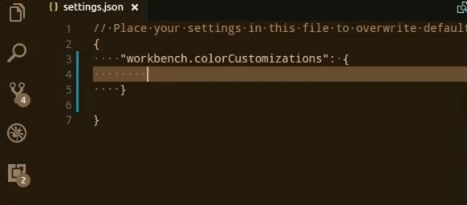

すべての標準テーマは、新しい配色を利用するように更新しました。[Theme Color Reference](https://code.visualstudio.com/docs/getstarted/theme-color-reference)ですべての配色の完全なリストを確認できます。

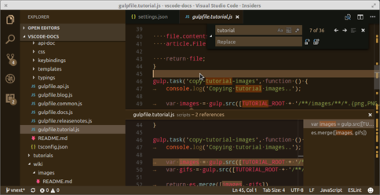

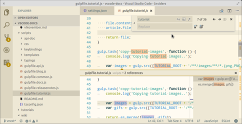

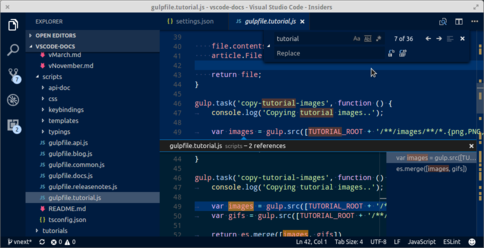

新しいユーザー設定`workbench.colorCustomization`は、`workbench.experimental.colorCustomization`を上書きし、選択しているテーマ上でユーザーが配色を変更できるようにします。実験的な設定を既に使用している場合は、[color id mapping table](https://github.com/Microsoft/vscode/wiki/Color-customization-color-id-changes)を使用して、IDを新しいフォーマットにマッピングしてください。

Yeomanジェネレーターは、新しい配色テーマのフォーマットを使用するように更新されました。さらに、新しいコマンド**Developer: Generate Color Theme From Current Settings**を**コマンド パレット**から使用すれば、Marketplaceで共有できるテーマへあなたのカスタム配色テーマを変更することが可能です。

また、GItHubの[vscode-theme-generator](https://github.com/Tyriar/vscode-theme-generator)プロジェクトではテーマを簡単に作成する方法も検討しています。ジェネレーターの目的は、個々のワークベンチのカラーキーとTextMateスコープの複雑さを隠して、できるだけ少ない労力によってきれいなテーマを作成できるようにすることです。

`vscode-theme-generator`を使用すれば、6つの色を定義するだけで次のようなテーマを作成できます:


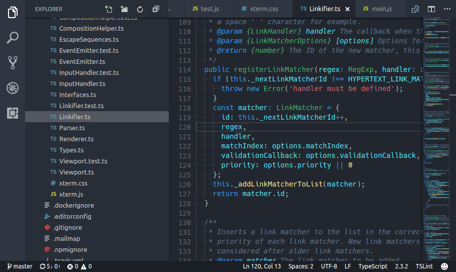

### Keyboard Shortcuts editor

**Keyboard Shortcuts**エディターで検索時、プラットホームの修飾キーをすべての用語で検索できるように改良されました。

* `meta`, `cmd`, `command`, `windows`
* `ctrl`, `control`
* `alt`, `option`
* `shift`

また、優先順位による並び替えのなかで、競合しているキーを確認できるようになりました。

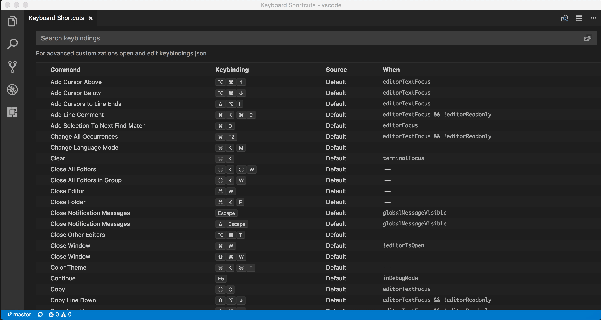

### Source control

SCM APIがリリースされて以来、コミュニティーを対象としたソース管理の拡張機能にいい進展がありました 。Marketplaceで既に公開されている拡張機能の一部を次に紹介します:

* [Visual Studio Team Services](https://marketplace.visualstudio.com/items?itemName=ms-vsts.team) - TFVCのサポート
* [Perforce for VS Code](https://marketplace.visualstudio.com/items?itemName=slevesque.perforce) - Perforceの統合
* [Hg](https://marketplace.visualstudio.com/items?itemName=mrcrowl.hg) - Mercurialレポジトリのサポート

私たちはこのAPIの可能性に非常に興奮しており、近い将来もっと多くの拡張機能が出てくることに期待しています！

### Git

VS Code内の[Git 拡張機能](https://github.com/Microsoft/vscode/tree/master/extensions/git)は多くの改良が進んでいます。この統合されたGitは、今後サードパーティーのSCMプロバイダーと同じ[extension points](https://code.visualstudio.com/docs/extensionAPI/api-scm)を介して実行するようになります。

**Note:** 6月より、従来の統合されたGitは完全に削除されます。それまでは、**SCM: Enable Legacy Git**コマンドを使用して元の状態に戻すことができます。

### macOS: Sierra Tabs

[Electron update](#electron-update)の助けを借りて、ウィンドウの管理にmacOS Sierra tabの基本的なサポートを回復できました。`window.nativeTabs`を介して、再起動後有効にできます。有効にすると、OSの設定に応じて、新しいウィンドウを開いたときにそれを新しいタブで開きます。タブにアクセスするには、tab bar(**View** > **Show Tab Bar**)を表示してください。


**Note**: ネイティブなタブはカスタムタイトルでは利用できません。ネイティブタブを有効にしたとき、タイトルバーもネイティブなスタイルに変化します。

### macOS: Mouse swipe to navigate

macOSのトラックパッドで三本指のスワイプジェスチャー(編集メモ: macosでの表記を知りません)を使用して、エディターの間を移動できるようにする、新しい`workbench.editor.swipeToNavigate`設定を追加しました。これは**Go** > **Back**や**Go** > **Forward**コマンドに似ていますが、ドキュメント内から生じるナビゲーションをスキップします。

**Note**: スワイプトリガーと同じ働きをする新しいコマンド(`workbench.action.openPreviousRecentlyUsedEditor`と`workbench.action.openNextRecentlyUsedEditor`)を、キーバインドして実行することもできます。

**Note**: 現在三本指のスワイプジェスチャーのみサポートしています。トラックパッドの設定が次のように設定されていることを確認してください:

* Swipe between pages: Scroll left or right with three fingers.
* Swipe between full-screen apps: Swipe left or right with four fingers.

### Integrated Terminal link line and column ranges

行と列の指定を持つファイルへのリンクがサポートされるようになりました 。

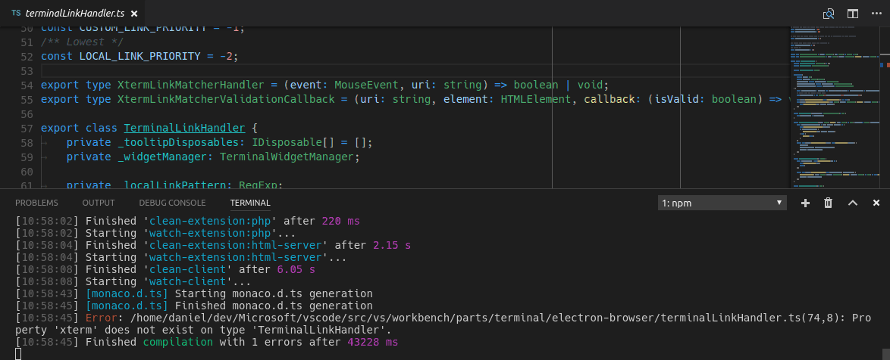

## Languages

### TypeScript 2.3

現在VS Codeには[TypeScript 2.3.2](https://blogs.msdn.microsoft.com/typescript/2017/04/27/announcing-typescript-2-3/)が付属しています。更新で、いくつかの[新しい言語機能](https://github.com/Microsoft/TypeScript/wiki/What's-new-in-TypeScript#typescript-23)と重要なバグがいくつか修正されています。

### Type checking for JavaScript files

またTypeScript 2.3では、プレーンなJavaScriptファイルにも型チェックを行います。これは一般的なプログラミングのミスを見つけ出す最適な方法です、またこれらの型チェックはJavaScriptで素早い修正を可能にする素晴らしい方法でもあります。

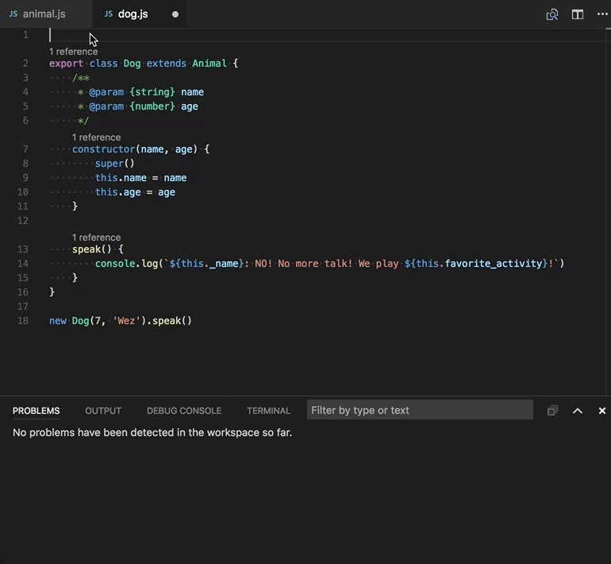

TypeScriptは`.ts`ファイルと同じ`.js`ファイルの型を推測できます。
型を推測できなかった場合、JSDocコメントを利用して型を指定できます。TypeScriptがJavaScriptの型チェックのためにJSDocsを利用する方法は[ここ](https://github.com/Microsoft/TypeScript/wiki/Type-Checking-JavaScript-Files)で詳細を読むことができます。

JavaScriptの型チェックはオプションで、オプトインです。ESLintのような既存のJavaScript検証ツールは、新しいビルトイン型チェック機能とともに使用できます。

必要に応じて、異なるいくつかの方法で型チェックを始めることができます。

**Per file**

JavaScriptファイルで型チェックを有効にする最も簡単な方法は、ファイルのトップに`// @ts-check`を追加することです。

```js
// @ts-check
let easy = 'abc'
easy = 123 // Error: Type '123' is not assignable to type 'string'
```

`// @ts-check`の使用は、いくつかのファイルで型チェックを行いたいが、コードベース全体に対しては有効にしたくないときに、いいアプローチと言えます。

**Using a Setting**

コードを変更せずにすべてのJavaScriptファイルの型チェックを有効にするには、ワークスペース設定に`"javascript.implicitProjectConfig.checkJs": true`を追加します。これにより`jsconfig.json`や`tsconfig.json`プロジェクトで、一部に限らないJavaScriptファイルの型チェックが可能になります。

`// @ts-nocheck`コメントを使用することで、ファイル単位で型チェック出力を選ぶことができます:

```js
// @ts-nocheck
let easy = 'abc'
easy = 123 // No error
```

また、JavaScriptファイル内の個々のエラーを、エラー行の前で`// @ts-ignore`コメントを使用して無効化できます:

```js
let easy = 'abc'
// @ts-ignore
easy = 123 // No error
```

**Using a JSConfig or TSConfig**

`jsconfig.json`か`tsconfig.json`の一部であるJavaScriptファイルに型チェックを有効するなら、プロジェクトのコンパイラーオプションに`"checkJs": true`を追加します:

`jsconfig.json`:

```json
{
    "compilerOptions": {
        "checkJs": true
    },
    "exclude": [
        "node_modules"
    ]
}
```

`tsconfig.json`:

```json
{
    "compilerOptions": {
        "allowJs": true,
        "checkJs": true
    },
    "exclude": [
        "node_modules"
    ]
}
```

これにより、プロジェクト内のすべてのJavaScriptファイルの型チェックが可能になります。`// @ts-nocheck`を使用することで、ファイルごとの型チェックを無効化できます。

JavaScriptの型チェックにはTypeScript 2.3が必要です。もし、現在選択しているTypeScriptのバージョンがわからない場合は**TypeScript: Select TypeScript Version*+コマンドを実行して確認してください。

### Change TypeScript versions without reloading VS Code

TypeScriptの現在のバージョンを変更するときとき、もはやVS Codeを再度読み込む必要はありません。

### Markdown Preview and Zoom

[Electronの更新](#electron-update)により、Markdownプレビューとリリースノートのクリッピングに関する問題を修正しました。

### Surround snippets for Markdown

マークダウン内でスニペットを使用すれば、素早くテキストを太字または斜体にすることができます。テキストを選択し、`insert snippet`コマンドを実行してください。Markdownの太字、イタリック、引用スニペットは、選択したテキストを変更するように更新されています。

スニペットを使用するためにキーバインドを設定することもできます:

```json
{
    "key": "cmd+k 8",
    "command": "editor.action.insertSnippet",
    "when": "resourceLangId == 'markdown'",
    "args": {
        "name": "Insert bold text"
    }
}
```

## Editor

### Dynamic IntelliSense sorting

入力時に提案リストをつど並び替えるようになりました。これにより、必要な補完が常に上にあり、簡単に選択できるようになります。

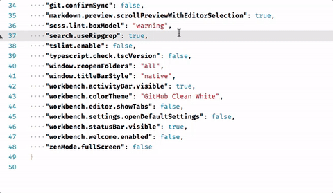

## Tasks

### Grunt task autodetection

新しいターミナルのタスクランナーのために、Gruntの自動検出を実装しました 。新しいターミナルランナーでは、ワークスペース内に対応する両方のファイル(`Gruntfile.js`, `gulpfile.js`) が存在する場合、タスクは[Grunt](https://gruntjs.com)と[Gulp](http://gulpjs.com/)の両方を検出するようになります。

さらに、proposed task APIは最適化されました。すでにこれを利用していた場合には、多少の変化が発生する可能性があります。

## Debugging

### Editing Watch expressions

コンテキストメニューを使用して、ウォッチ式を編集できるようになりました。

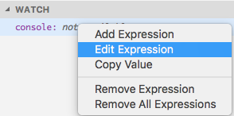

## Node Debugging

### Just My Code improvements

3つのリリースのためのNode.jsデバッガ、`inspector`プロトコルで、ステップ実行時ファイルをスキップすることができました。今回のリリースで、`legacy`プロトコルも利用できるようになりました。スキップするファイルを制御するには、**CALL STACK**ビュー内のスタックフレームでコンテキストメニューから**Toggle skipping this file**コマンドを使用します。

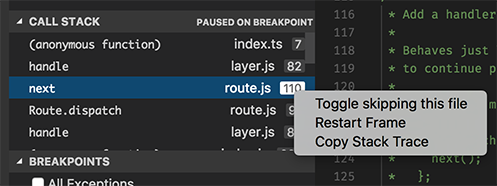

### Column breakpoints improvements

特定の列へのブレークポイント設定は、Node 8(未リリース)をデバッグしているとき、[Debugger for Chrome](https://marketplace.visualstudio.com/items?itemName=msjsdiag.debugger-for-chrome)拡張機能とNode.jsデバッガーのプロトコル`inspector`によって、サポートされます。列のブレークポイントは、`kb(editor.debug.action.toggleColumnBreakpoint)`を使用するか、デバッグセッション中にコンテキストメニューを介して設定できます。

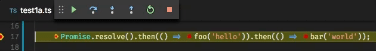

## Extension Authoring

### New APIs

新しいAPIをいくつか追加しました:

* 候補とシンボル項目の種類追加: `Event`, `Operator`,`TypeParameter`。
* プレビューエディターとしてテキストドキュメントを開くことが可能になりました。つまり、別のドキュメントをひらくとき、タブを再利用することを意味します。これは`vscode.window.showTextDocument(doc, { preview: true})`のようにして行えます。
* 時間のかかる操作実行のために、進捗状況を示す機能を追加しました。いまのところ、**Source Contro**ビューとステータスバーのwindow-global progress indicationで進捗状況を示すUIを定義します。

次のサンプルを確認してください:

```ts
vscode.window.withProgress({
    location: vscode.ProgressLocation.Window,
    title: 'My long running operation'
}, (progress) => {
    // Progress is shown while this function runs.
    // It can also return a promise which is then awaited
    progress.report({ message: 'Doing this' });
    await step1();

    progress.report({ message: 'Doing that' });
    await step2();
})
```

### Node.js update (6.x to 7.x)

Electronの1.6.6への更新で、拡張機能が利用するNode.jsのバージョンが6.4.0から7.4.0へ更新されました。Node.jsのメジャーアップデートによりいくつかの大きな変更がありますが、一般的に影響は軽微である必要があります。Node.jsの6から7への変更の完全なリストについては[overview](https://github.com/nodejs/node/wiki/Breaking-changes-between-v6-and-v7)を参照してください。

Electronの更新の結果として、Promise内のrejectionsが後から捕捉されたとしても、Node.jsランタイムによって予期せぬ未知の例外として処理されるようになりました。拡張機能をデバッグするときにこの動作は迷惑ですので、regular exceptionsから独立したpromiseのrejectionを制御するために新しい例外オプションを導入しました:

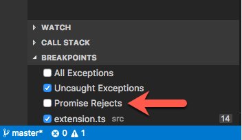

### Debugger extensions

**`evaluateName` attribute will become mandatory for `Add to Watch` and `Copy Value` actions**

VS Code tries to implement the **Add to Watch** and **Copy Value** actions by using the data from the **VARIABLES** view and a JavaScript-biased heuristic for building expressions that can be used with the evaluate request.(編集メモ: よくわからなかった)

このアプローチではすべての言語で機能しないので、以前は変数に`evaluateName`属性を導入していました。もし変数の`evaluateName`属性が利用可能な場合、VS Codeはevaluate requetのために'as is'を使用します。`evaluateName`がなければ古いアプローチに戻ります。

私たちは5月のリリースで完全にフォールバックを削除する計画です。ですから**Add to Watch**と**Copy Value**を今後行うためには、デバッグアダプターが`evaluateName`属性をサポートする必要があります。

**New argument `terminateDebuggee` for `disconnect` request**

オプションの引数`terminateDebuggee`が`disconnect`リクエストに追加されました。デバッグアダプターが `supportTerminateDebuggee`機能でこの機能を有効にした場合、クライアントはこれを使用して、デバッガが切断されたときにデバッグを終了するかどうかを制御できます。

## Miscellaneous

### Electron update

今回のリリースで、Electronは1.4.xから1.6.6に更新しました。これにより、Chromeのバージョンが53から56に、Node.jsが6.4から7.4に更新されました。特に、このアップデートではウィンドウ管理のためのmacOS Sierra tab(`window.nativeTabs`)と、よりよいクラッシュレポート生成プロセスを取り戻すことができました。また、macOS(background artifact)で見られたいくつかのグラフィックグリッチと、Windows上でUIエレメントに対するスケーリングが改良されています。

残念ながら、このアップデートでいくつかの後退(バグ？)も確認されており、これらの問題を解決する新しいElectronに移行するまで今しばらくお待ちください:

具体的には:

* [24981](https://github.com/Microsoft/vscode/issues/24981): Backspace can not erase the last character during Chinese/Japanese IME conversion (macOS)
* [24633](https://github.com/Microsoft/vscode/issues/24633): Unconfirmed text of CJK IME collapse to one character in Integrated Terminal
* [24643](https://github.com/Microsoft/vscode/issues/24643): Webview Flickering on Resize
* [24707](https://github.com/Microsoft/vscode/issues/24707): 1.6.2 update (<1.5) Completely breaks Dragon menu/submenu voice control (updated)
* [25700](https://github.com/Microsoft/vscode/issues/25700): Windows: dropdown selector empty after reload of window

**Note:**拡張機能の製作者であれば、Electronの更新による影響を [Extension Authoring](#extension-authoring)セクションで確認してください。

### China downloads

VS Codeのダウンロード速度が遅いと報告してきた中国ユーザーのために、インストールと更新の操作性を向上しました。中国のネットワークサーバーにリリースを配布するので、速度を向上するにはその地域で入手する必要があります。私たちのテストケースでは、`300x`もの速度向上が見られました⚡️!

これらの改善は、VS Codeを直接MSのウェブサイトからダウンロードする場合や自動アップデートを受け取る場合に利用できます。

## New Commands

Key|Command|Command id
---|-------|----------
`kb(workbench.action.openPreviousRecentlyUsedEditor)`|次に利用したエディターを開く|`workbench.action.openPreviousRecentlyUsedEditor`
`kb(workbench.action.openNextRecentlyUsedEditor)`|前に利用したエディターを開く|`workbench.action.openNextRecentlyUsedEditor`
`kb(workbench.action.openGlobalKeybindingsFile)`|キーボードショートカットファイルを開く|`workbench.action.openGlobalKeybindingsFile`

## Notable Changes

* [5745](https://github.com/Microsoft/vscode/issues/5745): Webview: apply window.zoomLevel too
* [12473](https://github.com/Microsoft/vscode/issues/12473): macOS Sierra: background artifacts
* [24482](https://github.com/Microsoft/vscode/issues/24482): New Uncaught Exception when starting an extension debugging session
* [24979](https://github.com/Microsoft/vscode/issues/24979): Compound debug configurations not shown after first breakpoint is hit
* [13306](https://github.com/Microsoft/vscode/issues/13306): stepping over breakpoint appears to resume execution fully, vs stepping
* [24126](https://github.com/Microsoft/vscode/issues/24126): Quickly blinking cursor in terminal if you open and quit external app
* [24302](https://github.com/Microsoft/vscode/issues/24302): Use ctrl key as the modifier to enable copy when drag and drop on Linux
* [18351](https://github.com/Microsoft/vscode/issues/18351): Support navigation of problems by keyboard similar to search results.

今回の1.12アップデートで[解決したバグ](https://github.com/Microsoft/vscode/issues?q=is%3Aissue+label%3Abug+milestone%3A%22April+2017%22+is%3Aclosed)と[解決した機能要求](https://github.com/Microsoft/vscode/issues?q=is%3Aissue+milestone%3A%22April+2017%22+is%3Aclosed+label%3Afeature-request) です。

## 拡張機能への貢献

私たちのチームは、いくつかのVS Code拡張機能の提供とメンテナンスに貢献しています。注目すべき拡張機能は：

* [Go](https://marketplace.visualstudio.com/items?itemName=lukehoban.Go)
* [TSLint](https://marketplace.visualstudio.com/items?itemName=eg2.tslint) : We contributed to the [tslint language server plugin](https://github.com/angelozerr/tslint-language-service) and there is now a [preview](https://github.com/angelozerr/tslint-language-service#vscode) available to try out for VS Code.
* [ESLint](https://marketplace.visualstudio.com/items?itemName=dbaeumer.vscode-eslint)
* [Docker](https://marketplace.visualstudio.com/items?itemName=PeterJausovec.vscode-docker)
* [Debugger for Chrome](https://marketplace.visualstudio.com/items?itemName=msjsdiag.debugger-for-chrome)
* [Mono Debug](https://marketplace.visualstudio.com/items?itemName=ms-vscode.mono-debug)
* [VSCodeVim](https://marketplace.visualstudio.com/items?itemName=vscodevim.vim)

## Thank You

最後になりましたが、VS Codeをより良いものへするために協力してくれた次の方々に多大なる感謝を込めて:

`vscode`への貢献:

* [Gordon Mckeown(@gmckeown)](https://github.com/gmckeown): Improved rendering of Seti icons [#22667](https://github.com/Microsoft/vscode/issues/22667)
* [@admosity](https://github.com/admosity):  Fix typo in inspectKeybindings.ts [PR #25262](https://github.com/Microsoft/vscode/pull/25262)
* [Brian Schlenker (@bschlenk)](https://github.com/bschlenk):  Add noValuePreselect option to showInputBox [PR #23827](https://github.com/Microsoft/vscode/pull/23827)
* [Burak Can (@burakcan)](https://github.com/burakcan):  Suggestion widget: Fix overflowing text problem (fixes #20679) [PR #20857](https://github.com/Microsoft/vscode/pull/20857)
* [Christopher Leidigh (@cleidigh)](https://github.com/cleidigh)
  *  Scm css fix for keyboard navigation and actions Issue [PR #23967](https://github.com/Microsoft/vscode/pull/23967)
  *  Monokai UI theme - first pass for #25327 [PR #25599](https://github.com/Microsoft/vscode/pull/25599)
* [Dick van den Brink (@DickvdBrink)](https://github.com/DickvdBrink):  Fixed typo in terminal.contribution description [PR #23784](https://github.com/Microsoft/vscode/pull/23784)
* [David Hewson (@dten)](https://github.com/dten):  OK capitalisation fix [PR #25005](https://github.com/Microsoft/vscode/pull/25005)
* [Eric Amodio (@eamodio)](https://github.com/eamodio):  Adds editor options overloads to showTextDocument & vscode.diff [PR #23641](https://github.com/Microsoft/vscode/pull/23641)
* [Elias Winberg (@elias-winberg)](https://github.com/elias-winberg):  Remove class snippet comment [PR #23209](https://github.com/Microsoft/vscode/pull/23209)
* [William Esz (@flagello)](https://github.com/flagello)
  *  Escape paths in npm.sh to fix #20907 [PR #21010](https://github.com/Microsoft/vscode/pull/21010)
  *  Escape paths in code.sh [PR #21016](https://github.com/Microsoft/vscode/pull/21016)
* [@gauss1314](https://github.com/gauss1314):  Update typescriptMain.ts [PR #24892](https://github.com/Microsoft/vscode/pull/24892)
* [Vakhurin Sergey (@igelbox)](https://github.com/igelbox):  Added support for encodings for Git. [PR #24911](https://github.com/Microsoft/vscode/pull/24911)
* [Ilie Halip (@ihalip)](https://github.com/ihalip):  Small comment fix [PR #25558](https://github.com/Microsoft/vscode/pull/25558)
* [Yuki Ueda (@Ikuyadeu)](https://github.com/Ikuyadeu):  fix Solarized Light theme highlighting  #24040 [PR #24292](https://github.com/Microsoft/vscode/pull/24292)
* [Jordan Menard (@jordanmkasla2009)](https://github.com/jordanmkasla2009)
  *  Open vscode://file/path/to/project/ URLs properly on Windows - fixes #20290 [PR #20469](https://github.com/Microsoft/vscode/pull/20469)
  *  Implement #12910 [PR #20881](https://github.com/Microsoft/vscode/pull/20881)
* [Jakub Synowiec (@jsynowiec)](https://github.com/jsynowiec):  Add an option to enable/disable JSDoc autocomplete [PR #23704](https://github.com/Microsoft/vscode/pull/23704)
* [Dominic Valenciana (@Kiricon)](https://github.com/Kiricon)
  *  Added missing . to hc-black so that it displays the correct scm actio… [PR #24385](https://github.com/Microsoft/vscode/pull/24385)
  *  Changed git renamed icon to orange color [PR #24567](https://github.com/Microsoft/vscode/pull/24567)
  *  Nested code lines now no longer display the hover border left. [PR #24686](https://github.com/Microsoft/vscode/pull/24686)
* [Phawin Khongkhasawan (@lifez)](https://github.com/lifez):  Add zenMode.hideActivityBar option [PR #24499](https://github.com/Microsoft/vscode/pull/24499)
* [Magnus Hiie (@magnushiie)](https://github.com/magnushiie):  Expose insert..Braces rule in VS Code settings [PR #21649](https://github.com/Microsoft/vscode/pull/21649)
* [Marek Lewandowski (@mlewand)](https://github.com/mlewand):  Added support for home/end key in IntelliSense [PR #20156](https://github.com/Microsoft/vscode/pull/20156)
* [Peter Juras (@peterjuras)](https://github.com/peterjuras):  Remove "JOAO" from Readme title [PR #24491](https://github.com/Microsoft/vscode/pull/24491)
* [@QwertyZW](https://github.com/QwertyZW):  Let the widgetactions debug UI reflect the state of a focused thread [PR #23878](https://github.com/Microsoft/vscode/pull/23878)
* [Rishii7 (@rishii7)](https://github.com/rishii7)
  *  Fix #24240 [PR #24371](https://github.com/Microsoft/vscode/pull/24371)
  *  Fix #24817 - Prevent overflow of the message in define keybinding widget. [PR #24925](https://github.com/Microsoft/vscode/pull/24925)
* [Rômulo Guimarães (@romulo1984)](https://github.com/romulo1984):  Update Exec param at code.desktop [PR #24523](https://github.com/Microsoft/vscode/pull/24523)
* [Seivan Heidari (@seivan)](https://github.com/seivan):  Fixes #4803: Adding support for swipe gestures on macOS. [PR #23663](https://github.com/Microsoft/vscode/pull/23663)
* [Tereza Tomcova (@the-ress)](https://github.com/the-ress):  Fixes #13905: Set relaunch command for window [PR #15407](https://github.com/Microsoft/vscode/pull/15407)
* [Thomas Rayner (@ThmsRynr)](https://github.com/ThmsRynr):  Fix #24971. PowerShell Extension .bat & .exe Syntax Highlighting Error [PR #24973](https://github.com/Microsoft/vscode/pull/24973)
* [Naveen Kumar (@timbanaveen)](https://github.com/timbanaveen)
  *  Adding 'never show again' in Git Extension [PR #24654](https://github.com/Microsoft/vscode/pull/24654)
  *  Adding line and column support for terminal [PR #24832](https://github.com/Microsoft/vscode/pull/24832)

`language-server-protocol`への貢献:

* [Damien Guard (@damieng)](https://github.com/damieng): Correct log message heading in protocol v1 [PR 186](https://github.com/Microsoft/language-server-protocol/pull/186)
* [Lucian Wischik (@ljw1004)](https://github.com/ljw1004): Change "utf8" to "utf-8" with a hyphen [PR 199](https://github.com/Microsoft/language-server-protocol/pull/199)
* [cxxxr (@cxxxr)](https://github.com/cxxxr): small corrections [PR 205](https://github.com/Microsoft/language-server-protocol/pull/205)
* [Vlad Dumitrescu (@vladdu)](https://github.com/vladdu): small corrections [PR 207](https://github.com/Microsoft/language-server-protocol/pull/207)

`vscode-languageserver-node`

* [Cam (@trixnz)](https://github.com/trixnz): Add return value to getEnvironment(). [PR #189](https://github.com/Microsoft/vscode-languageserver-node/pull/189)
* [Guillaume Martres (@smarter)](https://github.com/smarter): Fix a single typo [PR #196](https://github.com/Microsoft/vscode-languageserver-node/pull/196)
* [Hyo Jeong (@asiandrummer)](https://github.com/asiandrummer): fix typo [PR #200](https://github.com/Microsoft/vscode-languageserver-node/pull/200)

Contributions to `vscode-css-languageservice`

* [Dominic Valenciana (@Kiricon)](https://github.com/Kiricon):  Added @error support for sass [PR #24](https://github.com/Microsoft/vscode-css-languageservice/pull/24)
* [Ryan O'Connor (@rocifier)](https://github.com/rocifier):  added unit tests for real selector formatter and fixed indentation [PR #26](https://github.com/Microsoft/vscode-css-languageservice/pull/26)

## Thank you to our localization contributors

今回のリリースで[community localization](https://code.visualstudio.com/updates/v1_11#_coming-soon-support-for-community-localization)を開いたところ、世界のユーザーから多くの反応がありました。現在Transifex [VS Code project](https://aka.ms/vscodeloc)チームには100人以上のメンバーがいます。新しい翻訳の提供、翻訳への投票、プロセスの改善案による貢献に感謝します。

このリリースでトップ貢献者のスナップショットです。貢献者のリストを含むプロジェクトの詳細については[https://aka.ms/vscodeloc.](https://aka.ms/vscodeloc)を参照してください。

* **フランス語:** Vincent Biret.
* **イタリア語:** Piero Azi, Alessandro Burato, Giuliano Latini, Gianluca Bertelli.
* **ドイツ語:** Sascha Corti, Jens Suessmeyer, Christian Gräfe, Markus Weber.
* **スペイン語:** German Sak, Santiago Porras Rodríguez, José M. Aguilar, Alberto Poblacion.
* **ロシア語:** Aleksey Nemiro,  Kirill Moskvichev, Anton Afonin, Артем Мельниченко, Serge Rodionov, Andrei Pryymak.
* **日本語:** Yuichi Nukiyama, EbXpJ6bp.
* **中国語(簡体字):** Joel Yang, Ying Feng, YF.
* **中国語(繁体字):** Alan Tsai.

次の言語はVS Codeに含まれていませんが、ここでも作業を行っています。5月の定期更新では、これら言語がVS Codeへの言語統合の基準を満たしているかどうかを検証します。

* **ポルトガル語(Brazil):** Bruno Sonnino, Felipe Caputo, Rodrigo Crespi, Roberto Fonseca, Marcelo Fernandes, Roberto Nunes, Rodrigo Romano, Luan Moreno Medeiros Maciel, Ilton Sequeira, Douglas Eccker.
* **オランダ語:** Jeroen Hermans, Gerjan.
* **ポーランド語:** KarbonKitty, Lukasz Korowicki, Paweł Sołtysiak, Jakub Drozdek.
* **スウェーデン語:** Joakim Olsson.
* **トルコ語:** Adem Coşkuner, Serkan Inci, Sertac Ozercan.

## 回避策

### macOSのちらつき

外部のHigh DPIモニターを使用してるときに、VS Codeのちらつきが発生することがあります。[#25934](https://github.com/Microsoft/vscode/issues/25934)。この問題の回避策はユーザー設定で`"editor.disableTranslate3d": true`を設定することです(これにより警告がでますが、VS Codeはこの設定をまだ受け入れるので問題ありません)。

### macOSのぼやけたアイコン

この問題は、VS Codeを起動したときに特定の環境変数が設定されている場合に起こります。[#24820](https://github.com/Microsoft/vscode/issues/24820)。この問題の回避策は、macOSドックからVS Codeを起動するか、ターミナルから起動する前に`LC_ALL`環境変数(`export LC_ALL=`)をクリアすることです。[Insiders](https://code.visualstudio.com/insiders)ビルドでは、この回避策を適用し、`LC_ALL`をクリアします。
