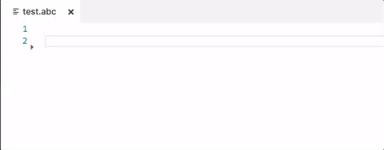
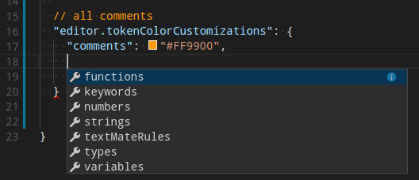
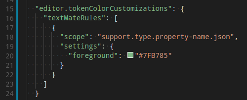
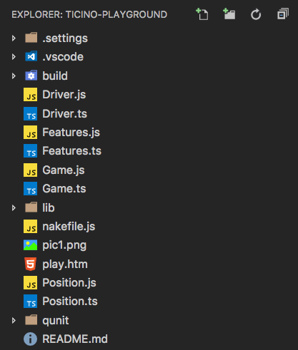
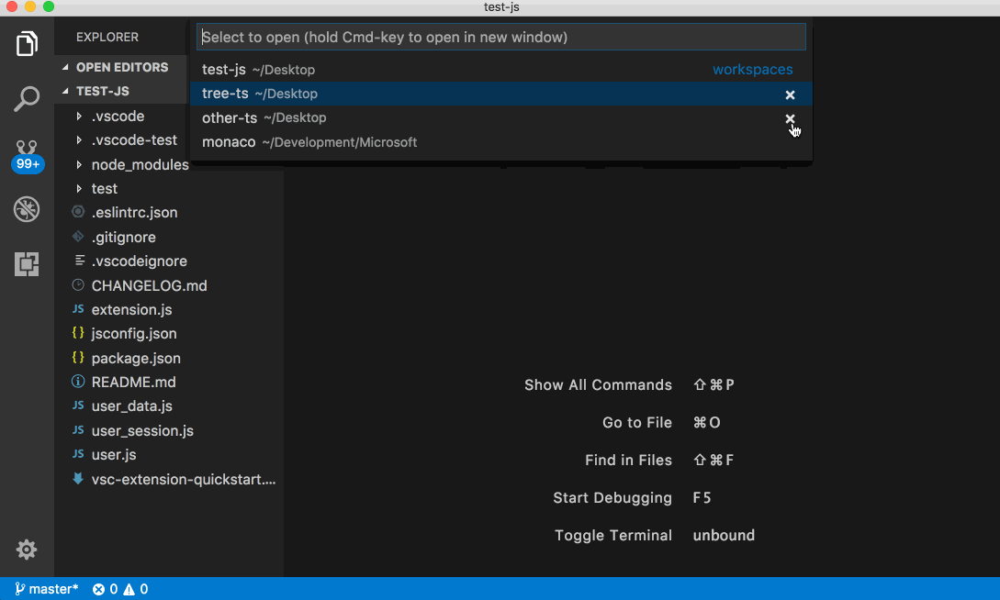
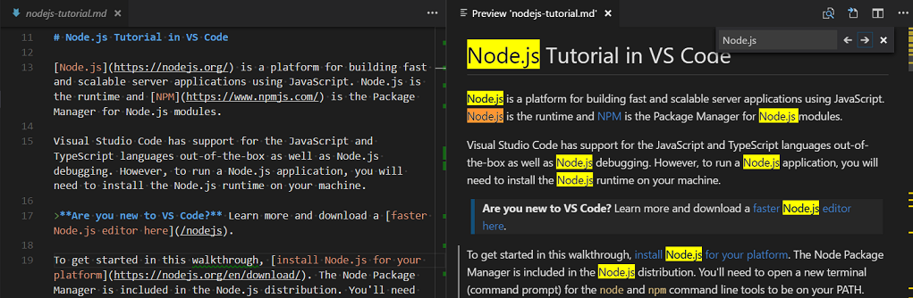
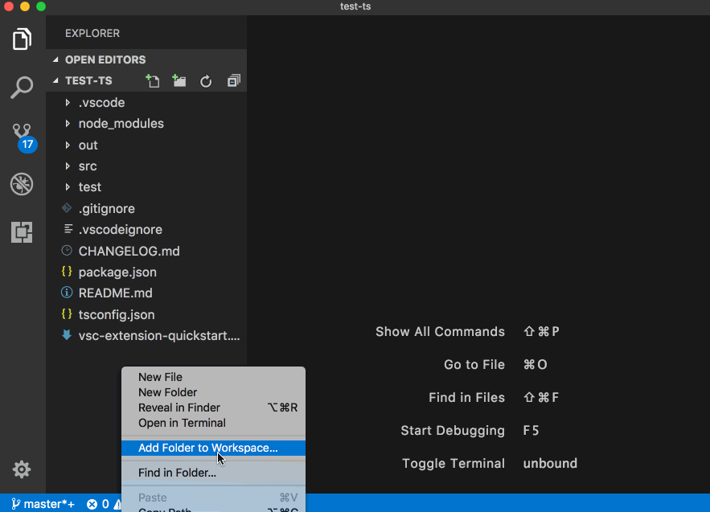
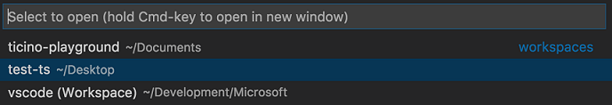
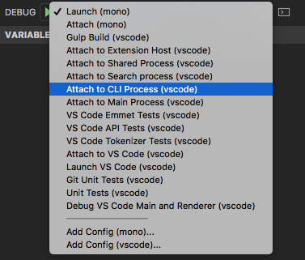
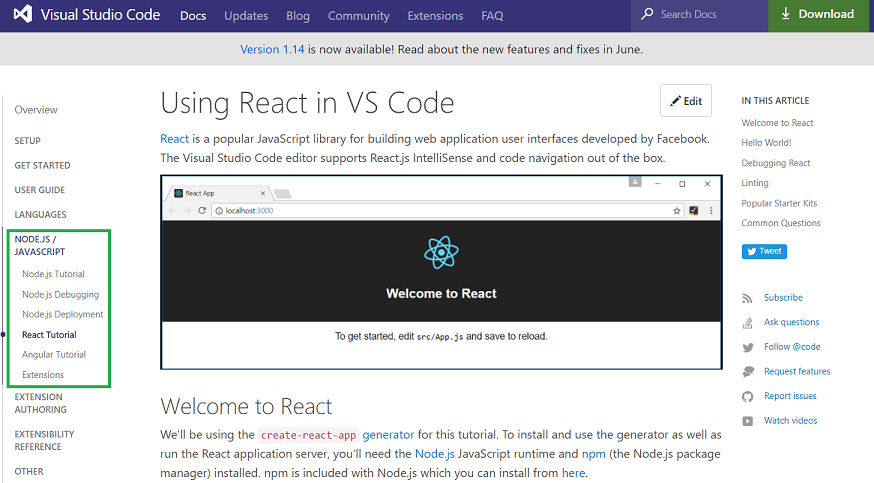

# July 2017 (version 1.15)

Visual Studio Code 2017 7月のリリースへようこそ。今回のバージョンには数多くの重要な更新があり、ハイライトは次の通りです:

* **[Large file support](#large-file-support)** - Improved performance for large files, no size limit on 64-bit machines.
* **[64-bit Windows builds](#windows-64-bit)** - Use your computer's full address space with the 64-bit builds.
* **[Find in Markdown preview](#search-in-markdown-preview)** - Full search for Release Notes, Markdown preview, and Extensions.
* **[Auto-indent, Emmet 2.0 on by default](#auto-indentation)** - Source code auto-indenting and new Emmet support.
* **[Custom syntax highlighting](#user-definable-syntax-highlighting-colors)** - Easily adjust editor colors to your liking.
* **[Terminal environment variables](#configure-environment-of-terminal-sessions)** - Preconfigure the Integrated Terminal environment.
* **[Color picker UI](#color-picker)** - Quickly create colors in your CSS, SASS, and Less files.
* **[Loaded Scripts Explorer](#loaded-scripts-explorer)** - Easily review and step through loaded scripts during Node.js debugging.
* **[Markdown preview plugins](#support-for-markdown-preview-plugins)** - Add styles, scripts or plug-ins to Markdown previews.
* **[code.visualstudio.com updates](#new-documentation)** - Tutorials for React, Angular and deploying Node.js to Azure.
* **[Preview: Multi-root workspaces](#preview-multi-root-workspaces)** - Settings and debug configurations across multiple projects (Insiders build).

> オンラインでリリースノートを確認するには [code.visualstudio.com](https://code.visualstudio.com) の [Updates](https://code.visualstudio.com/updates) に移動してください。

VS Code の重要な更新に関するアップデート情報は、リリースノートの次のセクションに配置しています。その他のアップデートは次の通りです:

* **[Editor](#editor)** - Predefined snippet choices, improved auto-indenting and diff editor.
* **[Workbench](#workbench)** - Customizable Explorer sort order and view layout, prefilled Quick Open actions.
* **[Integrated Terminal](#integrated-terminal)** - Improved switching, delete word keyboard shortcuts.
* **[Tasks](#tasks)** - Less and Sass compiler output parsing, new Status Bar display.
* **[Extension Authoring](#extension-authoring)** - Multi-root support for debugging and settings, new Markdown Preview API.

> **Insiders:** できるだけ早く新しい新機能を確認したいですか?夜間に更新する Insiders [build](https://code.visualstudio.com/insiders) をダウンロードすれば、最新のアップデートをすぐに試すことが可能です。

## Editor

### Large file support

大きなファイルはストレス テストによく使われます。現在、VS Code では行単位のテキスト バッファー表現を行っています。これにはいくつかの利点がありますが、(短い行の多いファイルで)特にメモリー使用量が多くなるという短所があります。

30MB もしくは 300K line を超えるファイルは大きなファイルとみなされ、場合によっては特別な処理がされます。トークン化、ラインガイド、折り返し折りたたみなど、大きなファイルで特定の機能を無効にすることでメモリー使用量を 50% 最適化することができました。また大きなファイルは、差分情報、リンク検出、単語ベースの補完を計算する Web werker に渡されることはありません。これは OS のメモリー使用量を軽減するのに役立ちます。

いくつかの最適化はすべてのファイルに影響しますが、小さなファイルではその効果が目立たないはずです。64bit インストールではハードコア ファイル サイズの 50MB 制限を廃止し、32bit インストールでは 300MB のファイル サイズ制限を設けることにしました。最適化の詳細については [#30180](https://github.com/Microsoft/vscode/issues/30180) を参照してください。

### Color Picker

今回のリリースで色をカスタマイズするカラー ピッカーを導入しました。エディターから取り出せる色の、色相、彩度、不透明度の構成に対応しています。またピッカーの上部にある色のカラー コードをクリックすることで、異なるカラー モード間で変更する機能も提供しています。ピッカーはドキュメント内のカラーを定義する部分にオーバーしているときホバー表示します。

​

プレビューを表示するために、RGBA, HSLA,Hex カラー モードをサポートする CSS, Sass, Lessファイルでピッカーを有効にしました。ピッカーの機能をより拡張し、将来的に拡張機能の作成者がカラー モデルを定義できるように提供する予定です。

### Auto indentation

今回のマイルストーンでオートインデントを既定で有効にしました (`"editor.autoIndent": true`)。作業している言語(TypeScript, JSON, CSSなど)に固有なインデント規則がある場合は、入力、行移動、コードブロックの貼り付け時にインデントが調整されます。

### Emmet 2.0

2 つ前のリリースで新しい Emmet ("Emmet 2.0") を導入しました。これはプレビュー中に、ユーザーがオプトインで [Emmet actions](https://docs.emmet.io/actions/) の候補/自動補完とマルチカーソルに Emmet 略語を表示するなどの新機能を試すことができました。今回のリリースで Emmet 2.0 とこれらの機能が既定で有効になっています。

Emmet 略語が提案/自動補完リストに表示されるようになったので、VS Code で `kbstyle(Tab)` キーを使用する Emmet 略語はトリガーされません。このキーボード ショートカットを削除することで 2 つの問題が解決されました:

* ユーザーが `kbstyle(Tab)` キーを使用してインデントを追加したいとき、予期しない Emmet 展開が発生します。
* ユーザーが実際に Emmet 略語を展開したいとき、提案リストの項目が挿入されます。

(`kbstyle(Tab)` キー以外の)任意のキーボード ショートカットを `editor.action.emmet.expandAbbreviation` にバインドすることや **Command Palette** から **Emmet: Expand Abbreviation** を使用することは依然として可能です。

#### Custom Emmet Snippets

カスタム Emmet スニペットを使用する場合は、新しい Emmet スニペットで機能するようにすこし変更を行う必要があります。

* HTML: HTML のカスタム Emmet スニペットは、有効な略語でなければなりません。たとえば: `<ul><li></li></ul>` の代わりに `ul>li` を使用します。
* CSS: Name the custom Emmet snippets in CSS such that they only contain letters from the snippet value in the order that they appear in the latter. これにより提案リストの fuzzy matchng algorithm が正しい結果を作成します。たとえば `color: black` の名前として `bc` や `darkc` を使用しないでください。代わりに `cb` や `cob` を使用します。

新しい Emmet の詳細については [Emmet 2.0 blog post](https://code.visualstudio.com/blogs/2017/08/07/emmet-2.0) を参照してください。

### Support for snippet choices

スニペットを選択することでプレースホルダーに値を事前に入力できます。構文は `${<number>|option_1,...,option_n|}` です。

次は固定された色のセットを指定するサンプルです:

```json
"color": {
  "prefix": "color",
  "body": "> Pick your favorite color ${1|red,green,blue,pink|}.\n< He likes $1."
}
```



最後に IntelliSense でスニペットを入力するとプレビューが表示されます。

### Improved diff editor results

今回のリリースでは、見た目がよりよくなるように (Longest-Common-Substring アルゴリズムによって処理される) differences を調整する差分アルゴリズムをいくつか変更しました。

これは `git diff` の(これら heuristics の一部を組み込む)出力により近づくことを意味します。ただそれ以外の(空白を取り除いただけのような変更)とき結果は LCS を含まないので `git diff` とは異なりますが、私たちの提案はより評価されるものになるはずです。

## Workbench

### User definable syntax highlighting colors

[Cody Hoover (@hoovercj)](https://github.com/hoovercj) のおかげで、ユーザー設定でエディター構文ハイライト カラーをカスタマイズできるようになりました。これはフルの配色テーマを作成せずに簡単にエディターの配色を調節するのに便利です。



新しい配色は現在のテーマを上書きする形で適用されます。これはライブに適用され VS Code を再読み込みする必要がありません。

よくある一般的な構文には、シンタックストークン('comments', 'strings', ...) の事前構成が利用可能です。より多く指定したい場合は TextMate テーマのカラー規則を直接指定できます。



詳細については [theme section](https://code.visualstudio.com/docs/getstarted/themes#_customize-a-color-theme) を参照してください。

### File Explorer sort order

[Dmitry Zabello (@foreverest)](https://github.com/foreverest) のおかげで、エクスプローラーでファイルとフォルダーのソート方法を新しい設定 `explorer.sortOrder` で構成できるようになりました。次から選択できます:

* `filesFirst` - ファイルを先にソートします
* `mixed` - 区別せずにファイルとフォルダーをソートします
* `modified` - 最終変更時刻でソートします
* `type` - ファイルの種類でソートします

次は `explorer.sortOrder: mixed` を使用するときのエクスプローラーです



### Launch Integrated Terminal from the File Explorer

ターミナルのフォルダーを開くためのコンテキスト メニュー項目(**Open in Terminal**)は既定で統合ターミナルのフォルダーを開きます。これを `terminal.explorerKind` 設定を使用して外部ターミナルを開くように設定できるようになりました。

### Managing views

VS Code はエクスプローラーのカスタム ビューに対応しており、このレイアウトをカスタマイズできるようになれば便利です。今回のリリースでは次の項目ビューの並びと表示を変更できるようになりました。

* Explorer view
* Debug view
* Extensions view


セクションを D&D すると並び替えができ、コンテキストメニューでセクションを表示/非表示にできます。ビューの変更は VS Code の再起動後も保持されます。

### New setting to close window when last editor closes

新しい設定を用意しました`window.closeWhenEmpty`。これは最後のエディターが閉じられたときにウィンドウ(インスタンス)を閉じるべきかどうかを制御します。macOS でこの動作はインスタンスを閉じるのが一般的なアプリケーション動作です。

> **Note**: この設定はフォルダーを開いていないウィンドウにのみ影響します。

### Improved --wait support

VS Code は Git などの外部プログラムのエディターとして構成することができます([documentation](https://code.visualstudio.com/docs/editor/versioncontrol#_git-patchdiff-mode))。`--wait` コマンド ライン引数は VS Code インスタンスを外部プログラムが閉じるまで保持するように使用されます。今回のリリースでは既知の問題を回避するためにこの機能を再実装しました 。

まず `--wait` を使用して開かれたインスタンスを記憶して、そのインスタンスが閉じるまで適切に待機します。これは `--wait` を使用している VS Code が既に実行されている間に追加のインスタンスをひらき、追加したウィンドウを閉じずにさらにウィンドウをひらくと 厄介な問題を起こすのを修正します。さらに、ウィンドウを閉じても通常はアプリケーションを終了しない macOS では、閉じた後にインスタンスを開始したプロセスにコントロールを戻すようにしました。

次に `--wait` を使用して開いたインスタンスの最後のエディターを閉じるとウィンドウを自動的に閉じるようになりました。`kb(workbench.action.closeActiveEditor)` を押してウィンドウヲ閉じることができます。

> **Note**: 最後のエディターが閉じたときにウィンドウを閉じたい場合は、空のウィンドウ用の新しい `window.closeWhenEmpty` 設定を確認してください。

### New theme color for title bar border

macOS の場合、上部にカスタム タイトル バーを表示します。新しい配色 `titleBar.border` をテーマや設定で定義してタイトル バーとエディター部分との境界線を描画することができます。

### Compare dirty file with version on disk

[Tobias Friemel (@tfriem)](https://github.com/tfriem) のおかげで、ダーティー(保存されていない)ファイルとディスク上のバージョンを比較して、最近の変更を素早く確認できるようになりました。


操作はエクスプローラーの **OPEN EDITORS** ビュー内でダーティ ファイルのコンテキストメニューから、もしくはグローバル コマンド **Files: Compare Active File with Saved** (`kb(workbench.files.action.compareWithSaved)`) から見つけることができます。

### Font aliasing (macOS only)

ワークベンチとエディター内のフォント スムージングを制御する新しい設定 `workbench.fontAliasing` (macOS) が追加されました。既定でフォントはサブピクセル方式でアンチエイリアス処理がされています。設定を `antialiased` に変更するとピクセルのレベルでフォントを滑らかにします(フォント全体がより細く見えるようになります)。これを `none` に設定するとフォント スムージングを無効にすることができます(テキストをぎざぎざな尖ったエッジで表示します)。

### Remove entries from recently opened

最近開いたピッカー(`kb(workbench.action.openRecent)`) の各エントリーの隣に、リストからエントリーを削除する新しいアクション (X) が表示されるようになりました。



### Quick Open command with prefix

コマンド `workbench.action.quickOpen` はプレフィックスを引数として受け取って **Quick Open** ピッカーを開き、任意のテキストを事前に挿入します。

たとえば、次のようにテキストをあらかじめ入力して **Quick Open** を表示するようにキーバインドを構成することができます:

```json
{ "key": "cmd+o", "command": "workbench.action.quickOpen", "args": "my-prefix" }
```

拡張機能作成者はプログラムからコマンドを実行して引数を渡すことができます:

```typescript
vscode.commands.executeCommand('workbench.action.quickOpen', 'my-prefix');
```

これに協力してくれた [cristianhosu (@cristianhosu)](https://github.com/cristianhosu) のおかげです。

### Search changes

検索ビューで変更を知っておく必要がある変更を行いました。1 つのフォルダーを開いている場合、`./example` は開いているフォルダーの一番上のディレクトリ `example/` と一致します。`example` と入力するとワークスペース内の `example` と名前がついているすべてのフォルダーとファイルに一致します。これは `example` という名前のファイルと一致する以前の既定とは異なりますが、  `example` という名前の一番上のフォルダーのみと一致します。

また include/exclude パターンボックスで **Use glob patterns** が削除されていることに気づくかもしれません。新しい `./` シンタックスではもはや必要ないと考えているからです。globs を使用する検索の詳細については [our search documentation](https://code.visualstudio.com/docs/editor/codebasics#_search-across-files) を参照してください。

## Integrated Terminal

### Configure environment of terminal sessions

各プラットフォーム用の新しい設定 `terminal.integrated.env.<platform>` は新しいターミナルに追加の環境変数を追加することができます。

```js
"terminal.integrated.env.linux": {
  "PYTHONPATH": "~/packages"
}
```

### Terminal switching

クイック ピッカーを使用してアクティブな端末を切り替え、名前の変更ができるようになりました。`Terminal: Switch Active Terminal` コマンドか Quick Open で`term ` (with a space) を入力してください。


### Better terminal session names on Windows

Windows で最初のシェルからプロセスを起動するときの既定のターミナル名を新しくしました。たとえばターミナル内で `powershell.exe` や `cmd.exe` を実行するとその名前が単純に 'powershell' や 'cmd' と表示されます。

### Additional delete word keybindings in the terminal

統合ターミナルに単語を削除する既定のキーが追加されました:

Linux/Windows:

* Ctrl+Backspace: カーソル前の文字を削除
* Ctrl+Delete: カーソル後ろの文字を削除

macOS:

* Alt+Backspace: カーソル前の文字を削除
* Alt+Delete: カーソル後ろの文字を削除

これらはキーストロークをターミナルに渡すことで機能し、その結果いくつかの Windows シェルでは機能しません。

### Force selection using Alt on macOS

ターミナル内のマウス モード(tmux など)でプログラムを実行すると、マウスが捕らえられるため、選択することはできません。マウス イベントが強制的にターミナル送信されるのではなく、選択を実行するようになるため `Alt` キーを押したままにすることができるようになりました。(?)

## Tasks

### Less and Sass compiler problem matchers

[less](https://www.npmjs.com/package/less) と [node-sass](https://www.npmjs.com/package/node-sass) コンパイラーの出力を解析するために、2 つの新しい問題マッチャー(VS Code 内の問題を検出して表示する機能)を追加しました。問題マッチャーの名前は `$lessc` と `$node-sass` です。

### Tasks Status Bar display

またタスクが実行されるとすぐに表示されるタスク用のステータス バー項目を追加しました。タスクのステータス バー表示をクリックすると、実行されたタスクの出力が表示されます。


## Node Debugging

### Loaded Scripts Explorer

前回の VS Code リリースでは、シンプルな [Quick Pick UI](https://code.visualstudio.com/updates/v1_11#_access-loaded-scripts) を使用して **Open Loaded Script** コマンドを介して読み込まれたスクリプトを検索して開くことができました。

今回のリリースでは、デバッグ ビューにランタイムによって多くのスクリプトが読み込まれると自動的にすべてのスクリプトと更新に直接アクセスする、エクスプローラー(Loaded Scripts Explorer)を追加しました。


制限のある Quick Pick UI に対して、エクスプローラーは同時デバッグ セッションに対応しており、マルチルート ワークスペースで使用されている場合はフォルダーごとにスクリプトがグループ化されます。

Loaded Scripts Explorer の 2 つ目の利点は、拡張機能として実装され新しいデバッグ API の現実的な例とツリー表示に貢献する方法を示すことです。実装については [here](https://github.com/Microsoft/vscode-node-debug/blob/master/src/node/extension/loadedScripts.ts) を参照してください。

## Languages

### Search in Markdown preview

[Cody Hoover (@hoovercj)](https://github.com/hoovercj) の PR により、リリースノート、Markdown preview、拡張機能の README ページなど webview コンテンツの検索ができるようになりました。



### Linkifying in the Markdown preview

Markdown preview では URL のテキストが自動的にクリック可能なリンクに変換されるようになりました。この機能は `"markdown.preview.linkify": false` に設定すると無効化できます。

### Support for Markdown preview plugins

Markdown preview のプラグイン用にスタイル、スクリプト、Markdown の拡張機能への対応を追加しました。

**Preview styles**

拡張機能は Markdown preview の見た目やレイアウトをカスタマイズするために CSS を提供できます:


[VS Code Github Style extension](https://github.com/mjbvz/vscode-github-markdown-preview-style) はスタイルシートを使用して、Github のレンダリング Markdown のように Markdown preview を変更する例です。

**Markdown it plugins**

拡張機能は  [markdown-it plugin.](https://github.com/markdown-it/markdown-it#syntax-extensions) に貢献して Markdown の構文を追加することができます。


emoji 対応を追加する markdown-it プラグイン [VS Code Markdown Emoji extension](https://github.com/mjbvz/vscode-markdown-emoji) を使用してこれを確認できます。

**Preview scripts**

最後に高度な機能のために、拡張機能は Markdown preview ないで実行されるスクリプトを提供します:


上記の [VS Code Markdown Mermaid extension](https://github.com/mjbvz/vscode-markdown-mermaid) には [mermaid](https://knsv.github.io/mermaid/index.html) diagrams と flowcharts を作成するスクリプトが追加されているのを確認できます。

### New Markdown Preview Security Settings

Markdown preview は既定で HTTPS のイメージをブロックしています。コンテンツがブロックされるとプレビュー ウィンドウにポップアップが表示されます 。このポップアップをクリックするか **Markdown: Change Preview Security Settings** コマンドを使用することで、現在のワークスペースで Markdwon preview のセキュリティー設定を変更できます。


新しい Markdown preview のセキュリティー レベルについては [Markdown documentation](https://code.visualstudio.com/docs/languages/markdown#_markdown-preview-security) を参照してください。

## Extension Authoring

### New API to extend the Markdown preview

拡張機能の製作者は Markdown preview を拡張することができます。新しい API はスタイル、スクリプト、markdown-it 拡張機能のために [3 つの貢献ポイント](https://code.visualstudio.com/docs/extensionAPI/api-markdown) を提供しています。

### Proposed API for storing credentials

`vscode.credentials`に資格情報を保存するための API (command-line flag に変更あり) を用意しました。バッキング ストアとして異なる OS の異なる資格情報ストアを使用する [keytar](https://github.com/atom/node-keytar) node module に転送することで、基本的な読み込み/書き込み/削除操作が利用できます。GitHub の [discussion](https://github.com/Microsoft/vscode/issues/31131) に参加してみてください。

### New API to open an editor or diff editor with a specific selection

`showTextDocument` メソッドと `vscode.diff` コマンドから使用できる新しいプロパティ `selection: Range` を使用することで既存の `TextDocumentShowOptions` を豊富にしました。これが提供されると、エディターは提供された範囲を表示して選択します。

### Debug API updates

前回のリリース (`vscode.debug.*`) から提案されている  proposed Debug API は修正し拡張しました。

デバッグは名前付きデバッグや複合構成、インメモリー構成のいずれかをとる `startDebugging` 関数を使用して開始することができます。名前付きの構成や変数はフォルダーのスコープ内でのみ定義されているので、フォルダー引数を追加する必要がありました。新しい `onDidStartDebugSession` イベントはデバッグ セッションが開始されたことを示してくれます。

現在アクティブなデバッグ セッションは `activeDebugSession` 変数として利用でき、`onDidChangeActiveDebugSession` イベントで報告されます。

Custom Debug Adapter Protocol requests は `DebugSession.customRequest` を使用してデバッグ セッションに送信でき、対応するカスタム イベントは `onDidReceiveDebugSessionCustomEvent` イベントで報告されます。

### Debug Contributions

**デバッグ サイド バーへのビューの貢献**

デバッグ サイド バーにビューを提供できるようになりました。

```json
"contributes": {
  "views": {
    "debug": [
      {
        "id": "extension.node-debug.loadedScriptsExplorer",
        "name": "Loaded Scripts",
        "when": "inDebugMode && debugType == 'node'"
      }
    ]
  }
}
```

**_package.json_ で変数置換がサポートされなくなります**

`package.json` の `debuggers` の `program` and と`runtime` 属性の変数置換対応を中止する予定です。この理由は 2 つあります: まず変数置換が 2 つの属性にのみ対応し、`packgage.json` のすべての属性に対しては機能しないことを説明するのが難しいことです。つぎに、マルチルートフォルダーではこの機能を有益な方法でサポートすることが困難なことです。

このリリースでは変数置換を deprecate  し、8 月に機能を削除する予定です。この機能を取りやめることが難しい場合は [here](https://github.com/Microsoft/vscode/issues/31675) にコメントしてください。

### Debug Adapter Protocol

**New `process` event**

デバッグされているプロセスに関するプロセス ID とその他の情報を伝える新しい `process` イベントが追加されました。

**`presentationHint` 属性用の新しい`normal` enum値**

完全性のために、既定値 `normal` は `Source` 型の `presentationHint` 属性に追加されました。

### New API for multi-root workspaces

マルチルート ワークスペース用に新しい複数のAPI が追加されました 。"single root workspace" `workspace.rootPath` 変数は廃止されます。拡張機能の作成者はエディターで開いた現在のフォルダーのリストを表す `WorkspaceFolder` 配列の  `workspace.workspaceFolders` を使用する必要があります。フォルダーが追加または削除されたときに発火する新しいイベントと指定したリソースのワークスペース フォルダーを見つける `getWorkspaceFolder` 関数が用意されています。

### Icon for root folders

アイコンテーマの作成者はマルチルートへの対応を準備してください:

ルート フォルダーを他のフォルダーとは異なる方法で比較表示するのに使用できる 2 つの新しいアイコン カテゴリー `rootFolder` と `rootFolderExpanded` を追加しました。たとえば、エクスプローラーではこのアイコンと最近開いたワークスペースのリストが使用されます。


### Configuration scopes

`configuration` 拡張機能ポイントに貢献する設定を次のスコープに分類できるようになりました:

* `window`: Window 固有の構成。VS Code ウィンドウに適用することができ、ユーザーとワークスペース設定で構成することができます。
* `resource`: リソース固有の構成。ファイルやフォルダーのようなリソースに適用することができフォルダーはユーザー、ワークスペース、フォルダー設定に構成することができます。

```json
"configuration": {
  "type": "object",
  "title": "MyLint",
  "properties": {
    "mylint.enable": {
      "type": "boolean",
      "default": true,
      "description": "Control whether mylint is enabled for files or not.",
      "scope": "resource"
    }
  }
}
```

この分類は **[Configuration API](#configuration-api)** をとおしてマルチルート ワークスペースのリソースに対する設定を構成するために必要です。

### Configuration API

Configuration API はマルチルート ワークスペースでグローバル、ワークスペース、フォルダーレベルの設定をサポートするように拡張されました。これによりリソースの構成を尋ねることができ、ユーザー、ワークスペース、フォルダー設定でリソースをインスペクト及び更新できます。

次にマルチルート ワークスペースのフォルダー設定でリソースの構成を読み書きする例を示します:

```typescript
const uri = vscode.window.activeTextEditor.document.uri;
const configuration = vscode.workspace.getConfiguration('mylint', uri);
// Let value of `mylint.enable` is `false` in the settings of root folder containing `uri`.
let value = configuration.get('enable'); // value is `false`
await configuration.update('enable', !value, vscode.ConfigurationTarget.WorkspaceFolder)
value = configuration.get('enable'); // value is `true`
```

> **Note:** 既存の Configuration API に大きな変更はありません。

## Preview: Multi Root Workspaces

> **Note:** マルチルート機能は安定版で利用できるまでは Insider ビルドでのみ使用可能です。試すには  [https://code.visualstudio.com/insiders](https://code.visualstudio.com/insiders) から Insiders ビルドを入手してください。

1 つの VS Code インスタンスで複数のフォルダー([issue #396](https://github.com/Microsoft/vscode/issues/396))を開くために対応を進めてきました。前回のリリースではこの機能のプレビューを用意しました([1.14.0 release notes](https://code.visualstudio.com/updates/v1_14#_preview-multi-root-workspaces))。

今回のスプリントでは、マルチルート ワークスペースを現実的なコンセプトにすることに重点をおいていました。

### Introducing "Workspaces"

ワークスペースとは 1 つのウィンドウ(インスタンス)に複数のフォルダーを開くときに UI に表示される新しいコンセプトです。ワークスペースはウィンドウ内で開いておきたいファイルを記述するためのシンプルな構成ファイルをしています。たとえば VS Code の開発では 3 つのフォルダーを頻繁に使用します:


上記のスクリーンショットからわかるように、ワークスペース構成ファイルには設定用のセクションも含まれています。あなたが設定する任意の **Workspace Setting** も最終的にこのファイルになります(ワークスペース設定については下記を参照してください)

空のウィンドウや単一フォルダーのウィンドウにフォルダーを追加すると、ウィンドウは "Untitled Workspace" になります。現在この移行にはウィンドウの再読み込みが必要です(下記の映像を確認してください)。将来的にはウィンドウを再読み込みしなくても、スムーズに移行することができると考えています。



### Untitled Workspace

ワークスペースを保存しない限り、 "Untitled Workspace" として表示されます。ワークスペースを保存場所たとえばデスクトップなどに保存するまで、ワークスペースを保存する必要はありません。無題のワークスペースはそれを使用しているウィンドウが開かれている限り存在します。無題のワークスペースを含んでいるウィンドウヲ閉じようとすると、保存するかどうかを求められます:


### Saved Workspaces

保存したワークスペースは `.code-workspace` ファイルをダブルクリックするか **File** メニュー下の **Open Workspace...** で開くことができます:


このあとワークスペースをディスク上の任意の場所に保存する **Save Workspace As...** アクションが表示されるはずです。VS Code ワークスペースのファイル拡張子は `.code-workspace`  であり、将来的にフォルダーに相対的パスを設定できるようにすることで、これらのファイルを簡単に共有できるようにする予定です。

ワークスペースはフォルダーと同様に表示されます。最近開いたワークスペースのリストから開くこともできます;



ワークスペースでは名前に追加の `(workspace)` 接尾辞がつきます。

### Workspace Settings

前述のように、新しいワークスペースのコンセプトにはワークスペースの設定を構成するセクションを含むワークスペースの構成ファイルが導入されました。マルチルート ワークスペースではこのファイルが、ワークスペース設定をひらくと表示されます。またこのファイルにはワークスペース設定に関連しないその他のセクションも含まれています。あまり目立たないようにするために、エディターではそれを薄く表示します。今後はユーザー設定と同様に一部のみを表示することで、experiece を改善していきます。


### Folder Settings

1 つのワークスペースで複数のルート フォルダーを使用すると、各ルート フォルダーに `.vscode` フォルダーを用意してそのフォルダーに適用する設定を定義することができます。設定エディターのドロップダウンからフォルダー設定を開くことが可能です。


フォルダーを選択することでそのフォルダーの設定が開きます。


`resource` 固有の設定だけがフォルダーレベルで適用され、`window` 固有の設定は適用されません。左に表示する既定の設定エディターにはフォルダー レベルで適用できる設定のみが表示されます。`window` 固有の設定がフォルダー設定に存在する場合、これらは情報アイコンでうすく表示されます。


`window` と `resource` 固有の設定を知るには **[Configuration scopes](#configuration-scopes)** を参照してください。

### Multi-root debugging

複数の `launch.json` ファイルを使用するマルチルート ワークスペース設定を開くと、デバッグ ドロップダウンにはすべての構成が表示されます:



構成で使用されている変数(たとえば `${workspaceRoot}`)はそれらが所属するフォルダーに対して相対的に解決されます。

### Multi-root Search

[Keegan Carruthers-Smith](https://github.com/keegancsmith) からの [PR](https://github.com/Microsoft/vscode/pull/29964) のおかげで、マルチルートワークスペースでの検索結果はフォルダーごとにグループ化されました。


マルチルート ワークスペースを開いているとき、"files to include" ボックスで `./` を使用して 1 つのルート フォルダーを検索して選択することができます。たとえば、`./project1/**/*.txt` を入力すると `project1/` ルート フォルダー下のすべての `.txt` ファイルを検索します。

## Windows 64 bit

Visual Studio Code 64bit ビルドは WIndows の Stable で利用できるようになりました。これらは Setup Installer 形式と Zip archive で提供されます。私たちは Windows に 64bit バージョンを紹介するメッセージボックスを表示する予定です。次がダウンロードリンクです:

Stable Windows 64-bit: [Installer](https://go.microsoft.com/fwlink/?linkid=852157) | [ZIP archive](https://go.microsoft.com/fwlink/?linkid=850641)

Insiders Windows 64-bit: [Installer](https://go.microsoft.com/fwlink/?linkid=852155) | [ZIP archive](https://go.microsoft.com/fwlink/?linkid=850640)

> **Note:** Setup Installer を使用する場合、64bit ビルドをインストールする前に 32bit バージョンをアンインストールする必要があります。

> **Note:** すべての設定と拡張機能は 64bit バージョンにアップグレードしたときも保持されます。

## New commands

Key|Command|Command id
---|-------|----------
`kb(workbench.files.action.compareWithSaved)`|Compare a dirty file with the version on disk|`workbench.files.action.compareWithSaved`
`kb(workbench.action.terminal.deleteWordLeft)`|Delete word left in terminal|`workbench.action.terminal.deleteWordLeft`
`kb(workbench.action.terminal.deleteWordRight)`|Delete word right in terminal|`workbench.action.terminal.deleteWordRight`

## New documentation

[https://code.visualstudio.com](https://code.visualstudio.com) ウェブサイトを製品のリリースとは別のタイミングで更新しています。そのため最新の一部更新の内容を逃すことがあるかもしれません。

### Community

Twitter, Stack Overflow, GitHub をすばやく利用できるように [Community](https://code.visualstudio.com/community) ページを追加しました。VS Code がホストされているコミュニティーが作成したリンクは [PluralSight](https://www.pluralsight.com/), [Scotch.io](https://scotch.io/), [LinkedIn Learning](https://www.linkedin.com/learning/) があります。


### Tutorials

[React](https://code.visualstudio.com/docs/nodejs/reactjs-tutorial), [Angular](https://code.visualstudio.com/docs/nodejs/angular-tutorial), [Node.js Deployment to Azure](https://code.visualstudio.com/docs/nodejs/nodejs-deployment) 用のチュートリアルを作成しました。これらのチュートリアルではサンプル プロジェクトを作成して VS Code を使用して賢いコード編集やデバッグを解説しています。



## Thank You

最後になりましたが、VS Code をより良いものへするために協力してくれた次の方々に多大なる感謝を込めて:

`vscode`への貢献:

* [Andrew Arnott (@AArnott)](https://github.com/AArnott):  Add *.props as a recognized file extension for XML [PR #30052](https://github.com/Microsoft/vscode/pull/30052)
* [Igor Polishchuk (@amadare42)](https://github.com/amadare42):  QuickPickOptions typings fix [PR #30819](https://github.com/Microsoft/vscode/pull/30819)
* [Bugra Cuhadaroglu (@BugraC)](https://github.com/BugraC):  Added Enabled View to Extension Viewlet [PR #30367](https://github.com/Microsoft/vscode/pull/30367)
* [Christopher Leidigh (@cleidigh)](https://github.com/cleidigh)
  *  Queue data during pty launch delay Fixes: #29184 [PR #30106](https://github.com/Microsoft/vscode/pull/30106)
  *  Add bottom padding to integrated terminal. Fixes #30626 [PR #30728](https://github.com/Microsoft/vscode/pull/30728)
  *  Handle Alt+Click for terminal links. Fixes #30761 [PR #31263](https://github.com/Microsoft/vscode/pull/31263)
  *  Remove inner whitespace on Toggle Block Comment. Fixes #30656 & #30729 [PR #30818](https://github.com/Microsoft/vscode/pull/30818)
* [@cristianhosu](https://github.com/cristianhosu): Add prefix argument to QuickOpen command (CTRL+P) [PR #28952](https://github.com/Microsoft/vscode/pull/28952)
* [Eric Amodio (@eamodio)](https://github.com/eamodio):  Use configuration for pinned default (Fixes #26184) [PR #27357](https://github.com/Microsoft/vscode/pull/27357)
* [Felix Becker (@felixfbecker)](https://github.com/felixfbecker): Switch to npm5 [PR #29576](https://github.com/Microsoft/vscode/pull/29576)
* [Dmitry Zabello (@foreverest)](https://github.com/foreverest)
  *  Sort by `type` doesn't affect folders [PR #30572](https://github.com/Microsoft/vscode/pull/30572)
  *  Various kinds of sorting in explorer [PR #29509](https://github.com/Microsoft/vscode/pull/29509)
* [Matt Fehskens (@gonzofish)](https://github.com/gonzofish):  Added Enabled View to Extension Viewlet [PR #25974](https://github.com/Microsoft/vscode/pull/25974)
* [Cody Hoover (@hoovercj)](https://github.com/hoovercj)
  * Make token colors user customizable [PR #29393](https://github.com/Microsoft/vscode/pull/29393)
  *  Find in webview based views (html preview, release notes, extension editor) [PR #30016](https://github.com/Microsoft/vscode/pull/30016)
* [@lslv1243](https://github.com/lslv1243):  Fix typo [PR #30653](https://github.com/Microsoft/vscode/pull/30653)
* [@mihailik](https://github.com/mihailik):  Ctrl-T to use word under cursor or current selection [PR #30021](https://github.com/Microsoft/vscode/pull/30021)
* [Nick Snyder (@nicksnyder)](https://github.com/nicksnyder):  Remove unnecessary Math.min [PR #29902](https://github.com/Microsoft/vscode/pull/29902)
* [Praveen Puglia (@praveenpuglia)](https://github.com/praveenpuglia):  Fix "No Results" error message color in find widget [PR #30746](https://github.com/Microsoft/vscode/pull/30746)
* [Priit Haamer (@priithaamer)](https://github.com/priithaamer):  Add workbench.fontAliasing configuration option [PR #30628](https://github.com/Microsoft/vscode/pull/30628)
* [@rianadon](https://github.com/rianadon):  Properly format file path on when dragging and dropping a tab into the integrated terminal in Windows [PR #30070](https://github.com/Microsoft/vscode/pull/30070)
* [Rohith Reddy Kumbharkar (@RohithKumbharkar)](https://github.com/RohithKumbharkar):  Add functionality to toggle break rendering mode for Markdown preview [PR #28713](https://github.com/Microsoft/vscode/pull/28713)
* [Vincent Sisk (@sappharx)](https://github.com/sappharx):  Fix typo in src/vs/base/common/arrays.ts [PR #30949](https://github.com/Microsoft/vscode/pull/30949)
* [Ryan Stringham (@stringham)](https://github.com/stringham):  Add history navigation for file include/exclude patterns in the search pane. Remember history between sessions. [PR #27476](https://github.com/Microsoft/vscode/pull/27476)
* [Tobias Friemel (@tfriem)](https://github.com/tfriem):  Show unsaved file modifications by opening a diff view [PR #30210](https://github.com/Microsoft/vscode/pull/30210)

These are the [closed bugs](https://github.com/Microsoft/vscode/issues?q=is%3Aissue+label%3Abug+milestone%3A%22July+2017%22+is%3Aclosed) and these are the [closed feature requests](https://github.com/Microsoft/vscode/issues?q=is%3Aissue+milestone%3A%22July+2017%22+is%3Aclosed+label%3Afeature-request) for the 1.15 update.

Contributions to `vscode-node-debug`:

* [Gary Ewan Park (@gep13)](https://github.com/gep13): (typo) Minor correction [PR #154](https://github.com/Microsoft/vscode-node-debug/pull/154)

Contributions to `vscode-chrome-debug`:

* [Matt Jimison @mjimison](https://github.com/mjimison): Update README.md [PR #472](https://github.com/Microsoft/vscode-chrome-debug/pull/472)

Contributions to `vscode-json-languageservice`:

* [Adam Voss (@adamvoss)](https://github.com/adamvoss):  Add null check to prevent service from crashing [PR #7](https://github.com/Microsoft/vscode-json-languageservice/pull/7)

Contributions to `vscode-css-languageservice`:

* [Praveen Puglia (@praveenpuglia)](https://github.com/praveenpuglia)
  *  CSS Colors Level 4 - 4 & 8 digit hex values [PR #38](https://github.com/Microsoft/vscode-css-languageservice/pull/38)
  *  add system font stack in font-family autocomplete list [PR #37](https://github.com/Microsoft/vscode-css-languageservice/pull/37)
  *  grid-row-start property browser support info [PR #35](https://github.com/Microsoft/vscode-css-languageservice/pull/35)
  *  add: flow-root for display property completion [PR #29](https://github.com/Microsoft/vscode-css-languageservice/pull/29)
* [Yuval Greenfield (@ubershmekel)](https://github.com/ubershmekel):  text-decoration-color update [PR #30](https://github.com/Microsoft/vscode-css-languageservice/pull/30)

Contributions to `vscode-tslint`:

* [David Valachovic (@AdenFlorian)](https://github.com/AdenFlorian)
  * When autoFixOnSave is array, items must be strings [PR #232](https://github.com/Microsoft/vscode-tslint/pull/232)
  * Allows naming which quick fixes should be run on save [PR #231](https://github.com/Microsoft/vscode-tslint/pull/231)

Contributions to `vscode-debugadapter-node`:

* [Holger Benl (@hbenl)](https://github.com/hbenl): testsupport: add missing requests to DebugClient [PR #120](https://github.com/Microsoft/vscode-debugadapter-node/pull/120)

Contributions to `vscode-recipes`:

* [Cyril DURAND (@cyrildurand)](https://github.com/cyrildurand): Update README.md [PR #13](https://github.com/weinand/vscode-recipes/pull/13)

Contributions to `vscode-github-issues-prs`:

* [Jens Hausdorf (@jens1o)](https://github.com/jens1o): Add action for creating issues [PR #8](https://github.com/Microsoft/vscode-github-issues-prs/pull/8)
* [道化師 (@wraith13)](https://github.com/wraith13): Fix parsing of repository names with dots [PR #17](https://github.com/Microsoft/vscode-github-issues-prs/pull/17)

Contributions to `localization`:

Transifex でコミュニティーによる多言語化を開始してから 4 ヶ月です。現在TransifexのVS Code project](https://aka.ms/vscodeloc)チームには300人以上のメンバーがいます。新しい翻訳の提供、翻訳への投票、プロセスの改善案による貢献に感謝します。

このリリースでトップ貢献者のスナップショットです。貢献者のリストを含むプロジェクトの詳細については[https://aka.ms/vscodeloc.](https://aka.ms/vscodeloc)を参照してください。

* **French:** Jonathan Menzel, Antoine Griffard.
* **Italian:** Aldo Donetti, Luca Nardi.
* **German:** Carsten Kneip.
* **Spanish:** Roberto Fonseca, dtriana, Jorge Serrano Pérez, Alberto Poblacion, Christian Eduardo Palomares Peralta, Andy Gonzalez.
* **Russian:** Valeriy Schepak, Nikita Gryzlov.
* **Japanese:** Tomoaki Yoshizawa, EbXpJ6bp, Yosuke Sano, Yuichi Nukiyama, Yuki Ueda, Tempura sukiyaki.
* **Chinese (Simplified):** Aifen Qin, 林昊, YF, Joel Yang, Zijian Zhou, Alan Tsai, Zijian Zhou, 陈嘉恺, Ricky Wang.
* **Chinese (Traditional):** Alan Liu, Alan Tsai, Duran Hsieh, Ke-Hsu Chen,  Wei-Ting(DM), Ricky Wang.
* **Portuguese (Brazil):** Bruno Sonnino, Roberto Fonseca, Frederico Oliveira, Luan Moreno Medeiros Maciel, Rodrigo Crespi, Lucas Miranda.
* **Hungarian:** Tar Dániel.
* **Turkish:** Adem Coşkuner, Ata Binen, Ali Oğuzhan Yıldız.
* **Dutch:** Gerald Versluis, Jeroen Hermans, Sander van de Velde, Jasper van Merle.
* **Indonesian:** eka priya.
* **Polish:** Patryk Adamczyk, Patryk Zawadzki, Albert, Mateusz Wyczawski, KarbonKitty.
* **Portuguese (Portugal):** Mike C.
