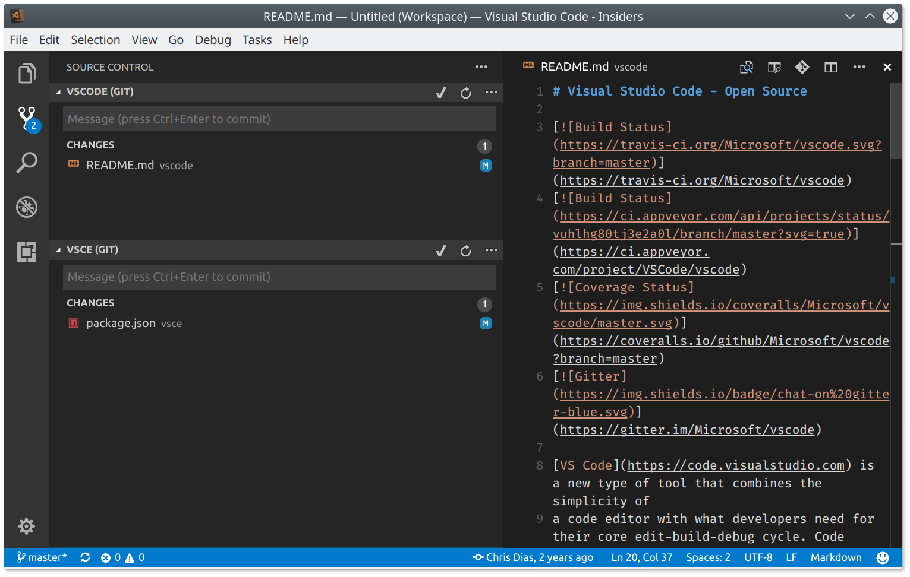
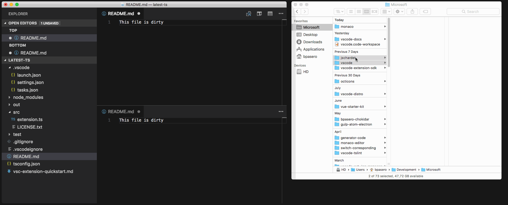
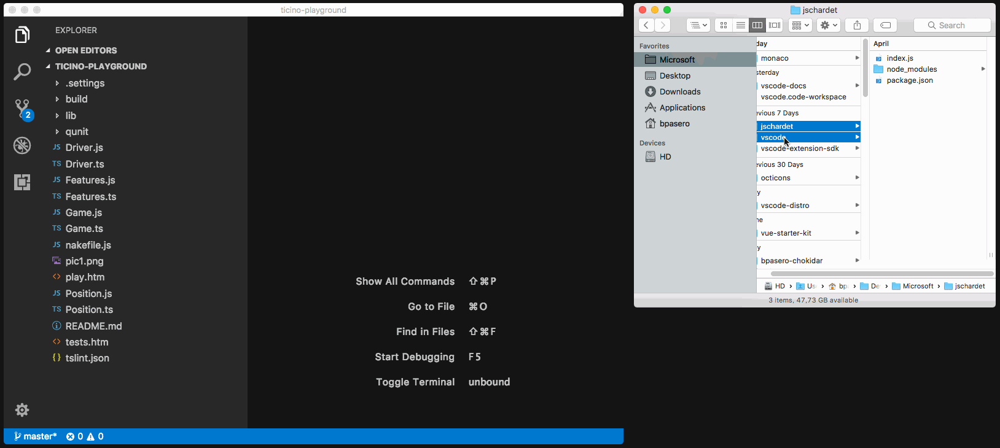

**Update 1.16.1**:  [問題](https://github.com/Microsoft/vscode/milestone/53?closed=1)を解決しました。

Visual Studio Code 2017 8 月のリリースへようこそ。今回のバージョンにも数多くの重要な更新があります。ハイライトは次の通りです:

* **[JavaScript/TypeScript refactoring](#javascript-and-typescript-refactorings)** - メソッドや関数にソースコードを簡単に抽出
* **[HTML tag auto close](#html-close-tags)** - タグの自動閉じによるエディター生産性を向上
* **[Color picker in HTML](#color-picker-in-html)** - HTMLファイルでのVS Codeカラーピッカー
* **[Integrated Terminal quick open](#terminal-quick-open-improvements)** - VS Codeのクイックオープンからターミナルの作成や移動
* **[Drag and drop from search](#drag-and-drop-from-search-results-and-problems-panel)** - 検索パネルや問題パネルからのすばやくファイル展開
* **[Multiple SCM providers](#source-control)** - 一度に複数のソース管理プロバイダーを使用
* **[New online documentation](#new-documentation)** - 新しいEmmetトピックとNode.jsデプロイトライアルの更新
* **[VS Code "recipes" repository](#vs-code-recipes)** - VS CodeでReact, Angular, Dockerを使用する例
* **[Preview: Multi-root workspaces](#preview-multi-root-workspaces)** - Smoother UI when adding folders and creating a Workspace (Insiders build).
* **[Multi-root tips for extension authors](#multi-root-workspace-tips-for-extension-authors)** - Update your extension to work seamlessly with multi-root workspaces.

> オンラインでリリースノートを確認するには [code.visualstudio.com](https://code.visualstudio.com) の [Updates](https://code.visualstudio.com/updates) に移動してください。
> [Brian Clark](https://twitter.com/_clarkio) による 1.16 release [highlights video] もご確認ください。

リリースノートは VS Code の重要な機能に関連する次のセクションに構成されており、多くの更新があります:

* **[ワークベンチ](#workbench)** - 拡張機能サンドボックスの改良, より多くのテーマ色
* **[エディター](#editor)** - ファイル変更を検出し元に戻せるようにスタック, 滑らかなスクロール, 点字サポート
* **[統合ターミナル](#integrated-terminal)** - LinuxとWIndowsでより良いテキスト選択, 検索履歴サポート
* **[言語](#languages)** - TypeScript 2.5, JSDocの型推論, Markdown Previewの更新コマンド
* **[拡張機能オーサリング](#extension-authoring)** - マルチルートワークスペースに対応するAPI更新とガイドライン

**Insiders:** できるだけ早く新しい新機能を確認したいですか?夜間に更新するInsiders [build](https://code.visualstudio.com/insiders) をダウンロードすれば、最新のアップデートをすぐに試すことが可能です。

## ワークベンチ <a id="workbench"></a>

###  検索結果と問題パネルからのドラッグ&ドロップ <a id="drag-and-drop-from-search-results-and-problems-panel"></a>

検索結果と問題パネルからファイルをエディターの領域にドラッグするとき、それらを展開する場所を選択できるようになりました。すでにファイル エクスプローラーはこれに対応しており、今回その機能を UI の別領域にも拡張しています。


### ドラッグ&ドロップでフォルダーを開く <a id="open-a-folder-via-drag-and-drop"></a>

VS Code 外からのフォルダーを開くために、フォルダーをドラッグして開くことができました。現在でもこれをサポートしていますが、視覚的なフィードバッグが少しかわります。以前までは VS Code の任意の場所にフォルダーをドロップして開くことができました。今回のリリースではフォルダーをエディター領域にドロップして開く必要があります。この変更は、技術的な理由(Electron)とマルチルートのエクスペリエンスをよりよくするための両方によるものです。マルチルートをサポートする VS Code Insder を使用している場合は、フォルダーをファイル エクスプローラーにドロップしてそれをワークスペースに追加できるようになります。


### 拡張機能のホスト <a id="extension-host"></a>

VS Code は拡張機能が独立した拡張機能ホストプロセスを使用するマルチプロセス アーキテクチャを使用しています。ワークベンチがこの拡張機能ホスト プロセスの予期しない終了から正常に回復することができるようになりました。すべての UI 要素と拡張機能によって動作していたもの(例: lint, ステータスバー項目)が削除され、拡張機能が再起動されるときこれらすべてが正常に戻ります。

次の短いビデオでは拡張機能ホストのプロセスが終了します。編集機能は機能し、単語の補完が表示されるが、拡張機能ホストが停止しているとき、拡張機能ホストを再起動することで実際の TypeScript の補完が戻ってきます:


### テーマの改善 <a id="theming-improvements"></a>

いくつかの新しいカラー キーが導入されました。これらの配色はテーマか `workbench.colorCustomizations` ユーザー設定で直接指定できます:

- `tab.activeBorder`: アクティブなタブの下に描画されるボーダー
- `tab.unfocusedActiveBorder`: アクティブでフォーカスされていないタブの下に描画されるボーダー
- `editorOverviewRuler.border`: 概要ルーラーのボーダーマーカー色
- `editorOverviewRuler.findMatchForeground`: 一致項目の概要ルーラーマーカー色
- `editorOverviewRuler.rangeHighlightForeground`: 範囲のハイライトの概要ルーラーマーカー色
- `editorOverviewRuler.selectionHighlightForeground`: 選択範囲のハイライトの概要ルーラーマーカー色
- `editorOverviewRuler.wordHighlightForeground`: シンボルハイライトのシンボルハイライトの概要ルーラーマーカー色
- `editorOverviewRuler.wordHighlightStrongForeground`: 書き込みアクセスのシンボルハイライトの概要ルーラーマーカー色
- `editorOverviewRuler.modifiedForeground`: 変更されたコンテンツの概要ルーラーマーカー色
- `editorOverviewRuler.addedForeground`: 追加されたコンテンツの概要ルーラーマーカー色
- `editorOverviewRuler.deletedForeground`: 削除されたコンテンツの概要ルーラーマーカー色
- `editorOverviewRuler.errorForeground`: エラーの概要ルーラーマーカー色
- `editorOverviewRuler.warningForeground`: 警告の概要ルーラーマーカー色
- `editorOverviewRuler.infoForeground`: 情報メッセージの概要ルーラーマーカー色

配色の完全なリストは [Theme Color Reference](https://code.visualstudio.com/docs/getstarted/theme-color-reference) を参照してください。

## エディター <a id="editor"></a>

### ディスク上のファイル変更のあとスタックを元に戻す <a id="undo-stack-preserved-when-file-changes-on-disk"></a>

[Ryan Stringham](https://github.com/stringham) による [PR #29655](https://github.com/Microsoft/vscode/pull/29655) のおかげで、ディスク上の変更によって開いているファイルが再読み込みされたときに、これに関連付けられたスタックを元に戻せるようになります。

### 滑らかなスクロール <a id="smooth-scrolling"></a>

[@JD342](https://github.com/JD342) による [PR #25286](https://github.com/Microsoft/vscode/pull/25286) のおかげで、アニメーションのエディター スクロールをする新しい `editor.smoothScrolling` 設定が追加されました。有効になると `Page Up` や `Page Down` の使用時、検索一致間の移動時、同じファイル内の定義移動時、マウスホイールによるスクロール時に、アニメーションされるようになります。

> Note: 現在私たちのプラットフォームはタッチパッドまたは物理マウスホイールによって始まったスクロールなのかを区別するサポートがありません。スムーズなスクロールが適用されるべきかどうかはそれを決めるヒューリスティクスが使用されます。


### スニペットとしてのEmmet提案 <a id="emmet-suggestions-as-snippets"></a>

Emmet の 提案/自動補完 リストはいくつかの状況の中でとても便利です。Emmet の提案をそのリストに追加できる 2 つの状況があります:

* `editor.snippetSuggestions` が `top` に設定されているので default/user/extension スニペットは提案リストの一番上に表示されます。
* スタイルシートで作業してるとき Emmet の提案は他の CSS 提案の中からアルファベット順にソートされます。

Emmet 提案が提案リストの一番上にあるようにするには、新しい `emmet.showSuggestionsAsSnippets` 設定を `true`  に `editor.snippetSuggestions`  を `top` に設定してください。

### Emmet preferences <a id="emmet-preferences"></a>

[Emmet 2.0](https://code.visualstudio.com/blogs/2017/08/07/emmet-2.0) の新しいアプローチが [Emmet Preferences](https://docs.emmet.io/customization/preferences/) に記載されている `emmet.preferences` 設定をサポートしていなかったため、前回のリリースではサポートされていませんでした。

これらの設定のいくつかは `emmet.preferences` によりサポートを取り戻しています:

* `css.propertyEnd`
* `css.valueSeparator`
* `sass.propertyEnd`
* `sass.valueSeparator`
* `stylus.propertyEnd`
* `stylus.valueSeparator`
* `css.unitAliases`
* `css.intUnit`
* `css.floatUnit`

これら以外への対応を望む場合は [feature request](https://github.com/Microsoft/vscode/issues/new) を提出してください。

### スニペット <a id="snippets"></a>

新しいスニペット変数 `$TM_FILENAME_BASE` を用意しました。これは拡張子なしのファイル名に解決されます。つまり `/my/super/file.ts` は `file` に解決されます。

### 点字サポート <a id="braille-support"></a>

Windows 上で NVDA を使用しているとき、接続されている点字ディスプレー上の点字ルーティング キーを使用して VS Codeのカーソル位置を変更できるようになりました。[issue #27216](https://github.com/Microsoft/vscode/issues/27216) で点字ディスプレーの動作をエミュレートをサポートしてくれた [James Teh](https://github.com/jcsteh) に感謝します。

## 統合ターミナル <a id="integrated-terminal"></a>

### ターミナルのクイックオープンを改善 <a id="terminal-quick-open-improvements"></a>

統合ターミナルは **Terminal: Switch Active Terminal** コマンドを使用するか **Quick Open** に "term "(スペースを含む) を入力することで起動できるようになりました。統合ターミナルの **Quick Open** ドロップダウンを使用する場合には、新しいターミナルを作成したり既存のターミナルを削除したりもできます。


### LinuxとWindowsでShiftを使用して強制的に選択 <a id="force-selection-using-shift-on-linux-and-windows"></a>

ターミナル内のマウス モード(tmux など)でプログラムを実行すると、マウスが捕らえられるため選択範囲をつくることができません。`Shift` キーを押したままにすると、マウス イベントが強制的にターミナルに送信されず選択範囲を作れるようになりました。この機能は 1.15 の macOS で `Alt` のために追加されていました。

### ターミナルの検索ウィジェットの改善 <a id="terminal-ifnd-widget-improvements"></a>

ターミナルの検索ウィジェットは検索履歴に対応しました。検索ウィジェットで次/前の検索文字を表示するには `kb(workbench.action.terminal.findWidget.history.showNext)` / `kb(workbench.action.terminal.findWidget.history.showPrevious)` を使用します。[PR #32113](https://github.com/Microsoft/vscode/pull/32113) のコード リファクタリングと機能改善の両方を手助けてくれた [Christopher Leidigh](https://github.com/cleidigh) に感謝します。


## 言語 <a id="languages"></a>

### HTMLの終了タグ <a id="html-close-tags"></a>

`>` の開始タグがタイプされると、タグ要素が自動的に閉じられます。


終了タグの `/` が入力されると一致する終了タグが挿入されます。


この動作は既定で有効になっており `html.autoClosingTags` 設定で無効にすることができます。

[Jun Han](https://github.com/formulahendry) の  [Auto Close Tag](https://marketplace.visualstudio.com/items?itemName=formulahendry.auto-close-tag) に感謝します。この拡張機能にはより多くの機能があり、特に HTML 以外の言語でも有効にすることができることに注目してください。

### HTMLのカラーピッカー <a id="color-picker-in-html"></a>

新しいカラーピッカーが HTML のスタイルセクションで利用できるようになりました。


### TypeScript 2.5 <a id="typescript-2.5"></a>

現在 VS Code には興奮させるような新しいエディター機能と多くのバグが修正された TypeScript 2.5.2 が含まれています。詳細は [TypeScript 2.5](https://blogs.msdn.microsoft.com/typescript/2017/08/31/announcing-typescript-2-5/) で確認することができます。下記は新機能のいくつかの詳細です。

### JavaScriptとTypeScriptのリファクタリング <a id="javascript-and-typescript-refactorings"></a>

新しい **Extract method** と **Extract function** コード アクションを使用すると、複雑な JavaScript や TypeScript コードを新しいメソッドや関数に素早くリファクタリングできます:


いくつかのコードを選択し、ガター内の電球をクリックするか (`kb(editor.action.quickFix)`) を押すと利用可能なリファクタリングが表示されます。ソース コードのかけらは新しいメソッドに抽出することも様々な異なるスコープで新しい関数に抽出することもできます。

### JSDocの型アソシエーション <a id="jsdoc-type-assertions"></a>

JSDoc の型アソシエーションを JavaScript ファイルで書けるようになりました:

```js
// @ts-check

const img = /** @type {HTMLImageElement} */ (document.getElementById('#cat'))
img.src = './cat.gif'
```

これは `@ts-check` を使用して [type checking in your JavaScript code](https://code.visualstudio.com/Docs/languages/javascript#_type-checking-and-quick-fixes-for-javascript-files) を有効にするとき特に便利です。

### より自由なJavaScript/typeScriptファイル分離

`jsconfig.json` や `tsconfig.json` プロジェクトに含まれておらず拘束されない JavaScript や TypeScript ファイルは各ルート フォルダーごとに暗黙のプロジェクトとして分割されるようになりました。いままで、ワークスペース内すべてのルート フォルダーは同じ暗黙のプロジェクトとしてグループ化されてきました。この変更は、別フォルダーの JavaScript ファイルで表示されているファイルからの候補が表示されなくなることを意味します。

### Markdownプレビューの更新コマンド <a id="markdown-preview-refresh-command"></a>

新しい **Markdown: Refresh Preview** コマンドは Markdown のプレビューコンテンツを手動で更新することができます。


これはファイル システム上で編集された画像をリロードするために使用できます。

### CSS/JSONの配色プレビュー <a id="cssjson-color-preview"></a>

インラインの色のプレビュー描画を CSS/JSON 拡張機能から VS code core に移動しました。途中で 4 つの構成設定 (`css.colorDecorators.enable`, `sass.colorDecorators.enable`, `scss.colorDecorators.enable`, `json.colorDecorators.enable`) が廃止されました。インラインの色のボックスを描画するかを制御する新しい一般的な設定 `editor.colorDecorators` があります。

## ソース管理 <a id="source-control"></a>

複数のソース管理プロバイダーを同時に使用することができるようになりました。この機能は複数のプロジェクトに異なる SCM を持つ可能性があるマルチルート ワークスペースのために調整されています。



1 つのワークベンチ ウィンドウで複数の Git リポジトリーを一度に操作したり、他の [SCM](https://marketplace.visualstudio.com/search?target=VSCode&category=SCM%20Providers&sortBy=Downloads) と一緒に使用したりできるようになりました。

## 新しいドキュメント <a id="new-documentation"></a>

### Node.jsのデプロイトライアルを更新 <a id="updated-nodejs-deployment-tutorial"></a>

[Node.js Deployment to Azure](https://code.visualstudio.com/docs/nodejs/nodejs-deployment) チュートリアルを改良して、アプリケーションをクライドですばやく実行できるようにしました。

### 新しいEmmetトピック <a id="new-emmet-topic"></a>

VS Code の Emmet サポートを解説する新しい [Emmet トピック](https://code.visualstudio.com/docs/editor/emmet)を追加しました。編集のセッション中に Emmet 略語を使用する方法、Emmet エクスペリエンスをカスタマイズする方法、カスタム Emmet スニペットを作成する方法について学ぶことができます。[Emmet トピック(日)](https://vscode-doc-jp.github.io/docs/userguide/emmet.html)

### VS Codeレシピ <a id="vs-code-recipes"></a>

5 月に [VS Code Recipe](https://github.com/Microsoft/vscode-recipes) リポジトリーで、非標準的なまたは複雑なデバッグ設定のレシピを収集し始めていました。このリポジトリーは現在新しい場所 [https://github.com/Microsoft/vscode-recipes](https://github.com/Microsoft/vscode-recipes) に移動しています。ここでは [React](https://github.com/Microsoft/vscode-recipes/tree/master/MERN-Starter), [Angular](https://github.com/Microsoft/vscode-recipes/tree/master/Angular-CLI), [Docker](https://github.com/Microsoft/vscode-recipes/tree/master/Docker-TypeScript) を使用する例を確認できます。

## 拡張機能オーサリング <a id="extension-authoring"></a>

### アップグレードされたElectronは"inspector"プロトコルのみに対応 <a id="upgraded-electron-only-supports-inspector-protocol"></a>

Electron 1.7 へのアップグレードにより、ビルトイン Node.js は "inspector" プロトコルのみをサポートするようになりました。この変更は下記で説明するように [extension debugging](#extension-debugging) と [profiling](#profile-your-extension) の両方に利点があります。

#### 拡張機能のデバッグ <a id="extension-debugging"></a>

(VS Code のビルトイン Node デバッガで実装される)拡張機能ホストのデバッグは、常に "inspector" プロトコルを使用するように切り替えられました。つまり下記のような動作上の違いが生じます:

"inspector" プロトコルを使用するときは、 Node.js デバッガが実行時にロードされた実際のスクリプト位置にバインドされるまで "verified" としてブレークポイントが設定されません。つまり拡張機能がアクティブでない限りブレークポイントはグレー(未検証)で表示されます。ただし拡張機能が有効になるとすぐに赤色(検証済み)になるので心配しないでください。


#### 拡張機能のプロファイル <a id="profile-your-extension"></a>

アップグレードされた Electron のバージョンではより強力な "inspector" プロトコルがサポートされているため Chrome DevTool を使用して拡張機能をプロファイルできるようになりました。次の手順で行います:

1. VS Code をコマンドラインから `--inspect-extensions=<port>`-flag で起動します。例: `code --inspect-extensions=9333`
2. VS Code で**コマンド パレット**(`F1`)から **Developer: Toggle Developer Tools** を選択します。
3. **コンソール**タブを選択して `"Debugger listening on port 9333"` で始まるメッセージを見つけ `chrome-devtools`-link で終わるメッセージを探します。
4. 拡張機能ホスト用の Chrome 内の専用 DevTools でそのリンクを開きます。
5. メモリーと CPU プロファイラを使用してメモリとリソースの使われ方を確認します。

### キャッチされなかったエラーを処理する <a id="handling-uncaught-errors"></a>

拡張機能のホストプロセスは、どの拡張機能がエラーを投げたのかをしるために、キャッチされていないスタックトレースを調べるようになりました。現時点ではこれらのエラーに respective extension ids の接頭辞を付けます。将来的には拡張機能ラインタイムビューや拡張機能に対する問題を作成する機能などより多くの計画をしています。

### 拡張機能のテーマ設定可能な配色 <a id="themable-colors-in-extensions"></a>

拡張機能は新しいテーマ設定可能な配色(themable colors)に貢献できるようになりました。これらの配色はデコレーターとステータスバーで使用できます。

```json
  "colors": [{
      "id": "superstatus.error",
      "description": "Color for error message in the status bar.",
      "defaults": {
          "dark": "errorForeground",
          "light": "errorForeground",
          "highContrast": "errorForeground"
      }
  }]
```

定義されるとユーザーは `workspace.colorCustomization` 設定で配色をカスタマイズできるようになります。

### ソース管理APIの更新 <a id="source-control-api-updates"></a>

`scm.inputBox` を使用してソース管理ビューの入力ボックスにアクセスする方法は廃止されました。かわりに `SourceControl.inputBox` を使用します。これは各ソース管理プロバイダーが、マルチルート機能で独自の入力ボックスを持つことができることに関連します。

多くのソース管理プロバイダーが同時にアクティブになることができるので global `scmProvider` context key は決して設定されません。

[@marckassay](https://github.com/marckassay) のおかげで、[ソース管理リソースのデコレーションに関連するツールチップ](https://github.com/Microsoft/vscode/pull/29644) を利用できるようになりました。

### デバッグAPIの更新 <a id="debug-api-updates"></a>

**新しい`DebugConfigurationProvider`が`initialConfigurations`と`startSession`を置き換えます**

現在デバッガ拡張機能は、最初の起動構成の生成とデバッグセッションの開始に加わるために "hook" のようなコマンドの `initialConfigurations` と `startSession` を提供することができます。今回のマイルストーンでは、メカニズムに基づくほぼ型のないコマンドを型付きソリューションに置き換える現実的な "API" が提案されています。なお `initialConfigurations` と `startSession` コマンドは非推奨になります (10月のリリースで削除)。

新しい API は特定のデバッグの種類用に登録された `DebugConfigurationProvider` に集約します。VS Code が新しく作成された launch.json の最初のデバッグ設定を必要とするときは、登録された `DebugConfigurationProvider` の  `provideDebugConfigurations` を呼び出します。`resolveDebugConfiguration` メソッドは新しいデバッグセッションが開始されたとき呼び出されます。`resolveDebugConfiguration` の実行(実装)は渡されたデバッグ構成を欠損している値に代入することによって、または adding/changing/removing 属性によって "massage" することが可能です。

> **Note:** 現在この API が提案なので、使用するには `"enableProposedApi": true` を `package.json` に追加して選択する必要があり、[`vscode.proposed.d.ts`](https://github.com/Microsoft/vscode/blob/master/src/vs/vscode.proposed.d.ts) をあなたの拡張機能プロジェクトにコピーしなければなりません。また `enableProposedApi` 属性を使用するかくちょうきのうを Marketplace に公開することはできません。

**`vscode.startDebug` コマンドが非推奨になりました**

7 月のリリースで適切な `vscode.debug.startDebugging(...)` APIの導入により、`vscode.startDebug` コマンドを使用してデバッグ セッションを開始する必要はなくなりました。したがって 8 月のリリースで `vscode.startDebug` コマンドを非推奨にし 10 月に削除する予定です。この機能を取りやめることが難しい場合は[ここ](https://github.com/Microsoft/vscode/issues/33795)にコメントしてください。

**Command `vscode.workbench.customDebugRequest` が非推奨になりました**

7 月のリリースで適切な `DebugSession.customRequest(...)` API の導入により、`vscode.workbench.customDebugRequest` コマンドを使用してカスタム リクエストをデバッグ アダプターに送る必要はなくなりました。したがって 8 月のリリースで `vscode.workbench.customDebugRequest` コマンドを非推奨にし 10 月に削除する予定です。この機能を取りやめることが難しい場合は[ここ](https://github.com/Microsoft/vscode/issues/33796)にコメントしてください。

### package.jsonでのデバッグ貢献 <a id="debug-contributions-in-package.json"></a>

**_package.json_ で `program` 属性と `runtime` 属性の置換変換がサポートされなくなりました**

[7月のマイルストーン](https://code.visualstudio.com/updates/v1_15#_debug-contributions)で、私たちは `package.json` での `debuggers` 貢献の `program` 属性と `runtime` 属性を非推奨にしました。8月になりこの機能を削除しました。

**_package.json_ で debuggers.startSessionCommand` を使用することは非推奨です**

`DebugConfigurationProvider` 型で `resolveDebugConfiguration` メソッドを導入すると、`debuggers` 貢献ポイントで `startSessionCommand` を貢献する必要がなくなりました。したがって 8 月のリリースで `startSessionCommand` コマンドを非推奨にし 10 月に削除する予定です。この機能を取りやめることが難しい場合は[ここ](https://github.com/Microsoft/vscode/issues/33791)にコメントしてください。

**_package.json_ で `debuggers.initialConfigurations` を使用することは非推奨です**

`DebugConfigurationProvider` 型で `provideDebugConfigurations` メソッドを導入すると、`debuggers` 貢献ポイントで `debuggers.initialConfigurations` を貢献する必要がなくなりました。したがって 8 月のマイルストーンで、コマンド ID を指定する機能を非推奨にし 10 月に削除する予定です(しかし JSON オブジェクトリテラルへの貢献サポートは続きます)。この機能を取りやめることが難しい場合は[ここ](https://github.com/Microsoft/vscode/issues/33794)にコメントしてください。

### Debug Adapter Protocol

**ソース リンクの属性が出力イベントに追加されました**

`source`, `line`, `column` 属性を `Output` イベント タイプに追加しました。これによりフロントエンドは出力が生成されたソースへのリンクを表示することができます。**Please note**: VS Code はまだ UI でこの機能に対応していません。

**Loaded scripts 対応**

ロードされたスクリプト(`LoadedSourcesRequest`)とロードされたスクリプト イベント(`LoadedSourceEvent`)を受け取るためのサポートが追加されました。
**Please note**: VS Code はまだ UI でこの機能に対応していません。新しく導入された JavaScript 向けの Loaded Scripts Exploer のデバッグではこのプロトコルは使用されていませんが、新しいプロトコルに移行する予定にあります。

**変数と評価結果のヒントを表示**

変数と評価結果のヒントの表示を追加しました(`VariablePresentationHint`)。A frontend can use these hints when rendering variables or evaluation results, for example for selecting specific icons that reflect their visibility.
**Please note**: VS Code はまだ UI でこの機能を使用していません。

### Marketplaceの拡張機能READMEレンダリングの更新

Visual Studio [Marketplace](https://marketplace.visualstudio.com/) では拡張機能 README の描画に [markdown-it](https://github.com/markdown-it/markdown-it) ライブラリーを使用するようになりました。これは VS Code の拡張機能ビューの描画に使用されている Markdown ライブラリーと同じであり、拡張機能 README オンライン描画との差異がなくなります。

### 拡張機能作成者のためのマルチルートワークスペースのヒント

私たちは拡張機能をマルチルート ワークスペースを準備するための方法についてのガイドを作成しました。詳細については [Adopting Multi Root Workspace APIs](https://github.com/Microsoft/vscode/wiki/Extension-Authoring:-Adopting-Multi-Root-Workspace-APIs) ガイドを参照してください。議論済みのすべての API は安定しており現在利用可能であると考えられています。ただしマルチルート ワークスペースは VS Code Insider リリースでのみ有効です。

拡張機能の作成者ガイドは次を説明しています:

* Basic APIs
* Settings
* Impact on extensions that have a language client/server model

このガイドに加え新しい API を使用する [samples repository](https://github.com/Microsoft/vscode-extension-samples) には新しいサンプルがあります。 フォルダー名が 'multi' のサンプルを検索してください (例: [basic-multi-root-sample](https://github.com/Microsoft/vscode-extension-samples/tree/master/basic-multi-root-sample)。

## Preview: Multi Root Workspaces <a id="preview-multi-root-workspaces"></a>

>**Note:** マルチルート機能は安定版で利用できるまでは Insider ビルドでのみ使用可能です。試すには  [https://code.visualstudio.com/insiders](https://code.visualstudio.com/insiders) から Insiders ビルドを入手してください。

1 つの VS Code インスタンスで複数のフォルダー([issue #396](https://github.com/Microsoft/vscode/issues/396))を開くために対応を進めてきました。これまでのリリースでもこの機能のプレビューを用意しています([1.14.0 release notes](https://code.visualstudio.com/updates/v1_14#_preview-multi-root-workspaces), [1.15.0 release notes](https://code.visualstudio.com/updates/v1_14#_preview-multi-root-workspaces))。

このマイルストーンではマルチルート ワークスペースに対応し、ソース管理対応の追加と拡張機能の更新に重点を置いてきました。また、ワークスペース ファイルのフォーマットを見直し、マルチルート ワークスペースをより快適にする UI 遷移を作成しています。

### マルチルートワークスペースへのスムーズな移行 <a id="smooth-transition-into-multiroot-workspaces"></a>

空のワークスペースまたは単一のフォルダー ワークスペースを複数のマルチルート ワークスペースにするにはいくつかの方法があります。この遷移は少しラフなもので、例えば保存されていないファイルを移行することはできませんでした。またマルチルート ワークスペースを作成するとすべての UI 状態が失われていました。今回のマイルストーンではこの動作をよりスムーズになるようにしています。私たちは依然としてウィンドウの再読み込みを必要としますが、移動を早くするようにこれを取り除く準備をしています。

下記のアニメーションでは単一のフォルダー ウィンドウがマルチルート ワークスペースに変化するようすを確認できます。次のことが起こっています:

* すべての UI 状態が次のワークスペースに移行され復元されます (エディターレイアウトと開いたエディター)。
* すべてのダーティー(未保存)ファイルが適切に復元され保存す量に指示されません。
* ワークスペースの設定はマルチルート ワークスペースにコピーされます (非表示のステータスバー、非表示のアクティビティバー)。



### マルチルートワークスペースの作成 <a id="creating-a-multi-root-workspace"></a>

VS Code でマルチルート ワークスペースを作成する方法を拡張しました。

**コマンド ライン**

新しいコマンドライン引数 `--add` を用意しました。これを使用してコマンドライン上のフォルダーを現在アクティブなウィンドウに追加します。新しいフォルダーの引数はパスとして提供する必要があります。これは空のワークスペース、単一フォルダーのワークスペース、つまり既存のマルチルート ワークスペースで機能します。

コマンド ラインから複数のフォルダーを開く指定をした場合は、別々のウィンドウで各フォルダーを開いていました。これからは自動的にワークスペースを作成しすべてのフォルダーを単一のウィンドウで開きます。

**ドラッグ アンド ドロップ**

VS Code にフォルダーをドロップすると、各フォルダーを別々のウィンドウに開いてきました。これからのマルチルート サポートでは、自動的にワークスペースを作成してすべてのフォルダーを 1 つのウィンドウに開くようになります。また、フォルダーをファイル エクスプローラーにドロップしてワークスペースを追加できるようになりました。



**ネイティブのファイルダイアログ**

ネイティブの ファイル ダイアログ (**File**>**Open**) から複数のフォルダーを選択するとすべてのフォルダーが 1 つのワークスペースで開かれます。macOS のドックのアプリケーション アイコンに複数のフォルダーをドロップする場合も同じです。

### 新しいワークスペースファイルのフォーマット <a id="new-workspace-file-format"></a>

このスプリントの間にワークスペース ファイル (`*.code-workspace`) の内容が変更されました。既存のワークスペース ファイルについて心配する必要はなく自動的に新しいフォーマットに移行されます。

新しいワークスペース ファイルは次のようになります:

```json
{
  "folders": [
    {
      "path": "monaco"
    },
    {
      "path": "Projects/vscode-distro"
    },
    {
      "path": "vscode-docs"
    },
    {
      "path": "/Users/bpasero/Development/Microsoft/vscode-extension-sdk"
    }
  ]
}
```

確認できるように `id` プロパティはもはやファイルにありません。かわりにディスク上のワークスペースの場所を使用して、ワークスペースの識別子を派生します。この識別子を使用することでさまざまな項目をワークスペースに関連付けます:

* すべての UI 状態 (例: 開いたエディター)
* ダーティー(未保存)ファイル (例: Hot Exit)
* 拡張機能のストレージ

この変更の利点の 1 つは、ワークスペース ファイルをディスクにコピーしても、同じワークスペースを複数のウィンドウで開くことができるようになることです。

`folders` プロパティに対してもう 1 つの変更が加えられました: 各エントリーは将来的にフォルダーに追加のメタデータを追加する可能性があるオブジェクトになりました。またフォルダー パス形式としてファイル リソースを使用することからはなれ、シンプルにパスを使用するようになりました。

またワークスペース ファイルで相対パスをサポートします。ワークスペース ファイルが保存されているフォルダーに対しての相対パスに解決されます。ワークスペース ファイルの場所が親フォルダーであることが検出されると相対パスとして自動的にパスが保存されます。それ以外の場合は絶対パスが使用されます。

### マルチルート ワークスペースの更新 <a id="updates-for-multi-root-workspaces"></a>

次のビルトイン言語はマルチルート ワークスペースを使用して作業するとき、フォルダー固有の設定へ対応するように更新されました:

* CSS
* Sass (SCSS)
* Less
* JSON
* HTML

また次の Microsoft 拡張機能が更新されました:

* [ESLint](https://marketplace.visualstudio.com/items?itemName=dbaeumer.vscode-eslint)
* [TSLint](https://marketplace.visualstudio.com/items?itemName=eg2.tslint)
* [Go](https://marketplace.visualstudio.com/items?itemName=lukehoban.Go)

[前述](#multi-root-workspace-tips-for-extension-authors)したようにあなたの拡張機能の更新に役立つマルチルート ワークスペース [ガイド](https://github.com/Microsoft/vscode/wiki/Extension-Authoring:-Adopting-Multi-Root-Workspace-APIs)があります。

### マルチルートとLSP <a id="multiroot-and-the-language-server-protocol"></a>

マルチルート ワークスペースをサポートするために提案されたプロトコルが LSP に追加されました。[VS Code language client](https://www.npmjs.com/package/vscode-languageclient) と [VS Code language server](https://www.npmjs.com/package/vscode-languageserver) の両方が提案されたプロトコルに対応するよう更新されています。さらに VS Codeの言語クライアントはワークスペース フォルダーごとにサーバーをサポートするよう拡張されました。対応する例は[ここ](https://github.com/Microsoft/vscode-extension-samples/tree/master/lsp-multi-server-sample)にあります。

## その他<a id="miscellaneous"></a>

### Electronの更新<a id="electron-update"></a>

今回のリリースで Electron を 1.6.6 から 1.7.3 に更新しました。これにより、Chrome のバージョンが 56 から 58 に Node.js が7.4から 7.9 に更新されています。

## 注目の変更 <a id="notable-changes"></a>

* [931](https://github.com/Microsoft/vscode/issues/931): Windows: Cannot save hidden files
* [32550](https://github.com/Microsoft/vscode/issues/32550): Explorer: allow to collapse a sub-tree fully via Alt-click
* [6196](https://github.com/Microsoft/vscode/issues/6196): VSCode is not per monitor DPI aware
* [29119](https://github.com/Microsoft/vscode/issues/29119): Support files.eol as multi root folder setting
* [24795](https://github.com/Microsoft/vscode/issues/24795): Using integrated terminal to cat file with lots of unicode hangs terminal
- [24820](https://github.com/Microsoft/vscode/issues/24820): Icon shapes broken with rendering artifacts
- [24981](https://github.com/Microsoft/vscode/issues/24981): Backspace can not erase the last one character during Chinese/Japanese IME conversion (macOS)
* [32336](https://github.com/Microsoft/vscode/issues/32336): terminal.integrated.rightClickCopyPaste isn't working on x64 build

## Thank You <a id="thank-you"></a>

最後になりましたが、VS Code をより良いものへするために協力してくれた次の方々に多大なる感謝を込めて:

`vscode`への貢献:

* [BrokenBacon (@brokenbacon)](https://github.com/brokenbacon):  Fix comment in User Settings for the Minimap [PR #33199](https://github.com/Microsoft/vscode/pull/33199)
* [Christopher Leidigh (@cleidigh)](https://github.com/cleidigh)
  *  Bug: Exclude active file from compare list (Cannot compare with self) Fixes: #31853 [PR #32803](https://github.com/Microsoft/vscode/pull/32803)
  *  Replace all instances off "Focussed" with "Focused" except ContextKey [PR #32904](https://github.com/Microsoft/vscode/pull/32904)
* [Hearstzhang (@Coresi7)](https://github.com/Coresi7):  Fix #33155: treat .pac file as javascript file [PR #33245](https://github.com/Microsoft/vscode/pull/33245)
* [David Lechner (@dlech)](https://github.com/dlech):  Fix spelling in TaskDefinition doc comment [PR #32104](https://github.com/Microsoft/vscode/pull/32104)
* [Dustin Campbell (@DustinCampbell)](https://github.com/DustinCampbell)
  *  Add .cake file extension for C# language [PR #32253](https://github.com/Microsoft/vscode/pull/32253)
  *  Update C# TextMate grammar with support for #r and #load directives [PR #31405](https://github.com/Microsoft/vscode/pull/31405)
* [Eric Amodio (@eamodio)](https://github.com/eamodio)
  *  Allow links in hover decorations to be inside a &lt;code> tag [PR #29082](https://github.com/Microsoft/vscode/pull/29082)
  *  Support multi-select on open file/changes commands [PR #27411](https://github.com/Microsoft/vscode/pull/27411)
* [Alexander Fadeev (@fadeevab)](https://github.com/fadeevab):  Makefile colorizing improvement: beginning of line, handling the '\' symbol and other. [PR #27293](https://github.com/Microsoft/vscode/pull/27293)
* [hikerpig (@hikerpig)](https://github.com/hikerpig):  fix spelling of 'iff' and 'idenifier' [PR #32401](https://github.com/Microsoft/vscode/pull/32401)
* [Carlo Bottiglieri (@inverno)](https://github.com/inverno):  Use 'modifiedStop' instead of 'modifiedStart' in line 863 of diff.ts [PR #33015](https://github.com/Microsoft/vscode/pull/33015)
* [@JD342](https://github.com/JD342):  Implement smooth scrolling feature [PR #25286](https://github.com/Microsoft/vscode/pull/25286)
* [Keegan Carruthers-Smith (@keegancsmith)](https://github.com/keegancsmith):  Add remove action for FolderMatch [PR #32483](https://github.com/Microsoft/vscode/pull/32483)
* [Krzysztof Cieślak (@Krzysztof-Cieslak)](https://github.com/Krzysztof-Cieslak): Add git stashing [PR #29138](https://github.com/Microsoft/vscode/pull/29138)
* [Marc Kassay (@marckassay)](https://github.com/marckassay):  Tooltips available for SCM diff decorations [PR #29644](https://github.com/Microsoft/vscode/pull/29644)
* [Andrii Melekhovskiy (@morkot)](https://github.com/morkot):  Fix typo in Markdown Preview security warning message [PR #32989](https://github.com/Microsoft/vscode/pull/32989)
* [Nick Allred (@NAllred91)](https://github.com/NAllred91):  Added support for recursively collapsing directory using alt-click [PR #32475](https://github.com/Microsoft/vscode/pull/32475)
* [Yu Zhang (@neilsustc)](https://github.com/neilsustc):  🐛 include setext heading levels (Markdown) [PR #32987](https://github.com/Microsoft/vscode/pull/32987)
* [Fu** Yeah (@ownagedj)](https://github.com/ownagedj):  Fix Typo: langauge to language [PR #32077](https://github.com/Microsoft/vscode/pull/32077)
* [Simon Friis Vindum (@paldepind)](https://github.com/paldepind):  Include command id in error message [PR #33064](https://github.com/Microsoft/vscode/pull/33064)
* [David McKay (@rawkode)](https://github.com/rawkode):  Added oxford comma and fixed macOS spelling [PR #30912](https://github.com/Microsoft/vscode/pull/30912)
* [Ron Buckton (@rbuckton)](https://github.com/rbuckton):  Update Promise definition  [PR #30268](https://github.com/Microsoft/vscode/pull/30268)
* [Robert Pethick (@RobPethick)](https://github.com/RobPethick):  Add publishsettings to list of xml file types [PR #32641](https://github.com/Microsoft/vscode/pull/32641)
* [Adrian (@Sakerdot)](https://github.com/Sakerdot):  Modifying report issues url to include command line options and smarter extensions table [PR #33225](https://github.com/Microsoft/vscode/pull/33225)
* [Nikolai Vavilov (@seishun)](https://github.com/seishun):  Use r+ with truncation when saving existing files [PR #31733](https://github.com/Microsoft/vscode/pull/31733)
* [Ryan Stringham (@stringham)](https://github.com/stringham):  Keep undo history even when file changes outside Code. [PR #29655](https://github.com/Microsoft/vscode/pull/29655)
* [J.R. Maingat (@tagniam)](https://github.com/tagniam):  Fix grammar for update alert [PR #32814](https://github.com/Microsoft/vscode/pull/32814)
* [YFdyh000 (@yfdyh000)](https://github.com/yfdyh000):  Fixes some extensions strings missing for i18n [PR #31253](https://github.com/Microsoft/vscode/pull/31253)
* [Simon Chan (@yume-chan)](https://github.com/yume-chan):  Automatically restart ts server after disableAutomaticTypeAcquisition config changed [PR #32412](https://github.com/Microsoft/vscode/pull/32412)

`vscode-css-languageservice` への貢献:

* [Praveen Puglia (@praveenpuglia)](https://github.com/praveenpuglia):  browser support updates to some properties [PR #41](https://github.com/Microsoft/vscode-css-languageservice/pull/41)

`vscode-tslint`: への貢献:

* [Quinn Slack (@sqs)](https://github.com/sqs):  bump tslint extension vscode engine [PR #243](https://github.com/Microsoft/vscode-tslint/pull/243)

`node-native-keymap` への貢献:

* [Gabriel Ebner (@gebner)](https://github.com/gebner): Use pkg-config for libx11 and libxkbfile on Linux [PR #9](https://github.com/Microsoft/node-native-keymap/pull/9)

Contributions to `localization`:

Transifex でコミュニティーによる多言語化を開始してから 5 ヶ月です。現在TransifexのVS Code project](https://aka.ms/vscodeloc)チームには 400 人以上のメンバーがいます。新しい翻訳の提供、翻訳への投票、プロセスの改善案による貢献に感謝します。

このリリースでトップ貢献者のスナップショットです。貢献者のリストを含むプロジェクトの詳細については[https://aka.ms/vscodeloc.](https://aka.ms/vscodeloc)を参照してください。

* **Spanish:** Alberto Poblacion, Roberto Fonseca, José M. Aguilar.
* **Japanese:** Yuichi Nukiyama, Shunya Tajima, yoshioms, Yuki Ueda.
* **Chinese (Simplified):** Joel Yang, 陈嘉恺.
* **Chinese (Traditional):** Duran Hsieh.
* **Portuguese (Brazil):** Roberto Fonseca, Marcondes Alexandre, Luan Moreno Medeiros Maciel, Frederico Oliveira.
* **Hungarian:** Tar Dániel, Milán Boleradszki.
* **Turkish:** Adem Coşkuner.
* **Dutch:** Sander van de Velde, Gerald Versluis, Maarten van Stam, Armand Duijn, Splinter Suidman, Dean Wyns, Geert Van der Cruijsen, Gerjan, Jeroen Hermans.
* **Polish:** KarbonKitty, Patryk Adamczyk, Marek Kurdej, Muchtrix, Mateusz Wyczawski, Patryk Zawadzki, Paweł Sołtysiak, Albert.
