# September 2017 (version 1.17)

Visual Studio Code 2017 9 月のリリースへようこそ。今回のバージョンには数多くの重要な更新があり、ハイライトは次の通りです:

* **[macOS Touch Bar support](#macos-touch-bar-support)** - Touch Bar actions for navigation and debugging.
* **[Source code folding improvements](#folding-regions)** - Collapse region markers and off-side language blocks.
* **[Integrated Terminal performance](#integrated-terminal)** - Terminal rendering is up to 45 times faster.
* **[Automatic import suggestions](#import-path-quick-suggestions-in-javascript-and-typescript)** - See module and path import suggestions while coding.
* **[Debugging shows source location](#debug-console-messages-show-source-location)** - Easily navigate from the Debug Console to source code.
* **[Better colorization of regex and format strings](#improved-colorization-in-dark-and-light-themes)** - Helps with parsing and identifying errors.
* **[Improved multiple SCM support](#source-control)** - New UI to view changes in multiple source control repositories.
* **[New online documentation](#new-documentation)** - Java language, 'Tips and Tricks', and Debugging Recipes topics.
* **[Preview: Multi-root workspaces](#preview-multi-root-workspaces)** - No reload on workspace updates, combined view of available tasks.
* **[Multi-root guide for extension authors](#multi-root-guide-for-extension-authors)** - To help extenders be ready for multi-root workspaces.

> オンラインでリリースノートを確認するには [code.visualstudio.com](https://code.visualstudio.com) の [Updates](https://code.visualstudio.com/updates) に移動してください。
> Cloud Developer Advocate [Brian Clark](https://twitter.com/_clarkio) による 1.187release [highlights video](https://youtu.be/dQmtzf65jY8) もご確認ください。

リリースノートは VS Code の重要な機能に関連する次のセクションに構成されています。多くの更新があります:

* **[Workbench](#ワークベンチ)** - Better macOS native tabs support, new editor label formats.
* **[Editor](#エディター)** - Snippet transforms, more Emmet preferences, optimized history navigation.
* **[Languages](#言語)** - TypeScript 2.5.3, Extract Method triggers rename, language support in Markdown code blocks.
* **[Extension Authoring](#拡張機能オーサリング)** - macOS Touch Bar support, styled completions and signature help text.

**Insiders:** できるだけ早く新しい新機能を確認したいですか？夜間に更新するInsiders [build](https://code.visualstudio.com/insiders)をダウンロードすれば、最新のアップデートをすぐに試すことが可能です。

## ワークベンチ <a id="workbench"></a>

### macOS Touch Bar サポート <a id="macos-touch-bar-support"></a>

macOS Touch Bar にアクションを表示する機能が追加されました。エディターの履歴を移動するアクションと、デバッガを制御する完全なデバッグ ツールバーを追加しています:


拡張機能は新しい `touchBar` menu identifier を介して Touch Bar にコマンドを追加することができます。詳細については下記の [Extension Authoring](#extension-authoring) を参照してください。

### macOS native window tab サポートの改善<a id="better-macos-native-window-tabs-support"></a>

macOS (Sierra) で `"window.nativeTabs": true` 設定を使用するとネイティブ ウィンドウ タブを有効にすることができます。今回のマイルストーンでは、ネイティブ タブの操作をよりしやすくしました。

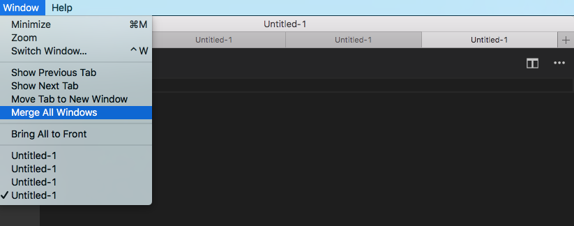

もう 1 つは、タブの最後で新しいウィンドウをタブとして開く "+" アクションに確認できます。またタブを管理するために一般的なアクションをウィンドウ メニューに追加しました。

**Note**: 現在 macOS High Sierra (10.13) でネイティブ タブは部分的にしかサポートされていません。私たちは修正に取り組んでいます。お楽しみに！

### 新しい Visual Studio Code のロゴ <a id="new-visual-studio-code-logo"></a>

私たちは VS Code のロゴと配色を更新しました。Stable はオレンジ色に、Insider は緑色になります。

Release | Stable | Insiders
--- | --- | ---
**macOS / Linux** |  | 
**Windows** |  | 

Note: プラットホームによってはアプリケーション アイコンの OS キャッシュによって以前のロゴが表示される可能性があります。

> 編集メモ: Insider で変更が入った時点でいろいろな議論が既にされており、担当者が変更するつもりがないとも言っているのでこれで固定になると思っています。

### --wait サポートの改善 <a id="better-wait-support"></a>

VS Code はコマンド ラインから `-wait` 引数を指定して起動することにより開いているインスタンスが閉じられるまで待機できます。このマイルストーンでは開いているすべてのエディターが閉じられたときに呼び出しているプロセスを終了することで、この機能をより強力にしました。結果としてすでに開いているインスタンスから `--wait` を使うことができます。これはとても便利です。

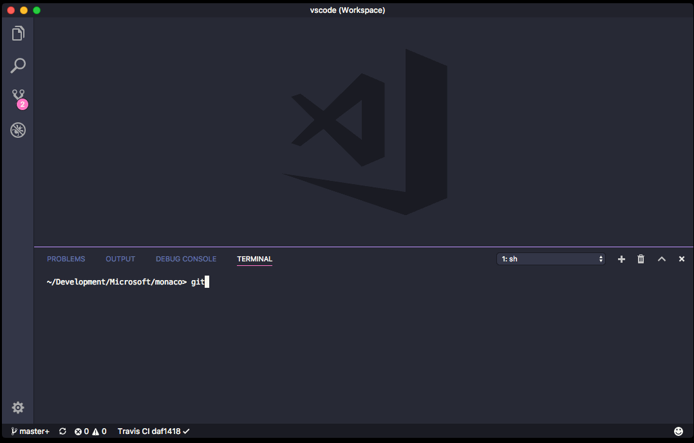

**Note**: デフォルトでは開かれたインスタンスを再利用するようになりました。これを避けるには  `-n` 引数をコマンド ラインに追加します。

### ファイル エンコードに関する新しい機能 <a id="new-features-around-file-encoding"></a>

言語ごとに `files.encoding` 設定に加え `files.autoGuessEncoding` 設定を構成できるようになりました。また VS Code では CP 850 と CP 865 エンコードもサポートするようにもなりました。

### エディター ラベルを制御する新しい設定 <a id="new-setting-to-control-editor-labels"></a>

新しい設定の `workbench.editor.labelFormat` はエディターの既定ラベルを調整します。可能値は `short`, `medium`, `long`, `default` です。デフォルトでエディターは同じ名前のエディターが開かれているときのみファイルパスに関する情報を表示します。ほかのオプションを使用することでエディターのラベルはパス情報を常に表示することが可能です。

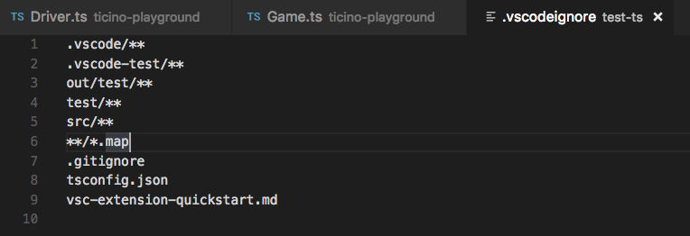

### launch.json と tasks.json の ${workspaceFolder} <a id="workspacefolder-in-launchjson-and-tasksjson"></a>

新しい置換変数 `${workspaceFolder}` を導入しました。この変数は適切な `launch.json` や `tasks.json` を含むワークスペース フォルダーの絶対パスに置き換えられます。これは以前の `${workspaceRoot}` と同じ効果がありますが、これからのマルチルート ワークスペースの構想ではもはや古い名前が十分でないと感じました。私たちは `${workspaceRoot}` を非推奨にしていますが、後方互換性のためにまだサポートされます。変数置換の詳細については[ここ](https://code.visualstudio.com/docs/editor/debugging#_variable-substitution)を参照してください。

### QuickOpen は ripgrep を使用します <a id="quickopen-uses-ripgrep"></a>

QuickOpen (`kb(workbench.action.quickOpen)`) はユーザーの入力フィルターを適用する前に [ripgrep](https://github.com/BurntSushi/ripgrep) を使用してファイル名の完全なリストを取得するようになりました。Windows ユーザーは大規模なフォルダー上でパフォーマンスが向上するはずです。これは以前にリスト ファイル名を増やすために `find` を使用していた Linux と macOS と同等です。

## エディター <a id="editor"></a>

### 折りたたみ <a id="folding-regions"></a>

折りたたみで region marker がサポートされるようになりました。マーカーは言語構成で言語によって定義されます。

現在、次の言語でマーカーが定義されています:

* TypeScript/JavaScript:  `//#region` and `//#endregion`  and `//region` and `//endregion`
* C#: `#region` and `#endregion`
* C/C++: `#pragma region` and `#pragma endregion`
* F#: `//#region` and `//#endregion`
* Powershell: `#region` and `#endregion`
* VB: `#Region` and `#End Region`

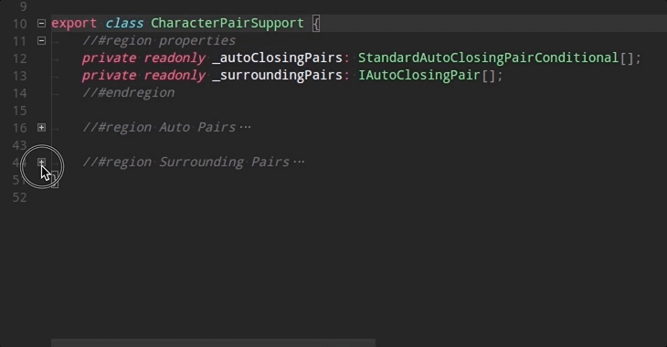

各言語にはマーカー用のスニペットも用意されています。表示するには '#' を入力してコード補完を呼び出します。

使用している言語用に region marker を構成するには、言語拡張機能の提供者に問い合わせてください。

### オフサイド言語で折りたたみ <a id="folding-in-offside-languages"></a>

コード ブロックの  [off-side rule](https://en.wikipedia.org/wiki/Off-side_rule)  に従う言語では、空の行はその次の折りたたみ領域に属します。

> 原文: In languages that follow the [off-side rule](https://en.wikipedia.org/wiki/Off-side_rule) for code blocks, empty lines belong to the next folding region.

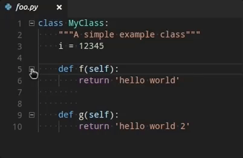

設定は言語設定で構成され、次の言語で有効になります:

Python, Yaml, Pug, Markdown, Clojure, CoffeeScript, FSharp

### スニペット セレクター <a id="snippet-selector"></a>

**Insert Snippet** コマンドで表示されるスニペット ピッカーのドロップダウンは、**User Snippets** と **Extension Snippets** の 2 つのスニペット グループで表示されるようになりました。ユーザー定義のスニペットはリストの上に表示され、お気に入りのスニペットに素早くアクセスできます。


### スニペット変換 <a id="snippet-transforms"></a>

VS Code スニペット エンジンは変数の変換(Transformations)をサポートするようになりました。Transformations は値を挿入する前に変数の値を変更できます。フォーマットは `var_name/regular_expression/format_string/options` です。次のサンプルはファイル名から派生した public Java class を作成するスニペットの例です。

```json
  "Public Class": {
    "prefix": "pclass",
    "body": [
      "public class ${1:${TM_FILENAME/(.*)\\.java/${1:/capitalize}/}} {",
      "\tpublic $1 (${2:params}) {",
      "\t\t$0",
      "\t}",
      "}"
    ],
    "description": "New public class"
  }
```

`${TM_FILENAME/(.*)\\.java/${1:/capitalize}/}` が新しい部分です:

1. `TM_FILENAME` の値を解決します。例:`myClass.java`。
2. 正規表現 `/(.*)\\.java` を使用してそこで `.java` で終わるベース名の一致グループを作成します。例:`myClass`。
3. 最初に一致するグループの値をとり、大文字ではじめさせ (`/capitalize`)、それを挿入します (`MyClass`)。

詳細については [snippet grammar](https://code.visualstudio.com/docs/editor/userdefinedsnippets#_snippet-syntax)  を参照してください。

### Lightbulb の改善 <a id="lightbulb-improvements"></a>

* 新しい `editor.lightbulb.enabled` 設定はエディターでコード アクションを有効または無効にします。デフォルト値は `true` です。
* コード アクション メニューはデフォルトで最初のエントリーが選択され実行しやすくなります。

### 履歴の移動を改善 <a id="improved-history-navigation"></a>

VS Code にはファイル内またはファイル間のエディターの履歴を移動するためのコマンドがあります (`workbench.action.navigateBack`, `workbench.action.navigateForward`)。このマイルストーンの間に履歴で不要なつっかえを減らすためにエクスペリエンスを微調整しました:

* We now require a minimum distance of 10 lines from one selection to another to add a new entry to history (previously we required a distance of 5 lines).
* Navigating less than 10 lines replaces the last history stop within the file with that location and thus avoids introducing unwanted stops.

In addition, we no longer center the selection vertically when navigating unless the selection is outside of the view. これにより移動中コンテキストに居続けることが容易になります。

### 警告色のカラーリング <a id="coloring-of-warning-squigglies"></a>

情報を区別するために、警告破線に違う配色を使用できるようになりました:

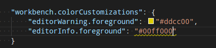

### Emmet preferences <a id=emmet-preferences"></a>

[Emmet 2.0](https://code.visualstudio.com/blogs/2017/08/07/emmet-2.0) の [Emmet Preferences](https://docs.emmet.io/customization/preferences/) サポートをより追加し続けました。[前回のリリース](https://code.visualstudio.com/updates/v1_16#_emmet-preferences)で追加した設定に加え 次を用意しています:

* `bem.elementSeparator`
* `bem.modifierSeparator`
* `filter.commentBefore`
* `filter.commentTrigger`
* `filter.commentAfter`

`filter.commentAfter` プリファランスのフォーマットは Emmet 2.0 とは異なりシンプルです。

たとえば、古いフォーマットの代わりに

```json
"emmet.preferences": {
    "filter.commentAfter": "\n<!-- /<%= attr('id', '#') %><%= attr('class', '.') %> -->"
}
```

次を使用するかもしれません

```json
"emmet.preferences": {
    "filter.commentAfter": "\n<!-- /[#ID][.CLASS] -->"
}
```

## 統合ターミナル <a id="integrated-terminal"></a>

### 新しいレンダリング エンジン <a id="new-rendering-engine"></a>

統合ターミナルは状況に応じて約 5 ~ 45 倍速く描画する新しい canvas ベースのレンダリング エンジンを使用するようになりました。この変更により、入力レイテンシ、消費電力、ターミナルのフレーム レートが大幅に向上します。


詳細については [blog post](https://code.visualstudio.com/blogs/2017/10/03/terminal-renderer) で詳しく読むことができます。

## デバッグ <a id="debugging"></a>

### デバッグ コンソール メッセージにソースの場所を表示 <a id="debug-console-messages-show-source-location"></a>

デバッグ コンソールの出力メッセージで右側に originating source location を表示するようになりました:

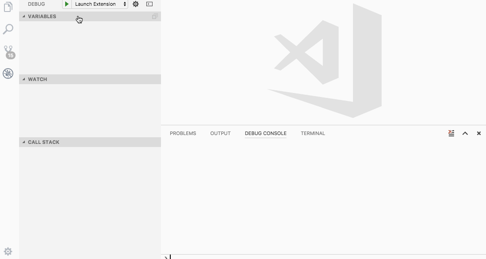

このオリジナルをクリックするとエディターでソース ファイルが開きます。

**Note**: 次のデバッガは既にこの機能をサポートしています:

* Node.js - "inspector" protocol only
* Extension Host debugging
* [Debugger for Chrome](https://marketplace.visualstudio.com/items?itemName=msjsdiag.debugger-for-chrome) extension

私たちはこの機能を多くのデバッグ拡張機能が採用することを期待しています。

## Node Debugging デバッグ <a id="node-debugging"></a>

### WSL 対応の第一歩 <a id="first-steps-towards-wsl-support"></a>

[Bartosz Sosnowski (@bzoz)](https://github.com/bzoz) による [PR](https://github.com/Microsoft/vscode-node-debug/pull/158) のおかげで、Node.js デバッガ (このマイルストーンでは "legacy" プロトコルのみ) は [Windows Subsystem for Linux](https://msdn.microsoft.com/commandline/wsl/about) (WSL) で Node.js のアプリケーションの起動とデバッグをサポートするようになりました。

この機能を使用すると Linux subsystem on Windows で実行されるように `useWSL` フラグをデバッグ構成に追加することができます。このフラグは WSL で Node.js ランタイムを起動するだけでなく、WSL と Windows 間で正しくパスをパップするようにデバッガを構成します。

次は WSL で `hello.js` をデバッグするための最も簡単なデバッグ構成です:

```json
{
    "type": "node",
    "request": "launch",
    "name": "Launch in WSL",
    "useWSL": true,
    "program": "${workspaceFolder}/hello.js"
}
```

### stdout/stderr から直接出力表示 <a id="viewing-output-from-direct-stdoutstderr-writes"></a>

`console.log` ではなく `process.stdout.write` を使用して stdout ストリームへの直接書き込みを行う Node.js ロギング ライブラリーがいくつかあります。これは高速ですが Node のデバッグ ソケットから送信されるものではなかったため、新しい 'inspector' プロトコルでデバッグする際にこれらのメッセージがデバッグ コンソールに表示されませんでした。

[Vakhurin Sergey (@igelbox)](https://github.com/igelbox) からの [PR #138](https://github.com/Microsoft/vscode-node-debug2/pull/138) は、stdout/stderr 出力をデバッグ コンソールに表示するようデバッグ アダプターに指示する `"outputCapture": "std"` 起動構成オプションを追加しました。

## タスク <a id="tasks"></a>

タスクにマルチ フォルダー サポートを追加しました。複数のフォルダーを持つワークスペースを作成すると、タスク バージョン "2.0.0" を使用しているすべてのワークスペース フォルダーのタスクが収集され、対応する **Run** コマンドで表示します。起動構成は同じワークスペース フォルダーからタスクを preLaunch タスクとして参照することもできます。

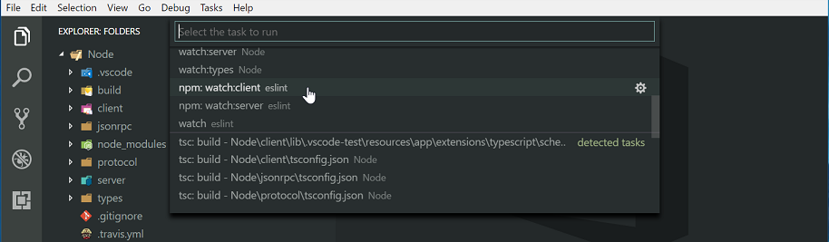

Gulp, Grunt, Jake, npm のタスク自動検出はマルチルート ワークスペースもサポートするようになりました。また [task contribution API](#tasks-contribution-api) は異なるワークスペース フォルダーに対するタスク貢献をサポートするように拡張されました。

なおマルチ フォルダー サポートは [Insiders](https://code.visualstudio.com/insiders) ビルドである櫃夜があります。

## 言語 <a id="languages"></a>

### TypeScript 2.5.3 <a id="typescript-2.5.3"></a>

VS Code に TypeScript 2.5.3 が含まれるようになりました。この更新ではメソッドの抽出リファクタリングやいくつかの重要な修正や改善が行われています。

### JavaScript と TypeScript で import パスの候補 <a id="import-path-quick-suggestions-in-javascript-and-typescript"></a>

JavaScript と TypeScript は VS Code 1.9 以降の importパスに対して IntelliSense を提供しています。しかし、import を入力している間に手動で IntelliSense をトリガする必要があったためこの機能について知らなかった可能性がありました。VS Code 1.17 を使用すると  `import` や `require` パスの入力を始めると自動的に module とパスの提案を表示します:

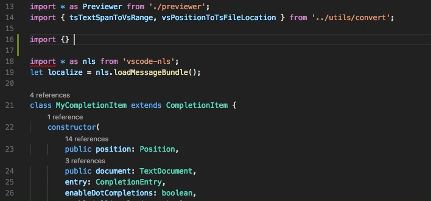

### Dark+ と Light+ テーマのカラライゼーション
改善<a id="improved-colorization-in-dark-and-light-themes"></a>

VS Code のビルトインの Dark+ と Light+ テーマでは、正規表現コンポーネントのハイライトより簡単に識別されるようになりました:

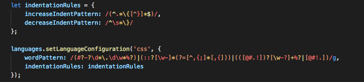

format string と string interpolation のカラライゼーションもいくつかの言語で改善されました。

Python:


Ruby:

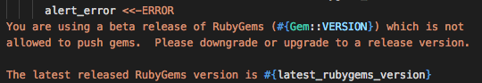

### メソッドの抽出時に名前変更 <a id="extract-method-now-triggers-rename"></a>

JavaScript と TypeScript のメソッドや関数の抽出リファクタリングは、抽出されたメソッドや関数で自動的に名前変更をトリガーするようになりました。

### TypeScript watch ビルド タスクの自動検出 <a id="auto-detection-of-typescript-watch-build-tasks"></a>

TypeScript は通常のビルド タスクとともににプロジェクト内の `tsconfig.json` ファイルにウォッチ タスクを自動的に作成するようになりました:


### JavaScript と TypeScript IntelliSense の Markdown サポート <a id="javascript-and-typescript-intellisense-now-supports-markdown"></a>

JavaScript や TypeScript の提案とパラメーター ヒントが Markdown コンテンツを表示するようになりました。


### JSX 言語スコープの改善 <a id="improvements-to-jsx-language-scoping"></a>

JSX タグ内の javaScript 式は javaScript 言語として正しくマークされるようになりました。これにより、ブラケット マッチングやコード コメントなどの基本的な言語機能に関するバグが修正されます。

### Markdown コード ブロックでの言語サポート <a id="language-support-in-markdown-code-blocks"></a>

Markdown ファイルの囲まれたコード ブロックはその内容に言語モードを設定できるようになりました。つまり、ブラケット マッチングやコード コメントなどの基本的な言語機能では、Markdown の言語設定ではなくコード ブロックの言語設定を使用するようになります。

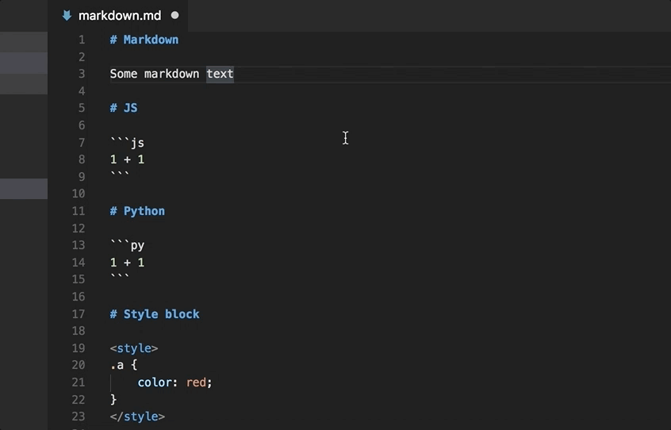

### Markdown 参照リンクの検出 <a id="detection-of-markdown-reference-links"></a>

参照リンクと参照リンクの定義はエディターでリンクとして検出されるようになりました:

```md
Some text with a [link][link definition] in it

[link definition]: /path/to/link
```

`link definition` をクリックすると  `[link definition]:` に移動します。`/path/to/link` がリンクとして検出されています。

### CSS 言語の改善 <a id="css-language-improvements"></a>

ビルトイン CSS/LESS/SCSS 言語サーバーが更新され、次の機能がサポートされるようになりました:

* `@supports` ルールの検証と補完
* クエリと `@import` のサポート
* `contain` といくつかの flex プロパティのサポート

### R 言語の改善 <a id="r-language-improvements"></a>

R 言語は[ここ](https://github.com/randy3k/R-Box)で公開されている文法に基づいてシンタックス ハイライトを改善しました。

## ソース管理 <a id="source-control"></a>

### マルチ SCM サポートの改善

ソース管理プロバイダー UX で継続的な繰り返しにより master-detail の実装が可能になりました。


複数の利用可能なリポジトリーがあるとき、新しい **SOURCE CONTROL PROVIDERS** で概要を表示します。これらは、いくつかの SCM プロバイダーで提供することができます。たとえば Git リポジトリーと TFS ワークスペースを並べて表示することができるのです。このビューでリポジトリーを選択することで強調表示されます。複数のリポジトリーを選択するには <kbd>ctrl+click</kbd> か <kbd>shift+click</kbd> を使用します。これらは分割された下のビューに表示されます。

### パフォーマンスの向上 <a id="increased-performance"></a>

ソース コントロール 拡張機能の API と UI についてはかなりのパフォーマンス向上がありました。全体的にエクスペリエンスは多くのオプジェクトを持つリポジトリーではるかにスムーズです。

### Git stash コマンド <a id="git-stash-commands"></a>

前回のリリースでこれを見逃したかもしれませんが、[Krzysztof Cieślak (@Krzysztof-Cieslak)](https://github.com/Krzysztof-Cieslak) からの PR のおかげで、 VS Code には  **Source Control** ビューの **More** (...) ドロップダウンで Git `stash` コマンドがあります。


## 新しいドキュメント <a id="new-documentation"></a>

### Java 言語サポート <a id="java-language-support"></a>

新しい [Java](https://code.visualstudio.com/docs/languages/java) 言語のトピックでは、VS Code で優れた Java code intelligence とデバッグ サポートのために [Java Extension Pack](https://marketplace.visualstudio.com/items?itemName=vscjava.vscode-java-pack) をインストールして使用する方法について説明しています。

### ヒントとコツ <a id="tips-and-tricks"></a>

VS Code を使用してすばやく生産的になれるよう [Tips and Tricks](https://code.visualstudio.com/docs/getstarted/tips-and-tricks) トピックを追加しました。これには VS Code チームが日常的に使用するお気に入りの機能とキーボード ショートカットが含まれています。

### デバッグのレシピ <a id="debugging-recipes"></a>

様々なデバッグ シナリオのために [recipes](https://github.com/Microsoft/vscode-recipes) に取り組んでおり、これらをガイドする新しいトピックと役立つブログ記事のリンクを提供する新しいトピックを追加しました。React, Angular, Electron や Docker のようなラインタイムのデバッグ フレームについては [Debugging Recipes](https://code.visualstudio.com/docs/nodejs/debugging-recipes) を参照してください。

### Keyboard Shortcut Cheat Sheet の更新 <a id="updated-keyboard-shortcut-cheat-sheets"></a>

キーボード ショートカット PDF を更新して  **Open User Settings** (`kb(workbench.action.openGlobalSettings)`), **Open Keyboard Shortcuts** (`kb(workbench.action.openGlobalKeybindings)`) といった便利なコマンドのキーバインドを追加しました。

* [Windows](https://go.microsoft.com/fwlink/?linkid=832145)
* [macOS](https://go.microsoft.com/fwlink/?linkid=832143)
* [Linux](https://go.microsoft.com/fwlink/?linkid=832144)

## 拡張機能オーサリング <a id="extension-authoring"></a>

### 拡張機能作成者のためのマルチ ルート ガイド <a id="multi-root-guide-for-extension-authors"></a>

すべてのユーザーにマルチルート サポートを提供するときは非常に近いです。すべての VS Code コア機能 [SCM, Settings, Debug, Tasks, ...] と拡張機能 [HTML, JS/TS, ESLint, Docker, ...] はマルチルートのコンセプトをサポートするようになりました。

私たちは拡張機能をマルチルート ワークスペースを準備するための方法についてのガイドを作成しました。詳細については [Adopting Multi Root Workspace APIs](https://github.com/Microsoft/vscode/wiki/Extension-Authoring:-Adopting-Multi-Root-Workspace-APIs) ガイドを参照してください。議論済みのすべての API は安定しており現在利用可能であると考えられています。ただしマルチルート ワークスペースは VS Code Insider リリースでのみ有効です。

拡張機能の作成者ガイドは次を説明しています:

* Basic APIs
* Settings
* Impact on extensions that have a language client/server model

このガイドに加え新しい API を使用する [samples repository](https://github.com/Microsoft/vscode-extension-samples) には新しいサンプルがあります。 フォルダー名が 'multi' のサンプルを検索してください (例: [basic-multi-root-sample](https://github.com/Microsoft/vscode-extension-samples/tree/master/basic-multi-root-sample)。


### ファイルの保存/開くダイアログ <a id="_file-save-file-open-dialogs"></a>

拡張機能 API には拡張機能がファイルやフォルダーを保存したり開いたりするためのダイアログを表示する新しい 2 つの関数があります。次のスニペットには画像ファイルを選択するダイアログが表示されます。

```ts
vscode.window.showOpenDialog({
    canSelectMany: true,
    filters: { 'Images': ['png', 'jpg'] }
}).then(result => {
    if (result) {
        console.log(`${result.length} files have been selected`);
    }
});
```

### 補完と署名のヘルプを改善 <a id="styled-completions-and-signature-help"></a>

`CompletionItems` と  `SignatureHelp` の API を拡張してこれらのドキュメントは `MarkdownString` として提供できるようになりました。これにより  fancy rendering、埋め込みコード スニペット、ドキュメントへのリンクが可能になります。私たちの TypeScript と JavaScript  拡張機能はすでに  `MarkdownString` を使用しています。

```ts
const item = new vscode.CompletionItem('Pretty');
item.documentation = new vscode.MarkdownString('*Hello*, `World`');
```

### CompletionContext <a id="completionContext"></a>

`CompletionItemProvider.provideCompletionItems` は新しい `CompletionContext` パラメーターを使用して提供しています。このコンテキストには補完プロバイダーがどのようにトリガーされたかに関する情報が含まれています:

```ts
interface CompletionContext {
  /**
    * How the completion was triggered.
    */
  readonly triggerKind: CompletionTriggerKind;

  /**
    * Character that triggered the completion item provider.
    * `undefined` if provider was not triggered by a character.
    * The trigger character is already in the document when the completion provider is triggered.
    */
  readonly triggerCharacter?: string;
}
```

### Touch Bar サポート <a id="touch-bar-support"></a>

拡張機能は macOS で Touch Bar にコマンドを提供できるようになりました。新しい menu identifier `touchBar` はこの目的のために追加されています:

```json
"contributes": {
  "menus": {
    "touchBar": [
      {
        "command": "markdown.showPreview",
        "when": "editorLangId == markdown",
        "group": "navigation"
      }
    ]
   }
}
```

常にコマンド コンテキストは現在のアクティブなファイルで、`when` に基づきコマンドを動的に表示および非表示にすることができます。これはラベルまたはアイコンのどちらかを持つことができます。コマンドがアイコンを提供する場合 touch bar のスペースはとても限られているためラベルは表示されません。

**Note**: 現在コマンドのアイコンは PNG ファイルである必要があります。SVG はサポートされません。

### 'active' ビュー列を参照 <a id="refer-to-the-active-view-column"></a>

エディターのレイアウトは 1, 2, 3 列に機能し `showTextDocument` 関数をしようするときは列を設定できます。ただし、現在アクティブな列を参照したいときがしばしばあります。これを簡単にするために、新しいシンボル列 `ViewColumn.Active` を追加しました。これは常に現在アクティブなカラムのドキュメントを表示しその列が何であるかを把握するのを助けます。

貢献者の [Eric Amodio (@eamodio)](https://github.com/eamodio) に感謝します。

### MarkedString vs MarkdownString <a id="markedstring-vs-markdownstring"></a>

このリリースでは `MarkedStrings` のコマンド リンクを使用できないことに注意してください。これがあなたの拡張機能へ影響を与える場合、私達から既にコンタクトがされている可能性があります。新しい `MarkdownString` を使用してこれを信頼できるものとしてマークしてください。詳細と背景は[ここ](https://github.com/Microsoft/vscode/issues/33577)で確認してください。

### 新しいソース管理メニュー <a id="new-source-control-menu"></a>

`scm/sourceControl` menu id を使用して **Source Control** ビューの新しい **SOURCE CONTROL PROVIDERS** セクションでインライン ソース管理プロバイダーにコマンドを提供できるようになりました。現在、context menu commands のみがサポートされています。

### タスク貢献 API <a id="tasks-contribution-api"></a>

Task API は異なるワークスペース フォルダーに貢献しているタスクをサポートするように拡張されました。拡張機能でタスクを作成するコンストラクターには、タスクがグローバル、ユーザー ローカル、ワークスペース フォルダーに属するかを特定する追加の引数があります。コンストラクタのシグネチャは次のようになります:

```ts
export class Task {
    /**
        * Creates a new task.
        *
        * @param definition The task definition as defined in the taskDefinitions extension point.
        * @param target Specifies the task's target. It is either a global or a workspace task
        *  or a task for a specific workspace folder.
        * @param name The task's name. Is presented in the user interface.
        * @param source The task's source (e.g. 'gulp', 'npm', ...) presented in the user interface.
        * @param execution The process or shell execution.
        * @param problemMatchers the names of problem matchers to use, like '$tsc'
        *  or '$eslint'. Problem matchers can be contributed by an extension using
        *  the `problemMatchers` extension point.
        */
    constructor(taskDefinition: TaskDefinition, target: WorkspaceFolder | TaskScope.Global | TaskScope.Workspace, name: string, source: string, execution?: ProcessExecution | ShellExecution, problemMatchers?: string | string[]);
}
```

### デバッグAPIの更新 <a id="debug-api-updates"></a>

**`vscode.startDebug` コマンドは非推奨です**

7 月のリリースで適切な `vscode.debug.startDebugging(...)` APIの導入により、`vscode.startDebug` コマンドを使用してデバッグ セッションを開始する必要はなくなりました。私たちは 8 月に `vscode.startDebug` コマンドを非推奨にしています。10 月にこれを削除する計画です。この機能を取りやめることが難しい場合は[ここ](https://github.com/Microsoft/vscode/issues/33795)にコメントしてください。

**Command `vscode.workbench.customDebugRequest` は非推奨です**

7 月のリリースで適切な `DebugSession.customRequest(...)` API の導入により、`vscode.workbench.customDebugRequest` コマンドを使用してカスタム リクエストをデバッグ アダプターに送る必要はなくなりました。8 月に `vscode.workbench.customDebugRequest` は非推奨になりました。10 月にこれを削除する計画です。この機能を取りやめることが難しい場合は[ここ](https://github.com/Microsoft/vscode/issues/33796)にコメントしてください。

### package.jsonでのデバッグ貢献 <a id="debug-contributions-in-package.json"></a>

**新しいアクティブ化イベント `onDebug`**

新しいデバッグ API を使用するには VS Code が必要なとき利用するために、拡張機能は早期に `DebugConfigurationProvider` を登録する必要があります。通常 `DebugConfigurationProvider` は拡張機能の `activate` 関数に登録されるので、新しい `onDebug` アクティブ化イベントを導入しています。これはちょうどデバッグが開始する (例: 起動構成の設定やデバッグ セッションの起動) 前に発火します。

拡張機能が `DebugConfigurationProvider` を登録している場合は package.json の `activationEvents` 貢献に `onDebug` があることを確認してください。

**アクティブ化イベント `onDebug:type` は非推奨です**

`DebugConfigurationProvider` API の導入により、('type' が debug type な) `onDebug:type` アクティブ化イベントを正しくサポートすることが難しくなりました。代わりに新しく導入されたアクティブ化イベント `onDebug` を使用することをお勧めします。

9 月のマイルストーンで `onDebug:type` のアクティブ化イベントを非推奨にし、10 月の更新でこれを削除する計画です。この機能を取りやめることが難しい場合は[ここ](https://github.com/Microsoft/vscode/issues/33803)にコメントしてください。

**_package.json_ で debuggers.startSessionCommand` を使用することは非推奨です**

`DebugConfigurationProvider` 型で `resolveDebugConfiguration` メソッドを導入すると、`debuggers` 貢献ポイントで `startSessionCommand` を貢献する必要がなくなりました。したがって 8 月のリリースで `startSessionCommand` コマンドを非推奨にし 10 月に削除する予定です。この機能を取りやめることが難しい場合は[ここ](https://github.com/Microsoft/vscode/issues/33791)にコメントしてください。

**_package.json_ で `debuggers.initialConfigurations` を使用することは非推奨です**

`DebugConfigurationProvider` 型で `provideDebugConfigurations` メソッドを導入すると、`debuggers` 貢献ポイントで `debuggers.initialConfigurations` を貢献する必要がなくなりました。したがって 8 月のマイルストーンで、コマンド ID を指定する機能を非推奨にし 10 月に削除する予定です(しかし JSON オブジェクトリテラルへの貢献サポートは続きます)。この機能を取りやめることが難しい場合は[ここ](https://github.com/Microsoft/vscode/issues/33794)にコメントしてください。

### Debug Adapter Protocol <a id="debug-adapter-protocol"></a>

**`BreakpointEvent` は `removed` reason をサポートします**

`BreakpointEvent` の `reason` 属性の値に `removed` reason が追加されました。この追加により、デバッグ アダプターはそのクライアント(フロントエンド)にブレークポイントが削除されたことを通知できます。

**Please note**: このリリースでは VS Code がブレークポイントの `new`, `changed`, `removed` reason を完全にサポートするようになりました。以前までの VS Code では `changed` (or `updated`) breakpoint イベントのみをサポートしていました。breakpoint イベントが `reason` に正しい値を使用していることを確認してください。

**Locale をデバッグ アダプターに渡すことができます**

オプションでデバッグ アダプター プロトコルのクライアント(フロントエンド)は、現在の Locale をデバッグ アダプターに渡すことができるため、クライアントに渡された視覚的ユーザー情報(例: エラー メッセージ)に対して正しい変換を選択できます。`initialize` リクエストにはオプションの `locale` 属性がでました。

### プレビュー: Remote File System API <a id="preview-remote-file-system-api"></a>

私たちは "リモート ファイル システム"のサポートを模索している最中です。新しい API を使用するとファイルやフォルダーをエクスプローラーに追加したり、ファイル/フォルダーの作成、削除、移動、コピー、ファイルの読み書きをしたりできます。目標はリモート ソースからのアイテムが表示され、ローカル ディスクと同じような動作をすることです。

次のスクリーンキャプチャではディスク上のファイルのように Azure のファイルが表示されています。

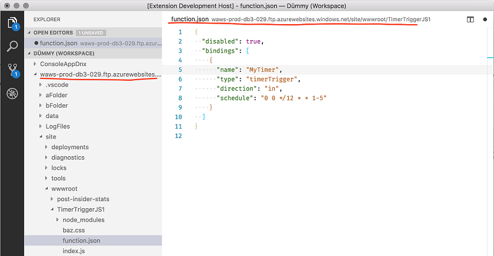

これに慣れるには [proposed-apis](https://github.com/Microsoft/vscode/blob/38779c0593c7604136c584060ea18212d8a00b4f/src/vs/vscode.proposed.d.ts#L116) を参照し、さらに重要な [ftp-sample](https://github.com/jrieken/ftp-sample) を確認してください。私たちは API の更新と洗練にあわせてこのサンプルを最新の状態に保ちます。

## プレビュー: Multi Root Workspaces <a id="preview-multi-root-workspaces"></a>

>**Note:** マルチルート機能は安定版で利用できるまでは Insider ビルドでのみ使用可能です。試すには  [https://code.visualstudio.com/insiders](https://code.visualstudio.com/insiders) から Insiders ビルドを入手してください。

1 つの VS Code インスタンスで複数のフォルダー([issue #396](https://github.com/Microsoft/vscode/issues/396))を開くために対応を進めてきました。これまでのリリースではこの機能のプレビューが用意されました([1.14.0 release notes](https://code.visualstudio.com/updates/v1_14#_preview-multi-root-workspaces), [1.15.0 release notes](https://code.visualstudio.com/updates/v1_14#_preview-multi-root-workspaces), [1.16.0 release notes](https://code.visualstudio.com/updates/v1_16#_preview-multi-root-workspaces))。

今回のマイルストーンではウィンドウの再読み込みを行わずにワークスペースに移行することにフォーカスをあてて、マルチルート ワークスペースに対応する拡張機能用の API をさらに導入しました。

### ウィンドウを再読み込みせずにワークスペースに入る <a id="enter-a-workspace without-window-reload"></a>

これまではワークスペースを作成/保存、ワークスペースにフォルダーを追加するときにウィンドウ全体をリロードする必要がありました。このウィンドウのリロードが必要なくなりマルチルートのエクスペリエンスがよりスムーズになりました。

### 拡張機能の推奨事項 <a id="extension-recommendations"></a>

拡張機能の推奨事項のサポートをマルチルート ワークスペースに拡張しました。すべてのルート フォルダーから拡張機能の推奨事項は統合され表示されます。また **Extensions: Configure Recommended Extensions (Workspace)** コマンドを使用してマルチルート ワークスペース用の推奨事項を構成することもできます。これによりワークスペース構成ファイルが開き `extensions/recommendations` セレクションに推奨事項を入力することができます。

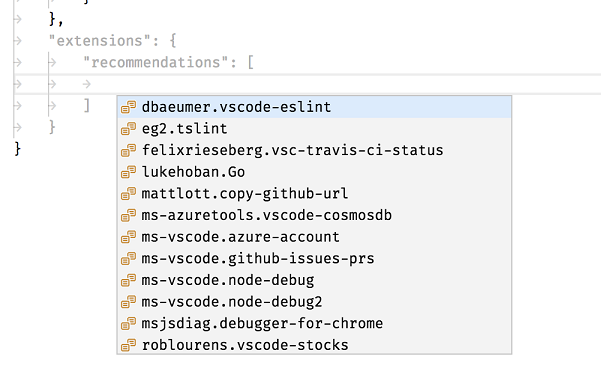

### 新しい API: Workspace Folder Picker

VS Code でのマルチルート サポートの到来により、拡張機能が特定の `WorkspaceFolder` をユーザーに尋ねたいときがあることに気が付きました。新しい提案 API `showWorkspaceFolderPick` メソッドはピッカーを開き結果を返します。

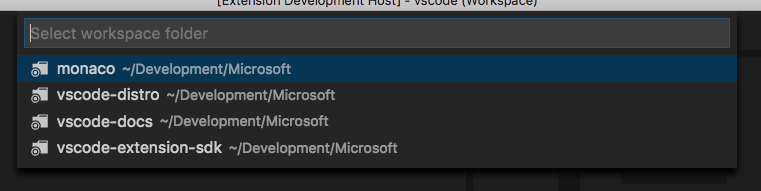

### 新しい API: RelativePattern <a id="new-api-relativepattern"></a>

特定の `WorkspaceFolder` へのファイル パスを簡単にフィルタリングできるように、新しい `RelativePattern` タイプを追加し、次の場所でサポートしました:

* `workspace.createFileSystemWatcher`
* `workspace.findFiles(include, exclude)`
* `DocumentFilter#pattern`

タイプは次のようなクラスです:

```typescript
/**
 * A relative pattern is a helper to construct glob patterns that are matched
 * relatively to a base path. The base path can either be an absolute file path
 * or a [workspace folder](#WorkspaceFolder).
 */
class RelativePattern {

  /**
   * A base file path to which this pattern will be matched against relatively.
   */
  base: string;

  /**
   * A file glob pattern like `*.{ts,js}` that will be matched on file paths
   * relative to the base path.
   *
   * Example: Given a base of `/home/work/folder` and a file path of `/home/work/folder/index.js`,
   * the file glob pattern will match on `index.js`.
   */
  pattern: string;

  /**
   * Creates a new relative pattern object with a base path and pattern to match. This pattern
   * will be matched on file paths relative to the base path.
   *
   * @param base A base file path to which this pattern will be matched against relatively.
   * @param pattern A file glob pattern like `*.{ts,js}` that will be matched on file paths
   * relative to the base path.
   */
  constructor(base: WorkspaceFolder | string, pattern: string)
}
```

次の呼び出しを介して相対パターンを作成できます:

```typescript
// Construct a relative pattern for the first root folder
const relativePattern = new vscode.RelativePattern(vscode.workspace.workspaceFolders[0], '*.ts');
```

 `RelativePattern` が使用されるとき、ファイル パスはパターンの基本パスに対して相対的にマッチングされます。たとえば `/home/work/folder` の基本パスと `/home/work/folder/index.ts` のファイルパスが与えられた場合 `RelativePattern` 内のパターンは `index.ts` に一致します。

### 賢いワークスペース ファイル形式の保存 <a id="smarter-workspace-file-format-saving"></a>

ワークスペース ファイルをディスクで保存するとき、ファイルが既にスラッシュを使用している場合には Windows 上でパスに普通のスラッシュを使用することをお勧めします。(編集メモ: バックスラッシュを使用している場合?)これにより Windows と他のプラットホーム間でワークスペース ファイルを簡単に共有できるようになります。

さらに、ワークスペース ファイル内のコメントを保存できるようになりました。JSON はファイル内のコメントを許可していませんが、VS Code 設定に使用しているのと同じ JSON パーサーを使用することで、コメントを許可し、エラートレラントを高めました。たとえば、末尾のカンマでワークスペース ファイル全体が無効になることはありません。

### ワークスペースのフォルダー名 <a id="workspace-folder-name"></a>

構成ファイル内の各フォルダーに `name` プロパティを割り当てることができるようになりました。この名前はエクスプローラーで表示され同じベース名を持つ複数のワークスペース フォルダーで使用されます。

## エンジニアリング <a id="engineering"></a>

### 問題管理の自動化 <a id="issue-management-automation"></a>

私たちは [Probot](https://github.com/probot/probot) インスタンスの使用範囲をメイン リポジトリー超えて拡張しました。これを使用して私たちの拡張機能と他のリポジトリーで issue の自動アサインと "needs more info" の自動クローズをするようになります。

## 注目の変更 <a id="notable-changes"></a>

* [27285](https://github.com/Microsoft/vscode/issues/27285): Onedrive 配下にあるフォルダーを開くことができません
* [25934](https://github.com/Microsoft/vscode/issues/25934): 高 DPI の外部モニターで VS Code がちらつく
* [35148](https://github.com/Microsoft/vscode/issues/35148): VS Code がオフスクリーンで開きます
* [22696](https://github.com/Microsoft/vscode/issues/22696): Cmd-A は保存dialogの save-as フィールドで選択できません

## Thank You

最後になりましたが、VS Code をより良いものへするために協力してくれた次の方々に多大なる感謝を込めて:

`vscode`への貢献:

* [Arthur Ozga (@aozgaa)](https://github.com/aozgaa):  report tsserver response error as telemetry [PR #34860](https://github.com/Microsoft/vscode/pull/34860)
* [Brandon Bloom (@brandonbloom)](https://github.com/brandonbloom):  Implement "Go Last" [PR #33715](https://github.com/Microsoft/vscode/pull/33715)
* [@DatGuyJonathan](https://github.com/DatGuyJonathan):  Maintain focus on stopped thread when stepping a multithreaded session [PR #34401](https://github.com/Microsoft/vscode/pull/34401)
* [Dustin Campbell (@DustinCampbell)](https://github.com/DustinCampbell):  Fix C# TextMate grammar to properly highlight statement-level await expressions [PR #33687](https://github.com/Microsoft/vscode/pull/33687)
* [Eric Amodio (@eamodio)](https://github.com/eamodio):  Closes #27408 - Adds ViewColumn.Active [PR #34649](https://github.com/Microsoft/vscode/pull/34649)
* [Putta Khunchalee (@ExUltima)](https://github.com/ExUltima):  Replace bash shebang with '#!/usr/bin/env bash" for portability [PR #34543](https://github.com/Microsoft/vscode/pull/34543)
* [Alexander Fadeev (@fadeevab)](https://github.com/fadeevab): Makefile colorization: fix old issues and improvement (~4 changes) [PR #33327](https://github.com/Microsoft/vscode/pull/33327)
* [Faustino Aguilar (@faustinoaq)](https://github.com/faustinoaq):  Fix #33939 [PR #34795](https://github.com/Microsoft/vscode/pull/34795)
* [Felix Becker (@felixfbecker)](https://github.com/felixfbecker): Make ExtensionTipsService multi-root aware [PR #32106](https://github.com/Microsoft/vscode/pull/32106)
* [Emily Marigold Klassen (@forivall)](https://github.com/forivall):  Actually don't sort folders when they are all root folders [PR #34052](https://github.com/Microsoft/vscode/pull/34052)
* [Ilie Halip (@ihalip)](https://github.com/ihalip):  fixed the terminal and find widget key presses [PR #33935](https://github.com/Microsoft/vscode/pull/33935)
* [Yuki Ueda (@Ikuyadeu)](https://github.com/Ikuyadeu):  Fix word highlighting Solarized Dark theme #28343 [PR #33820](https://github.com/Microsoft/vscode/pull/33820)
* [Jep (@jep-a)](https://github.com/jep-a):  Add "indentationRules" for Lua [PR #31696](https://github.com/Microsoft/vscode/pull/31696)
* [Keegan Carruthers-Smith (@keegancsmith)](https://github.com/keegancsmith)
  *  Fix tests and out of bounds in scorer [PR #34576](https://github.com/Microsoft/vscode/pull/34576)
  *  Handle user information in URI [PR #34051](https://github.com/Microsoft/vscode/pull/34051)
* [Alex Cao (@KuromiAK)](https://github.com/KuromiAK):  Improve search aria label generation performance [PR #34491](https://github.com/Microsoft/vscode/pull/34491)
* [showmeear (@mazamachi)](https://github.com/mazamachi):  Fix #32822. Stop propagation keydown event when keybinding. [PR #32826](https://github.com/Microsoft/vscode/pull/32826)
* [Tony Zhang (@neutrinonerd3333)](https://github.com/neutrinonerd3333):  Support commands for standalone language completion items [PR #32738](https://github.com/Microsoft/vscode/pull/32738)
* [Nick Snyder (@nicksnyder)](https://github.com/nicksnyder)
  *  Use unused param [PR #33981](https://github.com/Microsoft/vscode/pull/33981)
  *  Remove duplicate event firing of onDidClose [PR #34255](https://github.com/Microsoft/vscode/pull/34255)
* [Oliver Joseph Ash (@OliverJAsh)](https://github.com/OliverJAsh)
  *  Add import statement snippet to .js(x) files [PR #34682](https://github.com/Microsoft/vscode/pull/34682)
  *  Update .tsx import statement snippet to be consistent with .ts [PR #34653](https://github.com/Microsoft/vscode/pull/34653)
* [Dániel Tar (@qcz)](https://github.com/qcz)
  *  Fix duplicated {0} placeholders in new snippetsService messages [PR #34196](https://github.com/Microsoft/vscode/pull/34196)
  *  Clarify parameters with backticks in error messages [PR #35238](https://github.com/Microsoft/vscode/pull/35238)
* [@rinqu-eu](https://github.com/rinqu-eu):  Add indentationRules to lua [PR #34303](https://github.com/Microsoft/vscode/pull/34303)
* [Greg Zimmerman (@thezim)](https://github.com/thezim):  Fix Select-Object highlighting issue. [PR #34701](https://github.com/Microsoft/vscode/pull/34701)
* [Nguyen Long Nhat (@torn4dom4n)](https://github.com/torn4dom4n):  Updated the license to MIT [PR #34486](https://github.com/Microsoft/vscode/pull/34486)
* [Tony Valderrama (@tvald)](https://github.com/tvald):  Add settings to control the tab subtitle style (#12965) [PR #33815](https://github.com/Microsoft/vscode/pull/33815)
* [Simon Chan (@yume-chan)](https://github.com/yume-chan):  Scroll to selection after cursorUndo command [PR #34933](https://github.com/Microsoft/vscode/pull/34933)
* [Yuki Ueda (@Ikuyadeu)](https://github.com/Ikuyadeu):  Richer R syntax definition by R-Box [PR #28982](https://github.com/Microsoft/vscode/pull/28982)

`vscode-eslint`: への貢献:

* [陈三 (@chenxsan)](https://github.com/chenxsan): Update sourceMaps launch option to true [PR #294](https://github.com/Microsoft/vscode-eslint/pull/294)

`language-server-protocol`への貢献:

* [Paul Brousseau (@object88)](https://github.com/object88): Fixing 'paramters' and 'reponse' typos  [PR #295](https://github.com/Microsoft/language-server-protocol/pull/295)

`vscode-node-debug` への貢献:

* [Bartosz Sosnowski (@bzoz)](https://github.com/bzoz):  Add support for Windows Subsystem Linux [PR #158](https://github.com/Microsoft/vscode-node-debug/pull/158)

`vscode-node-debug2` への貢献:

* [Vakhurin Sergey (@igelbox)](https://github.com/igelbox):  Add a launch.json option to capture output from stdoutput and stderr streams [PR #138](https://github.com/Microsoft/vscode-node-debug2/pull/138)
* [Nguyen Long Nhat (@torn4dom4n)](https://github.com/torn4dom4n):  Ignore Travis and Appveyor [PR #141](https://github.com/Microsoft/vscode-node-debug2/pull/141)

`vscode-generator-code` への貢献:

* [Jiri Spac (@capaj)](https://github.com/capaj):  couple of style fixes, var->const [PR #57](https://github.com/Microsoft/vscode-generator-code/pull/57)
* [Christopher Roach (@croach)](https://github.com/croach):  Fixing 'no such file or directory' error when using `workspaceFolder` [PR #89](https://github.com/Microsoft/vscode-generator-code/pull/89)
* [Markus Eliasson (@eliasson)](https://github.com/eliasson):  Update gitignore to include `.vscode-test` [PR #90](https://github.com/Microsoft/vscode-generator-code/pull/90)
* [Gilmore Davidson (@gilmoreorless)](https://github.com/gilmoreorless):  Typo and formatting nitpicks [PR #85](https://github.com/Microsoft/vscode-generator-code/pull/85)

`vscode-github-issues-prs` への貢献:

* [Yuki Ueda (@Ikuyadeu)](https://github.com/Ikuyadeu)
  * Add Copy Url command [PR #24](https://github.com/Microsoft/vscode-github-issues-prs/pull/24)
  * Fix tslint semicolon setting [PR #23](https://github.com/Microsoft/vscode-github-issues-prs/pull/23)

`vscode-recipes` への貢献:

* [ElAndyG (@andyg8180)](https://github.com/andyg8180): removed "Launch with" to reflect the json [PR #25](https://github.com/Microsoft/vscode-recipes/pull/25)
* [Anthony Sneed (@tonysneed)](https://github.com/tonysneed): Update Minimum Angular CLI Version [PR #22](https://github.com/Microsoft/vscode-recipes/pull/22)

`localization` への貢献:

Transifex でコミュニティーによる多言語化を開始してから 6 ヶ月です。現在 Transifex の [VS Code project](https://aka.ms/vscodeloc) チームには 400 人以上のメンバーがいます。新しい翻訳の提供、翻訳への投票、プロセスの改善案による貢献に感謝します。

このリリースでトップ貢献者のスナップショットです。貢献者のリストを含むプロジェクトの詳細については [https://aka.ms/vscodeloc](https://aka.ms/vscodeloc) を参照してください。

* **French:** Antoine Griffard.
* **Italian:** Aldo Donetti, Piero Azi, Giuliano Latini.
* **German:** LosSandreas, Carsten Kneip, Christian Gräfe, Dejan Dinic, Levin Rickert.
* **Spanish:** Raul Rama, Carlos Mendible, Roberto Fonseca, Jorge Serrano Pérez, David Triana, José M. Aguilar, Andy Gonzalez.
* **Japanese:** EbXpJ6bp, Yuichi Nukiyama, Yuki Ueda, tanaka_733, Kyohei MORIYAMA, Yosuke Sano.
* **Chinese (Simplified):** Joel Yang, YingFeng, pluwen, Shawn Dai, Wang Weixuan, 林昊.
* **Chinese (Traditional):** Winnie Lin, Duran Hsieh, Ke-Hsu Chen, Poy Chang.
* **Korean:** HANSEULMARO KIM.
* **Portuguese (Brazil):** Roberto Fonseca, Bruno Sonnino, Danilo Dantas, Alessandro Fragnani, Andy Gonzalez.
* **Hungarian:** Tar Dániel, Attila Csaba Kiss.
* **Turkish:** Adem Coşkuner.
* **Czech:** Vojtěch Habarta, Frantisek Veris, Vít Staniček.
* **Dutch:** Gerald Versluis, Maarten van Stam, Sander van de Velde, Armand Duijn, Splinter Suidman, Geert van der Cruijsen, Peter Hut.
* **Indonesian:** Joseph Aditya P G, Herman Prawiro.
* **Polish:** Wojciech Maj, Patryk Adamczyk.
* **Swedish:** Joakim Olsson, Christian Svensson.
* **Bengali:** Ferdous Ahmed, Reaz Patwary.
* **Vietnamese:** Thanh Phu.
