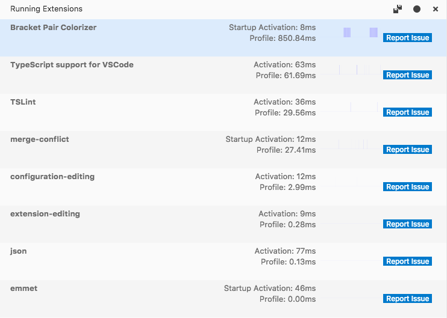
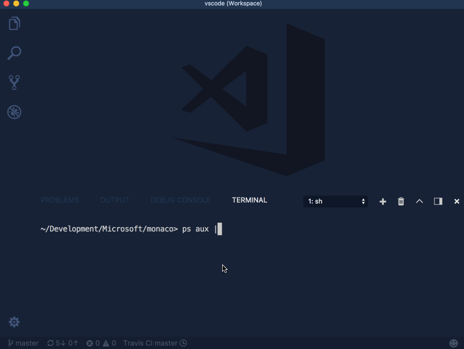

Visual Studio Code 2017 11 月のリリースへようこそ。[11 月の定期更新計画](https://github.com/Microsoft/vscode/issues/38268) でアナウンスしたように、GitHub issue のクリーンアップ、パフォーマンス、データ収集ツールの改善が今月の注目箇所です。

このマイルストーンの間に、すべての VS Code リポジトリで **4400** の問題(トリアージ済み、修正済み)をクローズしました。私たちが issue を閉じるにつれて、ユーザーは **2700** の新しい問題を作成しました。結果として **1700** の問題が削減され、そのうちの **1400** 件がメインの [vscode repository](https://github.com/Microsoft/vscode/issues) で削減されました。

バグ修正のほか、コミュニティーの PR によって更新リストが素晴らしいものになりました。リリースのハイライトは次の通りです:

* **[Performance](#performance)** - 起動とパフォーマンスの向上
* **[Serviceability/Diagnostics](#serviceability)** - 新しい診断、ロギング、拡張機能の監視システム
* **[Smarter IntelliSense](#smarter-intellisense)** - IntelliSense が選択した項目を記憶
* **[Better Tab layout](#new-editor-tabs-layout-option)** - タブのヘッダーを大きさによって変更
* **[Git side-by-side image diff](#image-diffing)** - Git ソース管理プロバイダーで画像の変更を並べて表示
* **[Pipe output into VS Code](#pipe-output-directly-into-vs-code)** - ターミナルの出力を VS Code エディターに表示
* **[New debugging recipes](#debugging-recipes)** -
modemon ユーティリティーを使用して Next.js、Meteor プロジェクト、アプリケーションをデバッグする方法を紹介

> オンラインでリリースノートを確認するには [code.visualstudio.com](https://code.visualstudio.com) の [Updates](https://code.visualstudio.com/updates) に移動してください。
> Cloud Developer Advocate [Brian Clark](https://twitter.com/_clarkio) による 1.19 release [highlights video](https://youtu.be/p6-7GLHWdac) もご確認ください。

リリースノートは VS Code の重要な機能に関連する次のセクションに構成されています。多くの更新があります:

* **[Workbench](#workbench)** - 現在のファイルとクリップボードの内容を比較
* **[Editor](#editor)** - 折りたたみの改善、行番号の間隔、macOS のグローバル クリップボードのサポート
* **[Languages](#languages)** - TypeScript 2.6.2, JSX fragment syntax, 新しい JSON with comments モード
* **[Debugging](#debugging)** - セッションごとの環境変数の削除、より良い VARIABLES の表示
* **[Extensions](#extensions)** - ワークスペースごとに拡張機能を選択
* **[Extension Authoring](#extension-authoring)** - Pre-release 拡張機能サポート、yo code で TSLint や checkJS の有効化

**Insiders:** できるだけ早く新しい新機能を確認したいですか？夜間に更新する Insiders [build](https://code.visualstudio.com/insiders) をダウンロードすれば、最新のアップデートをすぐに試すことが可能です。

## パフォーマンス <a id="performance"></a>

エディターのキーはパフォーマンスであり、11 月にはパフォーマンス関連の問題が約 50 件修正されました。VS Code のプロファイラーに大幅な時間を費やし、初期化フェーズを再考しました。パフォーマンスの向上は、アルゴリズムを最適化するだけでなく、ユーザーの知覚パフォーマンスを向上させることでもあります。起動のライフルサイクルのフェーズ ([#38080](https://github.com/Microsoft/vscode/issues/38080)) を知覚的により早く始めるために、コンポーネントの作成をより良くオーダーすることについて考え始めました (例: エディターに点滅するカーソルをすぐに表示しようとする)。パフォーマンスに関する成果の詳細については
[perf-startup](https://github.com/Microsoft/vscode/issues?q=is%3Aissue+label%3Aperf-startup+milestone%3A%22November+2017%22+is%3Aclosed)、[perf-bloat](https://github.com/Microsoft/vscode/issues?utf8=✓&q=is%3Aissue+milestone%3A%22November+2017%22+is%3Aclosed+label%3Aperf-bloat) (source code reduction)、 [perf](https://github.com/Microsoft/vscode/issues?q=is%3Aissue+milestone%3A%22November+2017%22+is%3Aclosed+label%3Aperf) ラベルが付いた問題を参照してください。

最後に注目すべき最適化をいくつか紹介します:

* 構成モデルの改善による起動と全体的なパフォーマンスの向上 [#37426](https://github.com/Microsoft/vscode/issues/37426), [#37539](https://github.com/Microsoft/vscode/issues/37539)
* package.json ファイルの拡張機能情報をキャッシュすることにより起動パフォーマンスの向上  [#28331](https://github.com/Microsoft/vscode/issues/28331)
* ファイル ウォッチャ [#38230](https://github.com/Microsoft/vscode/issues/38230)、検索アプリケーション [#38235](https://github.com/Microsoft/vscode/issues/38235)、拡張機能プロセス [#38323](https://github.com/Microsoft/vscode/issues/38323)、などの helper プロセスの作成を遅延することにより起動パフォーマンスの向上
* 起動パフォーマンスを向上させるようにファイル読み込みを改善 [#37541](https://github.com/Microsoft/vscode/issues/37541)
* 可能なときツリーに代わる高速なリスト ウィジェットを使用して BREAKPOINTS  ビューと OPEN EDITORS Explorer セクションを改善 [#38638](https://github.com/Microsoft/vscode/issues/38638)
* タッチイベント処理のパフォーマンスの改善による最適化 [#37917](https://github.com/Microsoft/vscode/issues/37917).
* 不要なレイアウトと計算のスキップすることでワークベンチの全体的なパフォーマンス向上 [39699](https://github.com/Microsoft/vscode/issues/), [#39185](https://github.com/Microsoft/vscode/issues/), [#38966](https://github.com/Microsoft/vscode/issues/), [#38963](https://github.com/Microsoft/vscode/issues/), [#38962](https://github.com/Microsoft/vscode/issues/), [#38960](https://github.com/Microsoft/vscode/issues/)
* 未使用のコードを削除することで起動パフォーマンス向上 [#38414](https://github.com/Microsoft/vscode/issues/38414)

これで完成ではありません。パフォーマンスは開発チーム全体の不変のテーマです。perf-labels と向き合い、パフォーマンス関連の問題の提出に怖気づきません。

## 保守性 <a id="serviceability"></a>

VS Code の保守性にもフォーカスを当てることで、問題を追跡するために必要な情報を私たちに簡単に提供できるようにしました。ロギング、診断、拡張機能の監視に取り組み、これが VS Code を改良する手助けをします。まだ機能の一部は開発中ですが、はやくツールを取り込みたいと考えていました。

### ロギング <a id="logging"></a>

VS Code はクラッシュ、応答なし、などの予期しない問題の診断に役立つアクティビティ ログを生成するようになりました。実行時に VS Code は `main`, `shared`, `renderer`, `extension-host` の 4 つのプライマリ プロセスを作成し、各プロセスはそれぞれのログファイルにログを残します。ユーザーは特定のプロセスログ ファイルを選択するプロセス ピッカーを開く **Developer: Show Logs...**  コマンドを使用して各ログファイルを開くことができます。


VS Code は次のログ レベルをサポートします:

* `critical`
* `error`
* `warn`
* `info`
* `debug`
* `trace`
* `off`

デフォルトでは `info` レベルに構成され `info` より上位レベル (`warn`, `error`, `critical`) をログに記録します。ログ レベルの変更にはコマンド ライン引数の `--log` を使用します。

```bash
--log <level>
    Log level to use. Default is 'info'. Allowed values are 'critical', 'error', 'warn', 'info', 'debug', 'trace', 'off'.
```

`--log off` オプションを使用してロギングをオフにすることもできます。

### --status コマンド オプション <a id="status-command-line-option"></a>

VS Code の診断情報をターミナルに表示する新しいコマンド ライン引数が追加されました。GitHub issue でこの情報を共有することができ、問題が発生した時の VS Code の状態をよりよく理解できるようになります。

VS Code が別のインスタンスを実行している間にコマンド ライン引数から `code --status` を実行すると、ステータスを収集したあと、次のように表示します:


出力には、環境、すべての実行中のプロセス、ワークスペース内のファイル タイプの数に関する情報が含まれます。

### VS Code プロセス ビュー <a id="vs-code-process-view"></a>

新しい VS Code のコマンド ライン オプション `--status` の副産物として、実験的な拡張機能 [vscode-processes](https://github.com/weinand/vscode-processes) を作成しました。カスタム ビューに VS Code のすべての子プロセスを表示して動的に更新します。プロセスの役割をよりよく理解するために、拡張機能はプロセスの引数を分析し、それに応じてラベルを付けます。またカッコ内に拡張機能の CPU 負荷とメモリー使用量を表示します。


さらに、VS Code がデバッグできるプロセスを特定し、コンテキスト メニューにデバッグ アクションを提供します。メニューからすべてのプロセスを終了または kill が可能です。

まだこの拡張機能はプロトタイプであり Marketplace で利用できませんが、次のコマンドを実行して簡単に extension VSIX をビルドできます。

```bash
  git clone https://github.com/weinand/vscode-processes
  cd vscode-processes
  npm install
  npm run package
```

extension VSIX が作成されたら VS Code の **Install from VSIX...** コマンドを使用して拡張機能をインストールします。

### 実行中の拡張機能 <a id="running-extensions"></a>

ユーザーが欠陥や不完全なパフォーマンスをする拡張機能を簡単に確認できるように **Running Extensions** ビューを追加しました。このビューには、有用なパフォーマンス情報と共に現在実行しているすべての拡張機能を表示します。このビューを使用すると、ユーザーは VS Code のプロファイルを作成して、どの拡張機能が最も時間をとっているか、そしてどれがパフォーマンスの問題を引き起こす原因になっているかを確認できます。**Command Palette** から  **Developers: Show Running Extensions**  コマンドを実行してこのビューを表示できます。



**Note**: まだ **Running Extensions** は開発中で、将来のリリースで更新されます。フィードバックに感謝します。

### パフォーマンスとアプリのクラッシュの問題を提出する方法

次のガイドを作成しました:

* [Performance Issues](https://github.com/Microsoft/vscode/wiki/Performance-Issues) - システム ダウンの追跡とパフォーマンス問題のファイル化

* [Native Crash Issues](https://github.com/Microsoft/vscode/wiki/Native-Crash-Issues) - ネイティブ クラッシュのためのデータ収集テクニック

## ワークベンチ <a id="workbench"></a>

### 新しいエディター タブのレイアウト オプション <a id="new-editor-tabs-layout-option"></a>

外側のコンテナで使用可能なスペースに応じてタブのサイズを調整する方法を制御する `workbench.editor.tabSizing` 設定が追加されました。デフォルト (`fit`) は以前と同じように動作し、タブが常にファイル名を完全に表示するようにします。スペースが少ないときはスクロール バーが表示されます。

この新しいオプションを `shrink` に設定することで、この動作を変更することができます。使用可能なスペースがほとんどない場合、タブ付きヘッダーは最小まで縮小するため、スクロールバーが表示される可能性が低くなります。


### VS Code に直接出力 <a id="pipe-output-directory-into-vs-code"></a>

ターミナル コマンドの出力を VS Code に直接流して、エディターで開けるようサポートを追加しました:



ターミナルのエンコードは Linux/macOS で `locale charmap` を実行することにより、もしくは Windows で `chcp` を実行することで決定します。`VSCODE_CLI_ENCODING` 環境変数を設定して、エンコードを手動で指定することもできます。

**Note:** stdin がターミナルに接続されていないことを検出すると、すぐに stdin から読み込むために一時ファイルを開きます。ターミナルではないアプリケーションからシェル スクリプト (`code.sh`, `code.cmd`) を介して VS Code を起動する場合は、実行可能ファイルを直接起動するように変更してください。

### 開いているファイルとクリップボードを比較 <a id="compare-open-file-to-clipboard"></a>

[Max Furman (@maxfurman)](https://github.com/maxfurman) からの [PR #37841](https://github.com/Microsoft/vscode/pull/37841) のおかげで、クリップボードのコンテンツと現在開いているコンテンツを比較できるようになりました。**Compare Active File with Clipboard** (command id `workbench.files.action.compareWithClipboard`) がコマンドです。

### workbench.panel.location を廃止

設定から `workbench.panel.location` を削除して、ストレージに保存するようになりました。パネルを横に移動させるような以前の機能はすべて維持されます。この変更の詳細については [ここ](https://github.com/Microsoft/vscode/issues/37351) を参照してください。

## エディター <a id="editor"></a>

### Smarter IntelliSense

VS Code の IntelliSense は入力時に提案を再ソートします。これにより、最も関連性の高い提案を上部に表示します。しかし複数の提案が同じように一致するケースがあります。たとえば `con` は `confirm`、`console`、`const`、`constructor` に一致したり、提案があらかじめ選択されているかを  lexicographic sort で判断したりするケースです。

このリリースで IntelliSense がある状況で選択した内容を記憶するように更新しました。`con` で `const` を一度選択すれば、将来的に上部に表示するようになります。


しばしば、誤って `console` を `cnosole` と入力したり `result` を `resutl` と入力するなど、前後の文字を打ち間違えることがあります。IntelliSense をよりリラックスさせたものにし、提案を選ぶときにいくつかの代わりの提案を表示します。


上記のサンプルでは IntelliSense は  `RTCIceTransportStateChangedEvent` で `cnos` の一致より強いので `cnos` を `cons` に変更することで `console` の提案を優先します。

### 折りたたみの改善 <a id="folding-improvements"></a>

折りたたみアイコンで `Shift + Click` を変更して、対応するセクションだけでなく、折りたたみ/展開の子を折りたたんだりできるようになりました。

次の言語に新しい折りたたみ領域が追加されました:

* CSS/Less/SCSS: `/*#region*/` and `/*#endregion*/`
* Coffeescript: `#region` and `#endregion`
* PHP: `#region` and `#endregion`
* Bat: `::#region` and `::#endregion`

Note: 折りたたみマーカーを覚えていない場合でも、行の先頭に `#` を入力すると IntelliSense の提案を得られます。各言語は、マーカー終了の提案やスニペットを提案します。

新しい折りたたみコマンドを追加しました:

* **Fold All Regions** (`kb(editor.foldAllMarkerRegions)`) すべての領域をマーカーから折りたたみます (例: `#region`)
* **Unfold All Regions** (`kb(editor.unfoldAllMarkerRegions)`) すべての領域をマーカーから展開します
* **Fold All Block Comments** (`kb(editor.foldAllBlockComments)`)ブロック コメント トークンで始まるすべての領域を折りたたみます (例: `/*`)

### 行番号の間隔 <a id="interval-line-numbers"></a>

[David Weber](https://github.com/DdWr) からの [PR #37120](https://github.com/Microsoft/vscode/pull/37120)  のおかげで、`editor.lineNumbers` を `interval` に構成すると 10 行ごとに行番号を描画できるようになりました。

### macOS のグローバル検索クリップボード <a id="global-find-clipboard-on-macos"></a>

[Melvin](https://github.com/melvin0008) からの [PR #35956](https://github.com/Microsoft/vscode/pull/35956) のおかげで、エディターは macOS のグローバル検索クリップボードに接続されました。VS Code または他のネイティブ macOS アプリケーションで何かを検索してから別のアプリケーションに切り替えると、検索ウィジェットには同じテキストが入力されます。この機能は macOS でデフォルトになっており `editor.find.globalFindClipboard` を `false` に設定して無効化できます。

## 言語 <a id="languages"></a>

### HTML <a id="html"></a>

HTML は `＆ｇｔ；;`、`＆ａｍｐ;` などの文字エンティティのコード補完を提供するようになりました。提案を表示するには要素または属性値で `&` を入力して IntelliSense を呼び出します。


### JSON with comments <a id="json-with-comments"></a>

コメントが利用できる JSON-like ファイルと JSON 仕様に従った JSON ファイルを区別するために **JSON with Comments** (jsonc) モードが追加されました。すべての VS Code 構成ファイルは新しいモードを使用してコメントが許可され、`.json` ファイルはデフォルトの JSON モードに設定され、コメントをエラーとして報告します。

### TypeScript 2.6.2 <a id="typescript-2.6.2"></a>

VS Code に TypeScript 2.6.2 が含まれるようになりました。このマイナー アップデートは[いくつかの重要なバグの修正とツールの改良](https://github.com/Microsoft/TypeScript/issues?q=is%3Aissue+milestone%3A%22TypeScript+2.6.2%22+is%3Aclosed)をしています。

### JSX fragment syntax

また TypeScript 2.6.2 では React 16.2 [new JSX fragment syntax](https://reactjs.org/blog/2017/11/28/react-v16.2.0-fragment-support.html#jsx-fragment-syntax) もサポートされています。


### Typescript reportStyleChecksAsWarnings

VS Code では TypeScript コードのスタイル問題をエラーではなく警告として表示するようになりました。適用箇所:

* Variable is declared but never used
* Property is declared but its value is never read
* Unreachable code detected
* Unused label
* Fall through case in switch
* Not all code paths return a value

これらを警告として扱うことは TSLint などほかのツールと一致します。依然としてコマンド ラインから `tsc` を実行するとエラーとして表示します。

`"typescript.reportStyleChecksAsWarnings": false` を設定することでこの動作を無効にすることができます。

### 言語サーバー プロトコル <a id="language-server-protocol"></a>

言語サーバー プロトコルは、トリガー文字へのアクセスが与えられた completion context、completion 項目とシンボル、markdown における completion 項目と signature ヘルプなどが拡張されました。プロトコルの追加はクライアントとサーバーの npm モジュールの `4.0.0-next.x` バージョンで利用できます。

## Git <a id="git"></a>

### 画像の差分

直接 Git リポジトリから画像を並べて変更を表示できるようになりました。


## デバッグ <a id="debugging"></a>

### ブレークポイントの変更コマンド <a id="edit-breakpoint-command"></a>

**BREAKPOINTS** コンテキスト メニューに新しい **Edit Breakpoint...** コマンドを追加しました。これによりブレークポイントの条件やヒット数を簡単に編集できます。


### 環境変数を定義しない <a id="undefining-environment-variables"></a>

多くのデバッグ系拡張機能はデバッグ ターゲットに渡される環境変数の追加 (または上書き) をサポートしています。このリリースから環境変数の変数を削除(定義づけの削除)ができるようになりました。

環境変数が `null` に設定されている場合、この変数はデバッグ ターゲットが起動される前に環境から削除されます。これにより、変数が定義されていないコードでコードのテストとデバッグがはるかに簡単になります。

このリリースでは Node.js デバッガのみがこれをサポートしていることに注意してください。

### VARIABLES の synthetic elements スタイル表示 <a id="new-rendering-style-for-synthetic-elements-in-variables"></a>

デバッガの **VARIABLES** ビューでは、デバッガまたはランタイムから受け取った real "data" と区別するために "synthetic" element を subdued style で表示します。このリリースでは、大きな配列の  "range" ノードのみが "synthetic" とみなされ subdued style で描画します。私たちはこの機能を多くのデバッグ拡張機能で採用することを期待しています。


### 新しいデバッグ設定 <a id="new-debug-settings"></a>

* 新しい `debug.showInStatusBar` 設定は、デバッグ ステータス バー項目の表示を制御します。利用可能な値は never`、`always` とデフォルトの `onFirstSessionStart` です。
* 新しい `debug.openDebug` 設定はデバッグ ビューの表示を制御します。利用可能な値は `neverOpen`、`openOnSessionStart` とデフォルトの `openOnFirstSessionStart` です。

## 拡張機能 <a id="extensions"></a>

### ワークスペースごとに拡張機能を有効 <a id="enable-extensions-per-workspace"></a>

VS Code はグローバルにもしくはワークスペース毎に拡張機能を無効できました。しかし、ワークスペースごとに拡張機能を有効にしたい場合もあります。このリリースから、特定のワークスペースに対してのみに実行する拡張機能を構成できます。


## 新しいドキュメント <a id="new-documentation"></a>

### Java トピック <a id="java-topics"></a>

デバッグ、クラウド デプロイメント、Azure Functions 開発のために [Java Extension Pack](https://marketplace.visualstudio.com/items?itemName=vscjava.vscode-java-pack) を使用方法を紹介する [Java](https://code.visualstudio.com/docs/java/java-tutorial) トピックの新しい項目があります。

### Python トピック <a id="python-topics"></a>

[Python](https://code.visualstudio.com/docs/python/python-tutorial) には [Microsoft Python](https://marketplace.visualstudio.com/items?itemName=ms-python.python) 拡張機能のチュートリアルの独自セクションもあります。"Hello World" で始まる、デバッグ、検証、ユニット テストのトピックを用意しています。

### デバッグのレシピ <a id="debugging-recipes"></a>

新しいデバッグ [レシピ](https://github.com/Microsoft/vscode-recipes) をいくつか追加しました:

* [Next.js](https://github.com/Microsoft/vscode-recipes/tree/master/Next-js)
* [Meteor](https://github.com/Microsoft/vscode-recipes/tree/master/meteor)
* [AspNetCore.SpaTemplates](https://github.com/Microsoft/vscode-recipes/tree/master/Angular-SpaTemplates)
* [Node.js with nodemon](https://github.com/Microsoft/vscode-recipes/tree/master/nodemon)

これらの詳細については [Debugging Recipes](https://code.visualstudio.com/docs/nodejs/debugging-recipes) を参照してください。

## 拡張機能オーサリング <a id="extension-authoring"></a>

### Pre-release versions

`x.y.z-alpha`、`x.y.z-beta` といった [pre-release versions](https://semver.org/) を使用する extension VSIX を配布することができるようになりました。
VS Code はこれを検出し、[ここで](https://semver.org/)定義されたようなバージョンの増加に沿って更新を提供します。詳細は [issue](https://github.com/Microsoft/vscode/issues/39024) を参照してください。

### 拡張機能ジェネレーター - `yo code` <a id="extension-generator-yo-code"></a>

TypeScript および JavaScript 拡張機能用の yeoman  ジェネレーターには、拡張機能のチェックを有効にするための追加オプションが用意されました。TypeScript 拡張機能の場合、ジェネレーターは [TSLint](https://palantir.github.io/tslint/) を設定し、`strict` TypeScript [compiler options](https://www.typescriptlang.org/docs/handbook/compiler-options.html) を有効にするオプションを提供します。

JavaScript の場合、JavaScript ファイルの型チェックを可能にする [`checkJS`](https://github.com/Microsoft/TypeScript/wiki/Type-Checking-JavaScript-Files) オプションを有効にするためのプロンプトが表示されます。

### デバッグAPIの更新 <a id="debug-api-updates"></a>

**プレビュー: Breakpoints API**

このマイルストーンでもブレークポイントに関連する Debug API の作業を続けました。ワークスペースのすべてのブレークポイントのセット (`vscode.debug.breakpoints`) にアクセスし、ブレークポイントの追加、削除、変更に関する通知 (`vscode.debug.onDidChangeBreakpoints`) を登録することが可能になりました。

`vscode.debug.breakpoints` を正しいセットに更新する subsequent `BreakpointsChangeEvent` イベントがトリガーされることに注意してください。したがって、コードが正確なブレークポイントのセットに依存している場合には、`BreakpointsChangeEvent` に登録することを忘れないでください。

異なる種類のブレークポイントは `Breakpoint` の異なるサブクラスとしてあらわされます。現在 `SourceBreakpoint` と `FunctionBreakpoint` がサポートされています。正確な型を判断するには `instanceof` check を使用してください。

> **Note:** 現在この API が提案なので、使用するには `"enableProposedApi": true` を `package.json` に追加して選択する必要があり、[`vscode.proposed.d.ts`](https://github.com/Microsoft/vscode/blob/master/src/vs/vscode.proposed.d.ts) をあなたの拡張機能プロジェクトにコピーしなければなりません。また `enableProposedApi` 属性を使用する拡張機能を Marketplace に公開することはできません。

**デバッグ コンソールへテキストの出力**

先月から提案されている Debug Console API は多少の変更と共に "proposed" から "official" に移されました。拡張機能は `vscode.debug.activeDebugConsole.append(text)` か `vscode.debug.activeDebugConsole.appendLine(text)` を使ってデバッグ コンソールにテキストを追加することができます。非推奨になった `debug.logToDebugConsole` は Marketplace の拡張機能で使用されなくなるとすぐに削除されます。

### package.json でのデバッグ提供 <a id="debug-contributions-in-package.json"></a>

**より詳細なデバッグ系アクティブ化イベント**

デバッグ系拡張機能が `DebugConfigurationProvider` を使用する場合には、最初に開始される前に `DebugConfigurationProvider` が登録されるよう拡張機能を早期にアクティブ化することが必要です。

これを実現する確実な方法は、拡張機能の `package.json` の `activationEvents` セクションに `onDebug` アクティブ化イベントを追加することです。拡張機能が起動シーケンスに多くの時間を要しない限りうまく機能します。言語サーバーを起動するときなど時間がかかる場合には、他のデバッグ系拡張機能に影響を与える可能性があるため早いアクティブ化は避けなければいけません。

スタートアップをよりシンプルにするために、より詳細なアクティブ化イベントを 2 つ追加しました:

* `onDebugInitialConfigurations` は `DebugConfigurationProvider` の `provideDebugConfigurations` メソッドが呼び出される直前に発火します。
* `onDebugResolve:type` は `DebugConfigurationProvider` の `resolveDebugConfiguration` メソッドが呼び出される直前に発火します。

**Rule of thumb:** デバッグ系拡張機能のアクティブ化にかかる時間が軽い場合は `onDebug` を使用します。重い場合は `DebugConfigurationProvider` が対応する`provideDebugConfigurations` メソッド、`resolveDebugConfiguration` メソッドを実装しているかどうかによって `onDebugInitialConfigurations`、`onDebugResolve` を使用します。

### Debug Adapter Protocol <a id="debug-adapter-protocol"></a>

**`Variable` 型の `presentationHint.kind` 属性に新しい enum 値**

The new enum value `virtual` indicates that the variable is a synthetic object introduced by the debugger for rendering or user interaction purposes. The client is expected to render this element in a different way then regular variables.

**環境変数から値の削除をサポート**

`runInTerminal` リクエストはデバッグ アダプターが統合ターミナル、外部ターミナルでデバッグ ターゲットを起動するために使用されます。デバッグ ターゲットに渡す環境変数のセットがリクエストに対する 1 つのパラメーターです。今回のリリースでは、環境変数の値に "ターゲットを起動する前に環境変数から取り除く" という意味で `null` が追加されました。

## エンジニアリング <a id="engineering"></a>

### Yarn <a id="yarn"></a>

プロダクトと開発環境の依存関係の管理に [Yarn](https://yarnpkg.com/en/) を使用するようになりました。これにより、開発とビルドの両方で VS Code リポジトリの準備にかかる時間が大幅に短縮されるようになります。詳細は [Pull Request](https://github.com/Microsoft/vscode/pull/38481) を確認してください。

## 新しいコマンド <a id="new-commands"></a>

Key|Command|Command id
---|-------|----------
`kb(workbench.action.openRawDefaultSettings)`|Open Raw Default Settings|`workbench.action.openRawDefaultSettings`
`kb(workbench.action.toggleTabsVisibility)`|View: Toggle Tab Visibility|`workbench.action.toggleTabsVisibility`
`kb(workbench.action.lastEditorInGroup)`|View: Open Last Editor in Group|`workbench.action.lastEditorInGroup`
`kb(workbench.files.action.compareWithClipboard)`|Compare Active File with Clipboard|`workbench.files.action.compareWithClipboard`
`kb(search.action.refreshSearchResults)`|Refresh Search results|`search.action.refreshSearchResults`
`kb(search.action.collapseSearchResults)`|Collapse Search results|`search.action.collapseSearchResults`
`kb(search.action.clearSearchResults)`|Clear Search results|`search.action.clearSearchResults`

## 注目の変更 <a id="notable-changes"></a>

* [36491](https://github.com/Microsoft/vscode/issues/36491): Backspace should not always cancel code completion
* [39594](https://github.com/Microsoft/vscode/issues/39594): Problems with nested snippet insertion
* [11928](https://github.com/Microsoft/vscode/issues/11928): Possible to bring up multiple dialogs on same dirty file when closing
* [31667](https://github.com/Microsoft/vscode/issues/31667): Configuration values are missing from files on remote network drives
* [18733](https://github.com/Microsoft/vscode/issues/18733): Dragging a tab can show visual glitch when tab not fully visible
* [16690](https://github.com/Microsoft/vscode/issues/16690): Closing tabs using mouse wheel click turns cursor into auto scroll
* [30530](https://github.com/Microsoft/vscode/issues/30530): Keyboard Shortcut to Skip Preview Using Quick Open
* [17552](https://github.com/Microsoft/vscode/issues/17552): Switch to Unsaved Tab When Prompting to Save
* [15477](https://github.com/Microsoft/vscode/issues/15477): Support dependencies for VSIX extensions
* [26871](https://github.com/Microsoft/vscode/issues/26871): Show a count badge for Problems panel
* [35580](https://github.com/Microsoft/vscode/issues/35580): Make "Workspace" and "Folder" settings more discoverable
* [38609](https://github.com/Microsoft/vscode/issues/38609): Install older version of an extension using VSIX
* [28331](https://github.com/Microsoft/vscode/issues/28331): Cache extension manifest files
* [38481](https://github.com/Microsoft/vscode/pull/38481): Use Yarn to manage dependencies
* [35749](https://github.com/Microsoft/vscode/issues/35749): Improve image view in working tree

## Thank You <a id="thank you"></a>

最後になりましたが、VS Code をより良いものへするために協力してくれた次の方々に多大なる感謝を込めて:

* [Abinav Seelan (@abinavseelan)](https://github.com/abinavseelan):  Add logging snippets for Javascript & typescript [PR #37889](https://github.com/Microsoft/vscode/pull/37889)
* [David Valachovic (@AdenFlorian)](https://github.com/AdenFlorian):  Support middle mouse click on folding decorator to recursively toggle folding [PR #38727](https://github.com/Microsoft/vscode/pull/38727)
* [Ajit Singh (@ajitid)](https://github.com/ajitid):  Update Quiet Light theme's JSX [PR #39451](https://github.com/Microsoft/vscode/pull/39451)
* [Alberto Cortés (@alcortesm)](https://github.com/alcortesm):  fix Keyboard dispatch help message typos [PR #36866](https://github.com/Microsoft/vscode/pull/36866)
* [Brook Riggio           (@brookr)](https://github.com/brookr):  Update CONTRIBUTING.md [PR #36673](https://github.com/Microsoft/vscode/pull/36673)
* [Dan Bovey (@danbovey)](https://github.com/danbovey):  Update NumberBadge to show hundreds in full, thousands with k [PR #38605](https://github.com/Microsoft/vscode/pull/38605)
* [Hannu Hartikainen (@dancek)](https://github.com/dancek):  Call shellscript files just "Shell Script" [PR #36889](https://github.com/Microsoft/vscode/pull/36889)
* [David Weber (@DdWr)](https://github.com/DdWr):  Add line number interval setting [PR #37120](https://github.com/Microsoft/vscode/pull/37120)
* [Deric Cain (@dericcain)](https://github.com/dericcain):  Added ability to use tilde as home dir in config for cloning repos [PR #32222](https://github.com/Microsoft/vscode/pull/32222)
* [David Lechner (@dlech)](https://github.com/dlech):  Add firstline match for Makefile [PR #38126](https://github.com/Microsoft/vscode/pull/38126)
* [Francisco Moreira (@Dozed12)](https://github.com/Dozed12):  Size down SCM discard icon [PR #39135](https://github.com/Microsoft/vscode/pull/39135)
* [Ryan Lee (@drdgvhbh)](https://github.com/drdgvhbh):  add split pane to preferences editor [PR #38000](https://github.com/Microsoft/vscode/pull/38000)
* [Carson McManus (@dyc3)](https://github.com/dyc3):  fix debug console to handle more than one graphics mode in a single escape sequence [PR #38981](https://github.com/Microsoft/vscode/pull/38981)
* [Louis MacFhionnlaigh (@ethernetcable)](https://github.com/ethernetcable):  Change Twitter character limit [PR #39109](https://github.com/Microsoft/vscode/pull/39109)
* [Harjyot Singh (@excerebrose)](https://github.com/excerebrose)
  * Sync (Rebase) Command added [PR #31416](https://github.com/Microsoft/vscode/pull/31416)
  * Displaying Repository URL (Git Link) on Extensions Page. [PR #31487](https://github.com/Microsoft/vscode/pull/31487)
* [Fabio Spampinato (@fabiospampinato)](https://github.com/fabiospampinato): Uninstall extensions given paths to their .vsix files [PR #34042](https://github.com/Microsoft/vscode/pull/34042)
* [Felix Becker (@felixfbecker)](https://github.com/felixfbecker)
  * Fix OSX builds [PR #37564](https://github.com/Microsoft/vscode/pull/37564)
  * Make npm logs less verbose in CI [PR #37566](https://github.com/Microsoft/vscode/pull/37566)
* [Joel Kuntz (@Frozenfire92)](https://github.com/Frozenfire92):  Fix #39867 fix git popStash type check [PR #39868](https://github.com/Microsoft/vscode/pull/39868)
* [Sanders Lauture (@golf1052)](https://github.com/golf1052):  Show preview tag on extension page if extension is in preview [PR #36261](https://github.com/Microsoft/vscode/pull/36261)
* [HUI ZHOU (@huizhougit)](https://github.com/huizhougit):  Set placeholder text in SourceControlInputBox [PR #29822](https://github.com/Microsoft/vscode/pull/29822)
* [Anton Vildyaev (@hun1ahpu)](https://github.com/hun1ahpu):  Fix 37385 by introducing addition configuration setting [PR #37704](https://github.com/Microsoft/vscode/pull/37704)
* [Ignacio Nicolás Rodríguez (@ignacionr)](https://github.com/ignacionr):  Update taskTemplates.ts [PR #37905](https://github.com/Microsoft/vscode/pull/37905)
* [Yuki Ueda (@Ikuyadeu)](https://github.com/Ikuyadeu):  Fix Markdown quote syntax highlight(fix #38523) [PR #39487](https://github.com/Microsoft/vscode/pull/39487)
* [Itamar (@itamark)](https://github.com/itamark):  Capitalizing Contains in Contains changes [PR #37980](https://github.com/Microsoft/vscode/pull/37980)
* [Justin Horner (@justinhhorner)](https://github.com/justinhhorner):  Add Rename Branch to Git Extension [PR #32244](https://github.com/Microsoft/vscode/pull/32244)
* [Karthik Iyengar (@karthikiyengar)](https://github.com/karthikiyengar):  Allow user to cancel cloning a git repo #30057 - WIP [PR #32119](https://github.com/Microsoft/vscode/pull/32119)
* [MXI (@KillyMXI)](https://github.com/KillyMXI):  Add Region folding for CSS (#3422) [PR #37789](https://github.com/Microsoft/vscode/pull/37789)
* [Markus Igeland (@Markussss)](https://github.com/Markussss):  Added support for sorting multiple selections [PR #36652](https://github.com/Microsoft/vscode/pull/36652)
* [Joe Martella (@martellaj)](https://github.com/martellaj):  Adds "Accept All Current" to command palette [PR #38582](https://github.com/Microsoft/vscode/pull/38582)
* [Max Furman (@maxfurman)](https://github.com/maxfurman)
  * Compare with Clipboard [PR #37841](https://github.com/Microsoft/vscode/pull/37841)
  * Toggle Tab Visibility [PR #37735](https://github.com/Microsoft/vscode/pull/37735)
* [Max Schmitt (@maxibanki)](https://github.com/maxibanki):  "Cannot read property 'filter' of undefined" in extensionGalleryService [PR #38642](https://github.com/Microsoft/vscode/pull/38642)
* [Melvin (@melvin0008)](https://github.com/melvin0008):  Add support for macOS globalFindClipboard #11233 #28896 [PR #35956](https://github.com/Microsoft/vscode/pull/35956)
* [Jared Moore (@moorejs)](https://github.com/moorejs):  Open File Handler now untildifies. Fixes #32736 [PR #39122](https://github.com/Microsoft/vscode/pull/39122)
* [Nehal J Wani (@nehaljwani)](https://github.com/nehaljwani):  Make v8-profiler, css-parser URI http-proxy friendly [PR #38181](https://github.com/Microsoft/vscode/pull/38181)
* [Zanidd (@ninijay)](https://github.com/ninijay):  Add platform info in code --version #37793 Done [PR #37824](https://github.com/Microsoft/vscode/pull/37824)
* [@nkofl](https://github.com/nkofl):  Add code folding #region support in coffeescript [PR #39334](https://github.com/Microsoft/vscode/pull/39334)
* [Tomer Ohana (@ohana54)](https://github.com/ohana54):  Add .nvmrc file [PR #39814](https://github.com/Microsoft/vscode/pull/39814)
* [Manuel Sommerhalder (@oncode)](https://github.com/oncode):  Trim whitespace from command.stash [PR #39264](https://github.com/Microsoft/vscode/pull/39264)
* [Nathan Shively-Sanders (@sandersn)](https://github.com/sandersn):  Fix array syntax in debugViewer.ts [PR #37542](https://github.com/Microsoft/vscode/pull/37542)
* [Shivam Mittal (@shivammittal99)](https://github.com/shivammittal99)
  * Fixes markdown link syntax highlighting bug [PR #38328](https://github.com/Microsoft/vscode/pull/38328)
  * Correct spelling of Message in reloadMessaage in extensionsActions.ts and extensionsActions.test.ts [PR #38698](https://github.com/Microsoft/vscode/pull/38698)
* [Shobhit Chittora (@shobhitchittora)](https://github.com/shobhitchittora)
  * Removing Disabled Extensions while Issue Reporting [PR #37705](https://github.com/Microsoft/vscode/pull/37705)
  * Fixing integrated terminal font-size overflow [PR #37636](https://github.com/Microsoft/vscode/pull/37636)
* [Suhas (@suhasdeshpande)](https://github.com/suhasdeshpande):  Update monaco-editor-setup.js [PR #38130](https://github.com/Microsoft/vscode/pull/38130)
* [Sye van der Veen (@Syeberman)](https://github.com/Syeberman):  Auto-closing quotes in Python raw string literals [PR #35636](https://github.com/Microsoft/vscode/pull/35636)
* [Ethan Woodward (@Takadimi)](https://github.com/Takadimi):  #36562 Sort multiple selections [PR #37196](https://github.com/Microsoft/vscode/pull/37196)
* [Martin Thierer (@thierer)](https://github.com/thierer):  Compare to correct Ressource-URI when fetching content [PR #34690](https://github.com/Microsoft/vscode/pull/34690)
* [Thomas Struller-Baumann (@Thomas-S-B)](https://github.com/Thomas-S-B):  Removed unnecessary comma. [PR #38104](https://github.com/Microsoft/vscode/pull/38104)
* [@tsalinger](https://github.com/tsalinger):  Reuse last commit message for amend [PR #38865](https://github.com/Microsoft/vscode/pull/38865)
* [Alexander (@usernamehw)](https://github.com/usernamehw):  Fixes #38691 [PR #38692](https://github.com/Microsoft/vscode/pull/38692)
* [Yang Liu (@zesik)](https://github.com/zesik):  Ensure Replace box's width when showing [PR #36902](https://github.com/Microsoft/vscode/pull/36902)

`language-server-protocol`への貢献:

* [Remy Suen (@rcjsuen)](https://github.com/rcjsuen):
  * Fix a small typo in protocol.md [PR #263](https://github.com/Microsoft/language-server-protocol/pull/263)
  * Fix the grammar [PR #322](https://github.com/Microsoft/language-server-protocol/pull/322)
  * Fix a small typo [PR #332](https://github.com/Microsoft/language-server-protocol/pull/332)
* [Brett Cannon (@brettcannon)](https://github.com/brettcannon):
  * Grammar tweaks for initialize request [PR #269](https://github.com/Microsoft/language-server-protocol/pull/269)
  * Fix a spelling mistake [PR #270](https://github.com/Microsoft/language-server-protocol/pull/270)
* [Maxim Reznik (@reznikmm)](https://github.com/reznikmm): Formating is done by server, not by client [PR #316](https://github.com/Microsoft/language-server-protocol/pull/316)
* [Sven-Hendrik Haase (@svenstaro)](https://github.com/svenstaro): Some grammar and consistency fixes [PR #311](https://github.com/Microsoft/language-server-protocol/pull/311)
* [Vlad Dumitrescu (@vladdu)](https://github.com/vladdu): Specify response from client/unregisterCapability [PR #331](https://github.com/Microsoft/language-server-protocol/pull/331)
* [Waleed Khan (@arxanas)](https://github.com/arxanas): Clarify response ordering (#306) [PR #333](https://github.com/Microsoft/language-server-protocol/pull/333)

`vscode-languageserver-node` への貢献:

* [Darin Morrison (@freebroccolo)](https://github.com/freebroccolo) Fix docs for TextDocumentItem.create [PR #269](https://github.com/Microsoft/vscode-languageserver-node/pull/269)
* [Mickael Istria @(mickaelistria)](https://github.com/mickaelistria):
  * Multi-root declared as ServerCapability (#298) [PR #272](https://github.com/Microsoft/vscode-languageserver-node/pull/272)
  * workspaceFolders isn't a model element [PR #273](https://github.com/Microsoft/vscode-languageserver-node/pull/273)
* [@amiramw](https://github.com/amiramw) typo fix [PR #339](https://github.com/Microsoft/language-server-protocol/pull/339)
* [Peter Burns (@rictic)](https://github.com/rictic): Document that onWillSave handler capabilities reqs [PR #275](https://github.com/Microsoft/vscode-languageserver-node/pull/275)
* [@danixeee](https://github.com/danixeee): Return value after executing command request [PR #284](https://github.com/Microsoft/vscode-languageserver-node/pull/284)

`vscode-extension-vscode` への貢献:

* [Gunnar Wagenknecht (@guw)](https://github.com/guw): Allow testing against latest Insiders app (#89) [PR #89](https://github.com/Microsoft/vscode-extension-vscode/pull/89)
* [kimushu (@kimushu)](https://github.com/kimushu): Fix invalid permission on Linux (#84) [PR #84](https://github.com/Microsoft/vscode-extension-vscode/pull/84)

`vscode-css-languageservice` への貢献:

* [Adam Miller (@amiller-gh)](https://github.com/amiller-gh):  Add attrib namespace to parser [PR #50](https://github.com/Microsoft/vscode-css-languageservice/pull/50)

`vscode-html-languageservice` への貢献:

* [Ludovic Oger (@garconvacher)](https://github.com/garconvacher):  Add DPub-ARIA roles (Digital Publishing WAI-ARIA Module 1.0) [PR #14](https://github.com/Microsoft/vscode-html-languageservice/pull/14)

`vscode-node-debug` への貢献:

* [Sindre Svendby (@SindreSvendby)](https://github.com/SindreSvendby): Accept .mjs as a valid fileending [PR #161](https://github.com/Microsoft/vscode-node-debug/pull/161)

`vsce` への貢献:

* [Morten N.O. Nørgaard Henriksen (@raix)](https://github.com/raix)
  * fix show: add icon fallback on win32 [PR #226](https://github.com/Microsoft/vscode-vsce/pull/226)
  * fix "show" to be case insensitive [PR #225](https://github.com/Microsoft/vscode-vsce/pull/225)
  * feature/issue-216-add-search-command [PR #218](https://github.com/Microsoft/vscode-vsce/pull/218)
  * Feature/issue 214 add show command [PR #215](https://github.com/Microsoft/vscode-vsce/pull/215)

`vscode-tslint`: への貢献:

* [Sebastian Silbermann (@eps1lon)](https://github.com/eps1lon):  Fixed link anchor [PR #301](https://github.com/Microsoft/vscode-tslint/pull/301)
* [Joachim Seminck (@jseminck)](https://github.com/jseminck):  Fix typo: Rename udpate* to update* [PR #293](https://github.com/Microsoft/vscode-tslint/pull/293)
* [Seth (@osdavison)](https://github.com/osdavison):  Fix incorrect link [PR #291](https://github.com/Microsoft/vscode-tslint/pull/291)

`vscode-recipes` への貢献:

* [Maximiliano Céspedes (@neomaxzero)](https://github.com/neomaxzero): update Next-Js link [PR #42](https://github.com/Microsoft/vscode-recipes/pull/42)
* [John Pankowicz (@johnpankowicz)](https://github.com/johnpankowicz): Added recipe for AspNetCore.SpaTemplates [PR #41](https://github.com/Microsoft/vscode-recipes/pull/41)
* [Cengiz Ilerler (@cilerler)](https://github.com/cilerler): updated deprecated command [PR #32](https://github.com/Microsoft/vscode-recipes/pull/32)

`localization` への貢献:

Transifex でコミュニティーによる多言語化を開始してから 8 ヶ月です。現在 Transifex の [VS Code project](https://aka.ms/vscodeloc) チームには 600 人近くのメンバーがいます。新しい翻訳の提供、翻訳への投票、プロセスの改善案による貢献に感謝します。

このリリースでトップ貢献者のスナップショットです。貢献者のリストを含むプロジェクトの詳細については[https://aka.ms/vscodeloc.](https://aka.ms/vscodeloc)を参照してください。

* **French:** Antoine Griffard, Bruno Lewin, Maxime COQUEREL.
* **Italian:** Alessandro Alpi, Piero Azi, Aldo Donetti.
* **German:** thefreshman89, Carsten Kneip, Dejan Dinic, Volkmar Rigo, Max Schmitt.
* **Spanish:** Roberto Fonseca, Raul Rama, Alberto Poblacion, Carlos Mendible, Thierry DEMAN-BARCELO, Andy Gonzalez, Juan Ramón Rodríguez, David Triana, Pedro Sánchez, Jorge Serrano Pérez.
* **Japanese:** EbXpJ6bp, Tomoaki Yoshizawa, Yuichi Nukiyama, tanaka_733, 杉田 寿憲, Yoshihisa Ozaki, Hiroyuki Mori, Miho Yamamoto, Yuki Ueda.
* **Chinese (Simplified):** Joel Yang, 王东程, Wang Weixuan, 陈嘉恺, bingzheyuan, YF.
* **Chinese (Traditional):** Duran Hsieh, Winnie Lin, Kirk Chen, Ke-Hsu Chen.
* **Korean:** Ian Y. Choi.
* **Hungarian:** Tar Dániel.
* **Portuguese (Brazil):** Roberto Fonseca, Bruno Sonnino, Lucas Miranda, SQLCrespi, Alefe Souza, Felipe Caputo, Danilo Dantas, João Holanda, .
* **Portuguese (Portugal):** BlueKore, António Campos, Ruben Mateus.
* **Turkish:** Adem Coşkuner.
* **Bulgarian:** Любомир Василев, Didi Milikina, Bozhidar Gevechanov, Ilia Iliev.
* **Dutch:** Maarten van Stam, Armand Duijn, Senno Kaasjager, Elmar Jansen, Gerjan, Gerald Versluis, Peter Hut.
* **Indonesian:** Joseph Aditya P G, Hendra Setiawan, Febrian Setianto (Feber), simplyeazy, Septian Primadewa, Riwut Libinuko, Alfa Phi.
* **Polish:** Wojciech Maj, Patryk Adamczyk, Patryk Zawadzki, Sölve Svartskogen, Mateusz Wyczawski, KarbonKitty, Marek Kurdej, Adam Borowski, Paweł Sołtysiak, Jakub Drozdek.
* **Serbian:** Darko Puflović, Марко М. Костић, Nikola Radovanović.
* **Swedish:** Joakim Olsson.
* **Tamil:** rajakvk, Praveen, Karunakaran Samayan, Nadar Solomon Sunder.
* **Thai:** Sirisak Lueangsaksri, Yuttana Buasen.
* **Ukrainian:** R.M., Oleksandr, Bogdan Surai, Borys Lebeda, Yevhen Kuzminov.
* **Vietnamese:** Thanh Phu, Khoi Pham, Hung Nguyen, Vuong, Trung Đào.
