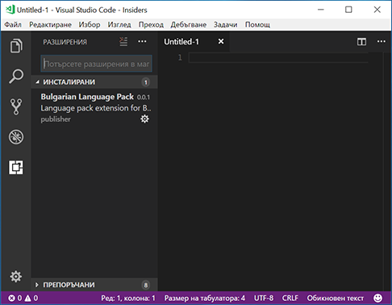

**Update 1.20.1**: [問題](https://github.com/Microsoft/vscode/milestone/63?closed=1)に対処しました。

---

Visual Studio Code 2018 年 1 月のリリースへようこそ。このリリースには VS Code チームの 1 月中の成果と 12、1 月に貢献された [Community PRs](#thank-you) が含まれています。リリースのハイライトは次の通りです:

* **[Explorer multi-selection](#multi-select-in-the-explorer)** - 1 回の操作で複数のファイルに対してアクションを実行。
* **[Improved Settings search](#settings-search)** - 自然言語検索で簡潔に適切な設定を検索。
* **[Errors & warnings in Explorer](#error-indicators-in-the-explorer)** - コード ベース内のエラーに素早く移動。
* **[Save large and protected files](#save-files-that-need-admin-privileges)** - 管理者権限で保護された、または 256M 以上のファイルを保存。
* **[Git submodule support](#git-submodules)** - 入れ子の Git レポに Git 操作を実行。
* **[Global snippets](#global-snippets)** - すべてのファイルタイプで使用可能なスニペットの作成。
* **[Image preview zoom](#image-preview-zooming)** - マウス、スクロールホイール、トラックパッドで画像の拡大/縮小。
* **[Terminal screen reader support](#screen-reader-support)** - 統合ターミナルの "Screen Reader Optimized" モード対応。
* **[Debugging support for multi-root workspaces](#improved-debugging-support-for-multi-root-workspaces)** - 複数のプロジェクト間で構成を管理。
* **[Quick Fix all for JavaScript/TypeScript](#quick-fix-all-for-javascript-and-typescript)** - ファイルのすべての出現箇所で同じ Quick Fix の適応。
* **[New Node.js deployment tutorials](#new-documentation)** - Docker や Azure App Service を使用して Node.js アプリをデプロイ。

> オンラインでリリースノートを確認するには [code.visualstudio.com](https://code.visualstudio.com) の [Updates](https://code.visualstudio.com/updates) に移動してください。
> Cloud Developer Advocate [Brian Clark](https://twitter.com/_clarkio) による 1.20 release [highlights video](https://youtu.be/dQmtzf65jY8) もご確認ください。

リリースノートは VS Code の重要な機能に関連する次のセクションに構成されています:

* **[ワークベンチ](#workbench)** - "Smart case" 検索, テーマ固有のカスタマイズ。
* **[エディター](#editor)** - 新しいスニペット変数, Emmet の改善, ミニマップを左/右に表示。
* **[言語](#languages)** - TypeScript の自動ブラケットとメンバー プロパティの提案。
* **[デバッグ](#debugging)** - Node.js サブプロセスの自動検出, nvm サポート。
* **[拡張機能](#extensions)** - 新しいファイル タイプの拡張機能の提案。
* **[拡張機能オーサリング](#extension-authoring)** - カスタム ビューのサポート, 新しいメニューのグループ化。

**Insiders:** できるだけ早く新しい新機能を確認したいですか？夜間に更新するInsiders [build](https://code.visualstudio.com/insiders)をダウンロードすれば、最新のアップデートをすぐに試すことが可能です。

## ワークベンチ <a id="workbench"></a>

### エクスプローラーの項目を複数選択 <a id="multi-select-in-the-explorer"></a>

**File Explorer** や **OPEN EDITORS** ビュー内で複数のファイルを選択してアクションを実行できるようになりました。


その結果 `Ctrl/Cmd` キーが項目の複数選択に使われるようになるため、押しながらクリックしてもエディターを横に開かなくなりました。新しい `workbench.list.multiSelectModifier` 設定を `"workbench.list.multiSelectModifier": "alt"` にすることで今まで通りの操作に戻すことができます。この設定では `Alt` キーを使用して選択項目に項目を追加します。

### エクスプローラーのエラー インジゲーター <a id="error-indicators-in-the-explorer"></a>

**File Explorer** と **OPEN EDITORS** ビューでエラーまたは警告のあるファイルを強調するようになりました。


デコレーションには、エラー/警告の数が表示されます。`problems.decorations.enabled` によってエラー/警告の装飾を有効/無効にすることが可能です。

### 設定の検索 <a id="settings-search"></a>

VS Code はエディターをカスタマイズする多くの設定を提供しており、使用したい用語がわからないとき検索するのが難しい場合があります。設定エディターの検索機能を改善して、これまでの単語だけの一致方法を改善しました。設定エディターは、単語の言い換え、入力ミス、活用形 ("saving" -> "save") を考慮して検索し、より自然に自然文を検索するようになります。


これまで通りの検索方法を好む場合は `"workbench.settings.enableNaturalLanguageSearch": false` を使用して無効かすることができます。

### 管理者権限が必要なファイルを保存 <a id="save-files-that-need-admin-privileges"></a>

管理者権限を要求するファイルを保存できるようになりました。たとえば `/etc/hosts` を変更するときです。ファイルがディスク上に存在し、権限昇格が必要な場合はエラー メッセージに **Retry as Admin...** アクションが表示されます。管理者として保存することはすべてのプラットホームで対応しています。プラットホームによっては管理者を認証するためのプロントが異なります。

### 大きなファイルを保存する >256 MB

以前はエラーになった 256 MB を超えるファイルを保存できるようになりました。VS Code がディスク上にエディターの内容を保存する実装を変更することにより実現しています。ファイルの全コンテンツをメモリーに読み込む代わりに、コンテンツのスナップショットを活用して 64KB のチャンクでファイルに保存します。

### "Smart Case" 検索

グローバル検索で "smart case" モードを有効にする `"search.smartCase": true` を設定できるようになりました。有効にすると VS Code は大文字を含むクエリを検索するとき、自動的に大文字、小文字を区別して検索します。すべてが小文字のときは大文字と小文字を区別して検索しません。

たとえば "code" を検索すると "code" または "Code" に一致します。逆に "Code" を検索すると "Code" にのみ一致します。

### ツリー/リストをダブルクリックで開く

ツリーやリストで項目を、シングルクリックやダブルクリックで開くよう制御する `workbench.list.openMode` 設定が追加されました。この設定は項目を展開/折りたたむときの両方に適応されます。

**Note:** この設定は VS Code 内のほとんどのツリリー/リストでサポートされますが、シングルクリックが最も理に適う箇所では今まで通りの動作が残っている場合があります。フィードバックをお待ちしています！

### 画像プレビューのズーム <a id="image-preview-zooming"></a>

画像のプレビューをズームできるようになりました:


拡大や縮小するには、クリックするか、(Windows/Linux`Ctrl`、macOS `Alt` を押しながら) スクロール ホイールするか、トラックパッドでピンチしてください。現在のズーム レベルはステータス バーに表示されます。ステータス バーのズーム項目をクイックすると素早くズームレベルを切り替えまたはリセット可能です。

### テーマ固有の配色カスタマイズ <a id="theme-specific-color -customizations"></a>

ユーザー設定で特定のカラーテーマを細かく調節できるようになりました:

```json
"editor.tokenColorCustomizations": {
    "[Monokai]": {
        "comments": "#229977"
    }
},
"workbench.colorCustomizations": {
    "[Monokai]": {
        "sideBar.background": "#347890"
    }
}
```

この例では **Monokai** テーマだけが変更されます。テーマについての詳細は [Customize a Color Theme](https://code.visualstudio.com/docs/getstarted/themes#_customize-a-color-theme) を参照してください。

### エディター タブの配色を追加

新しいテーマ設定可能な配色がエディター タブに追加されました:

* `tab.hoverBackground`: ホバー時のタブ背景色
* `tab.unfocusedHoverBackground`: ホバー時のフォーカスされていないタブの背景色
* `tab.hoverBorder`: ホバー時のタブを強調するボーダー色
* `tab.unfocusedHoverBorder`: ホバー時のフォーカスされていないグループのボーダー色

またこれらの配色は `workbench.colorCustomizations` から変更することが可能です。

### カスタム ドロップダウン

Windows と Linux では HTML のドロップダウンから独自のウィジェットを使用するようになりました。ドロップダウンは他の箇所のツリー/リストウィジェットと同じ配色を利用します。


これにより HTML ドロップダウンを場合によっては正しく表示しなかった問題が修正されます。

### OPEN EDITORS の更新 <a id="open-editors-updates"></a>

* **OPEN EDITORS** ビューは `explorer.openEditors.visible` で指定した最大サイズに到達するとサイズを変更できるようになりました。この変更により `explorer.openEditors.dynamicHeight` 設定はサポートされなくなります。
* **OPEN EDITORS** を非表示にするために `explorer.openEditors.visible` を 0 にする設定は、1 月のリリースで非推奨になり 2 月には廃止する予定です。**OPEN EDITORS** ビューを非表示にするには、エクスプローラーのタイトル領域のコンテキスト メニューを使用してビューの表示を制御してください。

### macOS Touch Bar を無効にする <a id="disable-macos-touch-bar-entries"></a>

新しい `keyboard.touchbar.enabled` 設定は VS Code が提供している macOS Touch Bar のエントリーを無効にします。

### workbench.fontAliasing 設定

macOS では VS Code を表示しているモニターの DPI に応じてフォント エイリアシングを調整する `"workbench.fontAliasing": "auto"` を設定できるようになりました。`auto` にすると、 VS Code はディスプレーの DPI に基づいて `default` か `antialiased` を自動的に適用します。

### 出力パネル <a id="output-panel"></a>

出力パネルの VS Code のログを構文ハイライト付きで見ることができるようになりました。ログ ファイルを構文ハイライトするための文法を提供してくださった [emilast](https://github.com/emilast) に感謝します。


また出力パネルは、新しい実装により消費するメモリー リソースを削減しました。何も表示されていないときに出力チャンネルのメモリ リソースを解放します。

## エディター <a id="editor"></a>

### グローバル スニペット <a id="global-snippets"></a>

VS Code は 1 つの言語を対象としない、任意のファイルを対象にする グローバル スニペット に対応しました。**Preferences: Configure User Snippets** コマンドを使用して **New Global Snippets file...** オプションを選択します。この操作により新しいスニペットのための `.code-snippets` ファイルが開かれます。このファイルで `scope` 属性を使用してスニペットの対象となる言語をリストします。例として、次のスニペットでは JavaScript や TypeScript ファイルに copyright header を追加します:

```json
"JS & TS Stub": {
  "scope": "javascript,typescript",
  "prefix": "stub",
  "body": [
    "/*--------------------------------------------------------------",
    " *  Copyright (c) Your Corporation. All rights reserved.",
    " *  Licensed under the MIT License.",
    " *-------------------------------------------------------------*/",
    "",
    "'use strict';",
    "",
    "$0"
  ],
  "description": "Insert Copyright Statement"
}
```

また、拡張機能作成者はグローバル スニペットを提供することもできます。拡張機能に `code-snippets` ファイルを含めて `package.json` の `contributes.snippets` セクションの言語プロパティを省略してください。

### 追加のスニペット変数 <a id="more-snippet-variables"></a>

クリップボード (`CLIPBOARD`) を読み込み、現在の日付と時刻の挿入を行うための新しいスニペット変数を追加しました。日付、時刻は次の変数の組み合わせで行います:


* `CURRENT_YEAR`
* `CURRENT_YEAR_SHORT`
* `CURRENT_MONTH`
* `CURRENT_DATE`
* `CURRENT_HOUR`
* `CURRENT_MINUTE`
* `CURRENT_SECOND`

### Quick Fixes や Code Actions のキーバインド <a id="keybindings-for-quick-fixes-and-code-actions"></a>

新しい `editor.action.codeAction` コマンドを使用すると特定のコード アクションのキーバインドを構成できます。たとえば、次の例では Extract function refactoring コード アクションをトリガーします:

```json
{
  "key": "ctrl+shift+r ctrl+e",
  "command": "editor.action.codeAction",
  "args": {
    "kind": "refactor.extract.function"
  }
}
```

Code Action kinds は拡張機能が強化された `CodeActionProvided` API を使用して指定します。Kinds は段階的になっており `"kind": "refactor"` はすべてのリファクタリング コード アクションを表示しますが  `"kind": "refactor.extract.function"` では Extract function refactorings のみを表示します。

上記のキーバインドを使用すると `"refactor.extract.function"` コード アクションしか利用できない場合自動的に適用されます。もし Extract function コード アクションが利用可能であれば、それらを選択するコンテキスト メニューを表示します:


`apply` 引数を使用するとコード アクションがどのように/いつ適用されるかを制御することもできます:

```json
{
  "key": "ctrl+shift+r ctrl+e",
  "command": "editor.action.codeAction",
  "args": {
    "kind": "refactor.extract.function",
    "apply": "first"
  }
}
```

`"apply"` の値:

* `"first"` - 常に最初に利用可能なコード アクションを適用します。
* `"ifSingle"` - デフォルト。 1 つしか利用できないときのそのコード アクションを自動的に適応します。それ以外の場合はコンテキスト メニューを表示します。
* `"never"` — 1 つのコード アクションしか利用できない場合でも常にコード アクションのコンテキスト メニューを表示します。

### 提案の改善 <a id="suggestion-improvements"></a>

提案の優先付けをどのように行うかを洗練しました。新しい `editor.suggestSelection` 設定は UI で提案がどのように選択されるかを制御します。常に一番上の項目が選択される (`first`)、以前に選択した項目を選択する(`recentlyUsed`)、prefix に基づいて項目を選択する (`recentlyUsedByPrefix`) の中から設定することができます。GitHub [issue](https://github.com/Microsoft/vscode/issues/41060#issuecomment-360529596) にはスクリーンショット付きのより詳細な説明があります。

### Emmet の改善 <a id="emmet-improvements"></a>

CSS 略語に `-` を使用する prefix をつけると、展開される略語に含まれるすべての適用可能なベンダー プレフィックスを取得するようになりました。


詳細は [how to control vendor prefix in Emmet](https://code.visualstudio.com/docs/editor/emmet#_include-vendor-prefixes) を参照してください。

Emmet の注目的なバグ修正:

* Use of `@-` to get numbering in descending order in repeaters not working. [#35296](https://github.com/Microsoft/vscode/issues/35296)
* The `snippets.json` file for custom Emmet snippets fails to get parsed in the presence of comments. [#33818](https://github.com/Microsoft/vscode/issues/33818)
* When using `bem` style, part of class names that appear after `-` get cut. [#38768](https://github.com/Microsoft/vscode/issues/38768)
* **Emmet: Wrap with Abbreviation** command should wrap the entire HTML element when cursor is in either open or close tag. [#41516](https://github.com/Microsoft/vscode/issues/41516)
* **Emmet: Wrap with Abbreviation** command should support `|c` and `|bem` filters. [#40471](https://github.com/Microsoft/vscode/issues/40471)
* **Emmet: Update Tag** and **Emmet: Remove Tag** commands matches wrong pair in the presence of self closing tags. [#39789](https://github.com/Microsoft/vscode/issues/39789)
* **Emmet: Expand Abbreviation** command doesn't expand abbreviation that contains unescaped single quotes. [#38807](https://github.com/Microsoft/vscode/issues/38807)
* Emmet expansion gets triggered when editing the value of a CSS property. [#34162](https://github.com/Microsoft/vscode/issues/34162)

### カーソルの幅を調整 <a id="control-cursor-width"></a>

新しい `editor.cursorWidth` 設定を使用してピクセル単位でカーソルの幅を制御できるようになりました。これは `editor.cursorStyle` が `line` に設定されているときのみ適用されます。カーソル幅は文字の幅まで大きくなるとそれ以上広がりません。


### macOS の検索クリップボード <a id="global-macos-find-clipboard"></a>

1.19 のリリースで私たちは macOS [global find clipboard](https://code.visualstudio.com/updates/v1_19#_global-find-clipboard-on-macos) と統合しました。これはアプリケーション間で検索テキストを簡単に共有することができました。これはデフォルトで無効ですが `"editor.find.globalFindClipboard"` 設定を使用して有効にすることができます。これが検索ビューでもサポートされるようになりました。 `"search.globalFindClipboard"` 設定により有効化できます。

### 括弧の間のテキストを選択 <a id="select-text-while-jumping-between-brackets"></a>

新しいコマンド **Select to Bracket** は 2 つの対応する括弧の中のテキストを選択します (既に用意されている **Go to Bracket** コマンドは対応する括弧に移動するのみです)。

### ミニマップを左に表示 <a id="display-minimap-to-the-left"></a>

新しい `editor.minimap.side` 設定によって、左側にミニマップ (code outline) を表示するよう構成できるようになりました。


### 差分エディターで行末の空白を切り替える <a id="toggle-for-ignore-trim-whitespace-in-the-diff-editor"></a>

差分エディターのタイトル領域に新しいアクションが追加されました。これにより行末の空白を無視する設定を素早く切り替えることができます。


## ソース管理 <a id="source-control"></a>

### Git submodules<a id="git-submodules"></a>

このリリースで Git submodules に対応しました。サブモジュールも Git リポジトリーですから、リポジトリ リストで表示されます。サブモジュールでのステージ、ステージ解除、破棄など基本的なサポートを用意しています。`git.detectSubmodules` 設定で自動的なサブモジュールの検出を無効化できます。


### Git: コミットする前にファイルを保存するように促す

コミットする前に未保存のファイルを保存するよう促すようできるようになりました。`git.promptToSaveFilesBeforeCommit` 設定で有効にすることができます。

### Git: コミット メッセージの検証

Git 拡張機能はメッセージの長さの検証するようになりました:


### エディターの差分装飾 <a id="setting-for-editor-diff-decorations"></a>

`scm.diffDecorations` 設定を使用すると、エディター内で差分のデコレーションを表示するときと方法を制御できます。利用可能な値は `all`, `gutter`, `overview`, `none` です。

## 統合ターミナル <a id="integrated-terminal"></a>

### スクリーン リーダー <a id="screen-reader-support"></a>

ターミナルをスクリーンリーダーに対応させました。この機能を有効にするには "Screen Reader Optimized" モードにする必要があります。通常自動的に検出しますがエディターのアクセシビリティ ヘルプを開いて手動で切り替えることもできます `kb(editor.action.showAccessibilityHelp)`。

私たちはこれを第一歩と考え視覚障害の方にターミナルを使いやすくするための方法を積極的に研究します。

### ターミナル アプリケーションでマウス ホイールが期待通りの動作をするように

ターミナルの *alt* buffer でホストされる `vim` や `tmux` のようなアプリケーションではマウス ホイールイベントをアロー イベントに変換してスクロールが可能になりました。正しい動作をするように定義を手伝ってくれた [Manoj Patel](https://github.com/nojvek) に感謝します。

### macOS で Option キーを meta キーとして使う <a id="option-as-meta-on-macos"></a>

Option キーをターミナルのメタ キーとして使用できるようになりました。`option+B` を使用して単語の前に移動や `option+F` を使用して単語の次に移動などの古典的なシェル ショートカットを使用できるようになります。

```js
"terminal.integrated.macOptionIsMeta": true
```

### 選択時にコピー <a id="copy-selection"></a>

ターミナルでテキストを選択するたびに自動的にコピーするようになりました:

```js
"terminal.integrated.copyOnSelection": true
```

これはデフォルトで無効です。

### 環境変数設定の変数 <a id="variables-resolved-in-env-setting"></a>

置換変数を `terminal.integrated.env.*` 設定で解決できるようになりました。これは他の設定で使用される [variable format](https://code.visualstudio.com/docs/editor/variables-reference) を使用します。

```js
"terminal.integrated.env.linux": {
  "FOO": "${workspaceRoot}",
  "BAR": "${env:PATH}"
},
```

## デバッグ <a id="debugging"></a>

### マルチ ルート ワークスペースのデバッグ サポートの改善 <a id="improved-debugging-support-for-multi-root-workspaces"></a>

マルチルート ワークスペースを使用すると 1 つのワークスペースで関連するプロジェクト上 ("server" や "cliant" など) で作業をすることができます。これらのフォルダーは独自の起動構成 (例: "Launch Server" や "Launch Client") を持ちますが、(フォルダーを横断して起動構成を参照する機能がなかったため) 異なるフォルダーの起動構成を "複合" 起動構成に組み合わせることはできませんでした。

このマイルストーンではこの制限に対処しました。まず "workspace" スコープの起動構成のサポートを追加しました。次にフォルダー間で起動構成を参照するためのシンタックスを導入しました。
この複合起動構成を使用することで、異なるフォルダーをまたぐ構成をワークスペース レベルで保持することができるようになります。

ワークスペースの起動構成は **Command Palette** で **Workspaces: Open Workspace Configuration File** を実行することで簡単に編集することができるワークスペース起動構成ファイルの `"launch"` セクションにあります。


新しい起動構成は起動構成にあるドロップダウンの **Add Config (workspace)** エントリーから追加することができます:


複合起動構成では、名前がワークスペース内で一意な限り個々の起動構成を名前で参照できます。例:

```json
  "compounds": [{
      "name": "Launch Server & Client",
      "configurations": [
        "Launch Server",
        "Launch Client"
      ]
  }]
```

個々の起動構成名が一意でない場合、より冗長な "folder" 構文を使用してフォルダーを指定することができます:

```json
  "compounds": [{
      "name": "Launch Server & Client",
      "configurations": [
        "Launch Server",
        {
          "folder": "Web Client",
          "name": "Launch Client"
        },
        {
          "folder": "Desktop Client",
          "name": "Launch Client"
        }
      ]
  }]
```

また `compounds` に加え、ワークスペース構成ファイルの `launch` セクションには通常の起動構成を含むこともできます。なお、使用したすべての変数が明示的に特定のフォルダーにスコープされていることを確認してください。そうでないとワークスペースに対して変数が有効でないことがあります。明示的にスコープされた変数の詳細については[下記](#scoped-configuration-variables)のセクションを参考してください。

次に、プログラムが "Program" フォルダー上にあり、"Library" フォルダーからのファイルがステップ実行時にスキップされる必要がある起動構成の例を示します:

```json
"launch": {
  "configurations": [{
      "type": "node",
      "request": "launch",
      "name": "Launch test",
      "program": "${workspaceFolder:Program}/test.js",
      "skipFiles": [
        "${workspaceFolder:Library}/out/**/*.js"
      ]
  }]
}
```

### スコープ構成変数 <a id="scoped-configuration-variables"></a>

ワークスペース フォルダーの `launch.json` や `tasks.json` ファイルのスコープ構成変数に新しい変数構文を導入しました。変数とルート フォルダーの名前を使用して、ワークスペースの兄弟フォルダフォルダーを指定することができます。ルート フォルダー名を省略すると、変数は使用されているのと同じフォルダーにスコープされます。

たとえば `Server` や `Client` を持つマルチルート ワークスペースでは、`${workspaceFolder:Client}` は `Client` ルートのパスを参照します。より複雑な例については [Improved debugging support for multi-root workspaces](#improved-debugging-support-for-multi-root-workspaces) セクションを参照してください。

> 置換変数の詳細については [こちら](https://code.visualstudio.com/docs/editor/variables-reference) を参照してください。

## Node デバッグ <a id="node-debugging"></a>

**デバッガを Node.js サブプロセスに自動的に接続する**

Node-debug にデバッグ対称のすべてのサブプロセスを追跡し、デバッグ モードで起動されるプロセスに自動的にアタッチする仕組みを追加しました。この機能は "cluster" node module に基づくプログラムのように Node.js プロセスを fork したり spawn するプログラムのデバッグを単純化します:


この機能は起動構成属性 `autoAttachChildProcesses` を true にすると有効になります:

```json
{
  "type": "node",
  "request": "launch",
  "name": "Cluster",
  "program": "${workspaceFolder}/cluster.js",
  "autoAttachChildProcesses": true
}
```

**Please note:** サブプロセスをトラックするためには、親のプロセス ID が必要です。このために、起動構成から起動されるメイン デバッグ対称が Node.js プロセスであり、プロセス ID を探すために "evaluate" を使用する必要があります。

プロセスがデバッグ モードにあるかどうかはプログラム引数を解析することで推測されます。現在 `--inspect`, `--inspect-brk`, `--inspect-port`, `--debug`, `--debug-brk`, `--debug-port` (`=` やポート番号) を検出します。

**"nvm" support**

"nvm" (もしくは "nvm-windows")  を使用して Node.js のバージョンを管理している場合、特定の Node.js バージョンを選択する `runtimeVersion` 属性を指定できるようになりました。

次に起動構成の例を示します:

```json
{
  "type": "node",
  "request": "launch",
  "name": "Launch test",
  "runtimeVersion": "7.10.1",
  "program": "${workspaceFolder}/test.js"
}
```

**Please note**: この機能では Node.js をダウンロードしたりそのバージョンをインストールしたりしないので `runtimeVersion` 属性で使用したい Node.js バージョンがインストールされていることを確認してください。 たとえば `"runtimeVersion": "7.10.1"` を起動構成にする場合は統合ターミナルから `nvm install 7.10.1` といったものを実行する必要があります。

## 拡張機能 <a id="extensions"></a>

### 拡張機能の推奨事項 <a id="extensionrecommendations"></a>

初期の VS Code やインストール済みの拡張機能ではサポートされていないファイルの種類で作業するとき、構文ハイライトが表示されないことがあります。このようなファイルをサポートできる拡張機能が Marketplace にある場合通知が表示されるようになりました。


拡張機能の推奨リストには同じリポジトリーで作業しているほかのユーザーの間で人気のある拡張機能が含まれるようになりました。


## 言語 <a id="languages"></a>

### TypeScript 2.7.1 <a id="typescript-2.7.1"></a>

現在 VS Code には [TypeScript 2.7.1](https://blogs.msdn.microsoft.com/typescript/2018/01/31/announcing-typescript-2-7/) が付属しています。このアップデートではいくつかの新機能とバグ修正が行われています。

### JavaScript や TypeScript の Quick Fix all

JavaScript と TypeScript 用の新しい Quick Fix All を使用して素早くエラーを修正できます。使用されていない変数などの修正可能なエラーにカーソルを移動して、電球または `kb(editor.action.quickFix)` を押して Quick Fixes をトリガーしてください。現在のファイル内の複数のエラーに適用可能な Quick Fixes の 1 つがあれば **Fix all in file** コード アクションが表示されます。


適応するとすべてのエラーが消えます:


### ブラケット プロパティの提案 <a id="bracket-property-suggestions"></a>

VS Code は `.` を入力すると、プロパティ名に空白や識別子でない文字が含まれていても  JavaScript や TypeScript のすべての既知のプロパティをすべて表示するようになりました。


これらから 1 つの提案を取り込むと、自動的に accessor 記法に変換されます。


### 自動メンバー プロパティの提案 <a id="automatic-member-property-suggestions"></a>

JavaScript や TypeScript でクラス プロパティにアクセスするのに `this.` を入力することは疲れましたか？利用可能なメンバーが入力を開始するだけで表示されるようになりました。


メンバーのプロパティー提案を取り込むと VS Code は自動的に `this.` を挿入します。


### オプション プロパティーのマーク <a id="marking-of-optional-property-insuggestions"></a>

TypeScript のプロパティーの提案に記号として `?` が付くようになりました:


また JavaScript ユーザーも `*.d.ts` 型定義パッケージからの補完でも `?` を確認できます。

### ファイル名に基づいた自動インポート <a id="auto-imports-based-on-filename"></a>

JavaScript、TypeScript の自動インポートでは、ファイル名に基づいてデフォルトでエクスポートされたオブジェクトをインポートするようになりました:


### TypeScript plugin の拡張機能貢献

[TypeScript plugins](https://github.com/Microsoft/TypeScript/wiki/Writing-a-Language-Service-Plugin) は VS Code の JavaScript や TypeScript の言語サポートを拡張します。たとえば TypeScript プラグインは JavaScript  テンプレート文字列での作業においてファイルにリントを追加したり IntelliSense を追加したりすることがあります。


TypeScript plugins は TypeScript 2.3 で初めて導入されましたが、以前は `npm` でプラグインをワークスペースにインストールして、さらに読み込むために `jsconfig.json` や `tsconfig.json` を構成する必要がありました。VS Code 1.20 では拡張機能が構成をしなくても自動的にグローバルの TypeScript plugins を提供できるようにすることでこれを単純化します。ユーザーは拡張機能をインストールするだけです。

いくつかの拡張機能が既にこれを利用しています:

* [vscode-styled-components](https://marketplace.visualstudio.com/items?itemName=jpoissonnier.vscode-styled-components) — Syntax highlighting, IntelliSense, and error reporting for [styled-component](https://github.com/styled-components/styled-components) CSS strings.
* [lit-html](https://marketplace.visualstudio.com/items?itemName=bierner.lit-html) — Syntax highlighting, IntelliSense, and formatting for [lit-html](https://github.com/Polymer/lit-html) template strings.

拡張機能が提供するプラグインは VS Code の TypeScript バージョンに合わせて自動的にアクティブ化します。ワークスペースの TypeScript を使用する場合は、依然としてワークスペースに TypeScript plugins をインストールする必要があります。

拡張機能オーサリングのドキュメントには新しい [TypeScript Plugin contribution point](https://code.visualstudio.com/docs/extensionAPI/extension-points#_contributestypescriptserverplugins) についての情報が用意されています。

## 保守性 <a id="serviceability"></a>

**Help: Report Issue** または **Help: Report Performance Issue** コマンドを使用すると別ウィンドウを開くようになりました。


このウィンドウでは報告したい問題に基づいて情報をまとめることができます。これには基本的な情報として、システム情報、アクティブな拡張機能、VS Code のプロセス、ワークスペースのファイルの種類が含まれます。送信する情報を選択すると、リポーターは GitHub 上で問題のプレビューができるブラウザ ウィンドウが開きます。

## 拡張機能オーサリング <a id="extension-authoring"></a>

### カスタム ビュー <a id="custom-views"></a>

Custom views は API の追加に伴いより良いものになりました:

**Inline actions**

拡張機能作成者は `view/item/context` メニュー コントリビューションで `inline` グループを用いてインライン アクションをツリー項目に追加できるようになりました。例:

```json
"contributes": {
  "commands": [
    {
      "command": "jsonOutline.refreshNode",
      "title": "Refresh",
      "icon": {
        "light": "resources/light/refresh.svg",
        "dark": "resources/dark/refresh.svg"
      }
    }
  ],
  "menus": {
    "view/item/context": [
      {
        "command": "jsonOutline.refreshNode",
        "when": "view == jsonOutline",
        "group": "inline"
      }
    ]
  }
}
```


**Resource URI**

カスタム ツリー ビューがファイル リソースに基づく場合、拡張機能作成者はそれを表現する `TreeItem` 内の resource URI を提供することができます。これによりユーザーが構成したファイル アイコンのテーマを適応し、エクスプローラーの File  Explorer ビューと同様の外見になります。

```typescript
/**
 * The [uri](#Uri) of the resource representing this item.
 *
 * Will be used to derive the [label](#TreeItem.label), when it is not provided.
 * Will be used to derive the icon from current file icon theme, when [iconPath](#TreeItem.iconPath) is not provided.
 */
resourceUri?: Uri;
```


**Id property**

拡張機能作成者は `TreeItem` に `id`を提供できるようになりました。これにより選択範囲と展開の状態は変更されたときでも保持されるようになります。

```typescript
/**
 * Optional id for the tree item that has to be unique across tree. The id is used to preserve the selection and expansion state of the tree item.
 *
 * If not provided, an id is generated using the tree item's label. **Note** that when labels change, ids will change and that selection and expansion state cannot be kept stable anymore.
 */
id?: string;
```

### マルチ選択対応のエクスプローラー コマンド

このマイルストーンで私たちは[上記](#workbench)の通りエクスプローラーでマルチ選択を導入しました。エクスプローラーにコマンドを提供する拡張機能は、コマンドに渡される新しい引数に対応することで、エクスプローラーでのマルチ選択に対応できます。

前述したとおり VS Code はエクスプローラーで選択されたリソースを割り出そうとし、コマンドを呼びだすときにパラメーターとしてこれを渡します。しかし、もしマルチ選択が有効であれば VS Code はコマンドに追加の第 2 の引数、つまり選択されたリソースの配列を渡します。この配列には常に 1 番目のリソース引数を含みます。

### 新しいメニュー グループ ID <a id="new-menu-group-identifiers"></a>

コマンドの配置をより細かく制御するためのグループIDをいくつかのメニューに追加しました:

**Explorer context menu**

* `navigation`:  VS Code 間の移動に関連するコマンド。これまで通り Explorer コンテキスト メニューの主要 (primary) グループです。
* `2_workspace`: workspace の操作に関連するコマンド。
* `3_compare`: 差分エディターでファイルの比較に関連するコマンド。
* `4_search`: 検索ビューの検索に関連するコマンド。
* `5_cutcopypaste`: ファイルの切り取り、コピー、貼り付けに関連するコマンド。
* `7_modification`: ファイルの変更に関連するコマンド。

**Editor Tab context menu**

* `1_close`: エディターを閉じることに関連するコマンド。
* `3_preview`: エディターを固定することに関連するコマンド。

**Editor Title menu**

* `1_diff`: 差分エディターの操作に関連するコマンド。
* `3_open`: エディターを開くことに関連するコマンド。
* `5_close`: エディターを閉じることに関連するコマンド。

### 新しいキーボード ショートカット コンテキスト演算子 <a id="new-keyboard-shortcut-context-operator"></a>

Keyboard shortcut context を使用するとユーザーがキーバインドを有効にするタイミングを制御できます。これらはキーバインドが有効、無効の **when** を定義するので [when](https://code.visualstudio.com/docs/getstarted/keybindings#_when-clause-contexts) 節とも呼ばれます。このリリースでは `when` 節のための新しいキーと演算子を用意しました。`key =~ value` 式は右辺を正規表現として扱い左辺に対してマッチを行います。たとえばすべての Docker ファイルでコンテキスト メニュー項目を提供するには次のように行います:

```json
   "when": "resourceFileName =~ /docker/"
```

### CodeActionProvider の改善 <a id="codeactionprovider-improvements"></a>

`CodeActionProvider` は新しい `CodeAction` クラスのオブジェクトを返すようになりました。`CodeAction` は `Command` に追加のメタデータと機能を付加し、そのコード アクションがどのようなもので VS Code の UI をどのように使用するかをキャプチャします。

`CodeAction` は主に `title`、`kind`、最後の `Command` もしくは `WorkspaceEdit` (VS Code 1.20 から) で構成されます。

```ts
import * as vscode from 'vscode'

/**
 * Quick fix provider that converts :) to 😀
 */
export class Emojizer implements vscode.CodeActionProvider {
    provideCodeActions(document: vscode.TextDocument, range: vscode.Range) {
        const pos = range.start;
        const line = document.lineAt(pos.line);

        // Check if we are at a :)
        if (line.text[pos.character] === ':' && line.text[pos.character + 1] === ')') {
            const fix = new vscode.CodeAction('Convert to 😀', vscode.CodeActionKind.QuickFix);
            fix.edit = new vscode.WorkspaceEdit();
            fix.edit.replace(document.uri, new vscode.Range(pos, pos.translate(0, 2)), '😀');
            return [fix];
        }
        return undefined;
    }
}
```

また `CodeAction` はコード アクションの種類 (上記の例では `vscode.CodeActionKind.QuickFix`) や、コード アクションが対処する diagnostics を含むコード アクションに関するメタデータを追加します。このメタデータを使用して `Refactor` コマンドや `vscode.action.codeAction` キーバインドといった機能を実装し、今後追加機能を構築する予定です。

### 最近開いたファイルの一覧からファイルを削除 <a id="remove-files-from-the-open-recent-list"></a>

新しい `vscode.removeFromRecentlyOpened` コマンドは **File** メニューの **Open Recent** リストからエントリーを削除します。

### ターミナルの作成時のカレント ディレクトリーを指定する <a id="specify-current-directory-when-creating-terminals"></a>

`createTerminal` を呼びだすときにカレント ディレクトリーを設定する新しい `cwd` プロパティが作成されました:

```ts
vscode.window.createTerminal({
  name: 'My Ext Terminal',
  cwd: process.env.HOME
});
```

### Debug API

**Adding and removing breakpoints**

In this milestone, we've continued work on the breakpoints debug API. It is now possible to [add and remove](https://github.com/Microsoft/vscode/blob/7636a7d6f7d2749833f783e94fd3d48d6a1791cb/src/vs/vscode.proposed.d.ts#L282-L292) `SourceBreakpoints` and `FunctionBreakpoints`.

> **Note:** The breakpoints API is still proposed, so in order to use it, you must opt into it by adding a `"enableProposedApi": true` to `package.json` and you'll have to copy the [`vscode.proposed.d.ts`](https://github.com/Microsoft/vscode/blob/master/src/vs/vscode.proposed.d.ts) into your extension project. Also be aware that you cannot publish an extension to the Marketplace that uses the `enableProposedApi` attribute.

**new `DebugConfigurationProvider.debugAdapterExecutable` replaces `adapterExecutableCommand` commands**

Currently a debugger extension can contribute the "hook"-like command `adapterExecutableCommand` to return a dynamically calculated path (and corresponding program arguments) of the debug adapter about to be launched by VS Code.
In this milestone, we are proposing "real" API that replaces the untyped command based mechanism with a typed solution. At the same time we are deprecating the `adapterExecutableCommand` command (and we will remove support for it as soon it is no longer used).

The new API is an optional method [`debugAdapterExecutable`](https://github.com/Microsoft/vscode/blob/7636a7d6f7d2749833f783e94fd3d48d6a1791cb/src/vs/vscode.proposed.d.ts#L388-L395) on the `DebugConfigurationProvider` that returns the path and arguments wrapped as an `DebugAdapterExecutable` object.

**Command `vscode.logToDebugConsole` will be removed**

As [announced](https://code.visualstudio.com/updates/v1_18#_debug-api-updates) in the previous release, we have deprecated the  `vscode.logToDebugConsole` command in favor of real debug API. We plan to remove support for the `vscode.logToDebugConsole` command in the February milestone.

**Run a debug adapter inside the debug extension**

Developing a debugger extension typically involves debugging both the extension and the debug adapter in two parallel sessions. VS Code supports this nicely but development could be easier if both the extension and the debug adapter would be one program that could be debugged in one session.

In this milestone we've explored a way to run the debug adapter inside the extension. The basic idea is to intercept the launch of a debug session in the `resolveDebugConfiguration` method of a `DebugConfigurationProvider` and starting to listen for connect requests and creating a new debug adapter session for every request. To make VS Code use connect requests (instead of always launching new debug adapter), the launch configuration is modified by adding the `debugServer` attribute to it.

These [lines of code](https://github.com/Microsoft/vscode-mock-debug/blob/042d19a27a8e3a08f27a24110506b53fbecc75ce/src/extension.ts#L61-L71) implement this approach for the "Mock Debug" extension (enable this feature by setting the compile time flag `EMBED_DEBUG_ADAPTER` to true).


## 提案状態の拡張機能 API <a id="proposed-extension-apis"></a>

このマイルストーンの間に 2 つの領域で新しい提案状態の API を追加しました。これらの API は十分に準備ができたとき今後のマイルストーンで安定板に追加する予定です。ユーザーの拡張機能でどのような動作をしているかフィードバックをお待ちしています。

> **Note:** これらの API は提案状態なので、使用するには `"enableProposedApi": true` を `package.json` に追加して選択する必要があり、[`vscode.proposed.d.ts`](https://github.com/Microsoft/vscode/blob/master/src/vs/vscode.proposed.d.ts) をあなたの拡張機能プロジェクトにコピーしなければなりません。また `enableProposedApi` 属性を使用する拡張機能を Marketplace に公開することはできません。

### 拡張機能のロギング <a id="extension-logging"></a>

拡張機能は VS Code のログ フォルダー内の独自フォルダにログを書き込めるようになりました。

```typescript
/**
 * The severity level of a log message
 */
export enum LogLevel {
  Trace = 1,
  Debug = 2,
  Info = 3,
  Warning = 4,
  Error = 5,
  Critical = 6,
  Off = 7
}

/**
 * A logger for writing to an extension's log file, and accessing its dedicated log directory.
 */
export interface Logger {
  readonly onDidChangeLogLevel: Event<LogLevel>;
  readonly currentLevel: LogLevel;
  readonly logDirectory: Thenable<string>;

  trace(message: string, ...args: any[]): void;
  debug(message: string, ...args: any[]): void;
  info(message: string, ...args: any[]): void;
  warn(message: string, ...args: any[]): void;
  error(message: string | Error, ...args: any[]): void;
  critical(message: string | Error, ...args: any[]): void;
}

export interface ExtensionContext {
  /**
   * This extension's logger
   */
  logger: Logger;
}
```

`Logger` メソッドを使用していくつかのログ レベルのログ メッセージを書き込むことができ、ユーザーは **Developer: Set Log Level** コマンドを使用してメッセージを記録する最小のログを指定します。

**Developer: Open Logs Folder** コマンドを実行するとログ ファイルを見つけることができます。拡張機能が書き込んだログは拡張機能の実行中のインスタンスごとにフォルダーに分けられます。

### ワークスペース フォルダーの追加、削除、変更

現在開いているワークスペースにワークスペース フォルダーを追加する新しい提案状態の API が追加されました:

```typescript
updateWorkspaceFolders(
  start: number,
  deleteCount: number,
  ...workspaceFoldersToAdd: { uri: Uri, name?: string }[]
): boolean
```

このメソッドでは次のことができます:

* (`start` で削除するフォルダーのインデックスと `deleteCount` で削除するフォルダーの数を指定することで) 既存のワークスペース フォルダーを削除。
* (`start` で追加する場所のインデックスを指定して `deleteCount` を `0` にして引数として追加するワークスペース フォルダーを指定することで) 特定のインデックスに新しいワークスペース フォルダーを追加。
* 既存のフォルダーを更新。たとえば(まず既存のフォルダーを削除して再度追加することで) フォルダーの移動や名前変更など。

### RenameProvider2

提案された `RenameProvider2` は `RenameProvider` に拡張され、名前を変更するシンボルの範囲やユーザーが名前を表示するときに表示される初期名を含む追加の名前変更情報を提供することができます:

```ts
export interface RenameInitialValue {
  range: Range;
  text?: string;
}

export interface RenameProvider2 extends RenameProvider {
  resolveInitialRenameValue?(document: TextDocument, position: Position, token: CancellationToken): ProviderResult<RenameInitialValue>;
}
```

## プレビュー機能 <a id="preview-features"></a>

リリースに達していないいくつかの機能について作業を進めてきました。フィードバックをお待ちしています。

### 言語パック <a id="language-packs"></a>

拡張機能を使用して VS Code に追加の翻訳を追加できる言語パックのサポートを追加しました。次のスクリーンショットは VS Code が VS Code の [Transifex](https://www.transifex.com/microsoft-oss/) プロジェクトから生成されたブラジル語の言語パックを使用して実行されていることを示します:



数か月以内に Transifex の翻訳者と協力して [Marketplace](https://marketplace.visualstudio.com/) の翻訳を言語パック拡張機能として最適に公開するプロセスを確定します。

### 通知の UX Design <a id="UX-designs-for-notifications"></a>

このマイルストーン中に UX (User Experience) チームは VS Code の通知表示を再設計しました。私たちは 2 月のマイルストーンでこれらのデザインに基づいて開発を開始する予定です。デザインに関する詳細は [GitHub issue](https://github.com/Microsoft/vscode/issues/22388#issuecomment-361915332) で確認することができ、フィードバックをお待ちしております。

## 新しいドキュメント <a id="new-documentation"></a>

### Docker、Azure App Service の Node.js 開発チュートリアル <a id="node.js-deployment-tutorials-for-docker-and-azure-app-service"></a>

Azure に関連する新しい [deploying Node.js applications](https://code.visualstudio.com/docs/nodejs/nodejs-deployment?utm_source=VsCode&utm_medium=ReleaseNotes)  チュートリアルを用意しました。

Tutorial | Description
--- | ---
[Deploy using Azure App Service](https://code.visualstudio.com/tutorials/app-service-extension/getting-started?utm_source=VsCode&utm_medium=ReleaseNotes) | Manage Azure resources directly in VS Code with the [Azure App Service](https://marketplace.visualstudio.com/items?itemName=ms-azuretools.vscode-azureappservice) extension.
[Deploy using Docker](https://code.visualstudio.com/tutorials/docker-extension/getting-started?utm_source=VsCode&utm_medium=ReleaseNotes) | Deploy your website using a Docker container with the [Docker](https://marketplace.visualstudio.com/items?itemName=PeterJausovec.vscode-docker) extension.

### 置換変数のリファレンス <a id="variable-substitution-reference"></a>

VS Code のデバッグやタスクの構成ファイルでの置換変数サポートを説明する [Variables Reference](https://code.visualstudio.com/docs/editor/variables-reference) を作成しました (例: `${workspaceFolder}`, `${file}`)

### VS Code recipe for Vue.js

[Vue.js](https://vuejs.org/) framework を使用するアプリケーション用に [Chrome debugger](https://marketplace.visualstudio.com/items?itemName=msjsdiag.debugger-for-chrome) を構成する手助けをする [Vue.js debugging recipe](https://github.com/Microsoft/vscode-recipes/tree/master/vuejs-cli) を作成しました。

### 言語サーバープロトコルのウェブサイト <a id="language-server-protocol-website"></a>

拡張機能作成者向けの LSP 仕様などのドキュメント Language Server Protocol [website](https://microsoft.github.io/language-server-protocol/)  を作成しました。

## 新しいコマンド <a id="new-commands"></a>

Key|Command|Command id
---|-------|----------
`kb(editor.action.refactor)`|Open refactoring context menu at current position|`workbench.action.refactor`
`kb(workbench.action.moveEditorToFirstGroup)`|Move Editor into First Group|`workbench.action.moveEditorToFirstGroup`
`kb(workbench.action.moveEditorToSecondGroup)`|Move Editor into Second Group|`workbench.action.moveEditorToSecondGroup`
`kb(workbench.action.moveEditorToThirdGroup)`|Move Editor into Third Group|`workbench.action.moveEditorToThirdGroup`
`kb(list.expandSelectionDown)`|Multi-Select in lists/trees: expand selection down|`list.expandSelectionDown`
`kb(list.expandSelectionUp)`|Multi-Select in lists/trees: expand selection up|`list.expandSelectionUp`
`kb(workbench.action.openLogFile)`|Developer: Open Log File...|`workbench.action.openLogFile`
`kb(workbench.action.openLogsFolder)`|Developer: Open Logs Folder|`workbench.action.openLogsFolder`
`kb(workbench.action.showLogs)`|Developer: Show Logs...|`workbench.action.showLogs`
`kb(workbench.action.setLogLevel)`|Developer: Set Log Level|`workbench.action.setLogLevel`
`kb(settings.action.editFocusedSetting)`|Edit focused setting in the Settings editor|`settings.action.editFocusedSetting`

`workbench.action.files.revealActiveFileInWindows`コマンドは `revealFileInOS` コマンドで利用可能です。したがって `workbench.action.files.revealActiveFileInWindows` コマンドを 1 月のリリースで非推奨にして 2 月に削除する予定です。

`workbench.action.files.copyPathOfActiveFile` commandは `copyFilePath` commandで利用可能です。したがって `workbench.action.files.copyPathOfActiveFile` コマンドを 1 月のリリースで非推奨にして 2 月に削除する予定です。

## 注目の変更 <a id="notable-changes"></a>

* [7893](https://github.com/Microsoft/vscode/issues/7893): Tweet feedback button - make it hideable
* [16852](https://github.com/Microsoft/vscode/issues/16852): Allow to search commands related to problems view with "error" or "warning"
* [19707](https://github.com/Microsoft/vscode/issues/19707): Add "(Administrator)" suffix to window title when running as administrator in Windows
* [31988](https://github.com/Microsoft/vscode/issues/31988): Terminal processes exit too eagerly if window close is canceled
* [34320](https://github.com/Microsoft/vscode/issues/34320): Terminal font squished when changing monitors with varying DPIs
* [35462](https://github.com/Microsoft/vscode/issues/35462): Remember visibility of custom view globally for all windows
* [37589](https://github.com/Microsoft/vscode/issues/37589): Multiple Process Debugging not possible with integratedTerminal
* [39371](https://github.com/Microsoft/vscode/issues/39371): Call stack only shows top frame after restart
* [39536](https://github.com/Microsoft/vscode/issues/39536): Change to use async API for modal dialogs
* [39574](https://github.com/Microsoft/vscode/issues/39574): Allow to change the log level of all log services at runtime
* [39719](https://github.com/Microsoft/vscode/issues/39719): Double click in Debugger watch panel should trigger new watch UI
* [40088](https://github.com/Microsoft/vscode/issues/40088): Running Extensions - provide action to disable an extension
* [41071](https://github.com/Microsoft/vscode/issues/41071): Quick access to custom views
* [41759](https://github.com/Microsoft/vscode/issues/41759): Show installing status while installing a VSIX extension

## Thank You

最後になりましたが、VS Code をより良いものへするために協力してくれた次の方々に多大なる感謝を込めて:

* [BlueC0re(@bluec0re)](https://github.com/bluec0re): version 1.19.3 のセキュリティー上の脆弱性について指摘しました。

`vscode`への貢献:

* [Afonso Pinto (@afonsobspinto)](https://github.com/afonsobspinto):  Select to bracket [PR #39066](https://github.com/Microsoft/vscode/pull/39066)
* [Anton Kosyakov (@akosyakov)](https://github.com/akosyakov)
  * [monaco] fix Microsoft/monaco-editor#642: sync CompletionItemProvider api [PR #41595](https://github.com/Microsoft/vscode/pull/41595)
  * [monaco] bind ILogService to NullLogService by default [PR #41927](https://github.com/Microsoft/vscode/pull/41927)
* [Aldo Donetti (@aldonetti)](https://github.com/aldonetti):  corrected typo [PR #42182](https://github.com/Microsoft/vscode/pull/42182)
* [@Ash258](https://github.com/Ash258):  Add region markers for Markdown [PR #40312](https://github.com/Microsoft/vscode/pull/40312)
* [Kirill Shaplyko (@Baltazore)](https://github.com/Baltazore):  Option to disable Touch Bar controls,  leave control strip [PR #40692](https://github.com/Microsoft/vscode/pull/40692)
* [Sebastian (@BattleBas)](https://github.com/BattleBas):  Added setting "git.autoRepositoryDetection" [PR #36183](https://github.com/Microsoft/vscode/pull/36183)
* [Pengcheng Bi (@bpceee)](https://github.com/bpceee)
  * add option to disable terminal exit alert [PR #40861](https://github.com/Microsoft/vscode/pull/40861)
  * Add tooltip on links in markdown preview #30201 [PR #40572](https://github.com/Microsoft/vscode/pull/40572)
* [Brian Schlenker (@bschlenk)](https://github.com/bschlenk):  Add ability to zoom in/out on all images [PR #38538](https://github.com/Microsoft/vscode/pull/38538)
* [Bura Chuhadar (@BuraChuhadar)](https://github.com/BuraChuhadar): Add option to disable git indicators in gutter [PR #29700](https://github.com/Microsoft/vscode/pull/29700)
* [@CoenraadS](https://github.com/CoenraadS):  Use keydown instead of keypress to close terminal [PR #38714](https://github.com/Microsoft/vscode/pull/38714)
* [@colinfang](https://github.com/colinfang):  Fix md block under a list is recognized as a paragraph [PR #39952](https://github.com/Microsoft/vscode/pull/39952)
* [Zhongliang Wang (@Cryrivers)](https://github.com/Cryrivers):  Add workbench.fontAliasing.auto option [PR #41895](https://github.com/Microsoft/vscode/pull/41895)
* [Daniel Pinho (@danrpinho)](https://github.com/danrpinho):  Adds bracket highlighting in scrollbar, fixes issue #16228 [PR #39501](https://github.com/Microsoft/vscode/pull/39501)
* [David Adams (@davidtadams)](https://github.com/davidtadams):  fix grammar in walkthrough [PR #41550](https://github.com/Microsoft/vscode/pull/41550)
* [Adam Skinner (@demoran23)](https://github.com/demoran23):  eslint-compact to use absolute pathnames [PR #39990](https://github.com/Microsoft/vscode/pull/39990)
* [Zuraiz Zafar (@Digized)](https://github.com/Digized):  Add copy command action to keybinding editor context menu [PR #41567](https://github.com/Microsoft/vscode/pull/41567)
* [Dmitrii Kabardinov (@dKab)](https://github.com/dKab)
  * Git - fix "there are no changes to stash" message issue  [PR #35710](https://github.com/Microsoft/vscode/pull/35710)
  * Commit unstaged files after pop-up confirmation (#35185) [PR #35700](https://github.com/Microsoft/vscode/pull/35700)
* [Sylvain Joyeux (@doudou)](https://github.com/doudou):  handle multi-line messages in multi-line patterns [PR #39935](https://github.com/Microsoft/vscode/pull/39935)
* [Francisco Moreira (@Dozed12)](https://github.com/Dozed12):  Show branches list in "git pull from" [PR #39216](https://github.com/Microsoft/vscode/pull/39216)
* [Dustin Campbell (@DustinCampbell)](https://github.com/DustinCampbell):  Update to latest C# TextMate grammar [PR #40125](https://github.com/Microsoft/vscode/pull/40125)
* [Pankaj Phartiyal (@electriccode)](https://github.com/electriccode):  #40483 Add user snippets line in the cog button [PR #41090](https://github.com/Microsoft/vscode/pull/41090)
* [Felix Becker (@felixfbecker)](https://github.com/felixfbecker):  Run hygiene in a dedicated Travis job [PR #41372](https://github.com/Microsoft/vscode/pull/41372)
* [Deleted user (@ghost)](https://github.com/ghost):  Revert - move striping logic back to javascript [PR #41905](https://github.com/Microsoft/vscode/pull/41905)
* [Sindre Tellevik (@graknol)](https://github.com/graknol):  Git branches sorted by committerdate, latest first. [PR #38563](https://github.com/Microsoft/vscode/pull/38563)
* [Heath Stewart (@heaths)](https://github.com/heaths):  Use case-insensitive environment vars on Windows [PR #40466](https://github.com/Microsoft/vscode/pull/40466)
* [@ironyman](https://github.com/ironyman):  Allow resizing of open editors pane [PR #39734](https://github.com/Microsoft/vscode/pull/39734)
* [Jacob Dufault (@jacobdufault)](https://github.com/jacobdufault):  Allow decorators to change font-weight and font-style. [PR #39701](https://github.com/Microsoft/vscode/pull/39701)
* [Tan Jay Jun (@jayjun)](https://github.com/jayjun):  Add character countdown to commit message input [PR #36890](https://github.com/Microsoft/vscode/pull/36890)
* [Jeyanthinath MuthuRam (@Jeyanthinath)](https://github.com/Jeyanthinath):  Fixed issue of Illegal git value for `line` [PR #34781](https://github.com/Microsoft/vscode/pull/34781)
* [Josh Unger (@joshunger)](https://github.com/joshunger):  fix spelling of issues to issue [PR #40808](https://github.com/Microsoft/vscode/pull/40808)
* [Kamil Szot (@KamilSzot)](https://github.com/KamilSzot):  Fix #41080 [PR #42003](https://github.com/Microsoft/vscode/pull/42003)
* [Keegan Carruthers-Smith (@keegancsmith)](https://github.com/keegancsmith): Sort RepositoryPicks to rank active repo first [PR #37030](https://github.com/Microsoft/vscode/pull/37030)
* [@keringar](https://github.com/keringar):  Update editor.lineNumbers description [PR #40388](https://github.com/Microsoft/vscode/pull/40388)
* [Miguel Carvajal (@krvajal)](https://github.com/krvajal):  [ext/yaml] add indentation rules configuration [PR #41378](https://github.com/Microsoft/vscode/pull/41378)
* [Krzysztof Cieślak (@Krzysztof-Cieslak)](https://github.com/Krzysztof-Cieslak):  Resolve initial rename value [PR #37691](https://github.com/Microsoft/vscode/pull/37691)
* [Manzur Khan Sarguru (@Manzurkds)](https://github.com/Manzurkds):  [fix] Wording issue #40064 [PR #40120](https://github.com/Microsoft/vscode/pull/40120)
* [Joe Martella (@martellaj)](https://github.com/martellaj):  Adds "copy on select" feature (with setting) [PR #38287](https://github.com/Microsoft/vscode/pull/38287)
* [Mathieu Bruguier (@mathieubruguier)](https://github.com/mathieubruguier):  Clarified documentation for Position functions [PR #41317](https://github.com/Microsoft/vscode/pull/41317)
* [Matthew Ferderber (@matthewferderber)](https://github.com/matthewferderber):  use previous commit msg for amend [PR #35403](https://github.com/Microsoft/vscode/pull/35403)
* [Mika Andrianarijaona (@mikaoelitiana)](https://github.com/mikaoelitiana):  Add word boundary to check markdown italic [PR #41466](https://github.com/Microsoft/vscode/pull/41466)
* [Marek Lewandowski (@mlewand)](https://github.com/mlewand):  Added support for multiple selections in Open Link [PR #41242](https://github.com/Microsoft/vscode/pull/41242)
* [Ng Yik Phang (@ngyikp)](https://github.com/ngyikp):  Use HTTPS for npm package.json auto-complete [PR #41512](https://github.com/Microsoft/vscode/pull/41512)
* [Nick Snyder (@nicksnyder)](https://github.com/nicksnyder)
  * ensure all switch cases are handled [PR #38361](https://github.com/Microsoft/vscode/pull/38361)
  * reset focus context key when the webview is disposed [PR #40130](https://github.com/Microsoft/vscode/pull/40130)
* [Nico (@njbmartin)](https://github.com/njbmartin):  Support current user install of Git Bash [PR #39674](https://github.com/Microsoft/vscode/pull/39674)
* [Adrian Lehmann (@ownadi)](https://github.com/ownadi):  Support Polish in terminal [PR #41862](https://github.com/Microsoft/vscode/pull/41862)
* [Peter Kahle (@petkahl)](https://github.com/petkahl):  Git submodules support. [PR #36313](https://github.com/Microsoft/vscode/pull/36313)
* [Pascal Fong Kye (@pfongkye)](https://github.com/pfongkye)
  * fix: #39738 [PR #39960](https://github.com/Microsoft/vscode/pull/39960)
  * issue: #40373 default setting for panel location [PR #40559](https://github.com/Microsoft/vscode/pull/40559)
  * fix: #41516 (wrap with abbrevation) [PR #41602](https://github.com/Microsoft/vscode/pull/41602)
* [Nelson Almeida (@PoiSoNz)](https://github.com/PoiSoNz):  Increase minimum limit for fontSize and lineHeight [PR #39314](https://github.com/Microsoft/vscode/pull/39314)
* [Pradeep Murugesan (@pradeepmurugesan)](https://github.com/pradeepmurugesan):  added a warning when user tries to commit, and there are unsaved files [PR #36364](https://github.com/Microsoft/vscode/pull/36364)
* [Ali (@Radon222)](https://github.com/Radon222) Tweak overflow behaviour when setting tab is narrow [PR #40462](https://github.com/Microsoft/vscode/pull/40462)
* [Royall Spence (@royallthefourth)](https://github.com/royallthefourth):  Fix typo [PR #42364](https://github.com/Microsoft/vscode/pull/42364)
* [saighost (@saighost)](https://github.com/saighost):  Add an option to display minimap to the left. [PR #40784](https://github.com/Microsoft/vscode/pull/40784)
* [Sam Ervin (@samervin)](https://github.com/samervin):  Correct "branchs" to "branches" typo [PR #41763](https://github.com/Microsoft/vscode/pull/41763)
* [SteVen Batten (@sbatten)](https://github.com/sbatten)
  * updating the typescript extension codelens to cache requests for the navtree [PR #40402](https://github.com/Microsoft/vscode/pull/40402)
  * updating the md scroll sync to use binary search over linear search [PR #40401](https://github.com/Microsoft/vscode/pull/40401)
  * Validate workspace recommended extensions against the marketplace [PR #40270](https://github.com/Microsoft/vscode/pull/40270)
  * adding suggestion to search for extension for files are of unknown mime type [PR #40269](https://github.com/Microsoft/vscode/pull/40269)
* [Sean Poulter (@seanpoulter)](https://github.com/seanpoulter):  Add note to differentiate btw TextDoc & TextEditor [PR #41307](https://github.com/Microsoft/vscode/pull/41307)
* [Sergey Kintsel (@sergey-kintsel)](https://github.com/sergey-kintsel):  Fix typo in MergeDecorator class name [PR #41131](https://github.com/Microsoft/vscode/pull/41131)
* [Shivam Mittal (@shivammittal99)](https://github.com/shivammittal99):  Setting to show Source Control Provider even for single repo [PR #39245](https://github.com/Microsoft/vscode/pull/39245)
* [Shobhit Chittora (@shobhitchittora)](https://github.com/shobhitchittora)
  * Adding test for integrated terminal font-size overflow [PR #40197](https://github.com/Microsoft/vscode/pull/40197)
  * workbench: Adds actions for moveEditorToFirstGroup, moveEditorToSecondGroup, moveEditorToThirdGroup [PR #40635](https://github.com/Microsoft/vscode/pull/40635)
  * [fix-panel-auto-maximize] removes condition which contraints panelHeight [PR #41800](https://github.com/Microsoft/vscode/pull/41800)
* [Stuart Baker (@smbkr)](https://github.com/smbkr):  Git - Ask to publish branch if there is no upstream [PR #36420](https://github.com/Microsoft/vscode/pull/36420)
* [Ryan Stringham (@stringham)](https://github.com/stringham):  Fix history navigator to change the position when adding an existing element. [PR #29763](https://github.com/Microsoft/vscode/pull/29763)
* [Steven Van Impe (@svanimpe)](https://github.com/svanimpe):  Update Swift snippets [PR #42048](https://github.com/Microsoft/vscode/pull/42048)
* [Benas Svipas (@svipben)](https://github.com/svipben):  "editor.suggestSelection" fix #42795 [PR #43017](https://github.com/Microsoft/vscode/pull/43017)
* [Svitlana Galianova (@svitlana-galianova)](https://github.com/svitlana-galianova):  Fix #41613 [PR #42259](https://github.com/Microsoft/vscode/pull/42259)
* [Charles Milette (@sylveon)](https://github.com/sylveon):  Fix some English issues in the interactive playground [PR #41310](https://github.com/Microsoft/vscode/pull/41310)
* [Alex (@TeeSeal)](https://github.com/TeeSeal):  Update Ruby indent pattern [PR #40292](https://github.com/Microsoft/vscode/pull/40292)
* [Naveen Kumar (@timbanaveen)](https://github.com/timbanaveen):  Fixes tests for line/column in terminal [PR #40370](https://github.com/Microsoft/vscode/pull/40370)
* [Tony Collen (@tonyc)](https://github.com/tonyc):  Switch all schemastore.org URLs to use SSL. [PR #40737](https://github.com/Microsoft/vscode/pull/40737)
* [Alexander (@usernamehw)](https://github.com/usernamehw)
  * Expose border style for debug toolbar. Fixes #39324 [PR #39976](https://github.com/Microsoft/vscode/pull/39976)
  * Add theme-specific color customizations. Fix #36860 [PR #40460](https://github.com/Microsoft/vscode/pull/40460)
  * Fix hr in github issues [PR #41313](https://github.com/Microsoft/vscode/pull/41313)
  * Allow alt+F4 to close window in integrated terminal on Windows Fixes #35646 [PR #40953](https://github.com/Microsoft/vscode/pull/40953)
  * Revert - move striping logic back to javascript for running extensions [PR #42022](https://github.com/Microsoft/vscode/pull/42022)
  * Add time variables for snippets [PR #41653](https://github.com/Microsoft/vscode/pull/41653)
  * Allow to copy from extension contributions [PR #42017](https://github.com/Microsoft/vscode/pull/42017)
  * Remove hard-coded zebra in running extensions Fixes #40432 [PR #41496](https://github.com/Microsoft/vscode/pull/41496)
* [Julien Bisconti (@veggiemonk)](https://github.com/veggiemonk):  Update issue_template.md [PR #39993](https://github.com/Microsoft/vscode/pull/39993)
* [Nicolas Ramz (@warpdesign)](https://github.com/warpdesign):
  * copy from terminal doesn't work #31902 [PR #37290](https://github.com/Microsoft/vscode/pull/37290)
  * issue window opened as modal/child, fixes #42024 [PR #42028](https://github.com/Microsoft/vscode/pull/42028)
* [Yannick Meeus (@YannickMeeus)](https://github.com/YannickMeeus):  Set the minimum height of the xterm scrollbar thumb to 35px [PR #41385](https://github.com/Microsoft/vscode/pull/41385)
* [Yitong Ding (@yitongding)](https://github.com/yitongding):  Add selected text to configuration variable #27466 [PR #39483](https://github.com/Microsoft/vscode/pull/39483)
* [Yuichi Nukiyama (@YuichiNukiyama)](https://github.com/YuichiNukiyama):  Fix typo [PR #41321](https://github.com/Microsoft/vscode/pull/41321)
* [José Azevedo (@zemafaz)](https://github.com/zemafaz):  terminal scroll cursor set to default [PR #39832](https://github.com/Microsoft/vscode/pull/39832)
* [Zac Bergquist (@zmb3)](https://github.com/zmb3):  Remove all PTYSHELLARGs from environment [PR #41059](https://github.com/Microsoft/vscode/pull/41059)

`vscode-extension-samples` への貢献:

* [Nathan Boyd (@nathan-boyd)](https://github.com/nathan-boyd): Add build output directories to list of possible file exclusions [PR #46](https://github.com/Microsoft/vscode-extension-samples/pull/46)

`language-server-protocol` への貢献:

* [Waleed Khan (@arxanas)](https://github.com/arxanas): Fix typo: 'lastet' -> 'latest' [PR #359](https://github.com/Microsoft/language-server-protocol/pull/359)
* [Sven Efftinge (@svenefftinge)](https://github.com/svenefftinge): Fixed a link [PR #361](https://github.com/Microsoft/language-server-protocol/pull/361)
* [Jens Hausdorf (@jens1o)](https://github.com/jens1o): fix Cancelparameters not being displayed right [PR #367](https://github.com/Microsoft/language-server-protocol/pull/367)

`vscode-languageserver-node`: への貢献:

* [Remy Suen (@rcjsuen)](https://github.com/rcjsuen):
  * Correct some grammar and typos [PR #292](https://github.com/Microsoft/vscode-languageserver-node/pull/292)
  * Fix a parameter typo [PR #294](https://github.com/Microsoft/vscode-languageserver-node/pull/294)
  * Fix a few small typos [PR #302](https://github.com/Microsoft/vscode-languageserver-node/pull/302)
  * Change TextDocument's getText to take an optional range [PR #298](https://github.com/Microsoft/vscode-languageserver-node/pull/298)

`vscode-eslint`: への貢献:

* [Josh Unger(@joshunger)](https://github.com/joshunger): update error message and add a hint to update yarn setting if using yarn [PR #390](https://github.com/Microsoft/vscode-eslint/pull/390)

`vscode-github-issues-prs` への貢献:

* [Yuki Ueda (@Ikuyadeu)](https://github.com/Ikuyadeu): GitHub Enterprise support [PR #25](https://github.com/Microsoft/vscode-github-issues-prs/pull/25)

`vscode-chrome-debug-core` への貢献:

* [Chance An (@changsi-an)](https://github.com/changsi-an)
  * Add a unit test for the overriding behavior of sendLoadedSourceEvent() [PR #271](https://github.com/Microsoft/vscode-chrome-debug-core/pull/271)
  * Make reporting loadedScource event customizable. [PR #269](https://github.com/Microsoft/vscode-chrome-debug-core/pull/269)
  * Expose the connection object, so the derivative class can revisit the… [PR #267](https://github.com/Microsoft/vscode-chrome-debug-core/pull/267)
  * Don't add the same breakpoint id to cache. [PR #264](https://github.com/Microsoft/vscode-chrome-debug-core/pull/264)
* [M.K. Safi (@msafi)](https://github.com/msafi):  Ignore some regex characters in sourcemap overrides pattern [PR #261](https://github.com/Microsoft/vscode-chrome-debug-core/pull/261)
* [Oguz Bastemur (@obastemur)](https://github.com/obastemur)
  * fix undefined variable exception [PR #265](https://github.com/Microsoft/vscode-chrome-debug-core/pull/265)
  * fix: handle is undefined [PR #263](https://github.com/Microsoft/vscode-chrome-debug-core/pull/263)

`vscode-chrome-debug` への貢献:

* [Josh Unger (@joshunger)](https://github.com/joshunger):  Add install the extension to Getting Started [PR #572](https://github.com/Microsoft/vscode-chrome-debug/pull/572)

`vscode-html-languageservice` への貢献:

* [Pascal Fong Kye (@pfongkye)](https://github.com/pfongkye)
  * feat: add cursor positions for data attributes [PR #18](https://github.com/Microsoft/vscode-html-languageservice/pull/18)
  * Fix/40149: add data-* attributes autocomplete [PR #17](https://github.com/Microsoft/vscode-html-languageservice/pull/17)

`vscode-json-languageservice` への貢献:

* [@stepjanssen](https://github.com/stepjanssen):  Correct grammar to 'String is not a URI' [PR #13](https://github.com/Microsoft/vscode-json-languageservice/pull/13)

`vscode-recipes` への貢献:

* [@jagreehal](https://github.com/jagreehal):  Added recipe for debugging tests in VS Code [PR #53](https://github.com/Microsoft/vscode-recipes/pull/53)
* [Jc' (@jcdenaes)](https://github.com/jcdenaes):  Small typo [PR #61](https://github.com/Microsoft/vscode-recipes/pull/61)
* [@othke](https://github.com/othke):  Add missing clone argument to git command in nodemon recipe [PR #69](https://github.com/Microsoft/vscode-recipes/pull/69)
* [@tab00](https://github.com/tab00):  Changed simple-todos-react github URL [PR #65](https://github.com/Microsoft/vscode-recipes/pull/65)
* [@taoxm310](https://github.com/taoxm310):  Fix typo [PR #56](https://github.com/Microsoft/vscode-recipes/pull/56)

`node-jsonc-parser` への貢献:

* [@sqs](https://github.com/sqs): add JSON formatter and editor from VS Code [PR #5](https://github.com/Microsoft/node-jsonc-parser/pull/5)

`localization` への貢献:

Transifex でコミュニティーによる多言語化を開始してから 10 ヶ月です。現在 Transifex の [VS Code project](https://aka.ms/vscodeloc) チームには 700 人近くのメンバーがいます。新しい翻訳の提供、翻訳への投票、プロセスの改善案による貢献に感謝します。

このリリースでトップ貢献者のスナップショットです。貢献者のリストを含むプロジェクトの詳細については[https://aka.ms/vscodeloc.](https://aka.ms/vscodeloc)を参照してください。

* **French:** Antoine Griffard, Adrien Clerbois, Thierry DEMAN-BARCELO.
* **Italian:** Alessandro Alpi, Piero Azi, Aldo Donetti, Michele Ferracin, Nicolò Carandini, Emilie Rollandin.
* **German:** Carsten Siemens, Jakob von der Haar, Carsten Kneip, Stephan, jublonet, thefreshman89, Levin Rickert, Ullmie02, Aldo Donetti, DSiekmeier, Dejan Dinic, Ettore Atalan.
* **Spanish:** Andy Gonzalez, Eickhel Mendoza, José M. Aguilar, Alberto Poblacion, Carlos Mendible, Carlos Herrera, Jorge Serrano Pérez, Thierry DEMAN-BARCELO.
* **Japanese:** EbXpJ6bp, Yuichi Nukiyama, Momoto.Seiji, Yoshihisa Ozaki, Hiroyuki Mori, tempura.sukiyaki.
* **Chinese (Simplified):** Joel Yang, pluwen, Bingxing Wang, joeqi, Ricky Wang, Simon Chan, Zhijian Zeng, Zou Jian, Ying Feng.
* **Chinese (Traditional):** Poy Chang, Winnie Lin, Ryan Tseng, duranHsieh, Han Lin, Alan Tsai, Ke-Hsu Chen.
* **Korean:** ChangJoon Lee, Ian Y. Choi, Sei Kwang Chung, Kyunghee Ko, Paul Lee.
* **Hungarian:** Tar Dániel.
* **Portuguese (Brazil):** Roberto Fonseca, Kayky de Brito dos Santos, Danilo Dantas, Alessandro Fragnani, Bruno Sonnino, Felipe Caputo, Thiago Franco, Leonardo Santos, Isaac Henrique.
* **Portuguese (Portugal):** BlueKore, António Campos, Gustavo Silva, José Luís, André Vala.
* **Turkish:** Adem Coşkuner, Burak Karahan, Volkan Nazmi Metin, Onat Yiğit Mercan, Türker YILDIRIM, Ata Binen, Mehmet Tolga Avcioglu, Volkan Nazmi Metin, Burak Karahan.
* **Bengali:** Mehedi Hassan.
* **Bosnian:** Bahrudin, Ismar Bašanović, Almir Vuk, Ahmet Novalić.
* **Bulgarian:** Любомир Василев, Didi Milikina, Ilia Iliev, Georgi Yanev.
* **Dutch:** Gerald Versluis, Jan Mulkens, Armand Duijn, Sander van de Velde, Maarten van Stam, Bram Lemenu, Gerjan.
* **Greek:** Deilv, Dimitris Trachiotis.
* **Indonesian:** Joseph Aditya P G, Wildan Mubarok, Aden Aziz, Riwut Libinuko, codenameupik, Febrian Setianto (Feber), Alfa Phi, simplyeazy, Herman Prawiro, Mulia Arifandi Nasution, Rizki Adiguno Wibowo, Septian Adi.
* **Lithuanian:** Martynas Jusys, Robertas Želvys, Emilis.
* **Polish:** Adam Borowski, Szymon Zak, Wojciech Maj.
* **Romanian:** Bogdan Mateescu, Schiriac Robert, ovisan.
* **Russian:** Svitlana Galianova, iVAN2002, Артём Давыдов, Alexander Filimonov, Aleksey Romanenko, Veronika Kolesnikova.
* **Serbian:** Марко М. Костић, Nikola Radovanović, Darko Puflović.
* **Tamil:** Karunakaran Samayan, Avinash, rajakvk.
* **Ukrainian:** Serhii Shulhin, R.M., Oleksandr, Borys Lebeda, Svitlana Galianova, Volodymyr Holovka, Yevhen Kuzminov, Bogdan Surai.
* **Vietnamese:** Vuong, Hung Nguyen, Trung Đào.
