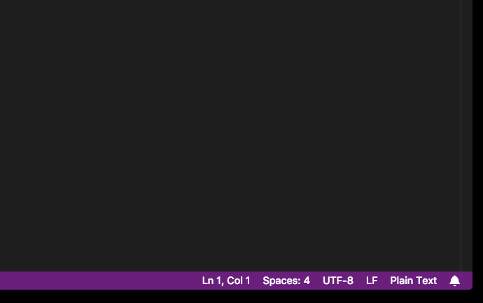
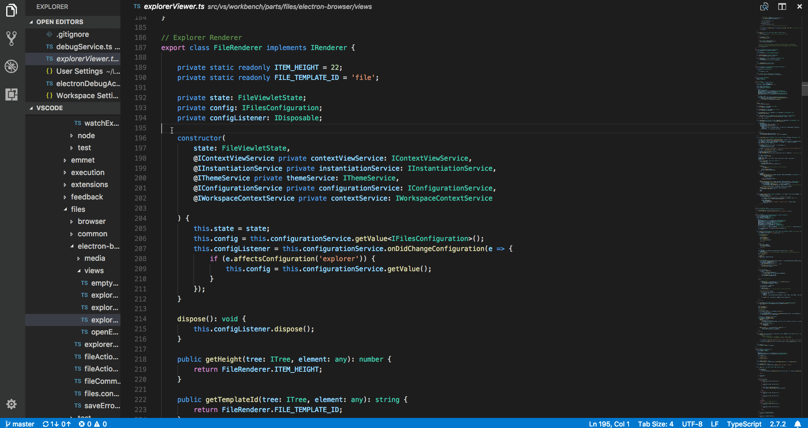
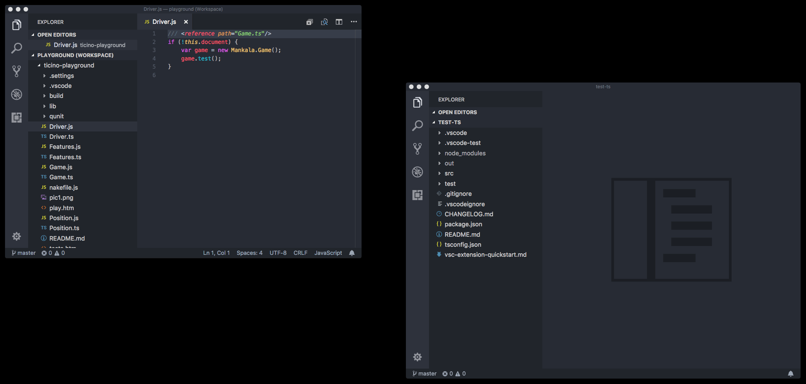
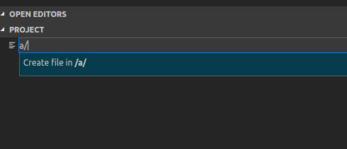
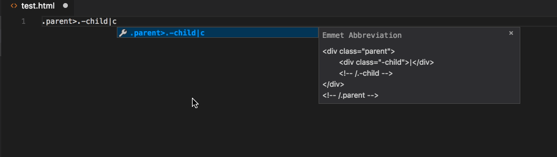
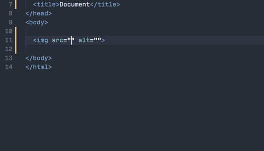
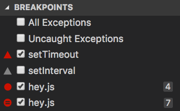
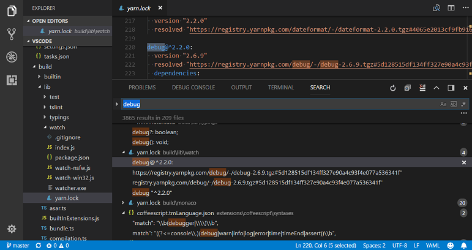

**Update 1.21.1**: [問題](https://github.com/Microsoft/vscode/milestone/65?closed=1)に対処しました。

---

Visual Studio Code 2018 年 2 月のリリースへようこそ。今回のバージョンには数多くの重要な更新があり、ハイライトは次の通りです:

* **[New Notifications UI](#new-notifications-ui)** - VSCode 通知のより簡潔な管理とレビュー。
* **[Integrated Terminal splitting](#split-terminals)** - 一度に複数のターミナルで作業。
* **[Markdown preview scrolling](#markdown-preview-bidirectional-scroll-synchronization)** - Markdown preview の双方向スクロールのサポート。
* **[Improved large file support](#text-buffer-improvements)** - 大きなファイル向けにテキスト バッファーの最適化。
* **[Centered editor layout](#centered-editor-layout)** - スクリーン領域を最大活用。
* **[Drag & drop, copy & paste across windows](#better-drag-and-drop-support)** - VSCode 間のファイル移動。
* **[HTML path completion](#html-path-completion)** - HTML 要素内にファイル パスの IntelliSense。
* **[Language Packs in the Marketplace](#language-packs)** - Marketplace から新しい表示言語をインストール。
* **[Deploy Azure Functions tutorial](#new-documentation)** - サーバレスな Azure Functions の作成とデプロイ。
* **[PREVIEW: Horizontal search results](#horizontal-search)** - 検索結果の水平パネル表示。

> オンラインでリリースノートを確認するには [code.visualstudio.com](https://code.visualstudio.com) の [Updates](https://code.visualstudio.com/updates) に移動してください。
> Cloud Developer Advocate [Brian Clark](https://twitter.com/_clarkio) による 1.21 release [highlights video](https://youtu.be/1hDFysLSVPo) もご確認ください。

リリースノートは VS Code の重要な機能に関連する次のセクションに構成されています:

* **[Workbench](#workbench)** - エクスプローラーで中間フォルダーの自動作成とシンボリック リンクの表示。
* **[Editor](#editor)** - Emmet フィルターの改善、テーマ設定可能なエディターの行番号。
* **[Debugging](#debugging)** - Breakpoint アイコンで種類とステータスの表示。
* **[Extensions](#extensions)** - ビルトイン拡張機能の管理、推奨事項の表示管理。
* **[Extension Authoring](#extension-authoring)** - ワークスペース フォルダーの追加/削除、拡張機能のアンインストール フック。
* **[Engineering](#engineering)** - 重複の GitHub issue 検出。

**Insiders:** できるだけ早く新しい新機能を確認したいですか？夜間に更新するInsiders [build](https://code.visualstudio.com/insiders)をダウンロードすれば、最新のアップデートをすぐに試すことが可能です。

## ワークベンチ <a id="workbench"></a>

### 新しい通知 UI <a id="new-notifications-ui"></a>

VS Code 内の通知のルック・アンド・フィールを更新しました:

* (新しい通知センターが開かれていないときは) 右下から通知がスライド表示します。
* 通知を却下することができ、後で通知センターから通知を確認できます。
* メッセージの全文を表示するように展開することができます。

各通知の構造は次の通りです:


通知が情報源やアクション ボタンを提供しないときは、重大度とメッセージのみが表示されます。これらの種類の通知は一定の時間がたつと自動的に非表示になります。


ステータス バー右下の新しい項目 ("bell" アイコン) では新しい通知の数が表示されます。クリックすると通知センターが開き、まだ却下されていないすべての通知を表示します。



通知は新しいコマンドやキーバインドを構成して管理することができます (後述の [New Commands](#new-commands) を参照してください)。

**拡張機能とテーマ作成者への喚起**  テーマ作成者が適応できる、新しい通知 UI に使用する新しいテーマ色を導入しました (下記参照)。通知のスタイルを表示するときに、もはや不要となった拡張機能作成者向け `isCloseAffordance` 属性のソフト廃止も行われています。

### 中央揃えのエディター <a id="centered-editor-layout"></a>

人気の機能リクエスト [#15684](https://github.com/Microsoft/vscode/issues/15684) によって、エディターの中央レイアウトを追加しました。このレイアウト モードはエディターに画面サイズの制限を加えることで、コードに深く集中できるようにデザインされています。



中央揃えのレイアウト モードはエディター グループが 1 つのときのみ機能し、追加のエディターを横に開くと、閉じるまで切り替えることができません。左右の枠は同期しているため、エディターは常に中央に配置されます。枠を個別にサイズ変更するには `Alt` キーを押したまま変更します。枠をダブルクリックすることでデフォルトの黄金比に戻すことが可能です。

Zen モードは自動的にこのモードがオンになります。この動作を制御するには `"zenMode.centerLayout"` を使用してください。

### ドラッグ アンド ドロップ

ワークベンチのドラッグ アンド ドロップのサポートを再考し、より多くのドラッグ アンド ドロップのシナリオがサポートされました。おそらくもっとも投票されたリクエストはファイル エクスプローラーから別の VS Code インスタンスにファイルをドラッグすることでした:


また [#29715](https://github.com/Microsoft/vscode/issues/29715) 要求に応じ、ファイル エクスプローラーでルート フォルダーをドラック アンド ドロップして順序を入れ変えることも可能になりました。

その他の改善点は **OPEN EDITORS** です:

* エクスプローラーから OPEN EDITORS の特定スペースにファイルをドラック。
* デスクトップから OPEN EDITORS の特定スペースにファイルをドラック。
* タブから OPEN EDITORS の特定スペースにファイルをドラック。

### ウィンドウ間でファイルをコピー/ペースト

異なるインスタンスの 2 つの VS Code ファイル エクスプローラー間でファイルをコピーしたり張り付けたりすることができるようになりました。これは、ファイルやフォルダーが複数でも同様に機能します。



### エクスプローラーのシンボリック リンク記号 <a id="symbolic-link-indication-in-explorer"></a>

ファイル エクスプローラーに矢印記号とホバー テキストを追加することでシンボリック リンクを識別できるようになりました。


### エクスプローラーに複数のフォルダーを作成 <a id="create-multiple-folders-in-the-explorer"></a>

サブフォルダーを含むパスを作成すると VS Code が中間フォルダーを作成するようになりました。これは新しいファイルの作成にも使用できます:



### NPM スクリプト

**Tasks** > **Run Tasks** を使用して [tasks](https://code.visualstudio.com/docs/editor/tasks#_task-autodetection) として `package.json`  ファイル内のスクリプトを実行すると、サブフォルダー内の `package.json` からのスクリプトも検出されるようになりました。スクリプト検出からフォルダーを除外するには `npm.exclude` を使用してください。

## エディター <a id="editor"></a>

### テキスト バッファーの改善 <a id="text-buffer-improvements"></a>

VS Code は行ベースのテキスト バッファーを使用します。これには多くの利点がありましたが、多くの行を含む大きなファイルを扱うときメモリーが多く必要などの欠点がありました。

私たちは約 2 ヶ月前から Insider build に新しいテキスト バッファーの実装を導入していました。新しいテキスト バッファーの実装は [piece table](https://en.wikipedia.org/wiki/Piece_table) データ構造からインスピレーションを得ており、ソース コードの編集シナリオに最適化されています。これはドキュメントのメタデータを保管するメモリーの使用量が少なくし、結果的にファイルをより簡単に開いて OS のメモリー負荷を削減できます。さらに、小さなファイルと大きなファイルの両方で優れた編集のパフォーマンスを提供します。

新しいテキスト バッファーは insider で 2 ヶ月間うまく機能していたため、このマイルストーンですべてのユーザーでオンにしました。これからも大きなファイルを検索するときなど、なお一層の改善を提供します。

### アクティブな行番号の色付け

新しいテーマ キー `editorActiveLineNumber.foreground` はテーマや設定で定義して、エディター内の現在の行番号の配色をカスタマイズすることができます。


### Emmet

VSCode は Emmet の略語を展開するとき `bem` と `comment` [filters](https://code.visualstudio.com/docs/editor/emmet#_using-filters) のサポートを提供してきましたが、今まで、両方を同時に使用することができませんでした。



補完が `kb(editor.action.triggerSuggest)` から手動でトリガーされるとき HTML ファイル内でスタイル属性の CSS Emmet 補完を取得できるようになりました。私たちは手動のトリガーなしに自動的に保管を取得できるように取り組んでいる最中です。


## 統合ターミナル <a id="integrated-terminal"></a>

### ターミナルの分割 <a id="split-terminals"></a>

一度に複数のターミナルを表示するように統合ターミナルを分割できるようになりました。これによりたとえば watch や run が必要な時にターミナルの管理が簡単にできます。


分割はパネルの分割ボタン、コンテキスト メニュ、コマンド `kb(workbench.action.terminal.split)` によって行います。

`kb(workbench.action.terminal.focusNextPane)` と `kb(workbench.action.terminal.focusPreviousPane)` を使用することで分割ターミナル間のフォーカスを移動できます。キーボードを使用してアクティブなペインのサイズを変更することができます:

* **Terminal: Resize Pane Down**  : `kb(workbench.action.terminal.resizePaneDown)`
* **Terminal: Resize Pane Up**    : `kb(workbench.action.terminal.resizePaneUp)`
* **Terminal: Resize Pane Left**  : `kb(workbench.action.terminal.resizePaneLeft)`
* **Terminal: Resize Pane Right** : `kb(workbench.action.terminal.resizePaneRight)`

### Alt+Click でカーソル移動

統合ターミナルのカーソルを `Alt+Click` を使用して移動できるようになりました。これは Vim や nano のようなアプリケーションでも機能します。[xterm.js](https://github.com/xtermjs/xterm.js) に機能実装をしてくれた [Nick Pezza](https://github.com/npezza93) に感謝します。

### Alt シーケンスの追加サポート

統合ターミナルがフォーカスされている間に `Alt+Shift+{key}` や `Alt+Ctrl+{key}` を押すことで、ターミナル内で実行されているプロセスによって処理されるキーストロークを送信するようになりました。(?)

### 単語選択に右クリックを使用

macOS の統合ターミナル内で右クリックすると単語が選択されます。これが設定によってほかのプラットホームでも構成できるようになりました。

```js
"terminal.integrated.rightClickBehavior": "selectWord"
```

## ソース管理 <a id="source-control"></a>

### Editor change navigation

新しい 2 つのアクションを使用すると現在のファイル内のアクティブな変更箇所を移動できます:

* **Move to Next Change** : `kb(workbench.action.editor.previousChange)`
* **Move to Previous Change** : `kb(workbench.action.editor.nextChange)`

## 言語 <a id="languages"></a>

### TypeScript 2.7.2 <a id="typescript-2.7.2"></a>

VS Code に TypeScript 2.7.2 が含まれるようになりました。このアップデートには [いくつかの重要なバグ修正](https://github.com/Microsoft/TypeScript/milestone/63?closed=1) が含まれています。

### HTML パス補完 <a id="html-path-completion"></a>

HTML 内でファイルをより簡単にインポートできるようにパス補完機能が追加されました。



### マークダウン プレビューの双方向のスクロール同期

VSCode のマークダウン プレビューに双方向のスクロール同期が追加されました。エディターをスクロールすることで、エディターのビューに対応するように自動的に対応するプレビューがスクロールします。プレビューをスクロールしたときでも同様にエディターが移動します。


`"markdown.preview.scrollEditorWithPreview"` と `"markdown.preview.scrollPreviewWithEditor"` 設定を使用することでスクロール同期を有効/無効にすることが可能です。古い `"markdown.preview.scrollPreviewWithEditorSelection"` 設定は廃止予定です。

### Markdown の動的プレビュー

VSCode のビルトイン Markdown プレビューがアクティブな Markdown ドキュメントを表示するよう自動的に更新するようになりました。以前は、開いた新しい Markdown ファイルごとに新しい Markdown プレビューを開く必要がありました。


特定の Markdown ファイルのプレビュー ペインを表示したい場合は、**Markdown: Toggle Preview Locking** コマンドを使用することでプレビューを "lock" できます。ロックされたプレビューは、アクティブな Markdown ファイルを表示するよう自動的に切り替わることがありません。このとき、ロックされたプレビューはタイトルが **[Preview]** として表示されます。


Markdown プレビューは **Markdown: Toggle Preview Locking** コマンドを使用してロックまたはロック解除できます。また、**Markdown: Open Locked Preview to Side** コマンドを使用することで、現在の Markdown ドキュメントをロックしたプレビューで表示することが可能です。


## デバッグ <a id="debugging"></a>

### BREAKPOINTS ビューの Breakpoint アイコン

異なるブレークポイントをより簡単に区別するために **BREAKPOINTS** ビューにアイコンを追加しました。ブレーク ポイントの種類と状態を、エディターのグリフ マージンと同じようにアイコン表示します。アクティブなブレークポイントは赤色、無効なものは灰色、未確認のものは中が開いた形で表示されます。条件付きブレークポイントには符号があり、関数ブレークポイントは三角で表されます。



## Node デバッグ <a id="node-debugging"></a>

**Node.js Version Switcher 'nvs' サポート**

前回のマイルストーンで私たちは [Node Version Manager](https://github.com/creationix/nvm) ('nvm') のサポートを追加しました。これが [Node Version Switcher](https://github.com/jasongin/nvs) ('nvs') にも対応するようになりました。Node.js の特定バージョンを選択するには "node" 起動構成で `runtimeVersion` 属性を使用します。

**Please note**: この機能では Node.js をダウンロードしたりそのバージョンをインストールしたりしないので `runtimeVersion` 属性で使用したい Node.js バージョンがインストールされていることを確認してください。 たとえば `"runtimeVersion": "7.10.1"` を起動構成にする場合は統合ターミナルから `nvs add 7.10.1` といったコマンドを実行します。

**Note**: 'nvs' がインストールされていて、指定の Node.js バージョンを 'nvs' で見つけることができなくても 'nvm' にフォール バック**しません**。'nvs' と 'nvm' の両方を同時に使用することはできません。

## 拡張機能 <a id="extensions"></a>

### ビルトイン拡張機能の管理

今回のリリースで VSCode に備わっているビルトイン拡張機能を管理 (無効/有効) ができるようになりました。すべてのビルトイン拡張機能を表示するアクションが拡張機能ビューの **Show Built-in Extensions** に用意され、ビルトイン拡張機能をブラウスして管理できます。**Command Palette** でも同様に同じアクションにアクセス可能です。


### 言語パック <a id="language-packs"></a>

1.20 リリースでは言語パックのサポートが追加され、最初の言語パックが [Marketplace](https://marketplace.visualstudio.com/vscode) で利用可能になりました。


私たちは引き続きコミュニティーと協力してより多くの言語パックを追加する予定です。

### 拡張機能の推奨事項 <a id="extensionrecommendations"></a>

`"extensions.showRecommendationsOnlyOnDemand": true` に設定することですべての拡張機能の推奨事項を無効にできるようになりました。この設定を有効にしても、拡張機能ビューの **Show Recommended Extensions** コマンドを使用して推奨事項を表示できます。コマンドは **Command Palette** からも実行可能です。

## 拡張機能オーサリング <a id="extension-authoring"></a>

### ワークスペース フォルダーの追加、削除、変更

ワークスペース フォルダーを追加、削除、更新するための [proposed](https://code.visualstudio.com/updates/v1_20#_add-remove-and-change-workspace-folders)  API が Stable に昇格しました。

### Messages: `isCloseAffordance` は非モーダル メッセージではサポートされなくなります

このマイルストーンで新しい通い UI が導入されたので、すべての通知メッセージが右上の閉じるボタンを提供するようになりました。この変更により、閉じるアクションがもはや他メッセージ アクションと混ざることがなくなり、`isCloseAffordance` が非モーダルのメッセージに対して不要になることを意味します。拡張機能のメッセージの活用状況を確認して、このアクションが拡張機能で具体的な機能を持つ時を除き、このアクションを追加しないようにしてください。

この提供したアクションがユーザーによってクリックされた場合でも、依然としてメッセージは自動的に閉じられます。

### テーマ配色の追加と削除

新しい通知 UX ではテーマ作成者が採用する新しい配色が追加されました:

(編集メモ: code内で翻訳されているので省略

* `notificationCenter.border`: Notification Center border color.
* `notificationCenterHeader.foreground`: Notification Center header foreground color.
* `notificationCenterHeader.background`: Notification Center header background color.
* `notificationToast.border`: Notification toast border color.
* `notifications.foreground`: Notifications foreground color.
* `notifications.background`: Notifications background color.
* `notifications.border`: Notifications border color separating from other notifications in the Notification Center.
* `notificationLink.foreground`: Notification links foreground color.

以前までにサポートされていた通知のテーマ配色はすべてサポートされなくなりました。

またエディター ハイライトの境界線色も自由に選択できるようになりました:

* `editor.selectionHighlightBorder`: Border color for regions with the same content as the selection.
* `editor.wordHighlightBorder`: Border color of a symbol during read-access, for example when reading a variable.
* `editor.wordHighlightStrongBorder`: Border color of a symbol during write-access, for example when writing to a variable.
* `editor.findMatchBorder`: Border color of the current search match.
* `editor.findMatchHighlightBorder`: Border color of the other search matches.
* `editor.findRangeHighlightBorder`: Border color the range limiting the search (Enable 'Find in Selection' in the find widget).
* `editor.rangeHighlightBorder`: Background color of the border around highlighted ranges.

追加配色:

* `terminal.border`: The color of the border that separates split panes within the terminal. This defaults to panel.border.

### カスタム ビュー <a id="custom-views"></a>

**Themable item icons**

`TreeItem` がアクティブなファイル アイコン テーマからフォルダーまたはファイル アイコンを取得するようにしたい場合は、`ThemeIcon.Folder` や `ThemeIcon.File` 定数に `TreeIem` の `iconPath` propertyを割り当ててることで可能になります。

**Tooltips**

`TreeItem` の `tooltip` プロパティを使用して、ビュー内のアイテムにツールチップを提供することができます。

### 拡張機能のアンインストール フック

拡張機能が VSCode からアンインストールされたときに、拡張機能がいくつかのクリーン アップを行う場合、拡張機能の `package.json` 内の `scripts` セクション下の `vscode:uninstall` アンインストール フックに `node` スクリプトを登録することで可能になりました。

```json
{
  "scripts": {
    "vscode:uninstall": "node ./out/src/lifecycle"
  }
}
```

このあスクリプトは、VSCode から拡張機能が完全にアンインストールされたとき (拡張機能がアンインストールされたあとに VSCode が再起動されたとき (シャットダウンと起動) ) 実行されます。

**Note:** Node.js スクリプトのみがサポートされています。

### Active view context key

現在開いている view: `activeViewlet` の ID 使用する新しいキーバインド コンテキスト キー ('when' 句)  が用意されました。使用例:

```json
  "when": "activeViewlet == workbench.view.scm"
```

### Debug Adapter Protocol <a id="debug-adapter-protocol"></a>

**新しい`CapabilitiesEvent`**

Sometimes it is difficult for a debug adapter to know and return all capabilities from the (very early) `Initialize` request because some might not be known until the runtime/debugger has started. The newly introduced `CapabilitiesEvent` can be used at a later time to announce that one or more capabilities have changed. Since the capabilities are dependent on the frontend and its UI, it might not be possible to change that at random times (or too late). Consequently, the `CapabilitiesEvent` has a hint characteristic: a frontend can only be expected to make a 'best effort' in honoring individual capabilities, but there are no guarantees.

### 言語サーバー プロトコル <a id="language-server-protocol"></a>

Version 3.6.0 [protocol specification](https://microsoft.github.io/language-server-protocol/specification) がリリースされました。このバージョンでは次の新しいリクエストと通知が指定されます:

* [Get Workspace Folders](https://microsoft.github.io/language-server-protocol/specification#workspace_workspaceFolders)
* [DidChangeWorkspaceFolders Notification](https://microsoft.github.io/language-server-protocol/specification#workspace_didChangeWorkspaceFolders)
* [Get Configuration](https://microsoft.github.io/language-server-protocol/specification#workspace_configuration)
* [Goto Type Definition](https://microsoft.github.io/language-server-protocol/specification#textDocument_typeDefinition)
* [Goto Implementation](https://microsoft.github.io/language-server-protocol/specification#textDocument_implementation)
* [Document Color](https://microsoft.github.io/language-server-protocol/specification#textDocument_documentColor)
* [Color Presentation](https://microsoft.github.io/language-server-protocol/specification#textDocument_colorPresentation)

## エンジニアリング <a id="engineering"></a>

### asar を使用して VSCode を高速起動

私たちは最大 5% の高速起動を得るためにコアの `node_modules` を Electron Archive ([asar](https://github.com/electron/asar)) にパッケージングしました。また VS Code インストールのディスク上のファイル数が約 25% 減少します。

### 重複 issue の検出

issue bot と Issue Reporter UI は重複の検出と既存の問題の候補を提供します。


### 開発フェーズによる Issue bot の設定

Issue bot は現在の開発フェーズ (development、release、など) に応じてその構成を変更します。開発フェーズの変更は vscode リポジトリー内の `.github/calendar.yml` ([example](https://github.com/Microsoft/vscode/blob/master/.github/calendar.yml)) であらかじめ設定されています。

## Proposed Extension APIs

This milestone we added several new proposed extension APIs. We plan to add these APIs to stable in a future milestone once we are confident enough with them. We welcome any feedback on how they work for your extension.

> **Note:** These APIs are still proposed, so in order to use it, you must opt into it by adding a `"enableProposedApi": true` to `package.json` and you'll have to copy the [`vscode.proposed.d.ts`](https://github.com/Microsoft/vscode/blob/master/src/vs/vscode.proposed.d.ts) into your extension project. Also be aware that you cannot publish an extension to the Marketplace that uses the `enableProposedApi` attribute.

### Folding

New proposed API has been added to support language aware folding:

```ts
export namespace languages {

    /**
     * Register a folding provider.
     *
     * @param selector A selector that defines the documents this provider is applicable to.
     * @param provider A folding provider.
     * @return A [disposable](#Disposable) that unregisters this provider when being disposed.
     */
    export function registerFoldingProvider(selector: DocumentSelector, provider: FoldingProvider): Disposable;
```

This is still work in progress, but feedback is welcome.

### Editor Visible Ranges

New proposed API has been added to support reading an editor's visible ranges:

```ts
export interface TextEditor {
    /**
     * The current visible ranges in the editor (vertically).
     * This accounts only for vertical scrolling, and not for horizontal scrolling.
     */
    readonly visibleRanges: Range[];
}

export namespace window {
    /**
     * An [event](#Event) which fires when the selection in an editor has changed.
     */
    export const onDidChangeTextEditorVisibleRanges: Event<TextEditorVisibleRangesChangeEvent>;
}
```

### Custom views: Reveal

A new proposed API was added to reveal and select an item in the view. You can access this API from `TreeView` object that is returned when you register the `TreeDataProvider`.

```typescript
const customView = vscode.window.registerTreeDataProvider<string>('customView', new CustomViewDataProvider<string>());
customView.reveal('element');
```

By default the item to be revealed is selected. In order to not to select, set the option `select` to `false`. For example:

```js
  customView.reveal('element', {select: false});
```

More examples are [here](https://github.com/Microsoft/vscode-extension-samples/blob/master/tree-view-sample/src/ftpExplorer.fileSystemProvider.ts#L2).

**Note:** To access this API, the registered `TreeDataProvider` is required to implement the `getParent` method .

### Webview API

The new webview API proposal seeks to make it easier to create and manage webviews. It supersedes the `TextDocumentContentProvider` and `vscode.previewHtml` command approach currently supported. We're still working hard on this API and would love your feedback or suggestions.

The new webview API focuses on three areas:

* Make webviews first class.
* Enable persistence.
* Improve security.

**First class**

A `webview` is an editor that renders HTML content. It is conceptually similar to an iframe. You create a new webview using `createWebview`:

```ts
const webview = vscode.window.createWebview(
  vscode.Uri.parse('cat-counter-ext:webview1'), // Identifier
  'Cat Counter', // Title
  vscode.ViewColumn.One, // Column to show in
  {} // Webview options
);
```

This creates and shows the new webview in the given editor group. Set the contents of the webview using the `html` property:

```ts
webview.html = `<!DOCTYPE html>
<html lang="en">
<head>
    <meta charset="UTF-8">
</head>
<body>
    
</body>
</html>
`;
```

Passing messages between a webview and your extension is now also much simpler. To post a message to a webview, call `postMessage` in your extension:

```ts
webview.postMessage({
  type: 'change-cats',
  requestedBreed: 'siberian'
});
```

And add a `message` handler inside the webview itself:

```js
window.addEventListener('message', event => {
  switch (event.data.type) {
    case 'change-cats':
      doChangeCats(event.data.requestedBreed);
      break;
  }
});
```

To post a message from a webview to your extension, call `window.parent.postMessage` inside the webview:

```js
window.parent.postMessage({
  type: 'did-update-count',
  count: 9
}, '*');
```

And add a `onDidReceiveMessage` event handler on the webview object in your extension:

```ts
webview.onDidReceiveMessage(e => {
  switch (e.type) {
    case 'did-update-count':
      this.handleUpdateCatCount(e.count);
      break;
  }
}, null, disposables)
```

**Persistence**

By default, a webview's context is destroyed when it is no longer visible, such as when moved to a background tab. The context is automatically recreated once the webview is shown again. If your extension's webview content cannot be quickly persisted and recreated, you can set the `retainContextWhenHidden` option. This preserves the webview's context, even when the webview editor is in the background. This option should only be used when absolutely necessary as webviews have a high memory overhead.

Also, unlike the existing HTML previews, webviews do not reload when they are moved between editor groups.

**Improved security**

Webviews are also more secure than old HTML previews. By default, webviews do not allow scripts or command URIs, which can help protect your extension's users from content injection attacks. You can enable scripts by setting `enableScripts` and `enableCommandUris` in the `WebviewOptions` when the webview is created.

Also, webviews now run in their own origin so they can no longer access `file:` resources directly. To load an extension resource, the webview must use the new `vscode-extension-resource:` URI scheme:

```html
<link rel="stylesheet" type="text/css" href="vscode-extension-resource:/Users/alice/.vscode-insiders/extensions/bierner.cat-counter-0.1.0/base.css">
```

To load a resource from the user's workspace, use the `vscode-workspace-resource:` scheme:

```html

```

## プレビュー機能 <a id="preview-features"></a>

プレビュー機能はリリースの準備はできていませんが、使用するには十分な機能を備えています。開発中の早期フィードバックをお待ちしています。

### 水平方向の検索パネル

このマイルストーンで検索ビューの位置を制御する `"search.location"` が追加されました。水平方向に検索結果のスペースを用意するには `"search.location": "panel"` に設定します。

水平方向のスペースの利点を利用するために検索ビュー内のレイアウトをもっと改善する計画があるため、この機能は現在プレビューです。プランは [issue](https://github.com/Microsoft/vscode/issues/45063) でキャプチャされています。直接的なフィードバックをお待ちしています。



## 新しいドキュメント <a id="new-documentation"></a>

### Azure Functions の Node.js 開発トライアル

[Azure Functions extension](https://marketplace.visualstudio.com/items?itemName=ms-azuretools.vscode-azurefunctions) を使用してサーバーレスな [Azure Functions](https://azure.microsoft.com/en-us/services/functions/)  を作成し、展開するための新しい [Deploy to Azure using Azure Functions](https://code.visualstudio.com/tutorials/functions-extension/getting-started?utm_source=VsCode&utm_medium=ReleaseNotes) チュートリアルを用意しました。

### リファクタリング トピック

**Extract Method**、**Extract Variable**、**Rename Symbol** といった VS Code がサポートするリファクタリングについて解説する [Refactoring](https://code.visualstudio.com/docs/editor/refactoring) トピックを追加しました。

## 新しいコマンド <a id="new-commands"></a>

Key|Command|Command id
---|-------|----------
`kb(notifications.showList)`|Show the Notification Center|`notifications.showList`
`kb(notifications.hideList)`|Hide the Notification Center|`notifications.hideList`
`kb(notifications.toggleList)`|Toggle the visibility of the Notification Center|`notifications.toggleList`
`kb(notifications.hideToasts)`|Hide notification toasts|`notifications.hideToasts`
`kb(notifications.focusToasts)`|Focus first notification toast|`notifications.focusToasts`
`kb(notifications.focusNextToast)`|Focus next notification toast|`notifications.focusNextToast`
`kb(notifications.focusPreviousToast)`|Focus previous notification toast|`notifications.focusPreviousToast`
`kb(notifications.focusFirstToast)`|Focus first notification toast|`notifications.focusFirstToast`
`kb(notifications.focusLastToast)`|Focus last notification toast|`notifications.focusLastToast`
`kb(notification.collapse)`|Collapse notification if possible|`notification.collapse`
`kb(notification.expand)`|Expand notification if possible|`notification.expand`
`kb(notification.toggle)`|Toggle expansion state of notification if possible|`notification.toggle`
`kb(notification.clear)`|Clear notification|`notification.clear`
`kb(notifications.clearAll)`|Clear all notifications|`notifications.clearAll`
Integrated Terminal||
`kb(workbench.action.terminal.split)`|Split Terminal|`workbench.action.terminal.split`
`kb(workbench.action.terminal.focusNextPane)`|Focus Next Pane| `workbench.action.terminal.focusNextPane`
`kb(workbench.action.terminal.focusPreviousPane)`|Focus Previous Pane| `workbench.action.terminal.focusPreviousPane`
`kb(workbench.action.terminal.resizePaneDown)`|Resize Pane Down| `workbench.action.terminal.resizePaneDown)`
`kb(workbench.action.terminal.resizePaneUp)`|Resize Pane Up|`workbench.action.terminal.resizePaneUp`
`kb(workbench.action.terminal.resizePaneLeft)`|Resize Pane Left|`workbench.action.terminal.resizePaneLeft`
`kb(workbench.action.terminal.resizePaneRight)`|Resize Pane Right|`workbench.action.terminal.resizePaneRight`
Extensions||
`kb(workbench.extensions.action.reinstall)`|Reinstall Extension|`workbench.extensions.action.reinstall`
`kb(workbench.action.reloadWindowWithExtensionsDisabled)`|Reload with Extensions Disabled|`workbench.action.reloadWindowWithExtensionsDisabled`

また、新しい通知コマンドではキーバインドに新しいコンテキストが用意されました:

* `notificationFocus`: when a notification has keyboard focus (either as toast or in the Notification Center)
* `notificationCenterVisible`: when the Notification Center is visible
* `notificationToastsVisible`: when a notification toast is visible

通知センターが表示されているときは通知トーストが表示されないことに注意してください。

## 注目の変更 <a id="notable-changes"></a>

* [44036](https://github.com/Microsoft/vscode/issues/44036): Missing file events when entering multi-folder workspace
* [42621](https://github.com/Microsoft/vscode/issues/42621): Tree: allow to expand with single click when clicking on twistie
* [42714](https://github.com/Microsoft/vscode/issues/42714): Allow middle mouse click to open an entry in the background
* [42557](https://github.com/Microsoft/vscode/issues/42557): Open in terminal explorer context menu action is now respecting multi selection
* [43319](https://github.com/Microsoft/vscode/issues/43319): "listMultiSelection" when clause to determine multi select in lists
* [44136](https://github.com/Microsoft/vscode/issues/44136): Windows: alternative context menu commands also get triggered when holding the shift key
* [44656](https://github.com/Microsoft/vscode/issues/44656): `"launch"` section is now typed in user settings
* [42770](https://github.com/Microsoft/vscode/issues/42770): Always show list of views on right click on view header
* [22717](https://github.com/Microsoft/vscode/issues/22717): Moving text cursor cause an incorrect position in Chinese
* [22832](https://github.com/Microsoft/vscode/issues/22832): Consider fullwidth characters when rendering tabs

## Thank You

最後になりましたが、VS Code をより良いものへするために協力してくれた次の方々に多大なる感謝を込めて:

`vscode`への貢献:

* [Aldo Donetti (@aldonetti)](https://github.com/aldonetti)
  * typo [PR #42809](https://github.com/Microsoft/vscode/pull/42809)
  * proper casing [PR #44189](https://github.com/Microsoft/vscode/pull/44189)
  * typos corrected [PR #42804](https://github.com/Microsoft/vscode/pull/42804)
* [Aleksi Juvani (@aleksijuvani)](https://github.com/aleksijuvani):  Use C++ for '.ipp' file extension [PR #43943](https://github.com/Microsoft/vscode/pull/43943)
* [Mikhail Bodrov (@Connormiha)](https://github.com/Connormiha):  Remove needless check for array in ContextKeyChangeEvent [PR #42914](https://github.com/Microsoft/vscode/pull/42914)
* [Darius Keeley (@Dari-K)](https://github.com/Dari-K):  Fade out tabs when sizing is set to shrink (fix #39417) [PR #39829](https://github.com/Microsoft/vscode/pull/39829)
* [Sylvain Joyeux (@doudou)](https://github.com/doudou):  allow for problem patterns without a line [PR #39936](https://github.com/Microsoft/vscode/pull/39936)
* [Ergün Erdoğmuş (@ergun1017)](https://github.com/ergun1017)
  * Adresses #27393 - Added margin-left: -1px to remove effect of the left border [PR #43443](https://github.com/Microsoft/vscode/pull/43443)
  * Fixes #19580; added copy property path action to debug viewlet [PR #43423](https://github.com/Microsoft/vscode/pull/43423)
* [Geoffrey Gilmore (@ggilmore)](https://github.com/ggilmore):  pass --no-use flag when sourcing nvm in build script  [PR #41479](https://github.com/Microsoft/vscode/pull/41479)
* [Greggman (@greggman)](https://github.com/greggman):  Remove magic number [PR #42871](https://github.com/Microsoft/vscode/pull/42871)
* [Matt Q (@irrationalRock)](https://github.com/irrationalRock):  fixed #38232 [PR #43950](https://github.com/Microsoft/vscode/pull/43950)
* [Itamar (@itamark)](https://github.com/itamark):  Renaming Close Unmodified to Close Unsaved [PR #44269](https://github.com/Microsoft/vscode/pull/44269)
* [Jackson Kearl (@JacksonKearl)](https://github.com/JacksonKearl):  Add option for always visible action buttons in side panels.  [PR #41414](https://github.com/Microsoft/vscode/pull/41414)
* [Joe Berria (@nexes)](https://github.com/nexes):  fix issue #40848 show extension tab if extension has previously been … [PR #42071](https://github.com/Microsoft/vscode/pull/42071)
* [Giannis Ntovas (@ntovas)](https://github.com/ntovas):  Keep item expanded after rename [PR #44362](https://github.com/Microsoft/vscode/pull/44362)
* [@peidaqi](https://github.com/peidaqi):  Making the script work with both Python2 and 3 [PR #43387](https://github.com/Microsoft/vscode/pull/43387)
* [Dániel Tar (@qcz)](https://github.com/qcz)
  * Remove extra 'preview' from a message in markdown/package.nls.json [PR #44705](https://github.com/Microsoft/vscode/pull/44705)
  * Stylistic and grammar fixes in Emmet messages [PR #42893](https://github.com/Microsoft/vscode/pull/42893)
* [Ray Gervais (@raygervais)](https://github.com/raygervais)
  * Monokai: Use new  dropdown.listBackground to correct contrast Fixes: #42480 [PR #42869](https://github.com/Microsoft/vscode/pull/42869)
  * Dropdown: Restore original selection on escape exit Fixes: #42487 [PR #43152](https://github.com/Microsoft/vscode/pull/43152)
* [Remy Suen (@rcjsuen)](https://github.com/rcjsuen):  Update typings in model.ts to allow nulls [PR #44353](https://github.com/Microsoft/vscode/pull/44353)
* [Shobhit Chittora (@shobhitchittora)](https://github.com/shobhitchittora):  workbench: Adds 'Show Code Version' Action [PR #40745](https://github.com/Microsoft/vscode/pull/40745)
* [Sriram (@sriram-dev)](https://github.com/sriram-dev):  #42557 fix - make open in command multiselect aware  [PR #43552](https://github.com/Microsoft/vscode/pull/43552)
* [Tobias Kahlert (@SrTobi)](https://github.com/SrTobi)
  * Setting to center the layout when turning on the zen mode [PR #44116](https://github.com/Microsoft/vscode/pull/44116)
  * added Center Mode (#15684) [PR #40757](https://github.com/Microsoft/vscode/pull/40757)
* [Alexander (@usernamehw)](https://github.com/usernamehw)
  * Allow middle mouse click to open file entry in the background [PR #42769](https://github.com/Microsoft/vscode/pull/42769)
  * Support theming of active line number [PR #42301](https://github.com/Microsoft/vscode/pull/42301)
  * Make diff gutter decorators width configurable [PR #43334](https://github.com/Microsoft/vscode/pull/43334)
* [Julien Roncaglia (@vbfox)](https://github.com/vbfox):  Allow extensions to specify custom tree view resoure type [PR #43261](https://github.com/Microsoft/vscode/pull/43261)
* [Yoshiharu Hirose (@yh1224)](https://github.com/yh1224):  Treat full-width character as two visible columns. [PR #44259](https://github.com/Microsoft/vscode/pull/44259)

`vscode-eslint`: への貢献:

* [Jacinto Ramirez Lahti (@jackrl)](https://github.com/jackrl): Create a task provider for linting the whole workspace [PR #410](https://github.com/Microsoft/vscode-eslint/pull/410)

`language-server-protocol`への貢献:

* [Nate Bosch (@natebosch)](https://github.com/natebosch): Fix typos in `SymbolInformation` documentation [PR #388](https://github.com/Microsoft/language-server-protocol/pull/388)
* [Filipe Correia (@laginha87)](https://github.com/laginha87): Fix typo [PR #391](https://github.com/Microsoft/language-server-protocol/pull/391)
* [Martin Björkström (@mholo65)](https://github.com/mholo65): Fix code block formatting [PR #393](https://github.com/Microsoft/language-server-protocol/pull/393)
* [Remy Suen (@rcjsuen)](https://github.com/rcjsuen): Add a new CompletionTriggerKind.TriggerForIncompleteCompletions for re-triggers [PR #403](https://github.com/Microsoft/language-server-protocol/pull/403)
* [Lars Hvam (@larshp)](https://github.com/larshp): readme: fix broken link [PR #406](https://github.com/Microsoft/language-server-protocol/pull/406)
* [Remy Willems (@keyboardDrummer)](https://github.com/keyboardDrummer): Make the description of textDocument/didOpen less ambiguous [PR #408](https://github.com/Microsoft/language-server-protocol/pull/408)

`vscode-languageserver-node` への貢献:

* [Remy Suen (@rcjsuen)](https://github.com/rcjsuen): Client does not declare that clientCapabilities.workspace.workspaceEdit.documentChanges is supported [PR #307](https://github.com/Microsoft/vscode-languageserver-node/pull/307)

`vscode-node-debug` への貢献:

* [Alessandro Vergani (@loghorn)](https://github.com/loghorn): Add nvs support [PR #171](https://github.com/Microsoft/vscode-node-debug/pull/171)

`vscode-node-debug2` への貢献:

* [@digeff](https://github.com/digeff): Added new integration test [PR #601](https://github.com/Microsoft/vscode-chrome-debug/pull/601)
* [Raghav Katyal (@rakatyal)](https://github.com/rakatyal): Changing overlay text based on clients [PR #599](https://github.com/Microsoft/vscode-chrome-debug/pull/599)

`vscode-chrome-debug-core` への貢献

* [Chance An (@changsi-an)](https://github.com/changsi-an)
  * Fallback to empty string if object.description is undefined. [PR #280](https://github.com/Microsoft/vscode-chrome-debug-core/pull/280)
  * Allow child-class to customize the creation of IVariableContainer . [PR #279](https://github.com/Microsoft/vscode-chrome-debug-core/pull/279)
* [@digeff](https://github.com/digeff)
  * Add an attach option to launch.json [PR #284](https://github.com/Microsoft/vscode-chrome-debug-core/pull/284)
  * Fix using deleted handles [PR #283](https://github.com/Microsoft/vscode-chrome-debug-core/pull/283)
  * Fix breakpoint not hitting in refresh because it's being set on a negative line [PR #282](https://github.com/Microsoft/vscode-chrome-debug-core/pull/282)
  * Now we send telemetry for each client request [PR #281](https://github.com/Microsoft/vscode-chrome-debug-core/pull/281)
  * Make sure to return 1 response for each breakpoint [PR #277](https://github.com/Microsoft/vscode-chrome-debug-core/pull/277)
  * Fix some breakpoints not hitting [PR #276](https://github.com/Microsoft/vscode-chrome-debug-core/pull/276)
  * Block while parsing scripts to prevent sending 'removes' before 'adds' [PR #274](https://github.com/Microsoft/vscode-chrome-debug-core/pull/274)

`vscode-css-languageservice` への貢献:

* [Alexander (@usernamehw)](https://github.com/usernamehw):  Move cursor inside parenthesis for function-like values [PR #67](https://github.com/Microsoft/vscode-css-languageservice/pull/67)

`vscode-generator-code` への貢献:

* [Mulia Nasution (@mul14)](https://github.com/mul14):  Change OSX to macOS [PR #107](https://github.com/Microsoft/vscode-generator-code/pull/107)
* [Max Schmitt (@mxschmitt)](https://github.com/mxschmitt)  Added file path space trimming [PR #97](https://github.com/Microsoft/vscode-generator-code/pull/97)
* [Stefan Janssen (@StefanJanssen95)](https://github.com/StefanJanssen95):  Add missing package to dependencies [PR #103](https://github.com/Microsoft/vscode-generator-code/pull/103)

`localization` への貢献:

Transifex でコミュニティーによる多言語化を開始してから 11 ヶ月です。現在 Transifex の [VS Code project](https://aka.ms/vscodeloc) チームには 700 人以上のメンバーがいます。新しい翻訳の提供、翻訳への投票、プロセスの改善案による貢献に感謝します。

このリリースでトップ貢献者のスナップショットです。貢献者のリストを含むプロジェクトの詳細については [https://aka.ms/vscodeloc](https://aka.ms/vscodeloc) を参照してください。

* **French:** Antoine Griffard, Adrien Clerbois, Thierry DEMAN-BARCELO, Jean-Paul Rouzé, Gabriel Dugny, Maxime COQUEREL.
* **Italian:** Alessandro Alpi, Riccardo Cappello, Simone Chiaretta, Francesco Mugnai, Steve Roger.
* **German:** Carsten Siemens, Dejan Dinic, Arne Lehmann.
* **Spanish:** Alberto Poblacion, Andy Gonzalez, Eickhel Mendoza, Jorge Serrano Pérez, Marcos de Lafuente, José M. Aguilar, Gabriel Peralta.
* **Japanese:** Shunya Tajima, Yuichi Nukiyama, Takayoshi Tanaka, Seiji Momoto, Yuki Ueda, Toshinori Sugita, yoshioms.
* **Chinese (Simplified):** Joel Yang, Simon Chan, Shawn Dai, Bingxing Wang, pluwen, Jason Zhang.
* **Chinese (Traditional):** Winnie Lin, Duran Hsieh, Ryan Tseng, Alan Tsai, Kuo-Chen Lien, Suki Huang.
* **Korean:** Ian Y. Choi, Sei Kwang Chung, ChangJoon Lee.
* **Russian:** Pavel Birukou, Ivan.
* **Bulgarian:** Любомир Василев.
* **Hungarian:** Tar Dániel.
* **Portuguese (Brazil):** Danilo Dantas, Roberto Fonseca, Rodrigo Crespi, Lucas Miranda, Frederico Oliveira.
* **Portuguese (Portugal):** Diogo Barros, António Lourenço, Tiago Soares, João Mata, Gustavo Silva.
* **Turkish:** Adem Coşkuner, Tuğrul Kaşıkcı, Volkan Nazmi Metin, Mustafa Turhan, Selim Ata.
* **Bosnian:** Ismar Bašanović, Bahrudin Hrnjica, Almir Vuk.
* **Czechia:** Vít Staniček, m_fr.
* **Dutch:** Marco van den Hout, Bram Lemenu, Maarten van Stam, Gerald Versluis, Christiaan Nieuwlaat, Jeroen Hermans, Geert van der Cruijsen, Patrick Kalkman, Maurits Kammer.
* **Finnish:** Feetu Nyrhinen, Make, Igetin.
* **Indonesian:** Najih Azkalhaq, G-RiNe Project, Joseph Aditya P G, Wildan Mubarok, Febrian Ramadhana, Riwut Libinuko, hilman firdaus.
* **Latvian:** Elina Dimante, Simone Chiaretta, Pēteris Kļaviņš, kozete.
* **Lithuanian:** Martynas Jusys.
* **Polish:** Mateusz Wyczawski, KarbonKitty, Wojciech Maj, Sölve Svartskogen, Adam Borowski, Patryk Adamczyk, Artur Mizera, Adrian Widerski, Patryk Zawadzki, Igor Śpiączka.
* **Romanian:** Bogdan Mateescu, Schiriac Robert.
* **Serbian:** Марко М. Костић, Nikola Radovanović, Pavle Rohalj.
* **Swedish:** A. Regnander, Joakim Olsson.
* **Tamil:** Karunakaran Samayan, rajakvk.
* **Thai:** Sirisak Lueangsaksri.
* **Ukrainian:** Volodymyr Holovka.
* **Vietnamese:** Vinh Pham, Vuong, Hung Nguyen, Brian Nguyen, Thanh Phu.

