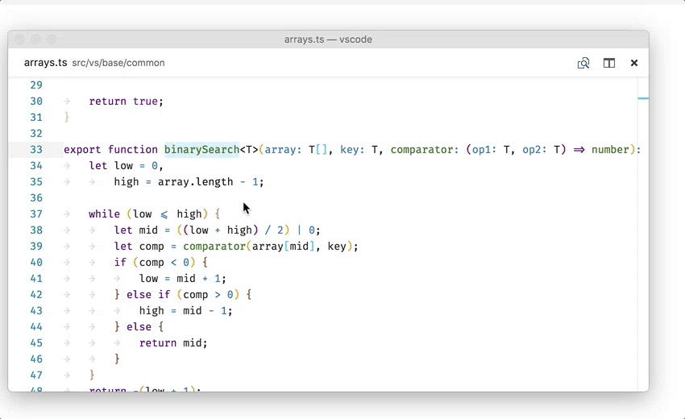
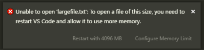

Visual Studio Code 2018 年 3 月のリリースへようこそ。今回のバージョンには数多くの重要な更新があり、ハイライトは次の通りです:

* **[構文に基づくコードの折りたたみ](#syntax-aware-folding)** - CSS, HTML, JSON, Markdown ファイルの折りたたみを改善。
* **[ファイルを横断するエラー、警告、参照の移動](#error-and-reference-navigation-across-files)** - ワークスペース間でも移動。
* **[新しいヒントの提案](#hints-in-the-editor)** - 修正やリファクタリングの提案を見つける。
* **[ES6 リファクタリングに変換](#suggestion-code-actions-for-javascript-and-typescript)** - ES6 class と module に変換する新しい CodeAction。
* **[プロセスに自動アタッチ](#node-debugging)** - 実行中の Node.js プロセスに自動アタッチ。
* **[ログポイント](#logpoints)** - ソース コードを変更したりデバッグ セッションを再起動せずにログを記録。
* **[大きいファイルのサポートを改善](#easier-way-to-open-large-files)** - 大木ファイルの構文ハイライトを高速化、メモリーの使用量を素早く変更。
* **[ターミナルのマルチライン リンク](#better-support-for-multi-line-links)** - 統合ターミナルの行をまたぐパスと URL にアクセス。
* **[Emmet ラップ変換のプレビュー](#emmet)** - Emmet のラップ変換のライブ プレビュー。
* **[Windows でのアップデート改善](#automatic-background-updates-on-windows)** -  中断時間を減らすバックグラウンドの自動更新。
* **[Preview: JS/TS imports の整理](#organize-imports-for-javascript-and-typescript)** - 未使用の import と import のソート。

> オンラインでリリース ノートを確認するには [code.visualstudio.com](https://code.visualstudio.com) の [Updates](https://code.visualstudio.com/updates) に移動してください。
> Cloud Developer Advocate [Brian Clark](https://twitter.com/_clarkio) による 1.22 release [highlights video](https://youtu.be/PG2KFAGDxNc)) もご確認ください。

リリースノートは VS Code の重要な機能に関連する次のセクションに構成されています:

* **[エディター](#editor)** - Emmet performance and smart matching improvements, new snippet Date variables.
* **[ワークベンチ](#workbench)** - Smoother scrolling on Windows, automatic save during Search and Replace.
* **[デバッグ](#debugging)** - Improved Node.js process picker, postDebugTask in launch.json.
* **[タスク](#tasks)** - Better command and argument quoting and escaping support.
* **[言語](#languages)** - Easier IntelliSense in JSDocs, CSS path completion.
* **[拡張機能オーサリング](#extension-authoring)** - Long running operations with cancellation, add related information to diagnostics.

**Insiders:** できるだけ早く新しい新機能を確認したいですか？夜間に更新する Insiders [build](https://code.visualstudio.com/insiders) をダウンロードすれば、最新のアップデートをすぐに試すことが可能です。

## エディター <a id="editor"></a>

### 構文に基づく折りたたみ認識 (Syntax aware folding) <a id="syntax-aware-folding"></a>

デフォルトで HTML、JSON、Markdown、CSS、Less、SCSS の折りたたみ領域は、言語の構文に基づいて計算され、整形式 (well-formed) インデントに依存しなくなりました。


また TypeScript と JavaScript でも利用でき `"typescript.experimental.syntaxFolding": true` 設定で有効にすることができます。

上記の言語の一部 (または全部) をインデントに基づく折りたたみに戻したい場合は次のようにします:

```json
  "[html]": {
    "editor.foldingStrategy": "indentation"
  },
```

> **Tip**: この機能がどのように使用されるか [Markdown ファイル内のヘッダー領域の折りたたみ](#fold-markdown-by-heading-level) で確認できます。

拡張機能向けの新しい API が [提案](#folding-provider-api) されているので、 syntax aware folding provider を他の言語にも提供することができます。

### ファイル間でエラーと参照の移動

このリリースでは `kb(editor.action.marker.next)` (**Go to Next Problem**) を使用してエラーと警告の移動すると報告されたすべてのエラーを考慮するようになりました。ただ 1 つのファイル内をループするのではなくエラーのある次のファイルへ移動したり戻ったりします。


同様に検索結果を参照するための新しいコマンドが用意されました。シンボルで **Find All References** をトリガーし、各参照を参照する `kb(goToNextReference)` と `kb(goToPreviousReference)` が使用できるようになりました。キーボードから手を放す必要がないため、シンボルを参照するすべての箇所を編集するのに最適です。



### エディターのヒント

extension API は   'Hint' diagnostics の作成をサポートするようになりました。これはエラーや警告ではなく、特定のリファクタリングを実行するなど、何かをより良くする方法を提案します。

問題の単語の先頭でヒント診断を `...`  で表示します。


ヒント診断が Code Action を宣伝するので、拡張機能製作者は常に Code Action にヒントを含めることをお勧めします。しかし、ユーザーによってはエディターにヒントを表示したくない場合もあり、ヒント診断を無効にするサポートも含めてください。

> **Tip**: このリリースで私たちは JavaScript/TypeScript [refactorings](#suggestion-code-actions-for-javascript-and-typescript) のためのヒントをいくつか追加しました。

### エラーと警告の関連情報

extension API は [related information](#support-related-diagnostics-information)  を診断情報に追加できるようになりました。これは診断情報が表示されるすべての場所 (ホバー、エラー Peek ウィンドウ、**問題パネル**) で表示されます。

次の例では 2 回割り当てられた変数の箇所で最初の位置を示す噛んれ情報を表示します:


### 大きなファイルをもっと簡単に開く方法

以前はエディターで大きなファイル (~2GB+) を開くと `--max-memory=NEWSIZE` フラグ付きでコマンド ラインから開くように促しました。この面倒を減らすために、アプリケーションが許可されたメモリーより多くのメモリーを必要とするファイルを開こうとすると、新しい通知を表示してアプリケーションが利用できるメモリーを増やし素早く再起動できるようにまりました。新しい設定 `files.maxMemoryForLargeFilesMB` で再起動後に利用可能な最大メモリーを構成でき、デフォルトは `4096` (4GB) です。



### 構文ハイライトの最適化

今回のリリースで、ビューポートのコンテンツ範囲に基づいてファイルを開いた直後にビューポートの構文ハイライトを行うようになりました。これは **Go to Definition** コマンドを使用して新しいファイルを開いたときに、次に示すようにより速いカラライゼーションをもたらします。

**Left**: VS Code 1.21 **Right**: VS Code 1.22


### 大きなファイルの検索と置換の改善

私たちは前回のリリースで新しいテキスト バッファーの改善を出荷しました ([blog post](https://code.visualstudio.com/blogs/2018/03/23/text-buffer-reimplementation) で詳細を確認してください)。これに続き大きなファイルの検索と置換を最適化しました。

### Format On Save のタイムアウト

VS Code はファイルをディスクに保存する直前にフォーマッタを実行できるため、遅い拡張機能が保存を遅延させることができ、スピードが問題でした。このため VS Code は保存についてとても厳密で format-on-save-request を 750 ms 後にキャンセルします。拡張機能で特に大きなファイルを取り扱うとき、これでは十分な時間が足りないことがあり、タイムアウトを構成する新しい `"editor.formatOnSaveTimeout"` 設定を追加しました。言語系拡張機能がフォーマットにより多くの時間を必要することが分かっている場合は、デフォルトの [language specific setting](https://code.visualstudio.com/docs/getstarted/settings#_language-specific-editor-settings) としてタイムアウトを変更できます。

保存をモニターするためにステータス バーには進捗状況のインジケーターが表示されるようになります。


### スニペット変数の追加 <a id="more-snippet-variables"></a>

現在の日付と時間を参照する新しいスニペット変数が用意されました。たとえば 28/3/2018 などの数字に加えて '28 of March' のような名前を使用できるようになりました。新しい変数は次の通りです:

* `${CURRENT_DAY_NAME}` - The name of the day ('Monday').
* `${CURRENT_DAY_NAME_SHORT}` - The short name of the day ('Mon').
* `${CURRENT_MONTH_NAME}` - The full name of the month ('July').
* `${CURRENT_MONTH_NAME_SHORT}` - The short name of the month ('Jul').

(編集メモ: これらテキストも localize point に指定されており、日本語では `CURRENT_MONTH_NAME` と `MONTH_NAME_SHORT` に違いがありません。個人的には翻訳する必要なかったかな..?

### Emmet

**ラップ変換 (Wrap with Abbreviation) のプレビュー**

**Emmet: Wrap with Abbreviation** または **Emmet: Wrap Individual Lines with Abbreviation** を使用するとき、ラップされたテキストがどのように表示されるかプレビューを表示するようになりました。


**より速い略語の展開**

大きな CSS/SCSS/Less ファイルで Emmet 略語の展開がはるかに高速になりました。これは、現在の場所が Emmet 略語の展開場所として有効かどうかを判断しようとするときに、完全なファイルの代わりにカーソル周りの小さな領域のみを解析することで達成されました。

**賢いスニペット一致**

スタイルシートの Emmet 略語は [pre-defined snippets](https://github.com/emmetio/snippets/blob/v0.2.9/css.json) とあいまい一致して最も近い一致結果を提供するようになりました。`emmet.preferences` の `css.fuzzySearchMinScore` 設定を変更することであいまい一致の精度を制御できます。`css.fuzzySearchMinScore` はスニペットが到達する必要のある最小するスコアを設定します。スコアを上げると結果は少なくなりますが、正確な一致を得られます。デフォルト値は 0.3 でユーザーは 0 から 1 を選択できます。

```json
"emmet.preferences": {
    "css.fuzzySearchMinScore": 0.3
}
```

## ワークベンチ <a id="workbench"></a>

### Windows の自動バックグラウンド更新

Windows の Insider ユーザー向けに長期間にわたり自動のバックグラウンド更新を提供してきました。これを 3 月のリリースで全員で有効にすることを決定しました。

長かったアップデート処理は、作業中にバックグラウンドで実行されるようになりました。この処理が終了すると、とても短いステップの最終アップデート処理を適応する確認通知が行われます。つまり、最新のVS Code にアップデートしているとき、より長く作業を続けることができます!

`update.enableWindowsBackgroundUpdates` 構成を使用するとこの機能を無効にすることができます。元の動作に戻したい場合やコンピューター上で新しいアップデート手順に何かしらの問題があればこれを適応します。

### Windows: スクロール ラグの回避策

特定のデバイスの Windows でスクロールが非常にラグく、スムーズに動かないという報告を受け取っていました ([issue 13612](https://github.com/Microsoft/vscode/issues/13612))。このスムース スクロールの回避策として新しい `window.smoothScrollingWorkaround` 設定を `true` に設定できるようになりました。これは回避策でありタスクバーからウィンドウを復元するたびにちらつきが発生する可能性があるため、この設定はデフォルトで有効になっていません。設定を有効にしてもそれ意外の影響はありません。

### 引数なしで VS Code を起動するとき空のウィンドウを開く

引数なしで VS Code を起動するとき、最後にアクティブなインスタンスにフォーカスするか、新しい空のウィンドウを開くかどうかを制御する 新しい `window.openWithoutArgumentsInNewWindow` 設定が導入されました。Windows と Linux では、プラットホームの動作をよりマッチさせるためデフォルトで有効になっています。有効にすると、デスクトップから VS Code アイコンをダブルクリックするか、コマンドラインから引数なしで VS Code を実行するとき新しい空のウィンドウを開きます。Windows でタスクバー アイコンを中クリックするかシフトクリックするときも同様の動作をします。この動作を無効にするには`window.openWithoutArgumentsInNewWindow` を `off` にします。

### 検索&置換のとき自動的に保存

すべての検索結果を置換するとき **Save All** **Close All** をする必要はもはやなくなりました。置換アクションが置換を行い変更を保存するようになります。

### 検索の包含/除外パターン

検索ビューの包含/除外パターンは 1 つのボックスにまとめられました。除外には `!` prefix を付ける必要がある以外、機能は全く同じです。例: `!*.js` は .js 拡張子を持つファイルの検索をスキップします。


### ツリー: 水平方向のスクロール

新しいグローバル設定 `workbench.tree.horizontalScrolling` が用意されました。これはワークベンチのいくつかのツリー ウィジェットの水平方向のスクロールを可能にします。ファイル エクスプローラーの深いファイル システムの階層など、幅広い要素の読みやすさを向上させるのに使用してください。

## 統合ターミナル <a id="integrated-terminal"></a>

### マルチ ライン リンクのサポートを改善

複数の行にまたがるパスと URL がリンクとして機能するようになりました。


この実装には特にウィンドウを変更したときに、いくつかの問題があります。これらは [reflow](https://github.com/Microsoft/vscode/issues/23688) を実装するときに修正される予定です。

### コマンド トラッキング

コマンドが実行されたタイミングを推測しようとする新しいターミナル機能の "command tracking" が追加されました。コマンド間の移動と選択を簡単にすることができます。


macOS では次のデフォルトのキーバインドがあります:

* 前のコマンドにスクロール: `kbstyle(Cmd+Up)`\*
* 次のコマンドにスクロール: `kbstyle(Cmd+Down)`\*
* 前のコマンドを選択: `kbstyle(Cmd+Shift+Up)`
* 次のコマンドを選択: `kbstyle(Cmd+Shift+Down)`

\* **Note**: スクロール アップ/ダウンを `kbstyle(Cmd+Alt+PgUp)`/`kbstyle(Cmd+Alt+PgDown)` に移動しています。

Windows と Linux ではこれらのコマンドを `keybindings.json` ファイルに追加することで [custom keybindings](https://code.visualstudio.com/docs/getstarted/keybindings) を構成することができます:

```js
{ "key": "ctrl+down",       "command": "workbench.action.terminal.scrollToNextCommand",
                               "when": "terminalFocus" },
{ "key": "ctrl+up",         "command": "workbench.action.terminal.scrollToPreviousCommand",
                               "when": "terminalFocus" },
{ "key": "ctrl+shift+down", "command": "workbench.action.terminal.selectToNextCommand",
                               "when": "terminalFocus" },
{ "key": "ctrl+shift+up",   "command": "workbench.action.terminal.selectToPreviousCommand",
                               "when": "terminalFocus" },
```

### より自然なスクロール

ターミナル アプリケーション内のスクロールは、ピクセル、行やページ単位でスクロールするかを定義する OS スクロール設定が考慮されるようになりました。

### VS Code を Git エディターとして使用したあとターミナルに再フォーカスする

メッセージを入力し終えたあと VS Code を Git エディターと使用しているか、統合ターミナルから Git がトリガーしているとき、ターミナルにフォーカスが戻ります。

## デバッグ <a id="debugging"></a>

### ログポイント

このマイルストーンには **Logpoints** の最初の成果が含まれています。ログポイントはデバッガを "break" しない代わりに、コンソールにメッセージを記録します。ログポイントは停止することができない本番サーバーのデバッグ中にログをイジェクションするときに便利です。

ログポイントは "ダイヤモンド" のアイコンで表示されます。ログ メッセージはプレーン テキストですが中括弧 ('{}') 内で評価する式を含めることが可能です。


通常のブレークポイントと同様に、ログポイントを有効/無効にすることができ、条件やヒット カウントによって制御することができます。

現在ログポイントは VS Code のビルトイン Node.js デバッガでサポートされていますが、他のデバッグ系拡張機能も続くと期待しています。

### launch.json の postDebugTask

`launch.json` に `postDebugTask` サポートを追加しました。このタスクはデバッグ セッションが終了した後に実行されます。`preLaunchTask` と同様に `tasks.json` のタスクを名前で参照することができます。`postDebugTask` を使用した起動構成の例を次に示します:

```json
{
    "name": "Attach to node server",
    "type": "node",
    "request": "attach",
    "port": 8008,
    "preLaunchTask": "Start Server",
    "postDebugTask": "Stop Server"
}
```

## Node デバッグ <a id="node-debugging"></a>

**Node.js プロセスに自動アタッチ**

新しい **Auto Attach**  機能の最初のバージョンが VS Code の Node.js デバッガに追加されました。有効にすると Node デバッガは VS Code の統合ターミナルからデバッグ モードで起動された Node.js プロセスに自動的にアタッチします。


この機能を有効にするには、**Toggle Auto Attach** アクションを使用するか、Node デバッガが既にアクティブになっている場合はステータス バー項目の **Auto Attach** を使用します。

プロセスがデバッグ モードにあるかどうかはプログラム引数を解析することで決定されます。現在 `--inspect`, `--inspect-brk`, `--inspect-port`, `--debug`, `--debug-brk`, `--debug-port` (`=` やポート番号) を検出します。

(まだ) この機能は (起動されたプロセスが VS Code の統合ターミナル内の子ではない) 'tmux' のようなターミナル マルチプレクサでは機能しません。

**Process Picker の改善**

以前のリリースまでは、Node.js プロセスのプロセス ピッカーは起動構成内から使用できる "interactive variable" としてのみ利用できました。

今回のリリースで、起動構成を使用しなくても **Attach to Node Process** アクションのピッカーを使用できるようにしました。

ピッカーと新しいアクションがより便利になるように (プロセス id に加え) デバッグ ポートを介した Node.js プロセスへのアタッチが可能になっています。

ピッカーは Node.js プロセスに加え、`--debug` や `--inspect` 引数の様々な形式で起動されたすべてのプログラムも表示するようになりました。これにより Electron や VS Code の helper プロセスにアタッチすることが可能になります。


ピッカーのリストされた個々のプロセス項目には、プロセス ID に加えデバッグ ポートと検出されたプロトコルが表示されます。

## タスク <a id="tasks"></a>

### 引数の引用符の処理を改善

bash や PowerShell などのシェルで実行したとき、引数とコマンド自体を引用する方法をより制御できるようにタスクが更新されました。`shell` タイプのタスクはコマンドとその引数を別々に提供できるようになっています。次の例は `folder with spaces` という名前のフォルダのディレクトリーをリストするタスクの例です:

```json
{
  "label": "dir",
  "type": "shell",
  "command": "dir",
  "args": [
    "folder with spaces"
  ]
}
```

シェル タスクは引数を個別に指定するので VS Code は 'dir' コマンドに 1 つの引数として渡す必要があることを認識し、使用されるシェルに基づいて引数を引用します。たとえば `cmd.exe` なら `"`、PowerShell なら `'`、Linux と macOS のシェルなら `'` を VS Code は使用します。引数の引用符を制御したい場合、これらを指定することができます。例:

```json
{
  "label": "dir",
  "type": "shell",
  "command": "dir",
  "args": [
    {
      "value": "folder with spaces",
      "quoting": "escape"
    }
  ]
}
```

これはシェルのエスケープ文字 (PowerShell ではバッククォート、bash では `\`) を使用して引数のスペースをエスケープします。シェルがエスケープ文字をサポートしていない場合は strong quote が使用されます。

エスケープ方式のみだけでなく次の値がサポートされています:

* **strong**: 文字列内の評価すべてを抑制するシェルの強い引用符を使用します。PowerShell、Linux や macOS のシェルではシングル クオートが使用されます。cmd.exe では `"` が使用されます。
* **weak**: 文字列内の式 (例: 環境変数など) を評価するシェルの弱い引用符を使用します。PowerShell、Linux や macOS のシェルではダブル クオートが使用されます (`"`)。cmd.exe は弱い引用符をサポートしていませんが `"` が使用されます。

コマンド自体にスペースを含む場合 VS Code はデフォルトでコマンドを強い引用符で囲います。引数と同様にユーザーは同じようにコマンドの囲い込み方を制御することができます。

`command` プロパティでコマンド ライン全体を保持する古い方式は引き続きサポートされることに注意してください。

同じサポートが task API に追加されているため、タスク プロバイダーも引用符やエスケープを完全に制御できます。

## 言語 <a id="languages"></a>

### 見出しレベルで Markdown を折りたたむ

Markdown ドキュメントを見出しで折りたたみできるようになりました:


1 つの見出しを折りたたむと、その見出し以下のすべてのコンテンツとサブ見出しが折りたたまれます。

### TypeScript 2.8 <a id="typescript-2.8"></a>

VS Code に TypeScript 2.8 が含まれるようになりました。この更新で多くの重要なバグ修正やツーリングの改善など [新しい言語機能](https://github.com/Microsoft/TypeScript/wiki/What's-new-in-TypeScript#typescript-28) が追加されています。

### JSDocs のクイック提案

VS Code が JSDoc の intelliSense を提供していることをご存知でしたか？この機能はずいぶん前のリリースで追加されましたが、手動で IntelliSense を表示したときのみ表示されるためこの機能は認知されていなかったようです。VS Code 1.22 では JSDoc 内でデフォルトでクイック提案が有効になりました。作動させるには IntelliSense の入力を開始するだけです:


### JavaScript と TypeScript の Code Actions の提案機能 (Suggestion Code Actions)

JavaScript と TypeScript の suggestion Code Actions の見つけやすさを改善しました。これはソース コードを素早く改善したりクリーン アップするのに役立つ変更です。電球ウィジェットで表示されますが、Quick Fixes とは異なりソース コード内の特定のエラーや警告は処理されません。たとえば ES5 のクラスを ES6 のクラスに変換したり、commonjs のモジュールを ES6 のモジュールに変換する suggestion Code Actions があります。

Suggestion Code Action はエディターで `...` 表示されます:


利用できる Code Action を表示するには `...` の上にカーソルを移動し、電球をクリックするか `kb(editor.action.quickFix)` を実行します。


引き続き提案を加える予定です。見てみたい提案があれば教えてください。

JavaScript と TypeScript で Suggestion Code Action はデフォルトで有効になっています。`"typescript.suggestionActions.enabled": false` や `"javascript.suggestionActions.enabled": false` を設定することで無効にすることができます。

### CSS パスの補完

HTML に加えて CSS でもパスの補完を利用できるようになりました:


## 拡張機能オーサリング <a id="extension-authoring"></a>

### 時間の長い操作のキャンセル機能を含む通知としてひょじする

通知センターで、長時間実行する操作をキャンセル機能付きで表示するための新しい API を追加しました。表示する利点は次の通りです:

* 複数の操作の進行状況を同時に報告できます。
* 操作の進行状況を表示できます。
* 操作のキャンセルオプションをユーザーが持つことができます。


新しい進行状況の位置 `ProgressLocation.Notification` を使用して `window.withProgress` を呼び出します。キャンセル ボタンを表示して、コールバックで提供される `CancellationToken` でキャンセルをチェックするには、`cancellable` を `true` に設定します。進行状況を表示するには、進行状況を表示するときに `increment` 値をバレッジします。この新しい API を使用する拡張機能の例は [progress sample](https://github.com/Microsoft/vscode-extension-samples/tree/master/progress-sample) を参照してください。

### related diagnostics information

診断情報に関連情報を提供する API [`DiagnosticRelatedInformation`](https://github.com/Microsoft/vscode/blob/b3200907913bea2b65a25b5e19b037739ca00119/src/vs/vscode.d.ts#L3710) を追加しました。変数名がスコープ内で再利用されてるためコンパイル エラーが発生してる状況を想像してみてください。実際のエラーは不正な宣言で "Duplicate definition of symbol 'Foo' not allowed"  です。診断情報に関連情報を含めることで、'Foo' というシンボルのはじめの宣言を指すことができ、エラーを理解して修正するのがより簡単になります。

### CancellationTokenSource を破棄してもトークンがキャンセル状態にならなくなりました

`CancellationTokenSource` で `dispose()` を呼びだすと、キャンセルトークンが設定され cancellation イベントがトリガーされます。トークンをキャンセルすることなくトークンを破棄できるようにするために動作を変更しました。トークンのキャンセルを元にするときは `cancel()` を呼び出します。

### Simple editors は拡張機能に渡されません

debug REPL input のようなエディターを使用する Input は、エディターとして拡張機能に渡されなくなりました。つまり、debug REPL にフォーカスしたときに `onDidChangeActiveTextEditor` がトリガーされないことと `onDidChangeTextDocument` が発火しないことを意味します。The reason behind this change is that the REPL input uses the editor as an implementation detail and extension should not be notified of this since it is not a "real editor".

### カスタム ビュー <a id="custom-views"></

**TreeView**

新しい `TreeView` API を使用してカスタム ビューで操作を実行できるようになりました。これには `viewId` と `TreeDataProvider` を提供することに、よって新しい API の `createTreeView` を使用してアクセスします。

```typescript
const customView = vscode.window.createTreeView<string>('customView', { treeDataProvider: new CustomViewDataProvider<string>() });
```

**Note:** 既存の `registerTreeDataProvider` API はビューに contribute data を提供するためにサポートされます。contribute するには `registerTreeDataProvider` か `createTreeView` のどちらかを使用できますが、両方を使用することはできません。

**Reveal**

現在のところ `TreeView` は reveal するために `reveal` メソッドをエクスポートしてビューの項目を選択します。

```typescript
customView.reveal('element');
```

デフォルトでは表示した項目が選択されます。項目を選択しないようにするには `select` オプションを `false` にします。例:

```typescript
  customView.reveal('element', { select: false });
```

TreeView` の例は [ここ](https://github.com/Microsoft/vscode-extension-samples/blob/master/tree-view-sample/src/ftpExplorer.fileSystemProvider.ts#L254) で確認できます。

**Note:** To enable the `reveal` API, the contributed `TreeDataProvider` must implement the `getParent` method.

### 新しいテーマ色

新しい 'Hint' 診断には 2 つの配色があります:

* `editorHint.foreground`: エディターのヒントの前景色。
* `editorHint.border`: エディターのヒントの境界線色。

### Editor visible ranges

editor visible ranges API は Stable に昇格されました。

```ts
export interface TextEditor {
    /**
     * The current visible ranges in the editor (vertically).
     * This accounts only for vertical scrolling, and not for horizontal scrolling.
     */
    readonly visibleRanges: Range[];
}

export namespace window {
    /**
     * An [event](#Event) which fires when the selection in an editor has changed.
     */
    export const onDidChangeTextEditorVisibleRanges: Event<TextEditorVisibleRangesChangeEvent>;
}
```

### Debug Adapter Protocol <a id="debug-adapter-protocol"></a>

**ログポイント サポート**

新しく導入されたログポイントは Debug Adapter Protocol に、`SourceBreakpoint` の `logMessage` 属性と新しい `supportsLogPoints` 機能としてやってきました。ログポイントをサポートするデバッグ アダプターは `supportsLogPoints` 機能に `true` を返します。空ではない `logMessage` 属性に対して 'break' (stop) しませんが、代わりにメッセージを記録します。中括弧 ('{...}') 内の式が評価され、結果はログ メッセージで '{...}' を置き換えます。

**`initialize` リクエストの新しい `clientName` 属性**

フロントエンドは `initialize` リクエストに新しいオプション属性 `clientName` を使用して、デバッグ アダプターにフロントエンドのヒューマン リーダブルな名前を渡すことができます。

**新しい `terminateThreads` リクエスト**

新しい `terminateThreads` リクエストは 1 つ以上のスレッドを停止することができます。対応する `supportsTerminateThreadsRequest` 機能はデバッグ アダプターがリクエストをサポートすることを意味します。

**新しい `setExpression` リクエスト**

新しい `setExpression` リクエストを使用すると、assignable expression (別名 "l-value") に値を代入できます。対応する `supportsSetExpression` 機能はデバッグ アダプターがリクエストをサポートすることを意味します。

**`stopped` イベントの新しい `preserveFocusHint`**

`stopped` イベントの true-ish `preserveFocusHint` は、停止したイベントがフォーカスを変更するべきでないことをフロント エンドに提案します。

### Multi-Select QuickPick

ユーザーが任意の数の項目を選択できるようにする新しい API で選択された項目のリストを返す QuickPick API を追加しました。


既存の `window.showQuickPick` API 関数でこれらを使用する方法については `QuickPickOptions.canPickMany` オプションと `QuickPickItem.picked` フラグを確認してください。

## 提案状態の拡張機能 API <a id="proposed-extension-apis"><a>

これらの API は十分に準備ができたとき今後のマイルストーンで安定板に追加する予定です。ユーザーの拡張機能でどのような動作をしているかフィードバックをお待ちしています。

> **Note:** これらの API は提案状態なので、使用するには `"enableProposedApi": true` を `package.json` に追加して選択する必要があり、[`vscode.proposed.d.ts`](https://github.com/Microsoft/vscode/blob/master/src/vs/vscode.proposed.d.ts) をあなたの拡張機能プロジェクトにコピーしなければなりません。また `enableProposedApi` 属性を使用する拡張機能を Marketplace に公開することはできません。

### Folding Provider API

拡張機能が language aware folding ranges を提供するために新しい API が提案されています:

```ts
export namespace languages {

  /**
    * Register a folding provider.
    *
    * Multiple folding can be registered for a language. In that case providers are sorted
    * by their [score](#languages.match) and the best-matching provider is used. Failure
    * of the selected provider will cause a failure of the whole operation.
    *
    * @param selector A selector that defines the documents this provider is applicable to.
    * @param provider A folding provider.
    * @return A [disposable](#Disposable) that unregisters this provider when being disposed.
    */
  export function registerFoldingProvider(selector: DocumentSelector, provider: FoldingProvider): Disposable;
}
```

完全な API は [こちら]( https://github.com/Microsoft/vscode/blob/21bfdd43b16707a07961f6d2b9d7782e5ea28d27/src/vs/vscode.proposed.d.ts#L42) を参照してください。

equivalent API は言語サーバー プロトコルのプロトコル系拡張機能として [ここで](https://www.npmjs.com/package/vscode-languageserver-protocol-foldingprovider) 提案されています。

### Task API

新しい task API がサポートされました:

* システム内の既存のすべてのタスクをクエリーする。
* プログラムでタスクを実行する。
* 実行中のタスクを停止する。
* タスクの開始と終了イベントをリッスンする。

proposed API は [ここ](https://github.com/Microsoft/vscode/blob/master/src/vs/vscode.proposed.d.ts#L653) で見つけることができます。

新しい API はタスク プロバイダーで行われたタスクをリターンことなく実行できます。次のシンプルな `echo` タスクを実行します。

```typescript
let task = new vscode.Task(
    {
        type: "myCustomTask"
    },
    "echo",
    "myExtension",
    new vscode.ShellExecution('echo', ['Hello World'])
);
vscode.workspace.executeTask(task);
```

## 保守性 <a id="serviceability"></a>

VS Code から拡張機能の新しい問題をファイルできるようになりました。issue reporter は VS Code または拡張機能で問題を報告するかどうかを選択するドロップダウンが用意されています。拡張機能が GutHub にリポジトリーを持っている場合、同様の問題を検索し **Preview on GitHub** の提出ボタンでそのリポジトリーを使用します。


## プレビュー機能 <a id="preview-features"></a>

プレビュー機能はリリースの準備はできていませんが、使用するには十分な機能をそなえています開発中の早期フィードバックをお待ちしています。

### JavaScript と TypeScript の import を整理する

新しい **Organize Imports** (`kb(typescript.organizeImports)`) コマンドは未使用の imports を削除し import を整理します。


このコマンドは JavaScript と TypeScript の両方で ES6 modules で機能します。

### Electron 2.0 exploration

このマイルストーンで、私たちは VS Code を Electron 2.0.0 にバンドルすることを検討していました。これは major Electron リリースであり Chrome 61 と Node.js 8.x がやってきます (Chrome 58 と Node.js 7.x を使用している現在のバージョンと比較して大きく進んでいます)。4 月の上旬に Insiders のユーザーにアップデートを提供し追加のフィードバックを集める予定です。もし協力に興味があれば VS Code [Insiders](https://code.visualstudio.com/insiders) をインストールしてください。

## 注目の変更 <a id="notable-changes"></a>

* [13905](https://github.com/Microsoft/vscode/issues/13905): Windows: Middle mouse click on taskbar icon doesn't open a new window
* [35675](https://github.com/Microsoft/vscode/issues/35675): Font rendering looks ugly on Linux
* [36307](https://github.com/Microsoft/vscode/issues/36307): Experimental File Watcher - high CPU on "circular" symlinks
* [42401](https://github.com/Microsoft/vscode/issues/42401): Smarter grouping of output channels
* [42402](https://github.com/Microsoft/vscode/issues/42402): Add option to reveal logs from within a channel
* [43813](https://github.com/Microsoft/vscode/issues/43813): Extension incomplete after update
* [44411](https://github.com/Microsoft/vscode/issues/44411): Bail out from launch for unresolvable variables
* [44554](https://github.com/Microsoft/vscode/issues/44554): Allow to DND multiple root-folders
* [45872](https://github.com/Microsoft/vscode/issues/45872): Prompt user to change the language of the UI after the installation of a localization pack
* [45972](https://github.com/Microsoft/vscode/issues/45972): Explorer: Reduce call count of isEqualOrParent

## Thank You

最後になりましたが、VS Code をより良いものへするために協力してくれた次の方々に多大なる感謝を込めて:

`vscode`への貢献:

* [Julian Tu (@AiryShift)](https://github.com/AiryShift):  Fixes #46075 [PR #46227](https://github.com/Microsoft/vscode/pull/46227)
* [@amalik12](https://github.com/amalik12):  Added Mac specific text for link follow tooltip [PR #44885](https://github.com/Microsoft/vscode/pull/44885)
* [朝歌 (@amtlib-dot-dll)](https://github.com/amtlib-dot-dll)
  * Wrong placeholder in the .desktop file [PR #44752](https://github.com/Microsoft/vscode/pull/44752)
  * Removing unnecessary lines in .travis.yml [PR #46044](https://github.com/Microsoft/vscode/pull/46044)
* [Andreas Offenhaeuser (@anoff)](https://github.com/anoff):  Markdown Security Policy to allow local HTTP content [PR #46473](https://github.com/Microsoft/vscode/pull/46473)
* [@Arnie97](https://github.com/Arnie97):  Update file extensions for the ini language [PR #45729](https://github.com/Microsoft/vscode/pull/45729)
* [Aliaksandr Ushakou (@aushakou)](https://github.com/aushakou):  Fix #43465 [PR #44006](https://github.com/Microsoft/vscode/pull/44006)
* [Robin Bartholdson (@buyology)](https://github.com/buyology):  make the timeout for formatOnSave configurable [PR #43702](https://github.com/Microsoft/vscode/pull/43702)
* [Juan Camilo Giraldo Chaverra (@camilogiraldo)](https://github.com/camilogiraldo):  Better uninstall dialog for extensions with dependencies. [PR #45929](https://github.com/Microsoft/vscode/pull/45929)
* [Cherry Wang (@chryw)](https://github.com/chryw)
  * Debug icons consistency and housekeeping work [PR #45253](https://github.com/Microsoft/vscode/pull/45253)
  * Adjusted icon size [PR #45608](https://github.com/Microsoft/vscode/pull/45608)
  * More tweaks for #45406 [PR #45691](https://github.com/Microsoft/vscode/pull/45691)
  * Conditional breakpoint icon polish for #45406 [PR #45935](https://github.com/Microsoft/vscode/pull/45935)
  * Debug icon consistensy pass [PR #45158](https://github.com/Microsoft/vscode/pull/45158)
* [Christian Oliff (@coliff)](https://github.com/coliff):  HTTPS link [PR #46849](https://github.com/Microsoft/vscode/pull/46849)
* [Mikhail Bodrov (@Connormiha)](https://github.com/Connormiha):  Simplify check lang.mimetypes [PR #42932](https://github.com/Microsoft/vscode/pull/42932)
* [Daniel Frankcom (@danielfrankcom)](https://github.com/danielfrankcom)
  * Add underline styling to debug console [PR #46042](https://github.com/Microsoft/vscode/pull/46042)
  * Add ANSI colour tokens as children of existing tokens [PR #45946](https://github.com/Microsoft/vscode/pull/45946)
* [Darius Keeley (@Dari-K)](https://github.com/Dari-K):  Hide tab fade until text overflows with sizing-shrink and close-button-left/off [PR #45815](https://github.com/Microsoft/vscode/pull/45815)
* [Dominik Ivosevic (@DominikDitoIvosevic)](https://github.com/DominikDitoIvosevic):  Add support for path links with spaces [PR #43733](https://github.com/Microsoft/vscode/pull/43733)
* [Fathy Boundjadj (@fathyb)](https://github.com/fathyb):  Add getWorker to MonacoEnvironment [PR #46032](https://github.com/Microsoft/vscode/pull/46032)
* [Mihai Balaceanu (@gizm0bill)](https://github.com/gizm0bill):  Fixes #46027 by using box-shadow CSS to render guides [PR #46029](https://github.com/Microsoft/vscode/pull/46029)
* [Jackson Kearl (@JacksonKearl)](https://github.com/JacksonKearl)
  * Use yarn rather than gulp for building tests [PR #45614](https://github.com/Microsoft/vscode/pull/45614)
  * Add basic support for transposing multibyte characters. [PR #45499](https://github.com/Microsoft/vscode/pull/45499)
* [Jean Pierre (@jeanp413)](https://github.com/jeanp413):  Fix for #46106 [PR #46309](https://github.com/Microsoft/vscode/pull/46309)
* [JYX (@jjyyxx)](https://github.com/jjyyxx):  Avoid accessing vsWorker of undefined / null value [PR #46012](https://github.com/Microsoft/vscode/pull/46012)
* [Ievgen Andrushchak (@killerDJO)](https://github.com/killerDJO): Search of local Typescript Language Service Plugins [PR #45858](https://github.com/Microsoft/vscode/pull/45858)
* [Dominic Valenciana (@Kiricon)](https://github.com/Kiricon):  Added focus to quick fix widget click [PR #44073](https://github.com/Microsoft/vscode/pull/44073)
* [Kumar Harsh (@kumarharsh)](https://github.com/kumarharsh):  fix(feedback): use the Button widget in Feedback form. Closes #46490 [PR #46503](https://github.com/Microsoft/vscode/pull/46503)
* [Matheus Salmi (@mathsalmi)](https://github.com/mathsalmi):  Fix php grammar update script [PR #44171](https://github.com/Microsoft/vscode/pull/44171)
* [Mika Andrianarijaona (@mikaoelitiana)](https://github.com/mikaoelitiana): Change default keybinding of cursorColumnSelectUp to ctrl+shift+… [PR #41471](https://github.com/Microsoft/vscode/pull/41471)
* [Mark Marron (@mrkmarron)](https://github.com/mrkmarron):  Change to prevent fakeFireContinued when initiating time-travel [PR #46441](https://github.com/Microsoft/vscode/pull/46441)
* [Bruno Ribeiro (@nikonso)](https://github.com/nikonso):  Add partial staging actions to diff editor context menu [PR #43941](https://github.com/Microsoft/vscode/pull/43941)
* [Ori Ashual (@oriash93)](https://github.com/oriash93)
  * Case insensitive comment string matching [PR #44998](https://github.com/Microsoft/vscode/pull/44998)
  * Enabled 'Open to the side' command only for files [PR #44968](https://github.com/Microsoft/vscode/pull/44968)
* [Pradeep Murugesan (@pradeepmurugesan)](https://github.com/pradeepmurugesan):  added the key bindings for first and last selection in suggestions. [PR #45881](https://github.com/Microsoft/vscode/pull/45881)
* [Roman Salvador (@rsalvador)](https://github.com/rsalvador)
  * Improve Call Stack performance with many threads, fixes #44248 [PR #44249](https://github.com/Microsoft/vscode/pull/44249)
  * Make problem counters consistent, fixes #45592 [PR #45593](https://github.com/Microsoft/vscode/pull/45593)
* [Shobhit Chittora (@shobhitchittora)](https://github.com/shobhitchittora)
  * Allow to filter keyBindings by 'Source'. [PR #43393](https://github.com/Microsoft/vscode/pull/43393)
  * Adds workspace config for submodules detection limit [PR #45727](https://github.com/Microsoft/vscode/pull/45727)
* [Tobias Kahlert (@SrTobi)](https://github.com/SrTobi):  Centered layout in horizontal mode [PR #45671](https://github.com/Microsoft/vscode/pull/45671)
* [Steve Desmond (@stevedesmond-ca)](https://github.com/stevedesmond-ca):  Properly set electron version in env scripts [PR #45696](https://github.com/Microsoft/vscode/pull/45696)
* [Alexander (@usernamehw)](https://github.com/usernamehw)
  * Add more time-based variables for snippets [PR #46049](https://github.com/Microsoft/vscode/pull/46049)
  * Focus terminal after toggling via `workbench.action.terminal.toggleTerminal` [PR #46272](https://github.com/Microsoft/vscode/pull/46272)
* [Waldir Pimenta (@waldyrious)](https://github.com/waldyrious):  Change label of indentation action in status bar [PR #37515](https://github.com/Microsoft/vscode/pull/37515)
* [Zim Kalinowski (@zikalino)](https://github.com/zikalino):  make sure yml extension is default for yaml files [PR #45756](https://github.com/Microsoft/vscode/pull/45756)

`vscode-extension-vscode` への貢献:

* [Danny Tuppeny (@DanTup)](https://github.com/DanTup):
  * Check for presence of code executable instead of just folder (#95) [PR #95](https://github.com/Microsoft/vscode-extension-vscode/pull/95)
  * Place VS Code inside insiders/stable sub-folders of .vs-test (#97) [PR #97](https://github.com/Microsoft/vscode-extension-vscode/pull/97)
  * Don't download Code every time on Windows (#102) [PR #102](https://github.com/Microsoft/vscode-extension-vscode/pull/102)
  * Add support for Mocha's forbidOnly (#103) [PR #103](https://github.com/Microsoft/vscode-extension-vscode/pull/103)

`vscode-nls` への貢献:

* [Ruben Bridgewater (@BridgeAR)](https://github.com/BridgeAR): Use sync fs.mkdir [PR #17](https://github.com/Microsoft/vscode-nls/pull/17)

`language-server-protocol`への貢献:

* [Igor Matuszewski (@Xanewok)](https://github.com/Xanewok): Change message params types to match JSON-RPC spec [PR #373](https://github.com/Microsoft/language-server-protocol/pull/373)

`vscode-css-languageservice` への貢献:

* [Avi Vahl (@AviVahl)](https://github.com/AviVahl):  Fix function calls in esm mode [PR #74](https://github.com/Microsoft/vscode-css-languageservice/pull/74)

`vscode-html-languageservice` への貢献:

* [Sibiraj (@Sibiraj-S)](https://github.com/Sibiraj-S):  add AngularJS `ng-strict-di` tag [PR #25](https://github.com/Microsoft/vscode-html-languageservice/pull/25)

`node-jsonc-parser` への貢献:

* [@sqs](https://github.com/sqs): Allow trailing commas in array [PR #6](https://github.com/Microsoft/node-jsonc-parser/pull/6)
* [Huachao Mao (@sqs)](https://github.com/Huachao):
  * Refactor computeIndentLevel method [PR #9](https://github.com/Microsoft/node-jsonc-parser/pull/9)
  * Fix typo of token [PR #8](https://github.com/Microsoft/node-jsonc-parser/pull/8)

`vscode-generator-code` への貢献:

* [Alessandro Fragnani (@alefragnani)](https://github.com/alefragnani):  Add Keymap extension template [PR #110](https://github.com/Microsoft/vscode-generator-code/pull/110)
* [Nikita Shiryakov (@nikselite)](https://github.com/nikselite):  Remove unnecessary space [PR #106](https://github.com/Microsoft/vscode-generator-code/pull/106)

`vscode-languageserver-node`

* [Matt Acosta (@mattacosta)](https://github.com/mattacosta): Typo fixes [PR #327](https://github.com/Microsoft/vscode-languageserver-node/pull/327)

`vscode-loader` への貢献:

* [Geoffrey Gilmore (@ggilmore)](https://github.com/ggilmore): support loading scoped modules at runtime [PR #10](https://github.com/Microsoft/vscode-loader/pull/10)

`vscode-azurecli` への貢献:

* [Derek Bekoe (@derekbekoe)](https://github.com/derekbekoe): Fix for PYTHONPATH on Homebrew [PR #31](https://github.com/Microsoft/vscode-azurecli/pull/31)

`vscode-azure-account` への貢献:

* [Sheng Chen (@jdneo)](https://github.com/jdneo): Add timeout in promise race [PR #46](https://github.com/Microsoft/vscode-azure-account/pull/46)

`vscode-chrome-debug` への貢献:

* [AJ Richardson (@aj-r)](https://github.com/aj-r):  Fix chrome session restore prompt in Windows [PR #606](https://github.com/Microsoft/vscode-chrome-debug/pull/606)
* [Chance An (@changsi-an)](https://github.com/changsi-an)
  * Use the telemetry collector to append an additional telemetry property for launch request. [PR #631](https://github.com/Microsoft/vscode-chrome-debug/pull/631)
  * Implements setExpression request. [PR #612](https://github.com/Microsoft/vscode-chrome-debug/pull/612)
  * Launch Chrome in unelevated state on Windows using `wmic call create`. [PR #619](https://github.com/Microsoft/vscode-chrome-debug/pull/619)
* [@digeff](https://github.com/digeff)
  * Add browser version to telemetry [PR #621](https://github.com/Microsoft/vscode-chrome-debug/pull/621)
  * Now we provide a reason of why start-up failed [PR #630](https://github.com/Microsoft/vscode-chrome-debug/pull/630)
  * Add an event with the target's version information [PR #627](https://github.com/Microsoft/vscode-chrome-debug/pull/627)
  * Report times of different tasks that happen until we launch and show the user page [PR #610](https://github.com/Microsoft/vscode-chrome-debug/pull/610)
* [Chris Wells (@msft-cwells)](https://github.com/msft-cwells)
  * Changes to the msbuild signing project to remove unwanted files [PR #622](https://github.com/Microsoft/vscode-chrome-debug/pull/622)
  * Simplification of the msbuild signing projects [PR #624](https://github.com/Microsoft/vscode-chrome-debug/pull/624)
  * Adding LOC files to the signing microbuild project [PR #615](https://github.com/Microsoft/vscode-chrome-debug/pull/615)
  * Adding signing msbuild files [PR #614](https://github.com/Microsoft/vscode-chrome-debug/pull/614)
* [Raghav Katyal (@rakatyal)](https://github.com/rakatyal)
  * Use landing page even if breakonload is disabled [PR #613](https://github.com/Microsoft/vscode-chrome-debug/pull/613)
  * Respect locale passed on from Pinezorro [PR #616](https://github.com/Microsoft/vscode-chrome-debug/pull/616)

`vscode-chrome-debug-core` への貢献

* [Chance An (@changsi-an)](https://github.com/changsi-an)
  * Introduces a telemetry collector. [PR #314](https://github.com/Microsoft/vscode-chrome-debug-core/pull/314)
  * Introduces a mechanism to batch-sending telemetry events. [PR #292](https://github.com/Microsoft/vscode-chrome-debug-core/pull/292)
  * Change the way error message is surfaced up to the UI. [PR #303](https://github.com/Microsoft/vscode-chrome-debug-core/pull/303)
  * Batch sending telemetry for some of the event notifications. [PR #300](https://github.com/Microsoft/vscode-chrome-debug-core/pull/300)
* [@digeff](https://github.com/digeff)
  * Add missing await [PR #306](https://github.com/Microsoft/vscode-chrome-debug-core/pull/306)
  * Don't wait for global telemetry properties to be ready before sending telemetry [PR #310](https://github.com/Microsoft/vscode-chrome-debug-core/pull/310)
  * Add versions to telemetry [PR #307](https://github.com/Microsoft/vscode-chrome-debug-core/pull/307)
  * Now the start-up timings events can include a failure reason [PR #316](https://github.com/Microsoft/vscode-chrome-debug-core/pull/316)
  * Now we send more telemetry information for some errors [PR #319](https://github.com/Microsoft/vscode-chrome-debug-core/pull/319)
  * Report times the different tasks that happen until we launch and show the user page [PR #301](https://github.com/Microsoft/vscode-chrome-debug-core/pull/301)
  * Send all telemetry properties of the start-up timings event in sentence case [PR #313](https://github.com/Microsoft/vscode-chrome-debug-core/pull/313)
  * Fix some unexplained breakpoints behavior [PR #296](https://github.com/Microsoft/vscode-chrome-debug-core/pull/296)
  * Resolve pending breakpoints onScriptParsed instead onScriptPaused when using break on load [PR #290](https://github.com/Microsoft/vscode-chrome-debug-core/pull/290)
* [Raghav Katyal (@rakatyal)](https://github.com/rakatyal):  Clear context to avoid sending multiple remove eve… [PR #318](https://github.com/Microsoft/vscode-chrome-debug-core/pull/318)

`vscode-node-debug2` への貢献:

* [@digeff](https://github.com/digeff)
  * Update FinishedStartingUpEventName to new signature [PR #184](https://github.com/Microsoft/vscode-node-debug2/pull/184)
  * Add version to all telemetry events, and properly trigger start-up telemetry [PR #183](https://github.com/Microsoft/vscode-node-debug2/pull/183)
* [Chris Wells (@msft-cwells)](https://github.com/msft-cwells)
  * Changes to the msbuild signing project to remove unwanted files [PR #181](https://github.com/Microsoft/vscode-node-debug2/pull/181)
  * Adding LOC files to the signing microbuild project [PR #179](https://github.com/Microsoft/vscode-node-debug2/pull/179)
  * Adding msbuild signing files [PR #178](https://github.com/Microsoft/vscode-node-debug2/pull/178)
* [Raghav Katyal (@rakatyal)](https://github.com/rakatyal):  Respect locale passed from Pinezorro [PR #180](https://github.com/Microsoft/vscode-node-debug2/pull/180)

`vscode-recipes` への貢献:

* [@bladedeyna](https://github.com/bladedeyna):  Update README.md to match current launch.json [PR #90](https://github.com/Microsoft/vscode-recipes/pull/90)
* [@dvlsg](https://github.com/dvlsg):  docs: spelling in debugging section [PR #75](https://github.com/Microsoft/vscode-recipes/pull/75)
* [Liran Tal (@lirantal)](https://github.com/lirantal):  docs(README): fix spelling typo [PR #88](https://github.com/Microsoft/vscode-recipes/pull/88)
* [Marek Kaczkowski (@marekkaczkowski)](https://github.com/marekkaczkowski):  debugging-jest-tests "Jest Current File" on Windows [PR #89](https://github.com/Microsoft/vscode-recipes/pull/89)

`localization` への貢献:

今月は 2017 年 4 月 10 日に Transifex で始まった VS code コミュニティーのローカライゼーションが 1 周年を迎えました。

* Transifex [VS Code project](https://aka.ms/vscodeloc) チームには 800 任以上のメンバーがいます。毎月のアクティブな貢献者は約 100 人です。
* コミュニティーの貢献により国際的なユーザーにコア 9 ヵ国語の月例アップデートのリリースに成功しました。
* またコミュニティー メンバーによって 4 ヵ国語が完全にローカライズされ、VS Code の言語パック拡張機能としてリリースされました。より多くの言語がリリース予定です。
* Kudos to VS Code community localization contributors!!!

このリリースのトップ貢献者のスナップショットです。貢献者のリストを含むプロジェクトの詳細については [https://aka.ms/vscodeloc](https://aka.ms/vscodeloc) を参照してください。

* **French:** Antoine Griffard, Adrien Clerbois, Smrman.
* **Italian:** Alessandro Alpi, Piero Azi, Aldo Donetti, Simone Chiaretta, Emilie Rollandin, Francesco Mugnai.
* **German:** Dejan Dinic, Jakob von der Haar, Carsten Kneip, Jakob, Ettore Atalan.
* **Spanish:** Alberto Poblacion, José M. Aguilar, David Silva, Alejandro M, Andy Gonzalez, AlanThinks, David Triana, Santiago Porras Rodríguez, Carlos Mendible, Jorge Serrano Pérez.
* **Japanese:** Shunya Tajima, Yuichi Nukiyama, Hiroyuki Mori, Takashi Takebayashi, Seiji Momoto, yoshioms, Yuki Ueda, 小島 富治雄, Satoshi Kajiura.
* **Chinese (Simplified):** Joel Yang.
* **Chinese (Traditional):** Duran Hsieh, Winnie Lin, Poy Chang, balduran, Will 保哥.
* **Korean:** ChangJoon Lee, Ian Y. Choi.
* **Russian:** Ivan, Andrei Makarov.
* **Bulgarian:** Любомир Василев.
* **Hungarian:** Tar Dániel.
* **Portuguese (Brazil):** Roberto Fonseca, Matheus Palu, Rodrigo Crespi, Danilo Dantas, Douglas Ivatiuk Martim, Alessandro Fragnani, Kayky de Brito dos Santos.
* **Portuguese (Portugal):** Diogo Barros, Ruben Mateus, António Lourenço, João Mata, Gustavo Silva.
* **Turkish:** Adem Coşkuner, Ömer Büyükçelik, Mustafa Turhan, Tuğrul Kaşıkcı.
* **Bosnian:** Bahrudin Hrnjica, Muharem Basanovic, Ismar Bašanović, Almir Vuk.
* **Czechia:** Michal Vondracek, Vít Staniček, Filip Vlček, Vojtěch Habarta, Ferdinand Prantl.
* **Dutch:** Maurits Kammer, Gerald Versluis, Marco van den Hout.
* **Finnish:** Feetu Nyrhinen, Petri Niinimäki.
* **Greek:** Dimitris Trachiotis.
* **Indonesian:** Joseph Aditya P G, Najih Azkalhaq, Adrian M. R., Wildan Mubarok, G-RiNe Project, Lundy Orlando, Azhe-kun, Febrian Setianto, Riwut Libinuko, Laurensius Dede Suhardiman, Mulia Arifandi Nasution, Herman Prawiro.
* **Latvian:** Pēteris Kļaviņš, Simone Chiaretta, kozete, Lafriks.
* **Lithuanian:** Martynas Jusys.
* **Polish:** Patryk Brejdak, Joanna Skurzyńska, Paweł Sołtysiak, KarbonKitty.
* **Serbian:** Марко М. Костић, Nikola Radovanović.
* **Swedish:** Joakim Olsson, Kalle Wallin, Johan Hedén.
* **Thai:** Sirisak Lueangsaksri, Phongphan Bunlom, ภูมิไผท จันทรศรีวงศ์.
* **Ukrainian:** Андрій Іванченко, R.M., Max Plotitsyn, Svitlana Galianova.
* **Vietnamese:** Hung Nguyen.

<!-- In-product release notes styles.  Do not modify without also modifying regex in gulpfile.common.js -->
<a id="scroll-to-top" role="button" aria-label="scroll to top" href="#"><span class="icon"></span></a>
<link rel="stylesheet" type="text/css" href="css/inproduct_releasenotes.css"/>
